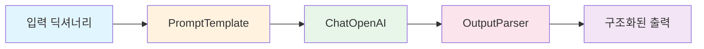
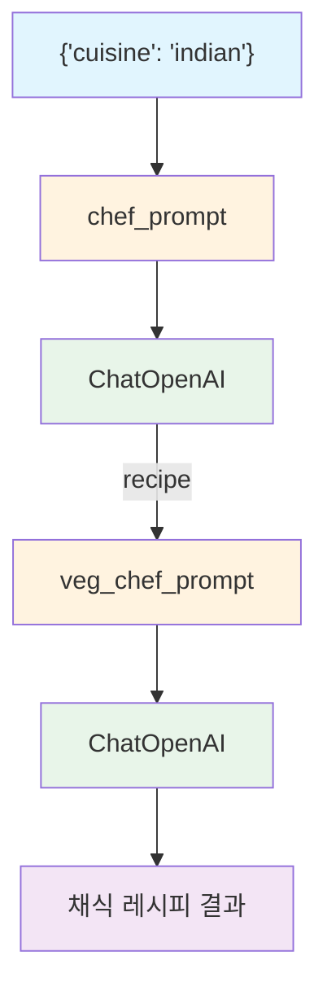

# Chapter 1: LLMs and Chat Models

## 학습 목표

이 챕터를 마치면 다음을 할 수 있습니다:

- **ChatOpenAI**를 사용하여 LLM과 대화하는 코드를 작성할 수 있다
- **메시지 타입**(SystemMessage, HumanMessage, AIMessage)의 역할을 이해한다
- **PromptTemplate**과 **ChatPromptTemplate**으로 재사용 가능한 프롬프트를 만들 수 있다
- **OutputParser**를 만들어 LLM 출력을 원하는 형태로 변환할 수 있다
- **LCEL(LangChain Expression Language)** 파이프 연산자(`|`)로 체인을 구성할 수 있다
- 여러 체인을 **연결(Chaining)**하여 복잡한 워크플로우를 만들 수 있다

---

## 핵심 개념 설명

### LangChain이란?

LangChain은 LLM(Large Language Model)을 활용한 애플리케이션을 쉽게 만들 수 있도록 도와주는 프레임워크입니다. LLM에 프롬프트를 보내고, 응답을 파싱하고, 여러 단계를 연결하는 작업을 표준화된 방식으로 처리할 수 있습니다.

### 핵심 컴포넌트

| 컴포넌트 | 설명 |
|---------|------|
| `ChatOpenAI` | OpenAI의 Chat 모델과 통신하는 래퍼 클래스 |
| `SystemMessage` | AI의 역할/성격을 정의하는 시스템 메시지 |
| `HumanMessage` | 사용자가 보내는 메시지 |
| `AIMessage` | AI가 응답한 메시지 (Few-shot 예시에 사용) |
| `PromptTemplate` | 변수가 포함된 문자열 템플릿 |
| `ChatPromptTemplate` | 메시지 리스트 형태의 채팅 템플릿 |
| `OutputParser` | LLM 출력을 구조화된 데이터로 변환 |
| LCEL `\|` 연산자 | 컴포넌트를 파이프라인으로 연결 |

### LCEL 체인 아키텍처



LCEL에서는 각 컴포넌트가 `|` 연산자로 연결됩니다. 데이터가 왼쪽에서 오른쪽으로 흐르며, 각 단계의 출력이 다음 단계의 입력이 됩니다.

### 체인 연결(Chaining Chains) 아키텍처



---

## 커밋별 코드 해설

### 1.0 LLMs and Chat Models

> 커밋: `d44ad48`

가장 기본적인 LLM 호출 코드입니다.

```python
from langchain_openai import ChatOpenAI

chat = ChatOpenAI(
    base_url=os.getenv("OPENAI_BASE_URL"),
    api_key=os.getenv("OPENAI_API_KEY"),
    model="gpt-5.1",
)

response = chat.invoke("How many planets are there?")
response.content
```

**핵심 포인트:**
- `ChatOpenAI`는 OpenAI의 Chat Completion API를 감싸는 LangChain 클래스입니다
- `invoke()` 메서드에 문자열을 전달하면 내부적으로 `HumanMessage`로 변환됩니다
- 반환값은 `AIMessage` 객체이며, `.content`로 텍스트를 꺼냅니다
- `base_url`과 `api_key`는 환경변수에서 읽어옵니다 (`.env` 파일 사용)

**용어 설명:**
- **invoke**: LangChain에서 컴포넌트를 실행하는 표준 메서드입니다. 입력을 받아 출력을 반환합니다.
- **dotenv**: `.env` 파일에 저장된 환경변수를 Python에서 사용할 수 있게 해주는 라이브러리입니다.

---

### 1.1 Predict Messages

> 커밋: `d6e7820`

메시지 타입을 사용하여 대화 맥락을 구성합니다.

```python
from langchain_core.messages import HumanMessage, AIMessage, SystemMessage

messages = [
    SystemMessage(
        content="You are a geography expert. And you only reply in {language}.",
    ),
    AIMessage(content="Ciao, mi chiamo {name}!"),
    HumanMessage(
        content="What is the distance between {country_a} and {country_b}. Also, what is your name?",
    ),
]

chat.invoke(messages)
```

**핵심 포인트:**
- `SystemMessage`: AI에게 역할을 부여합니다. "지리 전문가이고 특정 언어로만 답해라"
- `AIMessage`: AI가 이전에 했던 말을 설정합니다. Few-shot 학습이나 페르소나 설정에 사용됩니다
- `HumanMessage`: 사용자의 질문입니다
- 메시지 리스트를 `invoke()`에 전달하면 대화 형태로 LLM에 전송됩니다
- 이 단계에서 `{language}`, `{name}` 등은 아직 실제 변수 치환이 아닌 리터럴 문자열입니다

**`temperature` 파라미터 추가:**
```python
chat = ChatOpenAI(
    ...
    temperature=0.1,
)
```
- `temperature`는 응답의 무작위성을 조절합니다 (0.0 = 결정적, 1.0 = 창의적)
- 0.1로 설정하면 거의 같은 입력에 같은 출력을 냅니다

---

### 1.2 Prompt Templates

> 커밋: `edb339f`

변수를 자동으로 치환해주는 프롬프트 템플릿을 사용합니다.

**PromptTemplate (문자열 기반):**
```python
from langchain_core.prompts import PromptTemplate, ChatPromptTemplate

template = PromptTemplate.from_template(
    "What is the distance between {country_a} and {country_b}",
)

prompt = template.format(country_a="Mexico", country_b="Thailand")
chat.invoke(prompt).content
```

**ChatPromptTemplate (메시지 기반):**
```python
template = ChatPromptTemplate.from_messages(
    [
        ("system", "You are a geography expert. And you only reply in {language}."),
        ("ai", "Ciao, mi chiamo {name}!"),
        ("human", "What is the distance between {country_a} and {country_b}. Also, what is your name?"),
    ]
)

prompt = template.format_messages(
    language="Greek",
    name="Socrates",
    country_a="Mexico",
    country_b="Thailand",
)

chat.invoke(prompt)
```

**핵심 포인트:**
- `PromptTemplate`: 단순 문자열에 변수를 삽입합니다. `format()` 호출 시 치환됩니다
- `ChatPromptTemplate`: 메시지 리스트를 템플릿화합니다. 튜플 `("system", "...")` 형태로 메시지 타입을 지정합니다
- `format_messages()`는 변수를 치환한 메시지 리스트를 반환합니다
- 1.1에서 수동으로 만들었던 메시지 구조를, 템플릿을 통해 재사용 가능하게 만듭니다

**PromptTemplate vs ChatPromptTemplate:**

| | PromptTemplate | ChatPromptTemplate |
|---|---|---|
| 입력 | 문자열 | 메시지 리스트 (튜플) |
| 출력 | `format()` -> 문자열 | `format_messages()` -> 메시지 리스트 |
| 사용 | 단순 텍스트 프롬프트 | 역할이 있는 대화형 프롬프트 |

---

### 1.3 OutputParser and LCEL

> 커밋: `7c529ea`

커스텀 OutputParser를 만들고, LCEL로 체인을 구성합니다.

```python
from langchain_core.output_parsers import BaseOutputParser

class CommaOutputParser(BaseOutputParser):
    def parse(self, text):
        items = text.strip().split(",")
        return list(map(str.strip, items))
```

```python
template = ChatPromptTemplate.from_messages(
    [
        (
            "system",
            "You are a list generating machine. Everything you are asked will be answered with a comma separated list of max {max_items} in lowercase. Do NOT reply with anything else.",
        ),
        ("human", "{question}"),
    ]
)

chain = template | chat | CommaOutputParser()

chain.invoke({"max_items": 5, "question": "What are the pokemons?"})
```

**핵심 포인트:**

1. **커스텀 OutputParser**: `BaseOutputParser`를 상속하고 `parse()` 메서드를 구현합니다. LLM이 "pikachu, charmander, bulbasaur"라고 응답하면 `["pikachu", "charmander", "bulbasaur"]` 리스트로 변환합니다.

2. **LCEL 파이프 연산자 `|`**:
   - `template | chat | CommaOutputParser()`는 세 컴포넌트를 파이프라인으로 연결합니다
   - 데이터 흐름: 딕셔너리 -> 프롬프트 -> LLM -> 파서 -> 리스트
   - Unix의 파이프(`|`)와 같은 개념입니다

3. **invoke의 입력**: 체인의 `invoke()`에는 딕셔너리를 전달합니다. 템플릿의 변수명이 딕셔너리의 키가 됩니다.

---

### 1.4 Chaining Chains

> 커밋: `9153ca6`

여러 체인을 연결하여 복잡한 워크플로우를 만듭니다.

```python
from langchain_core.callbacks import StreamingStdOutCallbackHandler

chat = ChatOpenAI(
    ...
    streaming=True,
    callbacks=[StreamingStdOutCallbackHandler()],
)

chef_prompt = ChatPromptTemplate.from_messages(
    [
        ("system", ""),
        ("human", "I want to cook {cuisine} food."),
    ]
)

chef_chain = chef_prompt | chat
```

```python
veg_chef_prompt = ChatPromptTemplate.from_messages(
    [
        (
            "system",
            "You are a vegetarian chef specialized on making traditional recipies vegetarian. You find alternative ingredients and explain their preparation. You don't radically modify the recipe. If there is no alternative for a food just say you don't know how to replace it.",
        ),
        ("human", "{recipe}"),
    ]
)

veg_chain = veg_chef_prompt | chat

final_chain = {"recipe": chef_chain} | veg_chain

final_chain.invoke({"cuisine": "indian"})
```

**핵심 포인트:**

1. **스트리밍**: `streaming=True`와 `StreamingStdOutCallbackHandler()`를 설정하면 LLM 응답이 토큰 단위로 실시간 출력됩니다

2. **체인 연결의 핵심 패턴**:
   ```python
   final_chain = {"recipe": chef_chain} | veg_chain
   ```
   - `{"recipe": chef_chain}`: 딕셔너리의 값으로 체인을 넣으면, 해당 체인의 출력이 키(`recipe`)에 매핑됩니다
   - `chef_chain`의 출력(요리 레시피)이 `veg_chain`의 `{recipe}` 변수로 전달됩니다
   - 이것이 LCEL에서 체인을 연결하는 핵심 패턴입니다

3. **데이터 흐름**:
   - 입력: `{"cuisine": "indian"}`
   - `chef_chain`: 인도 요리 레시피 생성
   - 중간 변환: `{"recipe": "인도 요리 레시피..."}`
   - `veg_chain`: 채식 버전으로 변환
   - 출력: 채식 인도 요리 레시피

---

### 1.5 Recap

> 커밋: `3293b3b`

1.4의 코드를 완성된 형태로 정리합니다. `chef_prompt`의 system 메시지가 추가됩니다:

```python
chef_prompt = ChatPromptTemplate.from_messages(
    [
        (
            "system",
            "You are a world-class international chef. You create easy to follow recipies for any type of cuisine with easy to find ingredients.",
        ),
        ("human", "I want to cook {cuisine} food."),
    ]
)
```

이전 커밋에서 비어있던 system 프롬프트에 구체적인 역할이 부여되었습니다. 이를 통해 AI가 "세계적인 요리사"로서 쉬운 재료로 만들 수 있는 레시피를 제공하게 됩니다.

---

## 이전 방식 vs 현재 방식

이 프로젝트의 코드는 2026년 기준 LangChain 1.x를 사용합니다. 2023년의 LangChain 0.x와 비교하면 다음과 같은 차이가 있습니다:

| 항목 | LangChain 0.x (2023) | LangChain 1.x (2026) |
|------|---------------------|---------------------|
| Chat 모델 임포트 | `from langchain.chat_models import ChatOpenAI` | `from langchain_openai import ChatOpenAI` |
| 메시지 임포트 | `from langchain.schema import HumanMessage` | `from langchain_core.messages import HumanMessage` |
| 프롬프트 임포트 | `from langchain.prompts import ChatPromptTemplate` | `from langchain_core.prompts import ChatPromptTemplate` |
| LLM 호출 방식 | `chat.predict("...")` 또는 `chat("...")` | `chat.invoke("...")` |
| 메시지 호출 | `chat.predict_messages([...])` | `chat.invoke([...])` |
| 체인 구성 | `LLMChain(llm=chat, prompt=prompt)` | `prompt \| chat` (LCEL) |
| OutputParser 임포트 | `from langchain.schema import BaseOutputParser` | `from langchain_core.output_parsers import BaseOutputParser` |
| 패키지 구조 | 단일 `langchain` 패키지 | `langchain_core`, `langchain_openai` 등 분리 |

**주요 변화 요약:**
- `langchain` 모놀리식 패키지가 `langchain_core`, `langchain_openai`, `langchain_community` 등으로 분리되었습니다
- `predict()`, `predict_messages()` 대신 통일된 `invoke()` 인터페이스를 사용합니다
- `LLMChain` 대신 LCEL 파이프 연산자(`|`)로 체인을 구성합니다

---

## 실습 과제

### 과제 1: 번역 체인 만들기

LCEL을 사용하여 다음과 같은 번역 체인을 만들어보세요:

1. 사용자가 `{"text": "...", "source_lang": "English", "target_lang": "Korean"}`을 입력하면
2. ChatPromptTemplate으로 번역 프롬프트를 생성하고
3. ChatOpenAI로 번역을 수행한 뒤
4. 번역 결과 텍스트만 문자열로 반환하는 체인

**힌트:**
- `ChatPromptTemplate.from_messages()`에 system과 human 메시지를 정의하세요
- `StrOutputParser()`를 사용하면 AIMessage에서 문자열만 추출할 수 있습니다 (`from langchain_core.output_parsers import StrOutputParser`)

### 과제 2: 체인 연결 - 요약 후 퀴즈 생성

두 개의 체인을 연결하여:
1. 첫 번째 체인: 주어진 주제(`{topic}`)에 대해 3문장으로 설명하는 체인
2. 두 번째 체인: 첫 번째 체인의 출력(`{summary}`)을 받아 객관식 퀴즈 1문제를 생성하는 체인

`final_chain = {"summary": summary_chain} | quiz_chain` 패턴을 활용하세요.

---

## 다음 챕터 예고

**Chapter 2: Prompts**에서는 프롬프트를 더 정교하게 다루는 방법을 배웁니다:
- **FewShotPromptTemplate**: 예시를 포함한 프롬프트로 LLM의 출력 형식을 제어
- **ExampleSelector**: 예시를 동적으로 선택하는 전략
- **캐싱(Caching)**: 동일한 질문의 반복 호출을 줄여 비용 절감
- **토큰 추적**: API 사용량 모니터링
