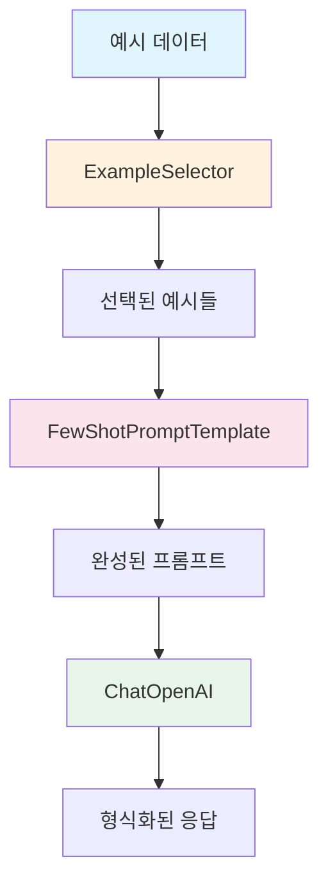
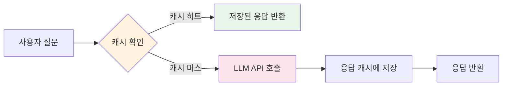

# Chapter 2: Prompts

## 학습 목표

이 챕터를 마치면 다음을 할 수 있습니다:

- **FewShotPromptTemplate**을 사용하여 예시 기반 프롬프트를 구성할 수 있다
- **FewShotChatMessagePromptTemplate**으로 채팅 형태의 Few-shot 프롬프트를 만들 수 있다
- **커스텀 ExampleSelector**를 구현하여 예시를 동적으로 선택할 수 있다
- 프롬프트 **조합(Composition)** 패턴을 이해한다
- **SQLiteCache**로 LLM 응답을 캐싱하여 비용을 절감할 수 있다
- **get_usage_metadata_callback**으로 토큰 사용량을 추적할 수 있다

---

## 핵심 개념 설명

### Few-shot Learning이란?

Few-shot Learning은 LLM에게 몇 가지 예시(example)를 보여줌으로써 원하는 출력 형식이나 스타일을 학습시키는 기법입니다. 프롬프트에 "이런 식으로 대답해줘"라는 예시를 포함하는 것입니다.



### 캐싱 아키텍처



### 주요 컴포넌트 비교

| 컴포넌트 | 용도 | 출력 형태 |
|---------|------|----------|
| `FewShotPromptTemplate` | 텍스트 기반 Few-shot | 문자열 |
| `FewShotChatMessagePromptTemplate` | 채팅 기반 Few-shot | 메시지 리스트 |
| `BaseExampleSelector` | 예시 동적 선택 | 예시 리스트 |
| `SQLiteCache` | 응답 캐싱 | - |
| `get_usage_metadata_callback` | 토큰 추적 | 사용량 통계 |

---

## 커밋별 코드 해설

### 2.1 FewShotPromptTemplate

> 커밋: `a8ebcc8`

텍스트 기반의 Few-shot 프롬프트를 구성합니다.

```python
from langchain_core.prompts import FewShotPromptTemplate, PromptTemplate

examples = [
    {
        "question": "What do you know about France?",
        "answer": """
        Here is what I know:
        Capital: Paris
        Language: French
        Food: Wine and Cheese
        Currency: Euro
        """,
    },
    {
        "question": "What do you know about Italy?",
        "answer": """
        I know this:
        Capital: Rome
        Language: Italian
        Food: Pizza and Pasta
        Currency: Euro
        """,
    },
    {
        "question": "What do you know about Greece?",
        "answer": """
        I know this:
        Capital: Athens
        Language: Greek
        Food: Souvlaki and Feta Cheese
        Currency: Euro
        """,
    },
]

example_prompt = PromptTemplate.from_template("Human: {question}\nAI:{answer}")

prompt = FewShotPromptTemplate(
    example_prompt=example_prompt,
    examples=examples,
    suffix="Human: What do you know about {country}?",
    input_variables=["country"],
)

chain = prompt | chat
chain.invoke({"country": "Turkey"})
```

**핵심 포인트:**

1. **examples**: 딕셔너리 리스트로, 각 예시에 `question`과 `answer` 키가 있습니다
2. **example_prompt**: 각 예시를 어떤 형태로 포맷할지 정의하는 템플릿입니다
3. **FewShotPromptTemplate 구성요소**:
   - `example_prompt`: 개별 예시의 포맷
   - `examples`: 예시 데이터 리스트
   - `suffix`: 예시 뒤에 붙는 실제 질문 부분
   - `input_variables`: 런타임에 치환할 변수 목록

**왜 Few-shot을 쓰나?**
- "Capital, Language, Food, Currency" 형식으로 대답하라고 명시적으로 지시하지 않아도, 예시를 보여주면 LLM이 같은 형식으로 응답합니다
- 출력 형식을 자연스럽게 제어하는 강력한 기법입니다

---

### 2.2 FewShotChatMessagePromptTemplate

> 커밋: `59e9b1c`

채팅 메시지 형태의 Few-shot 프롬프트를 구성합니다.

```python
from langchain_core.prompts import FewShotChatMessagePromptTemplate, ChatPromptTemplate

examples = [
    {
        "country": "France",
        "answer": """
        Here is what I know:
        Capital: Paris
        Language: French
        Food: Wine and Cheese
        Currency: Euro
        """,
    },
    # ... Italy, Greece 예시
]

example_prompt = ChatPromptTemplate.from_messages(
    [
        ("human", "What do you know about {country}?"),
        ("ai", "{answer}"),
    ]
)

example_prompt = FewShotChatMessagePromptTemplate(
    example_prompt=example_prompt,
    examples=examples,
)

final_prompt = ChatPromptTemplate.from_messages(
    [
        ("system", "You are a geography expert, you give short answers."),
        example_prompt,
        ("human", "What do you know about {country}?"),
    ]
)

chain = final_prompt | chat
chain.invoke({"country": "Thailand"})
```

**핵심 포인트:**

1. **FewShotPromptTemplate과의 차이**:
   - `FewShotPromptTemplate`은 모든 것을 하나의 텍스트 문자열로 만듭니다
   - `FewShotChatMessagePromptTemplate`은 각 예시를 `human`/`ai` 메시지 쌍으로 만듭니다
   - Chat 모델에서는 메시지 형태가 더 자연스럽고 성능이 좋습니다

2. **조합 구조**: `final_prompt` 안에 `example_prompt`를 넣어 system 메시지 + 예시 + 실제 질문을 하나의 프롬프트로 조합합니다

3. **변수명 변경**: 2.1에서는 `question`/`answer`였지만, 여기서는 `country`/`answer`로 변경되었습니다. 질문 형식이 고정되어 있으므로 국가명만 변수로 받습니다.

---

### 2.3 LengthBasedExampleSelector

> 커밋: `b96804d`

커스텀 ExampleSelector를 구현하여 예시를 동적으로 선택합니다.

```python
from langchain_core.example_selectors import BaseExampleSelector

class RandomExampleSelector(BaseExampleSelector):
    def __init__(self, examples):
        self.examples = examples

    def add_example(self, example):
        self.examples.append(example)

    def select_examples(self, input_variables):
        from random import choice
        return [choice(self.examples)]

example_selector = RandomExampleSelector(examples=examples)

prompt = FewShotPromptTemplate(
    example_prompt=example_prompt,
    example_selector=example_selector,
    suffix="Human: What do you know about {country}?",
    input_variables=["country"],
)

prompt.format(country="Brazil")
```

**핵심 포인트:**

1. **BaseExampleSelector 인터페이스**: 두 메서드를 구현해야 합니다:
   - `add_example(example)`: 새 예시를 추가
   - `select_examples(input_variables)`: 입력에 따라 예시를 선택하여 반환

2. **examples vs example_selector**: `FewShotPromptTemplate`에는 `examples`(전체 예시)를 직접 전달하거나, `example_selector`(동적 선택기)를 전달할 수 있습니다. 둘 중 하나만 사용합니다.

3. **왜 ExampleSelector가 필요한가?**
   - 예시가 많으면 프롬프트가 너무 길어져 토큰 비용이 증가합니다
   - 입력에 가장 관련성 높은 예시만 선택하면 비용도 줄이고 성능도 높일 수 있습니다
   - 실전에서는 `LengthBasedExampleSelector`(길이 기반), `SemanticSimilarityExampleSelector`(유사도 기반) 등을 사용합니다

**용어 설명:**
- **ExampleSelector**: 전체 예시 풀에서 특정 기준에 따라 일부 예시만 골라주는 컴포넌트입니다

---

### 2.4 Serialization and Composition

> 커밋: `6aa4b39`

프롬프트 조합(Composition) 패턴을 사용합니다.

```python
from langchain_core.prompts import ChatPromptTemplate

prompt = ChatPromptTemplate.from_messages(
    [
        (
            "system",
            "You are a role playing assistant. And you are impersonating a {character}.\n\n"
            "This is an example of how you talk:\n"
            "Human: {example_question}\n"
            "You: {example_answer}",
        ),
        ("human", "{question}"),
    ]
)

chain = prompt | chat

chain.invoke(
    {
        "character": "Pirate",
        "example_question": "What is your location?",
        "example_answer": "Arrrrg! That is a secret!! Arg arg!!",
        "question": "What is your fav food?",
    }
)
```

**핵심 포인트:**

1. **PipelinePromptTemplate 제거**: LangChain 0.x에서는 `PipelinePromptTemplate`으로 여러 프롬프트를 조합했지만, LangChain 1.x에서는 제거되었습니다. 코드의 주석에도 이 점이 명시되어 있습니다.

2. **현대적 조합 방식**: `ChatPromptTemplate` 하나로 모든 변수를 직접 관리합니다. system 메시지 안에 캐릭터 설정, 예시 대화, 실제 질문을 모두 포함합니다.

3. **유연한 변수 사용**: `{character}`, `{example_question}`, `{example_answer}`, `{question}` 네 개의 변수가 하나의 invoke 호출에서 모두 치환됩니다.

---

### 2.5 Caching

> 커밋: `65960c2`

LLM 응답을 캐싱하여 동일한 질문의 반복 호출 비용을 줄입니다.

```python
from langchain_core.globals import set_llm_cache
from langchain_community.cache import InMemoryCache, SQLiteCache

set_llm_cache(SQLiteCache("cache.db"))

chat = ChatOpenAI(
    base_url=os.getenv("OPENAI_BASE_URL"),
    api_key=os.getenv("OPENAI_API_KEY"),
    model="gpt-5.1",
    temperature=0.1,
)

chat.invoke("How do you make italian pasta").content  # API 호출
chat.invoke("How do you make italian pasta").content  # 캐시에서 즉시 반환
```

**핵심 포인트:**

1. **set_llm_cache**: 전역 캐시를 설정합니다. 모든 LLM 호출에 적용됩니다

2. **캐시 종류**:
   - `InMemoryCache()`: 메모리에 저장, 프로세스 종료 시 소멸
   - `SQLiteCache("cache.db")`: SQLite 파일에 저장, 영구 보존

3. **동작 방식**:
   - 첫 번째 호출: API 요청 -> 응답을 캐시에 저장 -> 반환
   - 두 번째 동일 호출: 캐시에서 즉시 반환 (API 호출 없음)

4. **비용 절감 효과**: 개발 중 같은 프롬프트를 반복 테스트할 때 API 비용을 크게 줄일 수 있습니다

**주의사항:**
- `temperature`를 0에 가깝게 설정해야 캐싱이 의미가 있습니다. temperature가 높으면 같은 입력에도 다른 출력이 나오기 때문입니다.

---

### 2.6 Serialization (토큰 추적)

> 커밋: `c9e0014`

API 사용량을 추적합니다.

```python
from langchain_openai import ChatOpenAI
from langchain_core.callbacks import get_usage_metadata_callback

chat = ChatOpenAI(
    base_url=os.getenv("OPENAI_BASE_URL"),
    api_key=os.getenv("OPENAI_API_KEY"),
    model="gpt-5.1",
    temperature=0.1,
)

with get_usage_metadata_callback() as usage:
    a = chat.invoke("What is the recipe for soju").content
    b = chat.invoke("What is the recipe for bread").content
    print(a, "\n")
    print(b, "\n")
    print(usage)
```

**핵심 포인트:**

1. **get_usage_metadata_callback**: context manager(`with` 문)로 사용합니다. 블록 안에서 발생한 모든 LLM API 호출의 토큰 사용량을 집계합니다

2. **usage 출력 정보** (모델별로 그룹핑됨):
   ```python
   # 출력 예시:
   # {'gpt-5.1-2025-11-13': {'input_tokens': 25, 'output_tokens': 1645, 'total_tokens': 1670}}
   ```
   - `input_tokens`: 프롬프트(입력)에 사용된 토큰 수
   - `output_tokens`: 응답(출력)에 사용된 토큰 수
   - `total_tokens`: 총 사용 토큰 수
   - 모델 이름별로 사용량이 분리되어 표시됩니다

3. **왜 토큰을 추적하나?**
   - API 비용은 토큰 수에 비례합니다
   - 프로덕션 환경에서 비용 모니터링은 필수입니다
   - 프롬프트 최적화의 기준이 됩니다

4. **`get_openai_callback` → `get_usage_metadata_callback` 변경 이유:**
   - `get_openai_callback`은 OpenAI 전용이었고 `langchain_community`에 있었습니다
   - `get_usage_metadata_callback`은 `langchain_core`에 포함되어 **모든 LLM 프로바이더에서 동작**합니다
   - OpenAI뿐 아니라 Bedrock, Azure, Ollama 등의 토큰 사용량도 동일하게 추적할 수 있습니다
   - LangChain 1.x에서는 이 새로운 콜백이 공식 권장 방식입니다

**용어 설명:**
- **토큰(Token)**: LLM이 텍스트를 처리하는 최소 단위입니다. 영어 기준 약 4글자가 1토큰, 한국어는 1글자가 약 2~3토큰입니다.

---

## 이전 방식 vs 현재 방식

| 항목 | LangChain 0.x (2023) | LangChain 1.x (2026) |
|------|---------------------|---------------------|
| FewShotPromptTemplate 임포트 | `from langchain.prompts import FewShotPromptTemplate` | `from langchain_core.prompts import FewShotPromptTemplate` |
| FewShotChatMessagePromptTemplate | `from langchain.prompts import FewShotChatMessagePromptTemplate` | `from langchain_core.prompts import FewShotChatMessagePromptTemplate` |
| ExampleSelector | `from langchain.prompts.example_selector import LengthBasedExampleSelector` | `from langchain_core.example_selectors import BaseExampleSelector` |
| PipelinePromptTemplate | 사용 가능 (프롬프트 조합) | **제거됨** - ChatPromptTemplate으로 직접 조합 |
| 캐시 설정 | `import langchain; langchain.llm_cache = SQLiteCache()` | `from langchain_core.globals import set_llm_cache; set_llm_cache(SQLiteCache())` |
| SQLiteCache 임포트 | `from langchain.cache import SQLiteCache` | `from langchain_community.cache import SQLiteCache` |
| 콜백 매니저 | `from langchain.callbacks import get_openai_callback` | `from langchain_core.callbacks import get_usage_metadata_callback` |
| 체인 구성 | `LLMChain(llm=chat, prompt=prompt)` | `prompt \| chat` (LCEL) |

**주요 변화:**
- `PipelinePromptTemplate`이 제거되면서 프롬프트 조합이 단순해졌습니다
- 캐시 설정 방식이 모듈 속성에서 함수 호출로 변경되었습니다
- 커뮤니티 기여 컴포넌트가 `langchain_community` 패키지로 분리되었습니다

---

## 실습 과제

### 과제 1: 번역 스타일 Few-shot

다음 요구사항에 맞는 Few-shot 체인을 만드세요:

1. 번역 예시 3개를 준비합니다 (영어 -> 한국어, 다양한 문체)
2. `FewShotChatMessagePromptTemplate`을 사용하여 예시를 포함합니다
3. system 메시지로 "자연스러운 한국어로 번역하되, 예시와 같은 문체를 유지하라"고 지시합니다
4. 새로운 영어 문장을 번역합니다

**힌트:** 예시의 `answer`에 특정 문체(존댓말, 반말, 문어체 등)를 사용하면 LLM이 그 문체를 따릅니다.

### 과제 2: 캐싱 + 토큰 추적 조합

1. `SQLiteCache`를 설정합니다
2. `get_usage_metadata_callback`으로 토큰 사용량을 추적합니다
3. 같은 질문을 두 번 호출하고, 각 호출의 토큰 사용량을 비교합니다
4. 캐시 히트 시 토큰 사용량이 0인지 확인합니다

---

## 다음 챕터 예고

**Chapter 3: Memory**에서는 LLM이 대화 맥락을 기억하게 하는 방법을 배웁니다:
- **ConversationBufferMemory**: 전체 대화 기록 저장
- **ConversationBufferWindowMemory**: 최근 N개 대화만 저장
- **ConversationSummaryMemory**: 대화를 요약하여 저장
- **ConversationKGMemory**: 지식 그래프 기반 메모리
- LCEL에서 메모리를 사용하는 패턴
