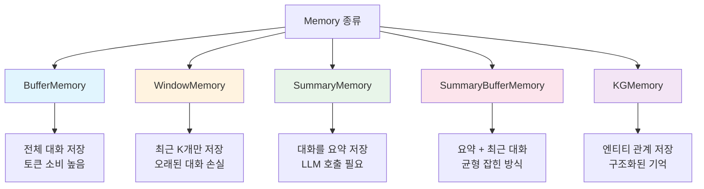
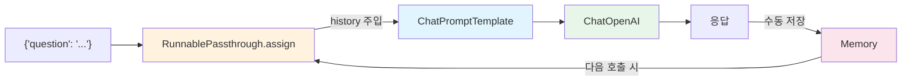

# Chapter 3: Memory

## 학습 목표

이 챕터를 마치면 다음을 할 수 있습니다:

- **대화 메모리(Memory)**의 필요성과 종류를 이해한다
- **ConversationBufferMemory**로 전체 대화를 저장할 수 있다
- **ConversationBufferWindowMemory**로 최근 대화만 유지할 수 있다
- **ConversationSummaryMemory**로 대화를 요약하여 저장할 수 있다
- **ConversationSummaryBufferMemory**로 요약과 버퍼를 결합할 수 있다
- **ConversationKGMemory**로 지식 그래프 기반 메모리를 사용할 수 있다
- **LLMChain**과 **LCEL**에서 메모리를 통합하는 방법을 안다

---

## 핵심 개념 설명

### 왜 메모리가 필요한가?

LLM은 기본적으로 **상태가 없습니다(stateless)**. 각 API 호출은 독립적이므로, "내 이름은 철수야"라고 말한 후 "내 이름이 뭐야?"라고 물으면 LLM은 기억하지 못합니다. 메모리 컴포넌트가 이전 대화를 프롬프트에 자동으로 포함시켜 이 문제를 해결합니다.

### 메모리 타입 비교



| 메모리 타입 | 저장 방식 | 장점 | 단점 |
|------------|----------|------|------|
| `ConversationBufferMemory` | 전체 대화 원문 | 정보 손실 없음 | 대화가 길어지면 토큰 폭증 |
| `ConversationBufferWindowMemory` | 최근 K개 대화 | 토큰 사용량 제한 | 오래된 정보 손실 |
| `ConversationSummaryMemory` | LLM이 요약한 텍스트 | 긴 대화도 짧게 저장 | 요약 시 LLM 호출 비용 |
| `ConversationSummaryBufferMemory` | 요약 + 최근 원문 | 균형 잡힌 접근 | 설정이 복잡 |
| `ConversationKGMemory` | 지식 그래프 (엔티티-관계) | 구조화된 정보 검색 | 관계 추출 정확도 |

### LCEL에서의 메모리 패턴



---

## 커밋별 코드 해설

### 3.0 ConversationBufferMemory

> 커밋: `4662bb8`

가장 기본적인 메모리 타입으로, 모든 대화를 그대로 저장합니다.

```python
from langchain_openai import ChatOpenAI
from langchain_classic.memory import ConversationBufferMemory
from langchain_core.runnables import RunnablePassthrough
from langchain_core.prompts import ChatPromptTemplate, MessagesPlaceholder

model = ChatOpenAI(
    base_url=os.getenv("OPENAI_BASE_URL"),
    api_key=os.getenv("OPENAI_API_KEY"),
    model="gpt-5.1",
)

prompt = ChatPromptTemplate.from_messages(
    [
        ("system", "You are a helpful chatbot"),
        MessagesPlaceholder(variable_name="history"),
        ("human", "{message}"),
    ]
)

memory = ConversationBufferMemory(return_messages=True)

def load_memory(_):
    return memory.load_memory_variables({})["history"]

chain = RunnablePassthrough.assign(history=load_memory) | prompt | model

inputs = {"message": "hi im bob"}
response = chain.invoke(inputs)
```

**핵심 포인트:**

1. **MessagesPlaceholder**: 프롬프트 안에 메시지 리스트가 동적으로 삽입될 자리를 만듭니다. `variable_name="history"`로 지정하면 `history`라는 변수에 담긴 메시지 리스트가 이 위치에 들어갑니다.

2. **ConversationBufferMemory**:
   - `return_messages=True`: 대화 기록을 메시지 객체 리스트로 반환합니다 (문자열 대신)
   - `load_memory_variables({})["history"]`: 저장된 대화 기록을 불러옵니다

3. **RunnablePassthrough.assign(history=load_memory)**:
   - 입력 딕셔너리에 `history` 키를 추가합니다
   - `load_memory` 함수가 호출되어 메모리에서 대화 기록을 가져옵니다
   - 결과: `{"message": "hi im bob", "history": [이전 대화 메시지들]}`

4. **load_memory 함수의 `_` 파라미터**: `RunnablePassthrough.assign`은 입력 딕셔너리를 함수에 전달하지만, 메모리 로드에는 입력이 필요 없으므로 `_`로 무시합니다.

**용어 설명:**
- **MessagesPlaceholder**: ChatPromptTemplate 안에서 메시지 리스트를 동적으로 삽입할 수 있는 자리표시자입니다.
- **RunnablePassthrough**: 입력을 그대로 통과시키면서 `.assign()`으로 새 키-값을 추가할 수 있는 LCEL 컴포넌트입니다.

---

### 3.1 ConversationBufferWindowMemory

> 커밋: `8a36e99`

최근 K개의 대화만 유지합니다.

```python
from langchain_classic.memory import ConversationBufferWindowMemory

memory = ConversationBufferWindowMemory(
    return_messages=True,
    k=4,
)
```

**핵심 포인트:**

- `k=4`: 최근 4쌍의 대화(human + AI)만 유지합니다
- 5번째 대화가 추가되면 가장 오래된 대화가 자동으로 삭제됩니다
- **사용 사례**: 대화가 매우 길어질 수 있지만, 최근 맥락만 중요한 경우 (예: 고객 서비스 챗봇)
- BufferMemory와 인터페이스가 동일하므로 교체가 간단합니다

---

### 3.2 ConversationSummaryMemory

> 커밋: `9683c60`

LLM을 사용하여 대화를 요약합니다.

```python
from langchain_classic.memory import ConversationSummaryMemory
from langchain_openai import ChatOpenAI

llm = ChatOpenAI(
    base_url=os.getenv("OPENAI_BASE_URL"),
    api_key=os.getenv("OPENAI_API_KEY"),
    model="gpt-5.1",
    temperature=0.1,
)

memory = ConversationSummaryMemory(llm=llm)

def add_message(input, output):
    memory.save_context({"input": input}, {"output": output})

def get_history():
    return memory.load_memory_variables({})

add_message("Hi I'm Nicolas, I live in South Korea", "Wow that is so cool!")
add_message("South Korea is so pretty", "I wish I could go!!!")
get_history()
```

**핵심 포인트:**

1. **LLM이 필요**: `ConversationSummaryMemory(llm=llm)` -- 대화를 요약하기 위해 별도의 LLM 호출이 필요합니다

2. **save_context**: `{"input": "..."}`, `{"output": "..."}`으로 대화 쌍을 저장합니다. 저장할 때마다 LLM이 기존 요약에 새 대화를 반영한 새로운 요약을 생성합니다.

3. **결과 예시**: 여러 대화가 쌓여도 메모리에는 "Nicolas는 한국에 살며, 한국이 예쁘다고 했다..." 같은 짧은 요약만 저장됩니다

4. **트레이드오프**:
   - 장점: 긴 대화도 일정한 토큰 수로 압축
   - 단점: 요약 시마다 LLM API 호출 비용 발생, 세부 정보 손실 가능

---

### 3.3 ConversationSummaryBufferMemory

> 커밋: `e85fcf9`

요약과 최근 대화를 결합하는 하이브리드 메모리입니다.

```python
from langchain_classic.memory import ConversationSummaryBufferMemory

memory = ConversationSummaryBufferMemory(
    llm=llm,
    max_token_limit=150,
    return_messages=True,
)

def add_message(input, output):
    memory.save_context({"input": input}, {"output": output})

def get_history():
    return memory.load_memory_variables({})

add_message("Hi I'm Nicolas, I live in South Korea", "Wow that is so cool!")
get_history()  # 아직 150토큰 이하 -> 원문 유지

add_message("South Korea is so pretty", "I wish I could go!!!")
get_history()  # 토큰이 늘어남

add_message("How far is Korea from Argentina?", "I don't know! Super far!")
get_history()  # 150토큰 초과 -> 오래된 대화 요약 시작

add_message("How far is Brazil from Argentina?", "I don't know! Super far!")
get_history()  # 요약 + 최근 대화
```

**핵심 포인트:**

1. **max_token_limit=150**: 대화의 총 토큰이 이 한도를 초과하면, 오래된 대화부터 요약으로 전환됩니다

2. **동작 방식**:
   - 토큰이 한도 이내: 모든 대화를 원문 그대로 유지
   - 토큰이 한도 초과: 오래된 대화를 요약 + 최근 대화는 원문 유지
   - 대화가 계속되면: 요약이 점점 갱신되고, 최근 대화 윈도우가 이동

3. **가장 실용적인 메모리**: 최근 대화의 디테일을 유지하면서도 오래된 맥락을 잃지 않는 균형 잡힌 접근입니다

---

### 3.4 ConversationKGMemory

> 커밋: `44226cd`

지식 그래프(Knowledge Graph) 기반 메모리입니다.

```python
from langchain_community.memory.kg import ConversationKGMemory

memory = ConversationKGMemory(
    llm=llm,
    return_messages=True,
)

def add_message(input, output):
    memory.save_context({"input": input}, {"output": output})

add_message("Hi I'm Nicolas, I live in South Korea", "Wow that is so cool!")
memory.load_memory_variables({"input": "who is Nicolas"})

add_message("Nicolas likes kimchi", "Wow that is so cool!")
memory.load_memory_variables({"inputs": "what does nicolas like"})
```

**핵심 포인트:**

1. **지식 그래프**: 대화에서 엔티티(개체)와 그 관계를 추출하여 그래프 형태로 저장합니다
   - "Nicolas"라는 엔티티 -> "lives in South Korea", "likes kimchi"

2. **쿼리 기반 검색**: `load_memory_variables({"input": "who is Nicolas"})`처럼 질문에 관련된 엔티티 정보만 반환합니다

3. **다른 메모리와의 차이**:
   - Buffer/Summary 메모리: 대화 전체를 시간순으로 저장
   - KG 메모리: 엔티티별로 구조화된 지식을 저장

4. **임포트 위치**: `langchain_community.memory.kg`에서 임포트합니다 (커뮤니티 패키지)

---

### 3.5 Memory on LLMChain

> 커밋: `1ee4696`

레거시 LLMChain에 메모리를 통합합니다.

```python
from langchain_classic.memory import ConversationSummaryBufferMemory
from langchain_classic.chains import LLMChain
from langchain_core.prompts import PromptTemplate

memory = ConversationSummaryBufferMemory(
    llm=llm,
    max_token_limit=120,
    memory_key="chat_history",
)

template = """
    You are a helpful AI talking to a human.

    {chat_history}
    Human:{question}
    You:
"""

chain = LLMChain(
    llm=llm,
    memory=memory,
    prompt=PromptTemplate.from_template(template),
    verbose=True,
)

chain.invoke({"question": "My name is Nico"})["text"]
chain.invoke({"question": "I live in Seoul"})["text"]
chain.invoke({"question": "What is my name?"})["text"]
```

**핵심 포인트:**

1. **memory_key="chat_history"**: 메모리가 프롬프트에 주입될 때 사용할 변수명입니다. 프롬프트의 `{chat_history}`와 일치해야 합니다.

2. **LLMChain의 자동 메모리 관리**:
   - 호출 시 자동으로 메모리를 불러와 프롬프트에 삽입합니다
   - 응답 후 자동으로 대화를 메모리에 저장합니다
   - 개발자가 수동으로 `save_context`를 호출할 필요가 없습니다

3. **verbose=True**: 체인의 실행 과정을 콘솔에 출력합니다. 디버깅에 유용합니다.

4. **LLMChain은 레거시**: 이 방식은 LangChain 0.x의 패턴입니다. 3.7에서 LCEL 방식으로 전환합니다.

---

### 3.6 Chat Based Memory

> 커밋: `9256b67`

LLMChain + ChatPromptTemplate + MessagesPlaceholder 조합입니다.

```python
from langchain_core.prompts import ChatPromptTemplate, MessagesPlaceholder

memory = ConversationSummaryBufferMemory(
    llm=llm,
    max_token_limit=120,
    memory_key="chat_history",
    return_messages=True,
)

prompt = ChatPromptTemplate.from_messages(
    [
        ("system", "You are a helpful AI talking to a human"),
        MessagesPlaceholder(variable_name="chat_history"),
        ("human", "{question}"),
    ]
)

chain = LLMChain(
    llm=llm,
    memory=memory,
    prompt=prompt,
    verbose=True,
)

chain.invoke({"question": "My name is Nico"})["text"]
```

**핵심 포인트:**

- 3.5와의 차이: `PromptTemplate` 대신 `ChatPromptTemplate` + `MessagesPlaceholder`를 사용합니다
- `return_messages=True`: 메모리가 문자열 대신 메시지 객체로 반환하여 `MessagesPlaceholder`에 맞게 동작합니다
- `memory_key`와 `MessagesPlaceholder의 variable_name`이 동일해야 합니다 ("chat_history")

---

### 3.7 LCEL Based Memory

> 커밋: `5117422`

LLMChain 없이 LCEL만으로 메모리를 구현합니다. **이것이 현대적인 권장 패턴입니다.**

```python
from langchain_classic.memory import ConversationSummaryBufferMemory
from langchain_openai import ChatOpenAI
from langchain_core.runnables import RunnablePassthrough
from langchain_core.prompts import ChatPromptTemplate, MessagesPlaceholder

llm = ChatOpenAI(
    base_url=os.getenv("OPENAI_BASE_URL"),
    api_key=os.getenv("OPENAI_API_KEY"),
    model="gpt-5.1",
    temperature=0.1,
)

memory = ConversationSummaryBufferMemory(
    llm=llm,
    max_token_limit=120,
    return_messages=True,
)

prompt = ChatPromptTemplate.from_messages(
    [
        ("system", "You are a helpful AI talking to a human"),
        MessagesPlaceholder(variable_name="history"),
        ("human", "{question}"),
    ]
)

def load_memory(_):
    return memory.load_memory_variables({})["history"]

chain = RunnablePassthrough.assign(history=load_memory) | prompt | llm

def invoke_chain(question):
    result = chain.invoke({"question": question})
    memory.save_context(
        {"input": question},
        {"output": result.content},
    )
    print(result)

invoke_chain("My name is nico")
invoke_chain("What is my name?")
```

**핵심 포인트:**

1. **LLMChain 없이 순수 LCEL**: `RunnablePassthrough.assign()` + `|` 연산자로 구성합니다

2. **수동 메모리 관리**: LCEL에서는 메모리 로드/저장을 직접 해야 합니다
   - 로드: `RunnablePassthrough.assign(history=load_memory)`
   - 저장: `invoke_chain` 함수 안에서 `memory.save_context()`를 수동 호출

3. **invoke_chain 헬퍼 함수**: 체인 호출과 메모리 저장을 함께 처리합니다. 이 함수를 통해야만 대화 기록이 제대로 누적됩니다.

4. **LLMChain vs LCEL 메모리 비교**:

| | LLMChain (3.5~3.6) | LCEL (3.7) |
|---|---|---|
| 메모리 로드 | 자동 | `RunnablePassthrough.assign` |
| 메모리 저장 | 자동 | `memory.save_context()` 수동 호출 |
| 유연성 | 낮음 (정해진 패턴) | 높음 (커스텀 가능) |
| 권장 여부 | 레거시 | 현대적 권장 방식 |

---

### 3.8 Recap

> 커밋: `8803d8c`

3.7과 동일한 코드입니다. LCEL 기반 메모리 패턴의 최종 정리입니다.

---

## 이전 방식 vs 현재 방식

| 항목 | LangChain 0.x (2023) | LangChain 1.x (2026) |
|------|---------------------|---------------------|
| 메모리 임포트 | `from langchain.memory import ConversationBufferMemory` | `from langchain_classic.memory import ConversationBufferMemory` |
| KG 메모리 임포트 | `from langchain.memory import ConversationKGMemory` | `from langchain_community.memory.kg import ConversationKGMemory` |
| 체인 + 메모리 | `LLMChain(llm=llm, memory=memory, prompt=prompt)` | `RunnablePassthrough.assign(history=load_memory) \| prompt \| llm` |
| 메모리 저장 | 자동 (LLMChain이 처리) | 수동 (`memory.save_context()`) |
| 패키지 | `langchain` | `langchain_classic` (레거시 호환 패키지) |

**주요 변화:**
- 메모리 클래스들이 `langchain_classic` 패키지로 이동했습니다. 이는 이 메모리 패턴이 "레거시"로 분류되었음을 의미합니다.
- LangChain 1.x에서는 상태 관리를 위해 `LangGraph`를 권장하지만, 이 코스에서는 기존 메모리 API를 사용하여 개념을 학습합니다.
- LCEL에서 메모리를 사용하려면 로드/저장을 직접 관리해야 합니다.

---

## 실습 과제

### 과제 1: 메모리 타입 비교 실험

다음 세 가지 메모리를 각각 사용하여 같은 대화를 10회 진행하고, 메모리 상태를 비교하세요:

1. `ConversationBufferMemory`
2. `ConversationBufferWindowMemory(k=3)`
3. `ConversationSummaryBufferMemory(max_token_limit=100)`

비교할 항목:
- 10번째 대화 후 메모리에 저장된 내용
- 첫 번째 대화의 정보를 기억하는지 여부
- 메모리의 토큰 수

### 과제 2: LCEL 챗봇 만들기

3.7의 패턴을 활용하여 다음 기능을 가진 챗봇을 만드세요:

1. `ConversationSummaryBufferMemory`를 사용합니다
2. system 프롬프트에 특정 역할을 부여합니다 (예: "당신은 파이썬 프로그래밍 튜터입니다")
3. `invoke_chain` 함수로 대화를 진행합니다
4. 3회 대화 후 `memory.load_memory_variables({})`를 출력하여 메모리 상태를 확인합니다

---

## 다음 챕터 예고

**Chapter 4: RAG (Retrieval-Augmented Generation)**에서는 외부 문서에서 정보를 검색하여 LLM이 답변하게 하는 기술을 배웁니다:
- **TextLoader**: 텍스트 파일 로드
- **CharacterTextSplitter**: 문서를 청크로 분할
- **Embeddings**: 텍스트를 벡터로 변환
- **FAISS Vector Store**: 벡터 유사도 검색
- **Stuff/MapReduce 체인**: 검색된 문서를 LLM에 전달하는 전략
