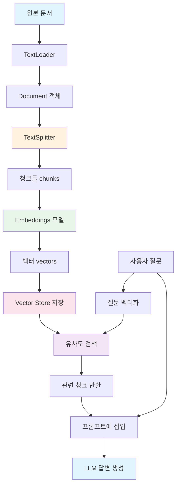
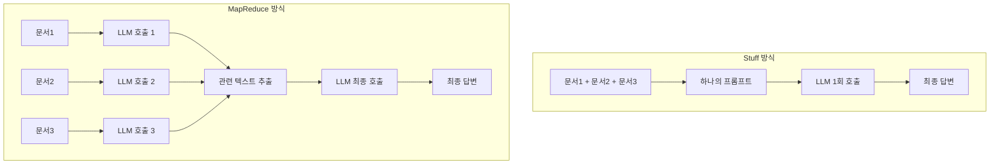

# Chapter 4: RAG (Retrieval-Augmented Generation)

## 학습 목표

이 챕터를 마치면 다음을 할 수 있습니다:

- **RAG**의 개념과 필요성을 이해한다
- **TextLoader**로 문서를 로드하고 **CharacterTextSplitter**로 분할할 수 있다
- **tiktoken** 기반 토큰 분할의 장점을 이해한다
- **OpenAIEmbeddings**로 텍스트를 벡터로 변환할 수 있다
- **FAISS**를 사용하여 벡터 스토어를 구축하고 유사도 검색을 수행할 수 있다
- **RetrievalQA**, **Stuff Chain**, **MapReduce Chain**의 차이를 이해하고 구현할 수 있다

---

## 핵심 개념 설명

### RAG란?

**RAG(Retrieval-Augmented Generation)**은 LLM이 학습하지 않은 외부 데이터를 검색(Retrieval)하여 답변 생성(Generation)에 활용하는 기법입니다. LLM의 지식 한계를 극복하고, 특정 문서에 기반한 정확한 답변을 가능하게 합니다.

### RAG 파이프라인



### 주요 용어

| 용어 | 설명 |
|------|------|
| **Document** | LangChain에서 텍스트와 메타데이터를 담는 객체 (`page_content`, `metadata`) |
| **Chunk** | 문서를 분할한 작은 조각. 각 청크가 하나의 Document 객체가 됩니다 |
| **Embedding** | 텍스트를 고차원 숫자 벡터로 변환한 것. 의미적 유사성을 수치로 비교 가능 |
| **Vector Store** | 벡터를 저장하고 유사도 검색을 수행하는 데이터베이스 |
| **Retriever** | Vector Store에서 관련 문서를 검색하는 인터페이스 |
| **Stuff** | 검색된 모든 문서를 하나의 프롬프트에 합쳐서 전달하는 방식 |
| **MapReduce** | 각 문서를 개별 처리(Map)한 후 결과를 종합(Reduce)하는 방식 |

### Stuff vs MapReduce



| | Stuff | MapReduce |
|---|---|---|
| LLM 호출 횟수 | 1회 | N+1회 (문서 수 + 최종) |
| 토큰 제한 | 전체 문서가 컨텍스트에 들어가야 함 | 각 문서를 개별 처리하므로 제한 적음 |
| 비용 | 낮음 | 높음 |
| 정확도 | 전체를 한번에 보므로 높음 | 각 문서에서 관련 부분만 추출 |
| 적합한 경우 | 문서가 적거나 짧을 때 | 문서가 많거나 길 때 |

---

## 커밋별 코드 해설

### 4.1 Data Loaders and Splitters

> 커밋: `75c3c6f`

문서를 로드하고 분할하는 기본 과정입니다.

```python
from langchain_community.document_loaders import TextLoader
from langchain_text_splitters import RecursiveCharacterTextSplitter

splitter = RecursiveCharacterTextSplitter()

loader = TextLoader("./files/chapter_one.txt")

loader.load_and_split(text_splitter=splitter)
```

**핵심 포인트:**

1. **TextLoader**: 텍스트 파일을 읽어 `Document` 객체로 변환합니다
   - `Document`는 `page_content`(텍스트)와 `metadata`(파일 경로 등)를 가집니다

2. **RecursiveCharacterTextSplitter**: 문서를 재귀적으로 분할합니다
   - 기본 구분자: `["\n\n", "\n", " ", ""]` 순서로 시도
   - 먼저 단락(`\n\n`)으로 나누고, 그래도 크면 줄바꿈(`\n`)으로, 그래도 크면 공백(` `)으로 분할
   - 이렇게 하면 의미 단위를 최대한 유지하면서 분할됩니다

3. **load_and_split**: 로드와 분할을 한 번에 수행합니다

**왜 문서를 분할하나?**
- LLM에는 컨텍스트 윈도우 제한이 있습니다 (한 번에 처리할 수 있는 토큰 수)
- 긴 문서를 통째로 넣을 수 없으므로, 관련 부분만 찾아서 넣어야 합니다
- 분할된 청크를 벡터로 변환하여 유사도 검색에 활용합니다

---

### 4.2 Tiktoken

> 커밋: `e3f9151`

tiktoken 기반으로 토큰 수를 정확히 제어하며 분할합니다.

```python
from langchain_community.document_loaders import TextLoader
from langchain_text_splitters import CharacterTextSplitter

splitter = CharacterTextSplitter.from_tiktoken_encoder(
    separator="\n",
    chunk_size=600,
    chunk_overlap=100,
)

loader = TextLoader("./files/chapter_one.txt")
```

**핵심 포인트:**

1. **CharacterTextSplitter.from_tiktoken_encoder**: tiktoken 라이브러리를 사용하여 토큰 수 기준으로 분할합니다

2. **파라미터 설명**:
   - `separator="\n"`: 줄바꿈을 기준으로 분할합니다
   - `chunk_size=600`: 각 청크가 최대 600토큰을 넘지 않도록 합니다
   - `chunk_overlap=100`: 연속된 청크 사이에 100토큰이 겹치도록 합니다

3. **왜 tiktoken인가?**
   - `RecursiveCharacterTextSplitter`는 **글자 수** 기준으로 분할합니다
   - `from_tiktoken_encoder`는 **토큰 수** 기준으로 분할합니다
   - LLM의 컨텍스트 윈도우는 토큰 단위이므로, 토큰 기준 분할이 더 정확합니다

4. **chunk_overlap의 역할**: 청크 경계에서 문맥이 끊기는 것을 방지합니다. 100토큰이 겹치면 앞 청크의 끝부분이 다음 청크의 시작에도 포함됩니다.

**용어 설명:**
- **tiktoken**: OpenAI가 만든 토크나이저 라이브러리입니다. GPT 모델이 실제로 사용하는 토큰 분할 방식을 제공합니다.

---

### 4.4 Vector Store

> 커밋: `3bd911a`

임베딩과 벡터 스토어를 구축합니다.

```python
from langchain_openai import OpenAIEmbeddings
from langchain_classic.embeddings import CacheBackedEmbeddings
from langchain_community.vectorstores import FAISS
from langchain_classic.storage import LocalFileStore

cache_dir = LocalFileStore("./.cache/")

splitter = CharacterTextSplitter.from_tiktoken_encoder(
    separator="\n",
    chunk_size=600,
    chunk_overlap=100,
)
loader = TextLoader("./files/chapter_one.txt")
docs = loader.load_and_split(text_splitter=splitter)

embeddings = OpenAIEmbeddings(
    base_url=os.getenv("OPENAI_EMBEDDING_BASE_URL"),
    api_key=os.getenv("OPENAI_API_KEY"),
    model=os.getenv("OPENAI_EMBEDDING_MODEL"),
)

cached_embeddings = CacheBackedEmbeddings.from_bytes_store(embeddings, cache_dir)

vectorstore = FAISS.from_documents(docs, cached_embeddings)
```

```python
results = vectorstore.similarity_search("where does winston live")
results
```

**핵심 포인트:**

1. **OpenAIEmbeddings**: 텍스트를 벡터(숫자 배열)로 변환합니다
   - 의미적으로 유사한 텍스트는 가까운 벡터를 가집니다
   - 예: "고양이"와 "cat"의 벡터는 "고양이"와 "자동차"보다 가깝습니다

2. **CacheBackedEmbeddings**: 임베딩 결과를 로컬 파일에 캐싱합니다
   - 같은 텍스트를 다시 임베딩할 때 API 호출 없이 캐시에서 반환
   - `LocalFileStore("./.cache/")`: 캐시 저장 위치

3. **FAISS**: Facebook AI Research에서 만든 벡터 유사도 검색 라이브러리입니다
   - `from_documents`: Document 리스트를 벡터화하여 인덱스를 구축합니다
   - `similarity_search`: 질문과 가장 유사한 청크를 검색합니다

4. **데이터 흐름**:
   ```
   텍스트 파일 -> TextLoader -> Documents -> TextSplitter -> 청크들
   -> OpenAIEmbeddings -> 벡터들 -> FAISS 인덱스
   ```

---

### 4.5 RetrievalQA

> 커밋: `84bb41b`

레거시 RetrievalQA 체인으로 문서 기반 QA를 수행합니다.

```python
from langchain_classic.chains import RetrievalQA

llm = ChatOpenAI(
    base_url=os.getenv("OPENAI_BASE_URL"),
    api_key=os.getenv("OPENAI_API_KEY"),
    model="gpt-5.1",
)

# ... (동일한 문서 로드, 임베딩, 벡터스토어 구축)

chain = RetrievalQA.from_chain_type(
    llm=llm,
    chain_type="map_rerank",
    retriever=vectorstore.as_retriever(),
)

chain.invoke("Describe Victory Mansions")
```

**핵심 포인트:**

1. **RetrievalQA**: 벡터 스토어 검색 + LLM 답변 생성을 하나의 체인으로 묶는 레거시 컴포넌트입니다

2. **chain_type 옵션**:
   - `"stuff"`: 모든 검색 결과를 하나의 프롬프트에 합침
   - `"map_reduce"`: 각 문서를 개별 처리 후 종합
   - `"map_rerank"`: 각 문서에서 답변을 생성하고, 가장 좋은 답변을 선택
   - `"refine"`: 문서를 순차적으로 처리하며 답변을 개선

3. **as_retriever()**: Vector Store를 Retriever 인터페이스로 변환합니다. 이를 통해 체인이 자동으로 관련 문서를 검색할 수 있습니다.

4. **레거시 주의**: `RetrievalQA`는 `langchain_classic`에 있으며, 현대적인 방식은 4.7~4.8에서 LCEL로 직접 구현합니다.

---

### 4.7 Stuff LCEL Chain

> 커밋: `bbb85ab`

LCEL로 Stuff 방식의 RAG 체인을 직접 구현합니다.

```python
from langchain_core.prompts import ChatPromptTemplate
from langchain_core.runnables import RunnablePassthrough

# ... (동일한 문서 로드, 임베딩, 벡터스토어 구축)

retriever = vectorstore.as_retriever()

prompt = ChatPromptTemplate.from_messages(
    [
        (
            "system",
            "You are a helpful assistant. Answer questions using only the following context. "
            "If you don't know the answer just say you don't know, don't make it up:\n\n{context}",
        ),
        ("human", "{question}"),
    ]
)

chain = (
    {
        "context": retriever,
        "question": RunnablePassthrough(),
    }
    | prompt
    | llm
)

chain.invoke("Describe Victory Mansions")
```

**핵심 포인트:**

1. **LCEL RAG 패턴의 핵심**:
   ```python
   {
       "context": retriever,
       "question": RunnablePassthrough(),
   }
   ```
   - `retriever`: 입력 문자열로 벡터 검색을 수행하여 관련 문서를 반환합니다
   - `RunnablePassthrough()`: 입력 문자열을 그대로 통과시킵니다
   - 결과: `{"context": [관련 Document들], "question": "원래 질문"}`

2. **프롬프트 설계**:
   - system 메시지에 `{context}`를 포함하여 검색된 문서를 컨텍스트로 제공합니다
   - "If you don't know the answer just say you don't know" -- 환각(hallucination)을 방지하는 중요한 지시문입니다

3. **Stuff 방식의 특징**: 검색된 모든 문서가 하나의 `{context}`에 합쳐져 들어갑니다. 단순하고 효과적이지만, 문서가 많으면 컨텍스트 윈도우를 초과할 수 있습니다.

4. **RetrievalQA vs LCEL**:
   - `RetrievalQA`: 블랙박스처럼 내부 동작이 숨겨져 있음
   - LCEL: 모든 단계가 명시적이어서 커스터마이징이 쉬움

---

### 4.8 Map Reduce LCEL Chain

> 커밋: `fcebffa`

LCEL로 MapReduce 방식의 RAG 체인을 구현합니다.

```python
from langchain_core.runnables import RunnablePassthrough, RunnableLambda

# Map 단계: 각 문서에서 관련 텍스트 추출
map_doc_prompt = ChatPromptTemplate.from_messages(
    [
        (
            "system",
            """
            Use the following portion of a long document to see if any of the text is relevant to answer the question. Return any relevant text verbatim. If there is no relevant text, return : ''
            -------
            {context}
            """,
        ),
        ("human", "{question}"),
    ]
)

map_doc_chain = map_doc_prompt | llm

def map_docs(inputs):
    documents = inputs["documents"]
    question = inputs["question"]
    return "\n\n".join(
        map_doc_chain.invoke(
            {"context": doc.page_content, "question": question}
        ).content
        for doc in documents
    )

map_chain = {
    "documents": retriever,
    "question": RunnablePassthrough(),
} | RunnableLambda(map_docs)

# Reduce 단계: 추출된 텍스트를 종합하여 최종 답변 생성
final_prompt = ChatPromptTemplate.from_messages(
    [
        (
            "system",
            """
            Given the following extracted parts of a long document and a question, create a final answer.
            If you don't know the answer, just say that you don't know. Don't try to make up an answer.
            ------
            {context}
            """,
        ),
        ("human", "{question}"),
    ]
)

chain = {"context": map_chain, "question": RunnablePassthrough()} | final_prompt | llm

chain.invoke("How many ministries are mentioned")
```

**핵심 포인트:**

1. **2단계 구조**:
   - **Map 단계**: 각 검색된 문서를 개별적으로 LLM에 보내서 관련 텍스트만 추출합니다
   - **Reduce 단계**: 추출된 텍스트들을 종합하여 최종 답변을 생성합니다

2. **map_docs 함수**:
   - `inputs["documents"]`에서 검색된 Document 리스트를 받습니다
   - 각 Document에 대해 `map_doc_chain`을 호출하여 관련 텍스트를 추출합니다
   - 결과를 `\n\n`으로 합쳐서 하나의 문자열로 반환합니다

3. **RunnableLambda**: 일반 Python 함수를 LCEL 체인에 삽입할 수 있게 해주는 래퍼입니다
   - `RunnableLambda(map_docs)`: `map_docs` 함수를 체인의 한 단계로 사용합니다

4. **체인 구성 순서**:
   ```
   질문 -> retriever로 문서 검색
        -> map_docs로 각 문서에서 관련 텍스트 추출
        -> final_prompt에 추출된 텍스트와 질문 삽입
        -> LLM으로 최종 답변 생성
   ```

5. **Stuff vs MapReduce 선택 기준**:
   - 검색된 문서가 4개 이하이고 각각 짧다면 -> Stuff (4.7)
   - 검색된 문서가 많거나 길다면 -> MapReduce (4.8)
   - MapReduce는 LLM 호출이 많아 비용이 높지만, 각 문서를 개별 분석하므로 정보 누락이 적습니다

---

## 이전 방식 vs 현재 방식

| 항목 | LangChain 0.x (2023) | LangChain 1.x (2026) |
|------|---------------------|---------------------|
| 문서 로더 임포트 | `from langchain.document_loaders import TextLoader` | `from langchain_community.document_loaders import TextLoader` |
| 텍스트 분할 임포트 | `from langchain.text_splitter import CharacterTextSplitter` | `from langchain_text_splitters import CharacterTextSplitter` |
| 임베딩 임포트 | `from langchain.embeddings import OpenAIEmbeddings` | `from langchain_openai import OpenAIEmbeddings` |
| 벡터스토어 임포트 | `from langchain.vectorstores import FAISS` | `from langchain_community.vectorstores import FAISS` |
| 캐시 임베딩 | `from langchain.embeddings import CacheBackedEmbeddings` | `from langchain_classic.embeddings import CacheBackedEmbeddings` |
| RetrievalQA | `from langchain.chains import RetrievalQA` | `from langchain_classic.chains import RetrievalQA` (레거시) |
| RAG 체인 구성 | `RetrievalQA.from_chain_type(...)` | LCEL: `{"context": retriever, "question": RunnablePassthrough()} \| prompt \| llm` |
| 텍스트 분할 패키지 | `langchain` 내장 | 별도 `langchain_text_splitters` 패키지 |

**주요 변화:**
- 텍스트 분할기가 `langchain_text_splitters`라는 독립 패키지로 분리되었습니다
- `RetrievalQA` 등 레거시 체인은 `langchain_classic`으로 이동했고, LCEL로 직접 구현하는 것이 권장됩니다
- `CacheBackedEmbeddings`, `LocalFileStore` 등 유틸리티가 `langchain_classic`으로 이동했습니다

---

## 실습 과제

### 과제 1: 나만의 RAG 시스템

다음 요구사항에 맞는 RAG 시스템을 구축하세요:

1. 자신이 선택한 텍스트 파일(블로그 글, 위키 문서 등)을 준비합니다
2. `CharacterTextSplitter.from_tiktoken_encoder`로 분할합니다 (chunk_size=500, chunk_overlap=50)
3. `CacheBackedEmbeddings`로 임베딩을 캐싱합니다
4. FAISS 벡터 스토어를 구축합니다
5. **Stuff 방식** LCEL 체인으로 3가지 질문에 답변합니다

### 과제 2: Stuff vs MapReduce 비교

같은 문서와 같은 질문으로 Stuff 체인(4.7)과 MapReduce 체인(4.8)을 각각 실행하고 비교하세요:

1. 두 체인의 답변 품질을 비교합니다
2. `get_usage_metadata_callback()`으로 각 체인의 토큰 사용량을 측정합니다
3. 어떤 상황에서 어떤 방식이 더 적합한지 정리합니다

---

## 다음 챕터 예고

**Chapter 5: Streamlit**에서는 지금까지 만든 RAG 시스템을 웹 애플리케이션으로 만듭니다:
- **Streamlit**: Python만으로 웹 UI를 만드는 프레임워크
- 파일 업로드, 채팅 인터페이스, 스트리밍 응답
- 완성된 문서 QA 챗봇 구현
