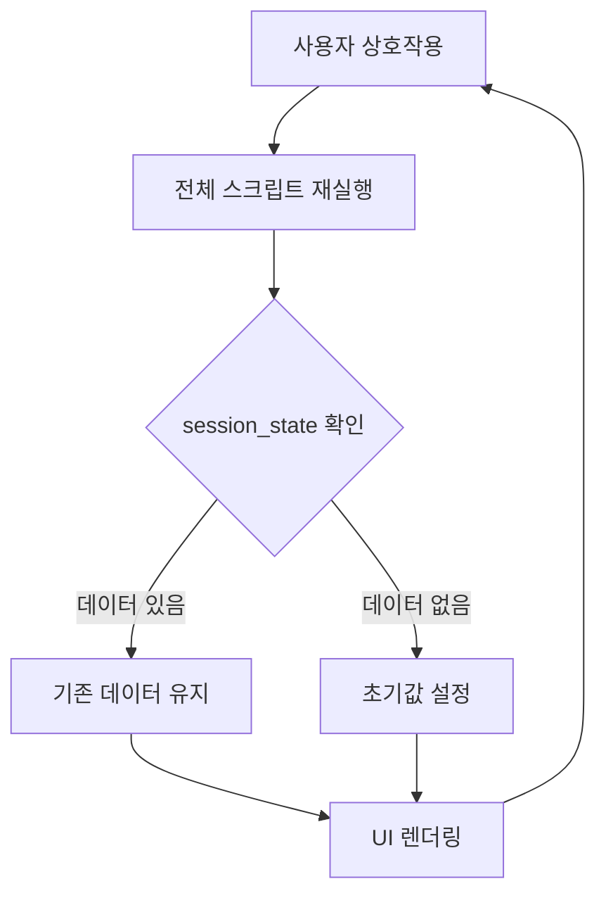
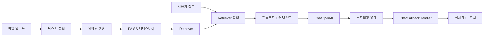
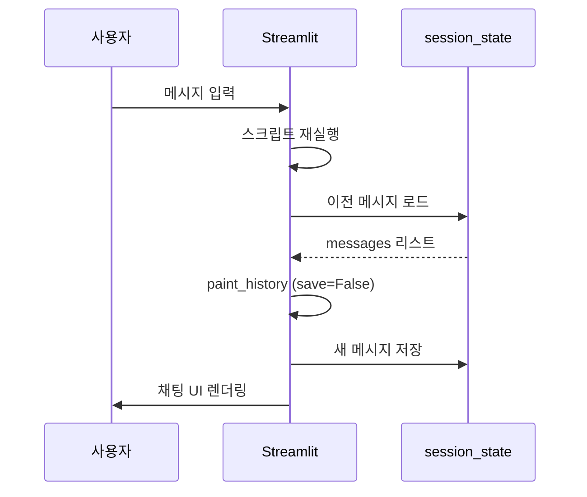
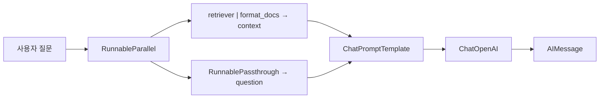
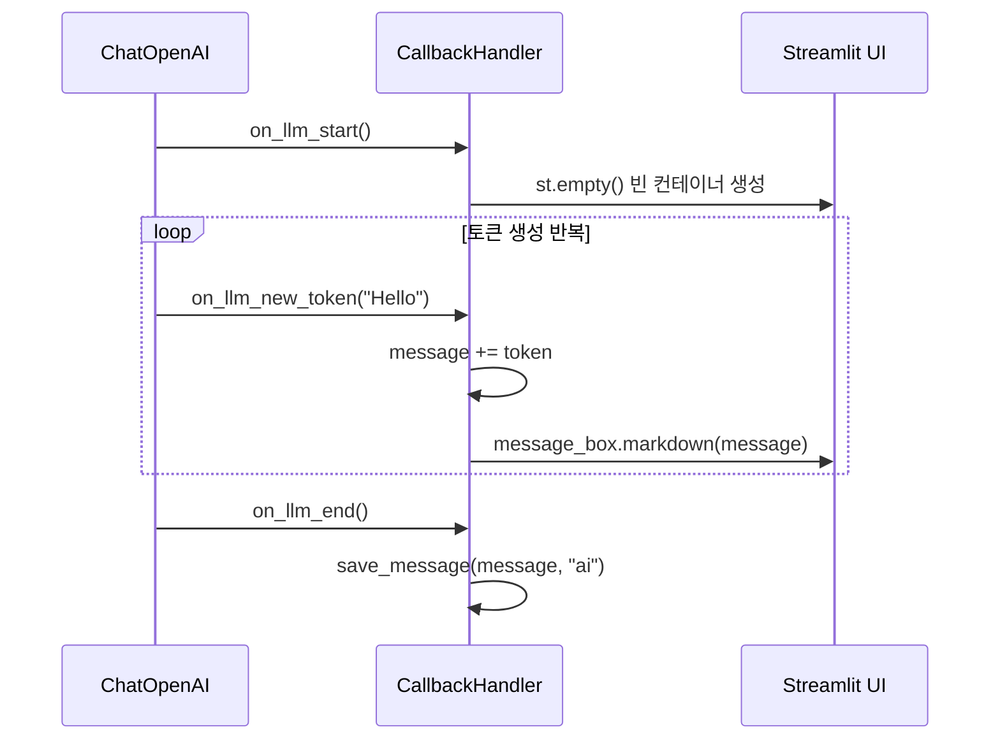

# Chapter 05: Streamlit - AI 챗봇 UI 만들기

## 학습 목표

이 챕터를 마치면 다음을 할 수 있습니다:

- Streamlit의 기본 위젯과 레이아웃을 사용하여 웹 앱을 만들 수 있다
- `st.session_state`를 이용해 대화 기록을 유지할 수 있다
- `st.file_uploader`로 문서를 업로드하고 RAG 파이프라인에 연결할 수 있다
- `ChatCallbackHandler`를 구현하여 스트리밍 응답을 실시간으로 표시할 수 있다
- Streamlit + LangChain으로 완전한 DocumentGPT 챗봇을 완성할 수 있다

---

## 핵심 개념 설명

### Streamlit이란?

Streamlit은 Python만으로 웹 애플리케이션을 만들 수 있는 프레임워크입니다. HTML, CSS, JavaScript를 전혀 몰라도 됩니다. 데이터 과학자와 AI 엔지니어가 빠르게 프로토타입을 만들 때 특히 유용합니다.

### Streamlit의 실행 모델

Streamlit의 가장 중요한 특징은 **스크립트가 매 상호작용마다 처음부터 다시 실행된다**는 것입니다. 버튼을 클릭하거나, 텍스트를 입력하거나, 파일을 업로드하면 전체 Python 스크립트가 위에서 아래로 다시 실행됩니다.



이 때문에 **`st.session_state`** 가 필수적입니다. 변수를 `session_state`에 저장하지 않으면 매 실행마다 초기화됩니다.

### DocumentGPT 아키텍처



---

## 커밋별 코드 해설

### 5.0 Introduction (`bd57168`)

Streamlit의 첫 만남입니다. 가장 기본적인 위젯들을 사용합니다.

```python
import streamlit as st

st.title("Hello world!")
st.subheader("Welcome to Streamlit!")
st.markdown("""
    #### I love it!
""")
```

`st.title`, `st.subheader`, `st.markdown`은 텍스트를 표시하는 가장 기본적인 함수입니다. Streamlit 앱을 실행하려면 터미널에서 `streamlit run Home.py`를 입력합니다.

---

### 5.1 Magic (`4a73e79`)

Streamlit의 "Magic" 기능과 입력 위젯을 소개합니다.

```python
import streamlit as st

st.selectbox(
    "Choose your model",
    ("GPT-3", "GPT-4"),
)
```

**`st.selectbox`** 는 드롭다운 메뉴를 만듭니다. 사용자가 선택한 값을 반환하므로 변수에 저장하여 조건 분기에 사용할 수 있습니다.

---

### 5.2 Data Flow (`7cf4068`)

Streamlit의 데이터 흐름(Data Flow)을 이해하는 핵심 커밋입니다.

```python
import streamlit as st
from datetime import datetime

today = datetime.today().strftime("%H:%M:%S")
st.title(today)

model = st.selectbox(
    "Choose your model",
    ("GPT-3", "GPT-4"),
)

if model == "GPT-3":
    st.write("cheap")
else:
    st.write("not cheap")
    name = st.text_input("What is your name?")
    st.write(name)
    value = st.slider("temperature", min_value=0.1, max_value=1.0)
    st.write(value)
```

**핵심 포인트:** `st.title(today)`에 표시되는 시간이 위젯을 조작할 때마다 바뀝니다. 이것이 바로 "스크립트 전체가 다시 실행된다"는 것의 증거입니다.

새로운 위젯들:
- **`st.text_input`**: 텍스트 입력 필드
- **`st.slider`**: 슬라이더 (여기서는 temperature 조절용)
- **`st.write`**: 어떤 타입이든 자동으로 적절하게 표시하는 만능 함수

---

### 5.3 Multi Page (`7152c0d`)

Streamlit의 멀티페이지 기능을 설정합니다. `pages/` 폴더에 파일을 넣으면 자동으로 사이드바에 네비게이션이 생깁니다.

```
프로젝트 구조:
├── Home.py                      # 메인 페이지
├── pages/
│   ├── 01_DocumentGPT.py        # /DocumentGPT
│   ├── 02_PrivateGPT.py         # /PrivateGPT
│   └── 03_QuizGPT.py            # /QuizGPT
```

`Home.py`에서 `st.set_page_config`로 페이지 제목과 아이콘을 설정합니다:

```python
st.set_page_config(
    page_title="FullstackGPT Home",
    page_icon="🤖",
)
```

> **용어 설명:** `st.set_page_config`는 반드시 스크립트의 **첫 번째 Streamlit 명령**으로 호출해야 합니다. 그렇지 않으면 에러가 발생합니다.

---

### 5.4 Chat Messages (`473717f`)

채팅 UI의 핵심인 `st.chat_message`와 `st.session_state`를 도입합니다.

```python
st.set_page_config(
    page_title="DocumentGPT",
    page_icon="📃",
)

if "messages" not in st.session_state:
    st.session_state["messages"] = []

def send_message(message, role, save=True):
    with st.chat_message(role):
        st.write(message)
    if save:
        st.session_state["messages"].append({"message": message, "role": role})

for message in st.session_state["messages"]:
    send_message(message["message"], message["role"], save=False)

message = st.chat_input("Send a message to the ai ")

if message:
    send_message(message, "human")
    time.sleep(2)
    send_message(f"You said: {message}", "ai")
```

**핵심 패턴 분석:**

1. **`st.session_state`**: 딕셔너리처럼 동작하며 재실행 사이에도 데이터가 유지됩니다
2. **`st.chat_message(role)`**: `"human"` 또는 `"ai"` 역할에 따라 다른 아이콘과 스타일로 메시지를 표시합니다
3. **`st.chat_input`**: 화면 하단에 고정된 채팅 입력창을 생성합니다
4. **`save=False` 패턴**: 이전 메시지를 다시 그릴 때는 중복 저장을 방지합니다



---

### 5.6 Uploading Documents (`5200539`)

파일 업로드와 RAG 파이프라인을 Streamlit에 통합합니다.

```python
def embed_file(file):
    file_content = file.read()
    file_path = f"./.cache/files/{file.name}"
    os.makedirs(os.path.dirname(file_path), exist_ok=True)
    with open(file_path, "wb") as f:
        f.write(file_content)
    cache_dir = LocalFileStore(f"./.cache/embeddings/{file.name}")
    splitter = CharacterTextSplitter.from_tiktoken_encoder(
        separator="\n",
        chunk_size=600,
        chunk_overlap=100,
    )
    if file.name.endswith(".txt"):
        loader = TextLoader(file_path)
    else:
        loader = UnstructuredFileLoader(file_path)
    docs = loader.load_and_split(text_splitter=splitter)
    embeddings = OpenAIEmbeddings(...)
    cached_embeddings = CacheBackedEmbeddings.from_bytes_store(embeddings, cache_dir)
    vectorstore = FAISS.from_documents(docs, cached_embeddings)
    retriever = vectorstore.as_retriever()
    return retriever

file = st.file_uploader(
    "Upload a .txt .pdf or .docx file",
    type=["pdf", "txt", "docx"],
)

if file:
    retriever = embed_file(file)
    s = retriever.invoke("winston")
    s
```

**주요 개념:**

- **`st.file_uploader`**: 파일 업로드 위젯. `type` 파라미터로 허용 확장자를 제한합니다
- **`CacheBackedEmbeddings`**: 이미 임베딩한 문서는 로컬 파일에 캐시하여 중복 API 호출을 방지합니다
- **파일 형식 분기**: `.txt` 파일은 `TextLoader`, 그 외는 `UnstructuredFileLoader`를 사용합니다

> **비용 절약 팁:** 임베딩 API는 호출할 때마다 비용이 발생합니다. `CacheBackedEmbeddings`를 사용하면 같은 문서를 다시 업로드해도 캐시된 결과를 사용하므로 비용이 들지 않습니다.

---

### 5.7 Chat History (`3c4b1ac`)

채팅 히스토리와 파일 업로드를 결합합니다. 사이드바로 파일 업로드를 이동하고, `@st.cache_data`를 추가합니다.

```python
@st.cache_data(show_spinner="Embedding file...")
def embed_file(file):
    # ... 이전과 동일하지만 캐싱 데코레이터 추가
    return retriever

def send_message(message, role, save=True):
    with st.chat_message(role):
        st.markdown(message)
    if save:
        st.session_state["messages"].append({"message": message, "role": role})

def paint_history():
    for message in st.session_state["messages"]:
        send_message(message["message"], message["role"], save=False)

with st.sidebar:
    file = st.file_uploader(
        "Upload a .txt .pdf or .docx file",
        type=["pdf", "txt", "docx"],
    )

if file:
    retriever = embed_file(file)
    send_message("I'm ready! Ask away!", "ai", save=False)
    paint_history()
    message = st.chat_input("Ask anything about your file...")
    if message:
        send_message(message, "human")
else:
    st.session_state["messages"] = []
```

**새로운 개념들:**

- **`@st.cache_data`**: 함수의 결과를 캐시합니다. 같은 파일을 업로드하면 임베딩을 다시 하지 않습니다. `show_spinner` 파라미터로 로딩 메시지를 표시합니다.
- **`with st.sidebar:`**: 위젯을 사이드바에 배치합니다
- **파일 없을 때 초기화**: `else: st.session_state["messages"] = []`로 파일을 제거하면 대화 기록도 초기화합니다

---

### 5.8 Chain (`c0c51ef`)

LangChain LCEL 체인을 Streamlit과 연결합니다. 이제 실제로 AI가 문서 기반 답변을 합니다.

```python
llm = ChatOpenAI(
    base_url=os.getenv("OPENAI_BASE_URL"),
    api_key=os.getenv("OPENAI_API_KEY"),
    model="gpt-5.1",
    temperature=0.1,
)

def format_docs(docs):
    return "\n\n".join(document.page_content for document in docs)

prompt = ChatPromptTemplate.from_messages([
    ("system", """
    Answer the question using ONLY the following context.
    If you don't know the answer just say you don't know.
    DON'T make anything up.

    Context: {context}
    """),
    ("human", "{question}"),
])

if message:
    send_message(message, "human")
    chain = (
        {
            "context": retriever | RunnableLambda(format_docs),
            "question": RunnablePassthrough(),
        }
        | prompt
        | llm
    )
    response = chain.invoke(message)
    send_message(response.content, "ai")
```

**LCEL 체인 구조 분석:**



- **`RunnableParallel`** (딕셔너리 형태): `context`와 `question`을 동시에 준비합니다
- **`RunnableLambda(format_docs)`**: retriever가 반환한 Document 리스트를 하나의 문자열로 변환합니다
- **`RunnablePassthrough()`**: 입력을 그대로 통과시킵니다 (사용자의 질문 텍스트)

---

### 5.9 Streaming (`16c3c12`)

실시간 스트리밍을 위한 `ChatCallbackHandler`를 구현합니다. 이것이 이 챕터의 하이라이트입니다.

```python
from langchain_core.callbacks import BaseCallbackHandler

class ChatCallbackHandler(BaseCallbackHandler):
    message = ""

    def on_llm_start(self, *args, **kwargs):
        self.message_box = st.empty()

    def on_llm_end(self, *args, **kwargs):
        save_message(self.message, "ai")

    def on_llm_new_token(self, token, *args, **kwargs):
        self.message += token
        self.message_box.markdown(self.message)

llm = ChatOpenAI(
    base_url=os.getenv("OPENAI_BASE_URL"),
    api_key=os.getenv("OPENAI_API_KEY"),
    model="gpt-5.1",
    temperature=0.1,
    streaming=True,
    callbacks=[ChatCallbackHandler()],
)
```

**ChatCallbackHandler 동작 원리:**



1. **`on_llm_start`**: LLM이 응답을 시작할 때 호출됩니다. `st.empty()`로 빈 컨테이너를 만듭니다.
2. **`on_llm_new_token`**: 토큰이 하나씩 생성될 때마다 호출됩니다. 기존 메시지에 새 토큰을 추가하고, `message_box.markdown()`으로 UI를 갱신합니다.
3. **`on_llm_end`**: 응답이 완료되면 전체 메시지를 `session_state`에 저장합니다.

호출 부분도 변경됩니다:

```python
if message:
    send_message(message, "human")
    chain = (
        {
            "context": retriever | RunnableLambda(format_docs),
            "question": RunnablePassthrough(),
        }
        | prompt
        | llm
    )
    with st.chat_message("ai"):
        chain.invoke(message)
```

`with st.chat_message("ai"):` 블록 안에서 `chain.invoke`를 호출하면, `ChatCallbackHandler`가 생성하는 `st.empty()`가 AI 메시지 컨테이너 안에 위치하게 됩니다.

---

### 5.10 Recap (`c6b2b04`)

최종 완성 코드는 5.9와 동일합니다. 전체 흐름을 복습하는 커밋입니다.

---

## 이전 방식 vs 현재 방식

| 항목 | LangChain 0.x (이전) | LangChain 1.x (현재) |
|------|---------------------|---------------------|
| 체인 구성 | `RetrievalQA.from_chain_type(llm, retriever=retriever)` | LCEL: `{"context": retriever \| format_docs, "question": RunnablePassthrough()} \| prompt \| llm` |
| 스트리밍 | `llm(streaming=True, callbacks=[...])` | 동일하지만 `BaseCallbackHandler` import 경로가 `langchain_core.callbacks`로 변경 |
| 문서 검색 | `retriever.get_relevant_documents(query)` | `retriever.invoke(query)` |
| 임베딩 | `from langchain.embeddings import OpenAIEmbeddings` | `from langchain_openai import OpenAIEmbeddings` |
| 벡터스토어 | `from langchain.vectorstores import FAISS` | `from langchain_community.vectorstores import FAISS` |
| 콜백 | `from langchain.callbacks.base import BaseCallbackHandler` | `from langchain_core.callbacks import BaseCallbackHandler` |

---

## 실습 과제

### 과제 1: 대화 초기화 버튼 추가

사이드바에 "Clear Chat History" 버튼을 추가하세요. 버튼을 누르면 `st.session_state["messages"]`를 빈 리스트로 초기화합니다.

**힌트:**
```python
with st.sidebar:
    if st.button("Clear Chat History"):
        st.session_state["messages"] = []
```

### 과제 2: 모델 선택 기능

사이드바에 `st.selectbox`를 추가하여 사용자가 모델을 선택할 수 있게 하세요. 선택한 모델에 따라 `ChatOpenAI`의 `model` 파라미터를 변경합니다.

**요구사항:**
- 모델 옵션: `"gpt-4o-mini"`, `"gpt-4o"`, `"gpt-4-turbo"`
- 모델 변경 시 기존 대화는 유지

---

## 다음 챕터 예고

Chapter 06에서는 OpenAI 대신 **오픈소스 LLM**을 사용하는 방법을 배웁니다. HuggingFace Hub, GPT4All, Ollama 등 다양한 대안 프로바이더를 탐색하고, 로컬에서 LLM을 실행하는 **PrivateGPT**를 만들어봅니다. 인터넷 없이, API 키 없이, 완전히 프라이빗한 AI 챗봇이 가능할까요?
