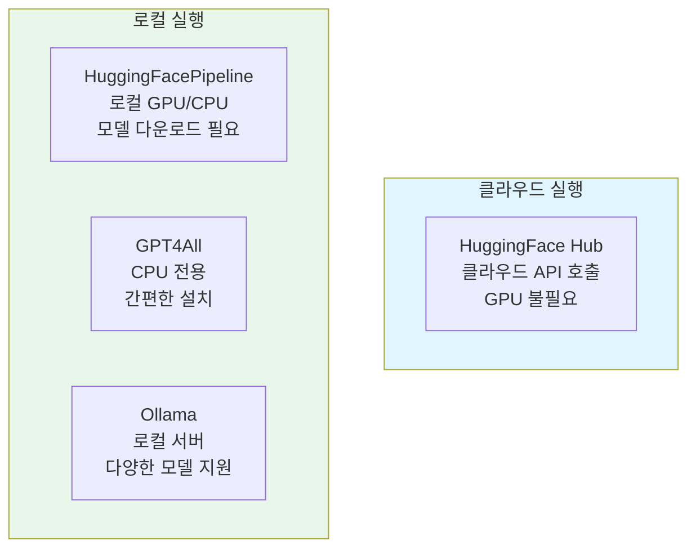
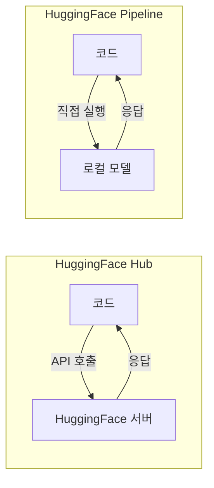
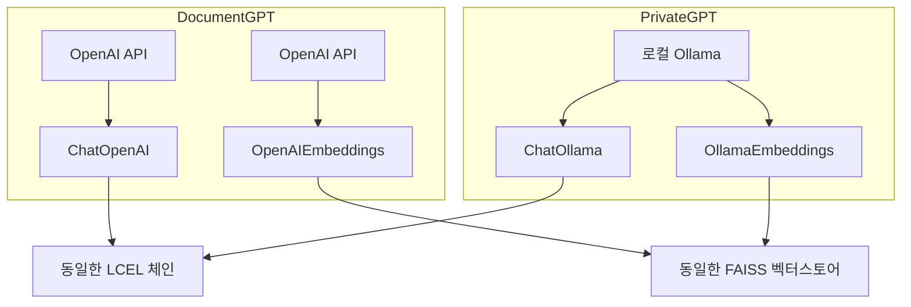

# Chapter 06: Alternative Providers - 오픈소스 LLM 활용하기

## 학습 목표

이 챕터를 마치면 다음을 할 수 있습니다:

- OpenAI 외에 다양한 LLM 프로바이더의 특징과 차이점을 이해한다
- HuggingFace Hub을 통해 클라우드에서 오픈소스 모델을 사용할 수 있다
- HuggingFacePipeline으로 로컬에서 모델을 직접 실행할 수 있다
- GPT4All과 Ollama를 설정하고 사용할 수 있다
- PrivateGPT를 만들어 완전히 로컬에서 동작하는 RAG 챗봇을 구현할 수 있다

---

## 핵심 개념 설명

### 왜 대안 프로바이더가 필요한가?

OpenAI의 GPT 모델은 강력하지만 몇 가지 제약이 있습니다:

1. **비용**: API 호출마다 요금이 발생합니다
2. **프라이버시**: 데이터가 OpenAI 서버로 전송됩니다
3. **인터넷 의존**: 오프라인에서는 사용할 수 없습니다
4. **API 키 필요**: 계정과 결제 수단이 필요합니다

오픈소스 LLM을 사용하면 이러한 제약 없이 AI 애플리케이션을 만들 수 있습니다.

### 프로바이더별 비교



| 프로바이더 | 실행 위치 | GPU 필요 | 인터넷 필요 | 난이도 |
|-----------|----------|---------|------------|--------|
| HuggingFace Hub | 클라우드 | X | O | 쉬움 |
| HuggingFacePipeline | 로컬 | 권장 | 최초 1회 | 보통 |
| GPT4All | 로컬 | X | 최초 1회 | 쉬움 |
| Ollama | 로컬 | X | 최초 1회 | 쉬움 |

---

## 커밋별 코드 해설

### 6.1 HuggingFaceHub (`bda470a`)

HuggingFace Hub은 수천 개의 오픈소스 모델을 호스팅하는 플랫폼입니다. API를 통해 클라우드에서 모델을 실행합니다.

```python
from langchain_community.llms import HuggingFaceHub
from langchain_core.prompts import PromptTemplate

prompt = PromptTemplate.from_template("[INST]What is the meaning of {word}[/INST]")

llm = HuggingFaceHub(
    repo_id="mistralai/Mistral-7B-Instruct-v0.1",
    model_kwargs={
        "max_new_tokens": 250,
    },
)

chain = prompt | llm

chain.invoke({"word": "potato"})
```

**코드 분석:**

- **`repo_id`**: HuggingFace 모델 저장소 ID입니다. 여기서는 Mistral AI의 7B 파라미터 인스트럭션 모델을 사용합니다
- **`[INST]...[/INST]`**: Mistral 모델의 특수 프롬프트 형식입니다. 모델마다 기대하는 프롬프트 형식이 다릅니다
- **`max_new_tokens`**: 생성할 최대 토큰 수를 제한합니다
- **LCEL 체인**: `prompt | llm` 파이프라인은 OpenAI와 완전히 동일합니다. LangChain의 추상화 덕분에 프로바이더를 바꿔도 체인 구조는 그대로입니다

> **용어 설명:** "7B"는 70억(7 Billion) 개의 파라미터를 가진 모델이라는 뜻입니다. 파라미터가 많을수록 일반적으로 더 똑똑하지만, 더 많은 컴퓨팅 자원이 필요합니다.

**사전 준비:**
```bash
pip install langchain-community huggingface_hub
```
환경 변수 `HUGGINGFACEHUB_API_TOKEN`에 HuggingFace API 토큰을 설정해야 합니다.

---

### 6.2 HuggingFacePipeline (`804ac75`)

이번에는 모델을 **로컬 컴퓨터에 다운로드**하여 실행합니다. 인터넷 연결 없이도 사용할 수 있습니다.

```python
from langchain_community.llms import HuggingFacePipeline
from langchain_core.prompts import PromptTemplate

prompt = PromptTemplate.from_template("A {word} is a")

llm = HuggingFacePipeline.from_model_id(
    model_id="gpt2",
    task="text-generation",
    pipeline_kwargs={"max_new_tokens": 150},
)

chain = prompt | llm

chain.invoke({"word": "tomato"})
```

**코드 분석:**

- **`HuggingFacePipeline.from_model_id`**: 모델 ID를 지정하면 자동으로 다운로드하고 로컬에서 실행합니다
- **`model_id="gpt2"`**: OpenAI의 GPT-2 모델입니다. 작고 가벼워서 테스트에 적합합니다
- **`task="text-generation"`**: HuggingFace에서 모델의 용도를 지정합니다. 텍스트 생성, 번역, 요약 등 다양한 태스크가 있습니다

**HuggingFace Hub vs Pipeline 차이:**



> **주의:** GPT-2는 매우 오래된 모델이라 답변 품질이 좋지 않습니다. 실제 프로덕션에서는 Llama, Mistral 같은 최신 모델을 사용하세요. 다만 이런 모델은 용량이 수 GB에 달하므로 다운로드에 시간이 걸립니다.

---

### 6.3 GPT4All (`ff08536`)

GPT4All은 CPU만으로 실행할 수 있는 로컬 LLM 솔루션입니다. GPU가 없는 컴퓨터에서도 사용할 수 있다는 것이 장점입니다.

```python
from langchain_community.llms import GPT4All
from langchain_core.prompts import PromptTemplate

prompt = PromptTemplate.from_template(
    "You are a helpful assistant that defines words. Define this word: {word}."
)

llm = GPT4All(
    model="./falcon.bin",
)

chain = prompt | llm

chain.invoke({"word": "tomato"})
```

**코드 분석:**

- **`model="./falcon.bin"`**: 로컬에 다운로드한 모델 파일 경로를 지정합니다
- 프롬프트 형식이 더 자연스럽습니다. GPT4All의 모델들은 대체로 표준 프롬프트 형식을 지원합니다
- 별도의 API 키가 필요 없습니다

**GPT4All 설치 및 모델 다운로드:**

```bash
pip install gpt4all
# 모델 파일은 GPT4All 공식 사이트에서 다운로드
# https://gpt4all.io/
```

> **참고:** GPT4All은 양자화(quantized)된 모델을 사용합니다. 양자화란 모델의 가중치를 낮은 정밀도로 변환하여 파일 크기와 메모리 사용량을 줄이는 기법입니다. 품질은 약간 떨어지지만 일반 컴퓨터에서도 실행할 수 있습니다.

---

### 6.4 Ollama (`bf6c317`)

Ollama는 로컬 LLM을 가장 편리하게 사용할 수 있는 도구입니다. Docker처럼 명령어 한 줄로 모델을 설치하고 실행합니다.

**notebook.ipynb의 코드는 6.3과 동일**하지만, 이 커밋의 핵심은 **`pages/02_PrivateGPT.py`** 파일입니다.

#### PrivateGPT - 완전한 로컬 RAG 챗봇

```python
from langchain_community.chat_models import ChatOllama
from langchain_community.embeddings import OllamaEmbeddings

llm = ChatOllama(
    model="mistral:latest",
    temperature=0.1,
    streaming=True,
    callbacks=[ChatCallbackHandler()],
)

@st.cache_data(show_spinner="Embedding file...")
def embed_file(file):
    # ... 파일 저장 및 분할 ...
    embeddings = OllamaEmbeddings(model="mistral:latest")
    cached_embeddings = CacheBackedEmbeddings.from_bytes_store(embeddings, cache_dir)
    vectorstore = FAISS.from_documents(docs, cached_embeddings)
    retriever = vectorstore.as_retriever()
    return retriever
```

**DocumentGPT와의 핵심 차이:**

| 항목 | DocumentGPT | PrivateGPT |
|------|------------|------------|
| LLM | `ChatOpenAI` (OpenAI API) | `ChatOllama` (로컬 Ollama) |
| 임베딩 | `OpenAIEmbeddings` | `OllamaEmbeddings` |
| 인터넷 | 필요 | 불필요 |
| API 키 | 필요 | 불필요 |
| 비용 | 유료 | 무료 |
| 응답 품질 | 높음 | 보통 |

나머지 코드 구조(체인, 채팅 히스토리, 스트리밍)는 **DocumentGPT와 거의 동일**합니다. 이것이 LangChain의 강력한 추상화입니다. LLM과 임베딩 객체만 교체하면 나머지 코드는 그대로 재사용할 수 있습니다.



**Ollama 설치 및 모델 다운로드:**

```bash
# macOS
brew install ollama

# 모델 다운로드 및 실행
ollama pull mistral
ollama run mistral
```

**프롬프트 구조도 약간 다릅니다:**

```python
prompt = ChatPromptTemplate.from_template(
    """Answer the question using ONLY the following context and not your training data.
    If you don't know the answer just say you don't know. DON'T make anything up.

    Context: {context}
    Question:{question}
    """
)
```

DocumentGPT는 `from_messages`를 사용했지만, PrivateGPT는 `from_template`을 사용합니다. 로컬 모델은 시스템/사용자 메시지 구분보다는 단일 프롬프트가 더 잘 동작하는 경우가 많습니다.

---

## 이전 방식 vs 현재 방식

| 항목 | LangChain 0.x (이전) | LangChain 1.x (현재) |
|------|---------------------|---------------------|
| HuggingFace Hub | `from langchain.llms import HuggingFaceHub` | `from langchain_community.llms import HuggingFaceHub` |
| HuggingFace Pipeline | `from langchain.llms import HuggingFacePipeline` | `from langchain_community.llms import HuggingFacePipeline` |
| GPT4All | `from langchain.llms import GPT4All` | `from langchain_community.llms import GPT4All` |
| Ollama (LLM) | `from langchain.llms import Ollama` | `from langchain_community.llms import Ollama` |
| Ollama (Chat) | 없음 | `from langchain_community.chat_models import ChatOllama` |
| Ollama Embeddings | `from langchain.embeddings import OllamaEmbeddings` | `from langchain_community.embeddings import OllamaEmbeddings` |
| 패키지 구조 | 모든 것이 `langchain` 패키지 안에 | 커뮤니티 모듈은 `langchain-community`로 분리 |

> **핵심 변경:** LangChain 1.x에서 커뮤니티 프로바이더들은 모두 `langchain-community` 패키지로 분리되었습니다. `pip install langchain-community`로 별도 설치해야 합니다.

---

## 실습 과제

### 과제 1: Ollama 모델 비교

Ollama에서 두 가지 이상의 모델(예: `mistral`, `llama2`)을 다운로드하고, 같은 질문에 대한 응답을 비교해보세요.

**요구사항:**
- Streamlit에 모델 선택 `st.selectbox`를 추가
- 같은 질문에 대해 각 모델의 응답 시간과 품질을 비교
- `st.sidebar`에 모델 정보(이름, 파라미터 수)를 표시

### 과제 2: PrivateGPT 개선

PrivateGPT에 다음 기능을 추가하세요:

1. 사이드바에 `temperature` 슬라이더 추가 (0.0 ~ 1.0)
2. 업로드 가능한 파일 형식에 `.csv` 추가
3. 현재 사용 중인 모델 이름을 사이드바에 표시

---

## 다음 챕터 예고

Chapter 07에서는 **QuizGPT**를 만듭니다. Wikipedia에서 정보를 검색하고, LLM이 자동으로 퀴즈를 생성합니다. LLM의 출력을 JSON으로 파싱하는 방법, 두 개의 체인을 연결하는 방법, 그리고 OpenAI의 **Function Calling**(구조화된 출력)을 활용하는 방법을 배웁니다.
