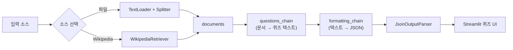
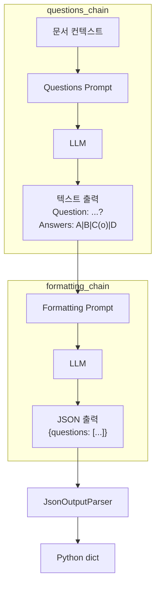
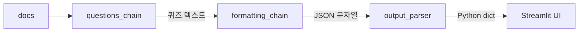
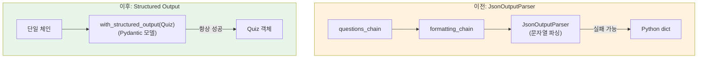

# Chapter 07: QuizGPT - AI 퀴즈 생성기

## 학습 목표

이 챕터를 마치면 다음을 할 수 있습니다:

- `WikipediaRetriever`를 사용하여 위키피디아에서 문서를 검색할 수 있다
- 두 개의 LCEL 체인을 연결하여 복잡한 파이프라인을 구성할 수 있다
- 커스텀 `JsonOutputParser`를 만들어 LLM 출력을 구조화된 데이터로 변환할 수 있다
- `@st.cache_data`를 활용한 캐싱 전략을 이해한다
- OpenAI의 `with_structured_output`(Function Calling)으로 안정적인 구조화 출력을 얻을 수 있다
- Streamlit의 `st.form`과 `st.radio`를 사용하여 인터랙티브 퀴즈 UI를 만들 수 있다

---

## 핵심 개념 설명

### QuizGPT 아키텍처

QuizGPT는 두 개의 체인을 직렬로 연결하는 구조입니다. 첫 번째 체인이 문서를 기반으로 질문을 텍스트로 생성하고, 두 번째 체인이 그 텍스트를 JSON으로 변환합니다.



### 두 체인의 역할 분리



**왜 체인을 두 개로 분리할까?**

LLM에게 "문서를 읽고 퀴즈를 만들고, JSON으로 출력해줘"라고 한 번에 요청하면 실패할 확률이 높습니다. 작업을 분리하면:
1. 각 단계에서 LLM이 하나의 작업에만 집중합니다
2. 디버깅이 쉽습니다 (어느 단계에서 문제가 생겼는지 파악 가능)
3. 중간 결과를 검증할 수 있습니다

---

## 커밋별 코드 해설

### 7.1 WikipediaRetriever (`65f2af8`)

QuizGPT의 기본 골격을 만듭니다. 파일 업로드와 Wikipedia 검색, 두 가지 입력 소스를 지원합니다.

```python
from langchain_community.retrievers import WikipediaRetriever

st.set_page_config(page_title="QuizGPT", page_icon="❓")
st.title("QuizGPT")

@st.cache_data(show_spinner="Loading file...")
def split_file(file):
    file_content = file.read()
    file_path = f"./.cache/quiz_files/{file.name}"
    with open(file_path, "wb") as f:
        f.write(file_content)
    splitter = CharacterTextSplitter.from_tiktoken_encoder(
        separator="\n", chunk_size=600, chunk_overlap=100,
    )
    loader = TextLoader(file_path)
    docs = loader.load_and_split(text_splitter=splitter)
    return docs

with st.sidebar:
    choice = st.selectbox(
        "Choose what you want to use.",
        ("File", "Wikipedia Article"),
    )
    if choice == "File":
        file = st.file_uploader(
            "Upload a .docx , .txt or .pdf file",
            type=["pdf", "txt", "docx"],
        )
        if file:
            docs = split_file(file)
            st.write(docs)
    else:
        topic = st.text_input("Search Wikipedia...")
        if topic:
            retriever = WikipediaRetriever(top_k_results=5)
            with st.status("Searching Wikipedia..."):
                docs = retriever.invoke(topic)
```

**핵심 개념:**

- **`WikipediaRetriever`**: LangChain이 제공하는 위키피디아 검색 도구입니다. `top_k_results=5`로 상위 5개 문서를 가져옵니다
- **`retriever.invoke(topic)`**: 검색어를 넘기면 관련 위키피디아 페이지를 `Document` 객체 리스트로 반환합니다
- **`st.status`**: 진행 상태를 표시하는 컨테이너입니다. 검색 중임을 사용자에게 알려줍니다
- **`st.selectbox`로 소스 선택**: 파일 업로드와 Wikipedia 검색을 사용자가 선택할 수 있습니다

> **용어 설명:** `Retriever`는 질의(query)를 받아서 관련 문서를 반환하는 인터페이스입니다. 벡터스토어의 `as_retriever()`도, WikipediaRetriever도 모두 같은 인터페이스를 구현하므로 교체가 쉽습니다.

---

### 7.2 GPT-4 Turbo (`9787dee`)

ChatOpenAI를 설정합니다.

```python
llm = ChatOpenAI(
    base_url=os.getenv("OPENAI_BASE_URL"),
    api_key=os.getenv("OPENAI_API_KEY"),
    model="gpt-5.1",
    temperature=0.1,
    streaming=True,
    callbacks=[StreamingStdOutCallbackHandler()],
)
```

여기서는 Streamlit UI에 스트리밍하는 것이 아니라 **터미널에 출력**하기 위해 `StreamingStdOutCallbackHandler`를 사용합니다. 퀴즈 생성은 채팅과 달리 전체 결과가 완성된 후에 UI에 표시해야 하므로, 개발 중 디버깅 용도로 터미널에 출력합니다.

---

### 7.3 Questions Prompt (`a6cbb0d`)

퀴즈 질문을 생성하는 프롬프트와 체인을 만듭니다.

```python
def format_docs(docs):
    return "\n\n".join(document.page_content for document in docs)

prompt = ChatPromptTemplate.from_messages([
    ("system", """
    You are a helpful assistant that is role playing as a teacher.

    Based ONLY on the following context make 10 questions to test the
    user's knowledge about the text.

    Each question should have 4 answers, three of them must be incorrect
    and one should be correct.

    Use (o) to signal the correct answer.

    Question examples:

    Question: What is the color of the ocean?
    Answers: Red|Yellow|Green|Blue(o)

    Question: What is the capital or Georgia?
    Answers: Baku|Tbilisi(o)|Manila|Beirut

    Your turn!

    Context: {context}
    """)
])

chain = {"context": format_docs} | prompt | llm

start = st.button("Generate Quiz")
if start:
    chain.invoke(docs)
```

**프롬프트 설계의 핵심:**

1. **역할 부여**: "teacher" 역할을 지정하여 교육적인 질문을 생성하도록 유도합니다
2. **형식 지정**: `(o)` 표시로 정답을 구분하고, `|`로 답변을 구분하는 명확한 형식을 정의합니다
3. **예시 제공**: Few-shot 프롬프팅으로 원하는 출력 형식을 모델에게 보여줍니다
4. **제약 조건**: "Based ONLY on the following context"로 환각(hallucination)을 방지합니다

**체인 구조:**

```python
{"context": format_docs} | prompt | llm
```

여기서 `{"context": format_docs}`는 `RunnableParallel`입니다. `docs` 리스트를 받아서 `format_docs` 함수로 변환한 결과를 `context` 키에 매핑합니다.

---

### 7.4 Formatter Prompt (`ba1dc05`)

첫 번째 체인의 텍스트 출력을 JSON으로 변환하는 두 번째 체인을 추가합니다.

```python
questions_chain = {"context": format_docs} | questions_prompt | llm

formatting_prompt = ChatPromptTemplate.from_messages([
    ("system", """
    You are a powerful formatting algorithm.

    You format exam questions into JSON format.
    Answers with (o) are the correct ones.

    Example Input:

    Question: What is the color of the ocean?
    Answers: Red|Yellow|Green|Blue(o)

    Example Output:

    ```json
    {{ "questions": [
            {{
                "question": "What is the color of the ocean?",
                "answers": [
                        {{
                            "answer": "Red",
                            "correct": false
                        }},
                        {{
                            "answer": "Blue",
                            "correct": true
                        }}
                ]
            }}
        ]
     }}
    ```
    Your turn!

    Questions: {context}
    """)
])

formatting_chain = formatting_prompt | llm
```

**주의할 점:**

- 프롬프트 안에서 JSON의 중괄호 `{}`를 사용할 때는 `{{ }}`로 이스케이프해야 합니다. LangChain이 `{variable}`을 템플릿 변수로 인식하기 때문입니다.
- 역할을 "formatting algorithm"으로 지정하여 창의적인 답변 대신 정확한 형식 변환에 집중하도록 합니다

---

### 7.5 Output Parser (`7a31123`)

LLM의 JSON 문자열 출력을 Python 딕셔너리로 변환하는 커스텀 파서를 만듭니다.

```python
import json
from langchain_core.output_parsers import BaseOutputParser

class JsonOutputParser(BaseOutputParser):
    def parse(self, text):
        text = text.replace("```", "").replace("json", "")
        return json.loads(text)

output_parser = JsonOutputParser()
```

**왜 커스텀 파서가 필요한가?**

LLM은 JSON을 반환할 때 종종 마크다운 코드 블록으로 감쌉니다:

```
```json
{"questions": [...]}
```
```

`parse` 메서드에서 ` ``` `과 `json` 텍스트를 제거한 후 `json.loads()`로 파싱합니다.

**`BaseOutputParser` 인터페이스:**

`BaseOutputParser`를 상속받으면 LCEL 체인에서 `|` 연산자로 바로 연결할 수 있습니다. `parse` 메서드만 구현하면 됩니다.

---

### 7.6 Caching (`5cbcbb6`)

모든 요소를 결합하고, 캐싱을 적용하여 동일한 입력에 대해 반복 API 호출을 방지합니다.

```python
@st.cache_data(show_spinner="Making quiz...")
def run_quiz_chain(_docs, topic):
    chain = {"context": questions_chain} | formatting_chain | output_parser
    return chain.invoke(_docs)

@st.cache_data(show_spinner="Searching Wikipedia...")
def wiki_search(term):
    retriever = WikipediaRetriever(top_k_results=5)
    docs = retriever.invoke(term)
    return docs
```

**캐싱 전략:**

- **`@st.cache_data`**: 함수의 인자가 같으면 이전 결과를 재사용합니다
- **`_docs` 파라미터**: 언더스코어(`_`)로 시작하는 파라미터는 Streamlit이 해싱하지 않습니다. `Document` 객체는 해싱이 어려우므로 이 방법을 사용합니다
- **`topic` 파라미터**: 실제 캐시 키로 사용됩니다. 같은 토픽이면 같은 퀴즈를 반환합니다

**최종 체인 구조:**

```python
chain = {"context": questions_chain} | formatting_chain | output_parser
```

이 한 줄이 전체 파이프라인입니다:
1. `questions_chain`이 문서를 읽고 퀴즈 텍스트를 생성
2. 그 텍스트가 `formatting_chain`의 `{context}`로 들어가 JSON으로 변환
3. `output_parser`가 JSON 문자열을 Python 딕셔너리로 파싱



---

### 7.7 Grading Questions (`7d017ba`)

Streamlit의 `st.form`과 `st.radio`를 사용하여 퀴즈 UI를 만들고, 채점 기능을 구현합니다.

```python
if not docs:
    st.markdown("""
    Welcome to QuizGPT.
    I will make a quiz from Wikipedia articles or files you upload
    to test your knowledge and help you study.
    Get started by uploading a file or searching on Wikipedia in the sidebar.
    """)
else:
    response = run_quiz_chain(docs, topic if topic else file.name)
    with st.form("questions_form"):
        for question in response["questions"]:
            st.write(question["question"])
            value = st.radio(
                "Select an option.",
                [answer["answer"] for answer in question["answers"]],
                index=None,
            )
            if {"answer": value, "correct": True} in question["answers"]:
                st.success("Correct!")
            elif value is not None:
                st.error("Wrong!")
        button = st.form_submit_button()
```

**UI 컴포넌트 분석:**

- **`st.form`**: 폼 안의 위젯 변경은 즉시 스크립트를 재실행하지 않습니다. "Submit" 버튼을 눌러야만 재실행됩니다. 퀴즈처럼 여러 답변을 한번에 제출할 때 유용합니다.
- **`st.radio`**: 라디오 버튼으로 단일 선택 UI를 만듭니다. `index=None`으로 초기에 아무것도 선택되지 않은 상태를 만듭니다.
- **채점 로직**: `{"answer": value, "correct": True} in question["answers"]`로 사용자의 선택이 정답 리스트에 있는지 확인합니다.
- **`st.success` / `st.error`**: 초록색/빨간색 알림 상자를 표시합니다.

---

### 7.8 Function Calling (`5372c9d`)

커스텀 `JsonOutputParser` 대신 OpenAI의 **Structured Output**(구조화된 출력)을 사용하는 방법을 탐구합니다. 이 코드는 `notebook.ipynb`에서 실험합니다.

```python
from pydantic import BaseModel, Field

class Answer(BaseModel):
    answer: str
    correct: bool

class Question(BaseModel):
    question: str
    answers: list[Answer]

class Quiz(BaseModel):
    """A quiz with a list of questions and answers."""
    questions: list[Question]

llm = ChatOpenAI(
    base_url=os.getenv("OPENAI_BASE_URL"),
    api_key=os.getenv("OPENAI_API_KEY"),
    model="gpt-5.1",
    temperature=0.1,
).with_structured_output(Quiz)

prompt = PromptTemplate.from_template("Make a quiz about {city}")

chain = prompt | llm

response = chain.invoke({"city": "rome"})
```

**Function Calling vs JsonOutputParser 비교:**



| 항목 | JsonOutputParser (이전) | Structured Output (이후) |
|------|----------------------|------------------------|
| 체인 수 | 2개 (질문 생성 + JSON 변환) | 1개 |
| 출력 형식 보장 | LLM이 잘못된 JSON을 생성할 수 있음 | Pydantic 스키마로 강제 |
| 타입 안전성 | `dict` (런타임 에러 가능) | Pydantic 모델 (타입 검증) |
| 에러 처리 | `json.loads` 실패 가능 | OpenAI가 스키마에 맞게 출력 보장 |

**Pydantic 모델 설명:**

- **`BaseModel`**: Pydantic의 기본 클래스입니다. 데이터의 구조와 타입을 정의합니다
- **`Answer`**: 하나의 답변 (텍스트 + 정답 여부)
- **`Question`**: 하나의 질문 (질문 텍스트 + 답변 리스트)
- **`Quiz`**: 전체 퀴즈 (질문 리스트)
- **`with_structured_output(Quiz)`**: LLM이 반드시 `Quiz` 스키마에 맞는 출력을 생성하도록 강제합니다

> **용어 설명:** **Function Calling**은 OpenAI가 도입한 기능으로, LLM에게 "이런 형태의 데이터를 반환해라"고 지시할 수 있습니다. LangChain에서는 `with_structured_output()` 메서드로 쉽게 사용할 수 있습니다.

---

### 7.9 Conclusions (`6d4121c`)

최종 버전은 7.6의 코드와 동일합니다. Function Calling 방식은 노트북에서 실험으로만 남기고, 실제 QuizGPT 앱에서는 두 체인 + JsonOutputParser 방식을 유지합니다.

---

## 이전 방식 vs 현재 방식

| 항목 | LangChain 0.x (이전) | LangChain 1.x (현재) |
|------|---------------------|---------------------|
| Wikipedia 검색 | `from langchain.retrievers import WikipediaRetriever` | `from langchain_community.retrievers import WikipediaRetriever` |
| Output Parser | `from langchain.schema import BaseOutputParser` | `from langchain_core.output_parsers import BaseOutputParser` |
| 체인 연결 | `SequentialChain([chain1, chain2])` | LCEL: `{"context": chain1} \| chain2 \| parser` |
| Function Calling | `llm.bind(functions=[...])` + 수동 스키마 정의 | `llm.with_structured_output(PydanticModel)` |
| 콜백 | `from langchain.callbacks import StreamingStdOutCallbackHandler` | `from langchain_core.callbacks import StreamingStdOutCallbackHandler` |
| 문서 검색 | `retriever.get_relevant_documents(query)` | `retriever.invoke(query)` |

---

## 실습 과제

### 과제 1: 난이도 선택 기능

사이드바에 난이도 선택 (`st.selectbox`)을 추가하세요. "Easy", "Medium", "Hard" 중 선택할 수 있고, 난이도에 따라 프롬프트를 변경하여 질문의 수준을 조절합니다.

**힌트:**
- Easy: "Make questions that a 10-year-old could answer"
- Hard: "Make questions that require deep expertise"
- 프롬프트의 시스템 메시지에 난이도 정보를 포함시키세요

### 과제 2: Function Calling 방식으로 전환

노트북에서 실험한 `with_structured_output(Quiz)` 방식을 실제 QuizGPT 앱에 적용하세요.

**요구사항:**
- Pydantic 모델 (`Quiz`, `Question`, `Answer`)을 정의
- 두 체인 + JsonOutputParser를 하나의 체인 + `with_structured_output`으로 대체
- 기존 퀴즈 UI는 그대로 유지 (Pydantic 모델의 `.model_dump()` 사용)

---

## 다음 챕터 예고

Chapter 08에서는 **SiteGPT**를 만듭니다. 웹사이트의 내용을 자동으로 수집하는 `AsyncChromiumLoader`와 `SitemapLoader`를 사용하고, 여러 문서에서 가장 관련성 높은 답변을 찾는 **Map Re-Rank** 체인을 구현합니다. 웹 스크래핑과 LLM을 결합하여 어떤 웹사이트든 질문할 수 있는 챗봇을 만들어봅시다.
