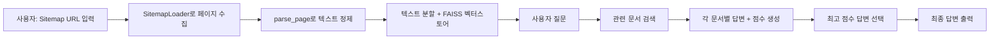
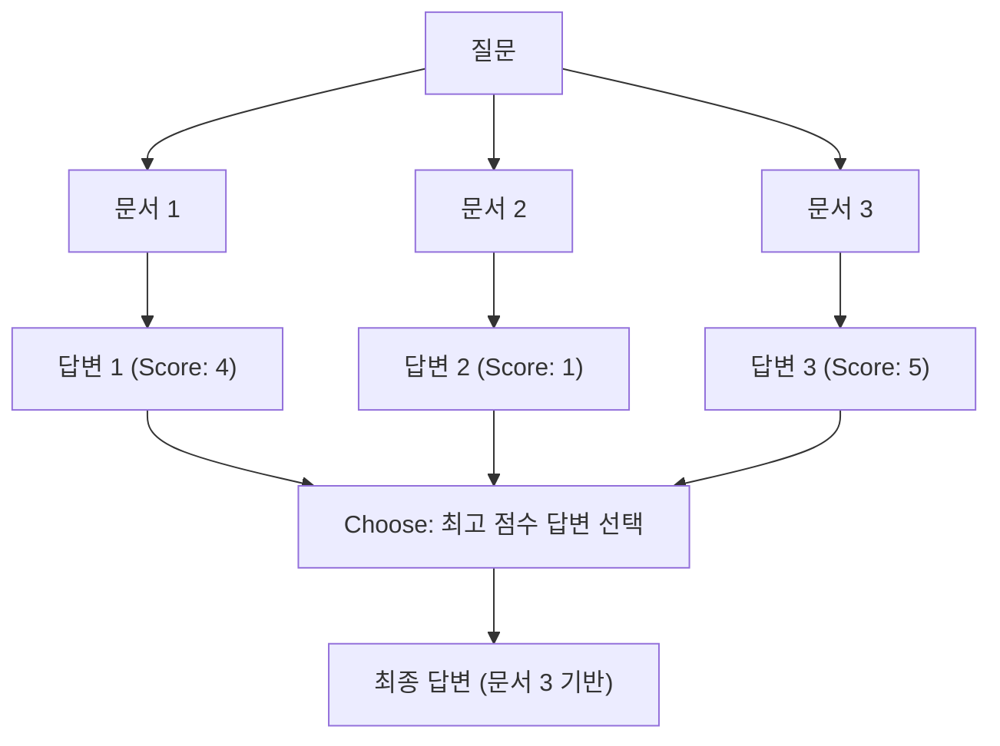

# Chapter 08: SiteGPT

## 학습 목표

이 챕터를 마치면 다음을 할 수 있습니다:

- **SitemapLoader**를 사용하여 웹사이트의 모든 페이지를 자동으로 수집할 수 있다
- **parse_page** 함수로 HTML에서 불필요한 요소를 제거하고 깨끗한 텍스트를 추출할 수 있다
- **Map Re-Rank 체인** 패턴을 이해하고 구현할 수 있다
- 여러 문서에서 답변을 생성하고 점수를 매겨 최적의 답변을 선택하는 파이프라인을 만들 수 있다

---

## 핵심 개념 설명

### SiteGPT란?

SiteGPT는 웹사이트의 sitemap.xml을 읽어 모든 페이지를 수집하고, 사용자의 질문에 대해 해당 웹사이트의 내용을 기반으로 답변하는 챗봇입니다.



### Map Re-Rank 패턴

이 챕터의 핵심은 **Map Re-Rank** 패턴입니다. 일반적인 Stuff 방식은 모든 문서를 하나의 프롬프트에 넣지만, Map Re-Rank는 각 문서에 대해 독립적으로 답변을 생성한 뒤, 점수를 기반으로 최적의 답변을 선택합니다.



---

## 커밋별 코드 해설

### 8.1 AsyncChromiumLoader

**커밋:** `d07cd31`

첫 번째 단계에서는 웹사이트 로딩의 기본 구조를 설정합니다. `SitemapLoader`를 import하고 Streamlit 사이드바에서 URL을 입력받는 UI를 만듭니다.

```python
from langchain_community.document_loaders import SitemapLoader

st.set_page_config(
    page_title="SiteGPT",
    page_icon="🖥️",
)

with st.sidebar:
    url = st.text_input(
        "Write down a URL",
        placeholder="https://example.com",
    )

if url:
    loader = SitemapLoader(url)
    docs = loader.load()
    st.write(docs)
```

> **참고:** 강의에서는 `AsyncChromiumLoader`도 소개하지만, 최종 코드에서는 `SitemapLoader`만 사용합니다. `AsyncChromiumLoader`는 JavaScript가 렌더링된 페이지를 가져올 때 유용하지만, sitemap 기반 접근이 더 효율적입니다.

### 8.2 SitemapLoader

**커밋:** `8aa9ee4`

본격적으로 전체 파이프라인을 구축합니다. LLM, 프롬프트, 벡터스토어, 체인을 모두 설정합니다.

**answers_prompt** - 각 문서에 대해 답변과 점수를 생성하는 프롬프트:

```python
answers_prompt = ChatPromptTemplate.from_template(
    """
    Using ONLY the following context answer the user's question. If you can't just say you don't know, don't make anything up.

    Then, give a score to the answer between 0 and 5.
    ...
    Context: {context}
    ...
    Question: {question}
"""
)
```

**get_answers** 함수 - 각 문서에 대해 독립적으로 답변을 생성합니다:

```python
def get_answers(inputs):
    docs = inputs["docs"]
    question = inputs["question"]
    answers_chain = answers_prompt | llm
    return {
        "question": question,
        "answers": [
            {
                "answer": answers_chain.invoke(
                    {"question": question, "context": doc.page_content}
                ).content,
                "source": doc.metadata["source"],
                "date": doc.metadata["lastmod"],
            }
            for doc in docs
        ],
    }
```

핵심 포인트:
- 각 문서(`doc`)에 대해 **개별적으로** LLM을 호출합니다
- 답변과 함께 **출처(source)**와 **날짜(date)** 메타데이터를 보존합니다

**choose_prompt**와 **choose_answer** - 여러 답변 중 최적의 것을 선택합니다:

```python
choose_prompt = ChatPromptTemplate.from_messages(
    [
        (
            "system",
            """
            Use ONLY the following pre-existing answers to answer the user's question.
            Use the answers that have the highest score (more helpful) and favor the most recent ones.
            Cite sources and return the sources of the answers as they are, do not change them.
            Answers: {answers}
            """,
        ),
        ("human", "{question}"),
    ]
)
```

### 8.3 Parsing Function

**커밋:** `ddd4a94`

웹 페이지의 HTML에서 불필요한 header/footer를 제거하는 파싱 함수를 추가합니다:

```python
def parse_page(soup):
    header = soup.find("header")
    footer = soup.find("footer")
    if header:
        header.decompose()
    if footer:
        footer.decompose()
    return (
        str(soup.get_text())
        .replace("\n", " ")
        .replace("\xa0", " ")
        .replace("CloseSearch Submit Blog", "")
    )
```

이 함수는 `SitemapLoader`의 `parsing_function` 파라미터로 전달됩니다:

```python
loader = SitemapLoader(
    url,
    parsing_function=parse_page,
)
```

**왜 파싱이 필요한가?**
- 웹 페이지에는 네비게이션, 푸터, 광고 등 질문 답변에 불필요한 요소가 많습니다
- 이런 노이즈를 제거해야 벡터 검색의 정확도가 올라갑니다
- `\xa0` (non-breaking space) 같은 특수 문자도 정리합니다

### 8.4~8.5 Map Re-Rank Chain

**커밋:** `dc95d87`, `f6d9a02`

전체 체인을 LCEL로 연결합니다:

```python
chain = (
    {
        "docs": retriever,
        "question": RunnablePassthrough(),
    }
    | RunnableLambda(get_answers)
    | RunnableLambda(choose_answer)
)
result = chain.invoke(query)
```

**실행 흐름:**

1. `retriever`가 질문과 관련된 문서를 검색합니다
2. `RunnablePassthrough()`가 원래 질문을 그대로 전달합니다
3. `get_answers`가 각 문서에 대해 답변+점수를 생성합니다
4. `choose_answer`가 점수가 높은 답변을 선택하여 최종 답변을 만듭니다

### 8.6 Code Challenge

**커밋:** `a450edf`

웹사이트 로딩을 `@st.cache_data`로 캐싱하고, `.xml` 확장자 검증을 추가합니다:

```python
@st.cache_data(show_spinner="Loading website...")
def load_website(url):
    splitter = RecursiveCharacterTextSplitter.from_tiktoken_encoder(
        chunk_size=1000,
        chunk_overlap=200,
    )
    loader = SitemapLoader(
        url,
        parsing_function=parse_page,
    )
    loader.requests_per_second = 2
    docs = loader.load_and_split(text_splitter=splitter)
    vector_store = FAISS.from_documents(docs, OpenAIEmbeddings(...))
    return vector_store.as_retriever()
```

- `requests_per_second = 2`: 서버에 부담을 주지 않도록 요청 속도를 제한합니다
- `@st.cache_data`: 같은 URL에 대해 반복 로딩을 방지합니다

---

## 이전 방식 vs 현재 방식 비교

| 구분 | Stuff 방식 (Chapter 04) | Map Re-Rank 방식 (Chapter 08) |
|------|------------------------|------------------------------|
| **문서 처리** | 모든 문서를 하나의 프롬프트에 넣음 | 각 문서에 대해 개별적으로 LLM 호출 |
| **컨텍스트 윈도우** | 문서가 많으면 토큰 제한 초과 | 문서별 독립 처리로 제한 없음 |
| **답변 품질** | 관련 없는 문서가 노이즈로 작용 | 점수 기반으로 최적 답변 선택 |
| **출처 추적** | 어려움 | 답변별 source/date 메타데이터 유지 |
| **비용** | LLM 호출 1회 | LLM 호출 N+1회 (문서 수 + 선택) |
| **데이터 소스** | 파일 업로드 | 웹사이트 sitemap |

---

## 실습 과제

### 과제 1: 필터링 기능 추가

`SitemapLoader`의 `filter_urls` 파라미터를 사용하여 특정 경로의 페이지만 로드하도록 수정하세요.

```python
# 힌트: filter_urls에 정규표현식 리스트를 전달할 수 있습니다
loader = SitemapLoader(
    url,
    parsing_function=parse_page,
    filter_urls=["https://example.com/blog/.*"],  # blog 페이지만 로드
)
```

### 과제 2: 답변 점수 표시

현재는 최종 답변만 표시됩니다. `get_answers`의 결과를 Streamlit UI에 표시하여, 각 문서별 답변과 점수를 사용자에게 보여주는 기능을 추가하세요. `st.expander`를 활용하면 깔끔하게 표시할 수 있습니다.

---

## 다음 챕터 예고

**Chapter 09: MeetingGPT**에서는 동영상 파일에서 오디오를 추출하고, OpenAI Whisper로 텍스트를 변환한 뒤, **Refine Chain** 패턴으로 긴 회의록을 요약하는 애플리케이션을 만듭니다. ffmpeg, pydub 같은 멀티미디어 처리 도구와 LangChain을 결합하는 방법을 배웁니다.
