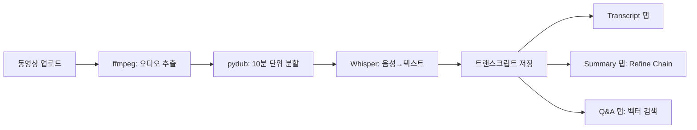
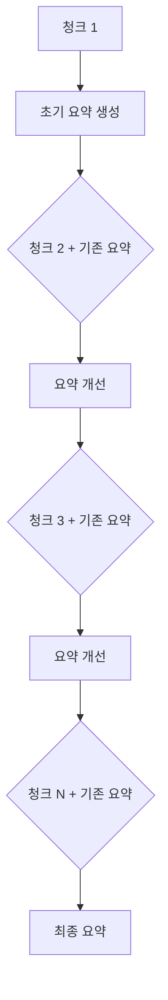

# Chapter 09: MeetingGPT

## 학습 목표

이 챕터를 마치면 다음을 할 수 있습니다:

- **ffmpeg**를 사용하여 동영상에서 오디오를 추출할 수 있다
- **pydub**로 긴 오디오 파일을 일정 크기의 청크로 분할할 수 있다 (Python 3.13+ 호환)
- **OpenAI Whisper API**로 오디오를 텍스트로 변환(STT)할 수 있다
- **Refine Chain** 패턴을 이해하고, 긴 문서를 점진적으로 요약할 수 있다
- Streamlit의 **탭(Tabs)** UI로 트랜스크립트, 요약, Q&A 기능을 분리할 수 있다

---

## 핵심 개념 설명

### MeetingGPT 파이프라인

MeetingGPT는 회의 동영상을 업로드하면 자동으로 텍스트 변환, 요약, 질의응답을 제공하는 애플리케이션입니다.



### Refine Chain 패턴

Refine Chain은 문서를 순차적으로 처리하면서 요약을 **점진적으로 개선**하는 방식입니다. MapReduce와 달리 이전 요약의 맥락을 유지하면서 새로운 정보를 반영합니다.



---

## 커밋별 코드 해설

### 9.1 Audio Extraction

**커밋:** `ae4f7f4`

Streamlit 페이지 기본 설정을 추가합니다. 이 단계에서는 아직 기능 구현 없이 UI 껍데기만 만듭니다.

```python
st.set_page_config(
    page_title="MeetingGPT",
    page_icon="💼",
)
```

### 9.2 Cutting The Audio

**커밋:** `10efbea`

`ffmpeg`를 사용하여 동영상에서 오디오를 추출하는 함수를 구현합니다:

```python
def extract_audio_from_video(video_path):
    if has_transcript:
        return
    audio_path = video_path.replace("mp4", "mp3")
    command = [
        "ffmpeg",
        "-y",        # 기존 파일 덮어쓰기
        "-i",        # 입력 파일
        video_path,
        "-vn",       # 비디오 스트림 제거 (오디오만 추출)
        audio_path,
    ]
    subprocess.run(command)
```

**ffmpeg 옵션 설명:**
- `-y`: 출력 파일이 이미 존재하면 덮어씁니다
- `-i`: 입력 파일 경로를 지정합니다
- `-vn`: 비디오 스트림을 제외하고 오디오만 출력합니다

그리고 `pydub`로 오디오를 10분 단위로 분할합니다:

```python
def cut_audio_in_chunks(audio_path, chunk_size, chunks_folder):
    if has_transcript:
        return
    track = AudioSegment.from_mp3(audio_path)
    chunk_len = chunk_size * 60 * 1000  # 분 → 밀리초 변환
    chunks = math.ceil(len(track) / chunk_len)
    for i in range(chunks):
        start_time = i * chunk_len
        end_time = (i + 1) * chunk_len
        chunk = track[start_time:end_time]
        chunk.export(
            f"./{chunks_folder}/chunk_{i}.mp3",
            format="mp3",
        )
```

**왜 오디오를 분할하는가?**
- Whisper API는 **최대 25MB**의 오디오 파일만 처리할 수 있습니다
- 긴 회의 영상은 이 제한을 초과하므로, 10분 단위로 나누어 처리합니다

**Python 3.13+ 호환성 주의:**

Python 3.13부터 표준 라이브러리에서 `audioop` 모듈이 제거되었습니다. `pydub`는 내부적으로 `audioop`에 의존하기 때문에, Python 3.13 이상에서는 **`audioop-lts`** 패키지를 추가로 설치해야 합니다:

```bash
pip install pydub audioop-lts
```

`audioop-lts`는 제거된 `audioop` 모듈을 서드파티 패키지로 제공하여 `pydub`와의 호환성을 유지합니다. 프로젝트의 `requirements.txt`에 반드시 포함시키세요:

```
pydub
audioop-lts    # Python 3.13+ 필수
```

> **참고:** Python 3.12 이하에서는 `audioop`이 내장되어 있으므로 `audioop-lts`가 없어도 동작합니다. 하지만 향후 호환성을 위해 미리 추가하는 것을 권장합니다.

### 9.3 Whisper Transcript

**커밋:** `585ae23`

분할된 오디오 청크를 OpenAI Whisper API로 텍스트 변환합니다:

```python
openai_client = OpenAI(
    base_url=os.getenv("OPENAI_BASE_URL"),
    api_key=os.getenv("OPENAI_API_KEY"),
)

@st.cache_data()
def transcribe_chunks(chunk_folder, destination):
    if has_transcript:
        return
    files = glob.glob(f"{chunk_folder}/*.mp3")
    files.sort()
    for file in files:
        with open(file, "rb") as audio_file, open(destination, "a") as text_file:
            transcript = openai_client.audio.transcriptions.create(
                model="whisper-1",
                file=audio_file,
            )
            text_file.write(transcript.text)
```

핵심 포인트:
- `glob.glob`으로 청크 파일들을 찾고 `sort()`로 순서를 보장합니다
- `"a"` 모드로 파일을 열어 각 청크의 텍스트를 **이어 붙입니다**
- `has_transcript` 플래그로 이미 변환된 경우 중복 작업을 방지합니다

### 9.4 Recap

**커밋:** `15f2321`

중간 정리 단계입니다.

### 9.5 Upload UI

**커밋:** `3034ee5`

Streamlit의 파일 업로더와 상태 표시, 탭 UI를 구성합니다:

```python
with st.sidebar:
    video = st.file_uploader(
        "Video",
        type=["mp4", "avi", "mkv", "mov"],
    )

if video:
    chunks_folder = "./.cache/chunks"
    with st.status("Loading video...") as status:
        video_content = video.read()
        video_path = f"./.cache/{video.name}"
        audio_path = video_path.replace("mp4", "mp3")
        transcript_path = video_path.replace("mp4", "txt")
        with open(video_path, "wb") as f:
            f.write(video_content)
        status.update(label="Extracting audio...")
        extract_audio_from_video(video_path)
        status.update(label="Cutting audio segments...")
        cut_audio_in_chunks(audio_path, 10, chunks_folder)
        status.update(label="Transcribing audio...")
        transcribe_chunks(chunks_folder, transcript_path)

    transcript_tab, summary_tab, qa_tab = st.tabs(
        ["Transcript", "Summary", "Q&A"]
    )
```

- `st.status`는 진행 상황을 실시간으로 보여주는 컨테이너입니다
- `st.tabs`로 세 개의 탭(Transcript, Summary, Q&A)을 만듭니다

### 9.6~9.7 Refine Chain

**커밋:** `0b74530`, `c761f3e`

Refine Chain의 핵심 구현입니다. 두 개의 프롬프트를 사용합니다:

**1단계 - 첫 번째 청크에 대한 초기 요약:**

```python
first_summary_prompt = ChatPromptTemplate.from_template(
    """
    Write a concise summary of the following:
    "{text}"
    CONCISE SUMMARY:
"""
)

first_summary_chain = first_summary_prompt | llm | StrOutputParser()

summary = first_summary_chain.invoke(
    {"text": docs[0].page_content},
)
```

**2단계 - 나머지 청크로 요약을 점진적으로 개선:**

```python
refine_prompt = ChatPromptTemplate.from_template(
    """
    Your job is to produce a final summary.
    We have provided an existing summary up to a certain point: {existing_summary}
    We have the opportunity to refine the existing summary (only if needed) with some more context below.
    ------------
    {context}
    ------------
    Given the new context, refine the original summary.
    If the context isn't useful, RETURN the original summary.
    """
)

refine_chain = refine_prompt | llm | StrOutputParser()

with st.status("Summarizing...") as status:
    for i, doc in enumerate(docs[1:]):
        status.update(label=f"Processing document {i+1}/{len(docs)-1} ")
        summary = refine_chain.invoke(
            {
                "existing_summary": summary,
                "context": doc.page_content,
            }
        )
        st.write(summary)
st.write(summary)
```

**Refine Chain의 동작:**
1. 첫 번째 문서로 초기 요약을 생성합니다
2. 두 번째 문서부터는 `existing_summary`(기존 요약)와 `context`(새 문서)를 함께 전달합니다
3. LLM이 새 정보가 유용하면 요약을 개선하고, 아니면 기존 요약을 유지합니다
4. 모든 문서를 순회하면 최종 요약이 완성됩니다

### 9.8 Q&A Tab

**커밋:** `662a528`

Q&A 탭은 이 코드에서는 구현 과제로 남겨져 있습니다. 트랜스크립트를 벡터스토어에 저장하고 질의응답하는 기능을 Chapter 04에서 배운 RAG 패턴으로 구현할 수 있습니다.

---

## 이전 방식 vs 현재 방식 비교

| 구분 | MapReduce (Chapter 04) | Refine (Chapter 09) |
|------|----------------------|---------------------|
| **처리 방식** | 각 청크를 병렬로 요약 후 합침 | 순차적으로 요약을 개선 |
| **맥락 유지** | 청크 간 맥락이 단절됨 | 이전 요약의 맥락을 유지 |
| **처리 속도** | 병렬 처리 가능, 빠름 | 순차 처리, 느림 |
| **요약 품질** | 중복/누락 가능 | 점진적 개선으로 높은 품질 |
| **적합한 사례** | 독립적인 문서 모음 | 연속성 있는 텍스트 (회의록 등) |
| **LLM 호출** | N+1회 (요약 N + 합치기 1) | N회 (초기 1 + 개선 N-1) |

---

## 실습 과제

### 과제 1: Q&A 탭 구현

트랜스크립트 파일을 `TextLoader`로 로드하고, FAISS 벡터스토어에 저장한 뒤, 사용자의 질문에 답변하는 Q&A 기능을 구현하세요.

```python
# 힌트: Chapter 04의 RAG 패턴을 활용합니다
with qa_tab:
    question = st.text_input("Ask a question about the meeting.")
    if question:
        loader = TextLoader(transcript_path)
        docs = loader.load_and_split(text_splitter=splitter)
        vector_store = FAISS.from_documents(docs, embeddings)
        # retriever를 만들고 체인을 구성하세요
```

### 과제 2: 요약 결과 캐싱

현재는 "Generate summary" 버튼을 누를 때마다 요약을 다시 생성합니다. `st.session_state`를 활용하여 한 번 생성된 요약을 캐싱하고, 같은 영상에 대해서는 재생성하지 않도록 개선하세요.

---

## 다음 챕터 예고

**Chapter 10: Agents**에서는 LLM이 스스로 도구를 선택하고 실행하는 **에이전트(Agent)** 개념을 배웁니다. DuckDuckGo 검색, Alpha Vantage 주식 API 등의 도구를 만들고, LLM이 자율적으로 판단하여 도구를 호출하는 InvestorGPT를 구현합니다.
