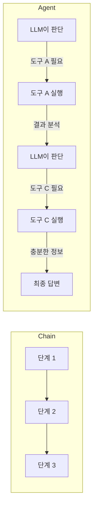

# Chapter 10: Agents

## 학습 목표

이 챕터를 마치면 다음을 할 수 있습니다:

- **Agent**의 개념과 일반 체인과의 차이를 이해할 수 있다
- `initialize_agent`와 다양한 **AgentType**을 사용할 수 있다
- **BaseTool**을 상속하여 커스텀 도구를 만들 수 있다
- DuckDuckGo 검색, Alpha Vantage API 등 외부 서비스를 도구로 통합할 수 있다
- **시스템 메시지**로 에이전트의 페르소나를 설정할 수 있다

---

## 핵심 개념 설명

### Agent란?

지금까지 만든 체인(Chain)은 실행 순서가 **미리 정해져** 있었습니다. Agent는 다릅니다. LLM이 사용자의 질문을 분석하고, **어떤 도구를 어떤 순서로 호출할지 스스로 결정**합니다.

```mermaid
flowchart TB
    U[사용자: "Apple 주식을 사야 할까?"] --> A[Agent: 질문 분석]
    A --> T1["1. StockMarketSymbolSearchTool → AAPL"]
    T1 --> T2["2. CompanyOverview → 재무 개요"]
    T2 --> T3["3. CompanyIncomeStatement → 손익계산서"]
    T3 --> T4["4. CompanyStockPerformance → 주가 추이"]
    T4 --> F[Agent: 종합 판단 후 답변]
```

### Agent vs Chain



### AgentType 비교

| AgentType | 특징 |
|-----------|------|
| `STRUCTURED_CHAT_ZERO_SHOT_REACT_DESCRIPTION` | ReAct 패턴, 다중 인자 도구 지원 |
| `OPENAI_FUNCTIONS` | OpenAI Function Calling 활용, 가장 안정적 |

---

## 커밋별 코드 해설

### 10.1 Your First Agent

**커밋:** `f504c4d`

노트북에서 가장 단순한 에이전트를 만듭니다. 덧셈 함수를 도구로 등록하고 에이전트가 이를 활용하게 합니다:

```python
from langchain_openai import ChatOpenAI
from langchain_core.tools import StructuredTool
from langchain_classic.agents import initialize_agent, AgentType

llm = ChatOpenAI(
    base_url=os.getenv("OPENAI_BASE_URL"),
    api_key=os.getenv("OPENAI_API_KEY"),
    model="gpt-5.1",
    temperature=0.1,
)


def plus(a, b):
    return a + b


agent = initialize_agent(
    llm=llm,
    verbose=True,
    agent=AgentType.STRUCTURED_CHAT_ZERO_SHOT_REACT_DESCRIPTION,
    tools=[
        StructuredTool.from_function(
            func=plus,
            name="Sum Calculator",
            description="Use this to perform sums of two numbers. This tool take two arguments, both should be numbers.",
        ),
    ],
)

prompt = "Cost of $355.39 + $924.87 + $721.2 + $1940.29 + $573.63 + $65.72 + $35.00 + $552.00 + $76.16 + $29.12"

agent.invoke(prompt)
```

핵심 포인트:
- `StructuredTool.from_function`으로 일반 Python 함수를 도구로 변환합니다
- `description`이 매우 중요합니다. LLM은 이 설명을 읽고 어떤 도구를 사용할지 결정합니다
- `verbose=True`로 에이전트의 사고 과정을 확인할 수 있습니다

### 10.3 Zero-shot ReAct Agent

**커밋:** `c15fd71`

**ReAct (Reasoning + Acting)** 패턴을 사용하는 에이전트입니다. LLM이 "생각(Thought) → 행동(Action) → 관찰(Observation)" 사이클을 반복합니다.

```
Thought: 사용자가 여러 숫자의 합을 물어보고 있다. Sum Calculator를 사용해야 한다.
Action: Sum Calculator
Action Input: {"a": 355.39, "b": 924.87}
Observation: 1280.26
Thought: 나머지 숫자들도 더해야 한다...
```

### 10.4 OpenAI Functions Agent

**커밋:** `0402758`

`AgentType.OPENAI_FUNCTIONS`를 사용하면 OpenAI의 Function Calling 기능을 활용합니다. ReAct보다 더 안정적이고 정확합니다.

### 10.5 Search Tool

**커밋:** `46ea170`

DuckDuckGo 검색을 도구로 만듭니다. 여기서부터 **BaseTool 클래스 상속** 방식을 사용합니다:

```python
from langchain_core.tools import BaseTool
from pydantic import BaseModel, Field
from langchain_community.utilities import DuckDuckGoSearchAPIWrapper


class StockMarketSymbolSearchToolArgsSchema(BaseModel):
    query: str = Field(
        description="The query you will search for. Example query: Stock Market Symbol for Apple Company"
    )


class StockMarketSymbolSearchTool(BaseTool):
    name: str = "StockMarketSymbolSearchTool"
    description: str = """
    Use this tool to find the stock market symbol for a company.
    It takes a query as an argument.
    """
    args_schema: Type[
        StockMarketSymbolSearchToolArgsSchema
    ] = StockMarketSymbolSearchToolArgsSchema

    def _run(self, query):
        ddg = DuckDuckGoSearchAPIWrapper()
        return ddg.run(query)
```

**BaseTool을 상속하는 이유:**
- `args_schema`로 입력 파라미터를 Pydantic 모델로 정의할 수 있습니다
- `description`에 도구의 용도를 상세히 기술합니다
- `_run` 메서드에 실제 로직을 구현합니다
- LLM이 `Field(description=...)`을 읽고 어떤 값을 전달해야 하는지 이해합니다

### 10.6 Stock Information Tools

**커밋:** `3fa82c9`

Alpha Vantage API를 활용하는 세 가지 금융 도구를 만듭니다:

```python
class CompanyOverviewTool(BaseTool):
    name: str = "CompanyOverview"
    description: str = """
    Use this to get an overview of the financials of the company.
    You should enter a stock symbol.
    """
    args_schema: Type[CompanyOverviewArgsSchema] = CompanyOverviewArgsSchema

    def _run(self, symbol):
        r = requests.get(
            f"https://www.alphavantage.co/query?function=OVERVIEW&symbol={symbol}&apikey={alpha_vantage_api_key}"
        )
        return r.json()


class CompanyIncomeStatementTool(BaseTool):
    name: str = "CompanyIncomeStatement"
    description: str = """
    Use this to get the income statement of a company.
    You should enter a stock symbol.
    """
    args_schema: Type[CompanyOverviewArgsSchema] = CompanyOverviewArgsSchema

    def _run(self, symbol):
        r = requests.get(
            f"https://www.alphavantage.co/query?function=INCOME_STATEMENT&symbol={symbol}&apikey={alpha_vantage_api_key}"
        )
        return r.json()["annualReports"]


class CompanyStockPerformanceTool(BaseTool):
    name: str = "CompanyStockPerformance"
    description: str = """
    Use this to get the weekly performance of a company stock.
    You should enter a stock symbol.
    """
    args_schema: Type[CompanyOverviewArgsSchema] = CompanyOverviewArgsSchema

    def _run(self, symbol):
        r = requests.get(
            f"https://www.alphavantage.co/query?function=TIME_SERIES_WEEKLY&symbol={symbol}&apikey={alpha_vantage_api_key}"
        )
        response = r.json()
        return list(response["Weekly Time Series"].items())[:200]
```

**세 도구의 역할:**

| 도구 | API 함수 | 반환 데이터 |
|------|----------|------------|
| `CompanyOverview` | `OVERVIEW` | 시가총액, PER, 배당률 등 재무 개요 |
| `CompanyIncomeStatement` | `INCOME_STATEMENT` | 매출, 영업이익 등 손익계산서 |
| `CompanyStockPerformance` | `TIME_SERIES_WEEKLY` | 최근 200주 주가 데이터 |

> **참고:** 세 도구 모두 같은 `CompanyOverviewArgsSchema`를 사용합니다. 입력이 모두 `symbol` (주식 심볼) 하나이기 때문입니다.

### 10.7 Agent Prompt

**커밋:** `102aaf3`

에이전트에 **시스템 메시지**를 설정하여 "헤지펀드 매니저" 페르소나를 부여합니다:

```python
agent = initialize_agent(
    llm=llm,
    verbose=True,
    agent=AgentType.OPENAI_FUNCTIONS,
    handle_parsing_errors=True,
    tools=[
        CompanyIncomeStatementTool(),
        CompanyStockPerformanceTool(),
        StockMarketSymbolSearchTool(),
        CompanyOverviewTool(),
    ],
    agent_kwargs={
        "system_message": SystemMessage(
            content="""
            You are a hedge fund manager.

            You evaluate a company and provide your opinion and reasons why the stock is a buy or not.

            Consider the performance of a stock, the company overview and the income statement.

            Be assertive in your judgement and recommend the stock or advise the user against it.
        """
        )
    },
)
```

핵심 파라미터:
- `handle_parsing_errors=True`: LLM 출력 파싱 오류 시 자동으로 재시도합니다
- `agent_kwargs["system_message"]`: 에이전트의 역할과 행동 지침을 설정합니다
- 시스템 메시지에서 "주가 성과, 기업 개요, 손익계산서를 고려하라"고 지시하여 에이전트가 모든 도구를 활용하도록 유도합니다

### 10.8 SQLDatabaseToolkit

**커밋:** `4d75579`

강의에서는 `SQLDatabaseToolkit`도 소개합니다. 이 도구를 사용하면 에이전트가 SQL 데이터베이스에 직접 질의할 수 있습니다. 자연어 질문을 SQL 쿼리로 변환하여 실행하는 강력한 기능입니다.

### 10.9 Conclusions

**커밋:** `9a99520`

Streamlit UI를 완성합니다:

```python
st.set_page_config(
    page_title="InvestorGPT",
    page_icon="💼",
)

company = st.text_input("Write the name of the company you are interested on.")

if company:
    result = agent.invoke(company)
    st.write(result["output"].replace("$", "\$"))
```

> **주의:** `$` 기호를 `\$`로 이스케이프합니다. Streamlit의 마크다운 렌더러가 `$...$`를 LaTeX 수식으로 해석하기 때문입니다.

---

## 이전 방식 vs 현재 방식 비교

| 구분 | Chain (이전 챕터들) | Agent (Chapter 10) |
|------|-------------------|-------------------|
| **실행 흐름** | 개발자가 미리 정의 | LLM이 실행 시점에 결정 |
| **도구 선택** | 코드에 하드코딩 | LLM이 상황에 따라 선택 |
| **유연성** | 낮음 (고정된 파이프라인) | 높음 (동적 판단) |
| **예측 가능성** | 높음 | 낮음 (같은 입력, 다른 경로 가능) |
| **디버깅** | 쉬움 | 어려움 (`verbose=True` 필요) |
| **도구 정의** | 불필요 | `BaseTool` 상속 또는 `StructuredTool` |
| **적합한 사례** | 정해진 워크플로우 | 탐색적/복합적 질문 |

---

## 실습 과제

### 과제 1: 커스텀 도구 추가

`CompanyNewsSearchTool`을 만들어 에이전트에 추가하세요. DuckDuckGo 검색을 활용하여 해당 기업의 최근 뉴스를 검색하는 도구입니다.

```python
# 힌트
class CompanyNewsSearchTool(BaseTool):
    name: str = "CompanyNewsSearch"
    description: str = """
    Use this to search for recent news about a company.
    You should enter the company name.
    """
    # args_schema와 _run 메서드를 구현하세요
```

### 과제 2: 에이전트 페르소나 변경

시스템 메시지를 수정하여 "보수적인 개인 투자자 어드바이저"로 변경하세요. 리스크를 강조하고, 분산 투자를 권장하며, 장기 투자 관점에서 조언하도록 프롬프트를 작성하세요.

---

## 다음 챕터 예고

**Chapter 11: FastAPI & GPT Actions**에서는 LangChain 애플리케이션을 **FastAPI**로 API 서버로 만들고, ChatGPT의 **GPT Actions** 기능을 통해 GPT가 우리 서버의 API를 직접 호출하도록 연동합니다. Pinecone 벡터 데이터베이스와 OAuth 인증도 다룹니다.
