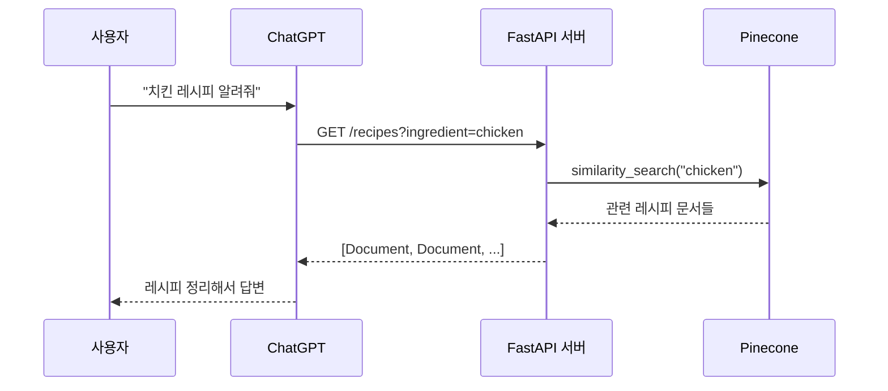

# Chapter 11: FastAPI & GPT Actions

## 학습 목표

- FastAPI를 사용하여 REST API 서버를 구축할 수 있다
- GPT Actions를 통해 ChatGPT가 외부 API를 호출하도록 설정할 수 있다
- API Key 인증과 OAuth 인증 플로우를 구현할 수 있다
- Pinecone 벡터 스토어를 연동하여 유사도 검색 API를 만들 수 있다

---

## 핵심 개념 설명

### GPT Actions란?

GPT Actions는 ChatGPT가 외부 API를 호출할 수 있게 해주는 기능입니다. 사용자가 ChatGPT에게 질문하면, ChatGPT가 우리가 만든 API를 호출하고, 그 결과를 바탕으로 답변을 생성합니다.



### 인증 방식 비교

```mermaid
graph LR
    subgraph "API Key 인증"
        A[GPT] -->|Header: X-API-Key| B[FastAPI]
    end
    subgraph "OAuth 인증"
        C[GPT] -->|1. authorize 요청| D[로그인 페이지]
        D -->|2. code 반환| C
        C -->|3. code로 token 요청| E[/token 엔드포인트]
        E -->|4. access_token 반환| C
        C -->|5. Bearer token으로 API 호출| F[FastAPI]
    end
```

---

## 커밋별 코드 해설

### 11.2 FastAPI Server (`574eee9`)

첫 번째 단계에서는 기본 FastAPI 앱을 만듭니다.

```python
from fastapi import FastAPI
from pydantic import BaseModel

app = FastAPI(
    title="ChefGPT. The best provider of Indian Recipes in the world.",
    description="Give ChefGPT the name of an ingredient and it will give you multiple recipes to use that ingredient on in return.",
    servers=[
        {
            "url": "https://example.trycloudflare.com",
        },
    ],
)
```

**핵심 포인트:**

- `title`과 `description`은 GPT가 이 API의 용도를 이해하는 데 사용됩니다
- `servers`에는 외부에서 접근 가능한 URL을 설정합니다 (Cloudflare Tunnel 등 활용)

Pydantic 모델로 응답 형식을 정의합니다:

```python
class Document(BaseModel):
    page_content: str
```

엔드포인트에는 GPT Actions에 필요한 상세한 메타데이터를 추가합니다:

```python
@app.get(
    "/recipes",
    summary="Returns a list of recipes.",
    description="Upon receiving an ingredient, this endpoint will return a list of recipes that contain that ingredient.",
    response_description="A Document object that contains the recipe and preparation instructions",
    response_model=list[Document],
    openapi_extra={
        "x-openai-isConsequential": False,
    },
)
def get_recipe(ingredient: str):
    return [
        Document(page_content=f"Recipe for {ingredient}: coming soon..."),
    ]
```

`x-openai-isConsequential: False`는 GPT가 사용자 확인 없이 API를 호출할 수 있음을 의미합니다.

**서버 실행:**

```bash
uvicorn main:app --reload
```

### 11.3 GPT Action (`4d926fb`)

FastAPI가 자동 생성하는 OpenAPI 스펙(`/openapi.json`)을 ChatGPT의 GPT Actions 설정에 붙여넣으면, ChatGPT가 우리 API를 호출할 수 있게 됩니다.

**GPT Actions 설정 순서:**

1. ChatGPT에서 GPT 생성 (Create a GPT)
2. Configure > Actions > Create new action
3. Schema에 `/openapi.json` 내용 붙여넣기
4. 서버 URL이 외부에서 접근 가능한지 확인

### 11.5 API Key Auth (`2737111`)

API Key 인증은 가장 간단한 인증 방식입니다. GPT Actions 설정에서 API Key를 등록하면, ChatGPT가 매 요청마다 해당 키를 헤더에 포함시켜 보냅니다.

GPT Actions 설정에서:
- Authentication Type: API Key
- API Key: 실제 키 값 입력
- Auth Type: Custom Header 또는 Bearer

### 11.6 OAuth (`0649030`)

OAuth 플로우는 사용자별 인증이 필요할 때 사용합니다. 두 개의 엔드포인트가 필요합니다:

```python
@app.get(
    "/authorize",
    response_class=HTMLResponse,
    include_in_schema=False,
)
def handle_authorize(client_id: str, redirect_uri: str, state: str):
    return f"""
    <html>
        <head>
            <title>Nicolacus Maximus Log In</title>
        </head>
        <body>
            <h1>Log Into Nicolacus Maximus</h1>
            <a href="{redirect_uri}?code=ABCDEF&state={state}">Authorize Nicolacus Maximus GPT</a>
        </body>
    </html>
    """
```

- `/authorize`: 사용자에게 로그인 페이지를 보여줍니다
- `redirect_uri`로 인증 코드(`code`)와 `state`를 돌려보냅니다
- `include_in_schema=False`로 OpenAPI 스펙에서 제외합니다 (GPT가 직접 호출하면 안 되는 엔드포인트)

```python
@app.post(
    "/token",
    include_in_schema=False,
)
def handle_token(code=Form(...)):
    return {
        "access_token": user_token_db[code],
    }
```

- `/token`: 인증 코드를 받아 access_token을 발급합니다
- `Form(...)`으로 form-data 형태의 요청을 처리합니다

### 11.8 Pinecone (`fbe45e3`)

실제 레시피 데이터를 검색할 수 있도록 Pinecone 벡터 스토어를 연동합니다:

```python
from dotenv import load_dotenv
import os

load_dotenv()

from pinecone import Pinecone
from langchain_openai import OpenAIEmbeddings
from langchain_pinecone import PineconeVectorStore

pc = Pinecone(api_key=os.getenv("PINECONE_API_KEY"))

embeddings = OpenAIEmbeddings(
    base_url=os.getenv("OPENAI_EMBEDDING_BASE_URL"),
    api_key=os.getenv("OPENAI_API_KEY"),
    model=os.getenv("OPENAI_EMBEDDING_MODEL"),
)

vector_store = PineconeVectorStore.from_existing_index(
    "recipes",
    embeddings,
)
```

**핵심 포인트:**

- `Pinecone` 클라이언트로 Pinecone 서비스에 연결
- `OpenAIEmbeddings`로 텍스트를 벡터로 변환
- `PineconeVectorStore.from_existing_index`로 이미 생성된 인덱스에 연결

### 11.9 Chef API (`746afa2`)

최종적으로 엔드포인트가 실제 벡터 검색을 수행합니다:

```python
def get_recipe(ingredient: str):
    docs = vector_store.similarity_search(ingredient)
    return docs
```

더미 데이터 대신 `similarity_search`로 실제 유사한 레시피를 검색하여 반환합니다.

---

## 이전 방식 vs 현재 방식

| 항목 | 이전 방식 (Plugins) | 현재 방식 (GPT Actions) |
|------|-------------------|----------------------|
| 설정 방식 | Plugin manifest + OpenAPI | GPT Builder에서 Action 추가 |
| 인증 | Plugin 전용 OAuth | 표준 OAuth / API Key |
| 배포 | Plugin Store 심사 필요 | GPT 공유로 간단 배포 |
| API 스펙 | `.well-known/ai-plugin.json` 필요 | OpenAPI 스펙만 필요 |
| 접근성 | ChatGPT Plus 전용 | GPT 공유 링크로 접근 |

---

## 실습 과제

### 과제 1: 날씨 API 서버 만들기

FastAPI로 날씨 정보를 반환하는 API를 만들어 보세요.

**요구 사항:**

1. `GET /weather?city=Seoul` 엔드포인트 구현
2. Pydantic 모델로 응답 형식 정의 (도시명, 온도, 날씨 상태)
3. `x-openai-isConsequential: False` 설정
4. GPT Actions에 적합한 `summary`, `description` 작성

### 과제 2: OAuth 인증 추가

과제 1의 API에 OAuth 인증을 추가해 보세요.

**요구 사항:**

1. `/authorize` 엔드포인트 (로그인 페이지 반환)
2. `/token` 엔드포인트 (access_token 발급)
3. 두 엔드포인트 모두 `include_in_schema=False` 설정

---

## 다음 챕터 예고

다음 챕터에서는 OpenAI의 **Assistants API**를 학습합니다. Assistants API는 상태를 가진 대화(Thread)를 관리하고, 파일 검색(file_search) 같은 내장 도구를 제공하며, 커스텀 함수 호출까지 지원합니다. ChatGPT의 기능을 우리 애플리케이션에 직접 내장하는 방법을 배워봅니다.
