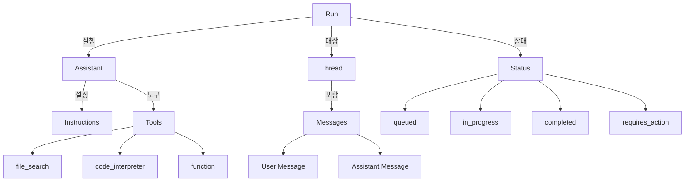
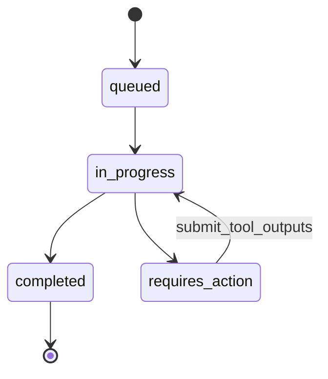

# Chapter 12: Assistants API

## 학습 목표

- OpenAI Assistants API의 핵심 개념(Assistant, Thread, Run)을 이해할 수 있다
- `file_search` 도구를 활용하여 RAG 기반 어시스턴트를 만들 수 있다
- Thread를 통해 상태를 유지하는 대화를 구현할 수 있다
- Tool outputs를 제출하여 커스텀 함수를 어시스턴트에 연동할 수 있다

---

## 핵심 개념 설명

### Assistants API 아키텍처



### Run의 생명주기



**핵심 개념 요약:**

| 개념 | 설명 |
|------|------|
| **Assistant** | 모델, 지시문, 도구를 묶은 설정 객체 |
| **Thread** | 대화 기록을 저장하는 컨테이너 (상태 유지) |
| **Message** | Thread 안의 개별 메시지 (user / assistant) |
| **Run** | Thread에서 Assistant를 실행하는 단위 |
| **Tool** | Assistant가 사용할 수 있는 도구 (file_search, function 등) |

---

## 커밋별 코드 해설

### 12.2 Creating The Assistant (`b383cf8`)

OpenAI 클라이언트를 초기화하고 Assistant를 생성합니다:

```python
from openai import OpenAI

client = OpenAI(
    base_url=os.getenv("OPENAI_BASE_URL"),
    api_key=os.getenv("OPENAI_API_KEY"),
)

assistant = client.beta.assistants.create(
    name="Book Assistant",
    instructions="You help users with their question on the files they upload.",
    model="gpt-5.1",
    tools=[{"type": "file_search"}],
)
assistant_id = assistant.id
```

**핵심 포인트:**

- `client.beta.assistants.create`로 Assistant 생성 (beta 네임스페이스 사용)
- `name`: 어시스턴트의 이름
- `instructions`: 시스템 프롬프트에 해당하는 지시문
- `tools`: 사용할 도구 목록. `file_search`는 파일 내용을 검색하는 내장 도구
- 생성 후 `assistant_id`를 저장해두면 재사용 가능

### 12.3 Assistant Tools (`8d4ee27`)

Thread를 생성하고 초기 메시지를 설정합니다:

```python
thread = client.beta.threads.create(
    messages=[
        {
            "role": "user",
            "content": "I want you to help me with this file",
        }
    ]
)
```

파일을 업로드하고 메시지에 첨부합니다:

```python
file = client.files.create(
    file=open("./files/chapter_one.txt", "rb"), purpose="assistants"
)

client.beta.threads.messages.create(
    thread_id=thread.id,
    role="user",
    content="Please analyze this file.",
    attachments=[{"file_id": file.id, "tools": [{"type": "file_search"}]}],
)
```

**핵심 포인트:**

- `client.files.create`로 파일 업로드 (`purpose="assistants"`)
- `attachments`로 메시지에 파일 첨부
- 첨부 시 `tools`에 `file_search`를 지정하면 해당 파일을 검색 대상에 포함

### 12.4 Running A Thread (`6801466`)

Run을 생성하여 Assistant가 Thread의 메시지를 처리하게 합니다:

```python
run = client.beta.threads.runs.create(
    thread_id=thread.id,
    assistant_id=assistant_id,
)
```

Run의 상태를 확인하는 헬퍼 함수들을 정의합니다:

```python
def get_run(run_id, thread_id):
    return client.beta.threads.runs.retrieve(
        run_id=run_id,
        thread_id=thread_id,
    )

def send_message(thread_id, content):
    return client.beta.threads.messages.create(
        thread_id=thread_id, role="user", content=content
    )

def get_messages(thread_id):
    messages = client.beta.threads.messages.list(thread_id=thread_id)
    messages = list(messages)
    messages.reverse()
    for message in messages:
        print(f"{message.role}: {message.content[0].text.value}")
```

**핵심 포인트:**

- Run은 비동기적으로 실행됩니다. `get_run`으로 상태를 폴링해야 합니다
- `status`가 `completed`가 되면 결과를 확인할 수 있습니다
- `get_messages`는 전체 대화 기록을 시간순으로 출력합니다

### 12.5 Assistant Actions (`5153705`)

Run이 `requires_action` 상태가 되면 커스텀 함수의 결과를 제출해야 합니다:

```python
def get_tool_outputs(run_id, thread_id):
    run = get_run(run_id, thread_id)
    outputs = []
    for action in run.required_action.submit_tool_outputs.tool_calls:
        action_id = action.id
        function = action.function
        print(f"Calling function: {function.name} with arg {function.arguments}")
        outputs.append(
            {
                "output": functions_map[function.name](json.loads(function.arguments)),
                "tool_call_id": action_id,
            }
        )
    return outputs

def submit_tool_outputs(run_id, thread_id):
    outputs = get_tool_outputs(run_id, thread_id)
    return client.beta.threads.runs.submit_tool_outputs(
        run_id=run_id,
        thread_id=thread_id,
        tool_outputs=outputs,
    )
```

**핵심 포인트:**

- `run.required_action.submit_tool_outputs.tool_calls`에서 호출해야 할 함수 정보를 가져옵니다
- `functions_map`은 함수 이름을 실제 Python 함수에 매핑하는 딕셔너리
- `submit_tool_outputs`로 함수 실행 결과를 OpenAI에 제출하면 Run이 계속 진행됩니다

### 12.8 RAG Assistant (`9b8da4b`)

최종적으로 파일 기반 RAG 어시스턴트가 완성됩니다. 사용자가 파일을 업로드하면 `file_search` 도구가 파일 내용을 검색하고, 후속 질문에도 대화 맥락을 유지하면서 답변합니다:

```python
send_message(
    thread.id,
    "Where does he work?",
)
```

Thread가 이전 대화와 파일 내용을 기억하고 있으므로, "he"가 누구인지 맥락에서 파악하여 답변할 수 있습니다.

---

## 이전 방식 vs 현재 방식

| 항목 | 직접 구현 (LangChain RAG) | Assistants API |
|------|--------------------------|----------------|
| 메모리 관리 | Memory 클래스 직접 설정 | Thread가 자동 관리 |
| 파일 검색 | VectorStore + Retriever 구성 | `file_search` 도구 한 줄 |
| 대화 상태 | 세션별 메모리 직접 관리 | Thread ID로 자동 유지 |
| 함수 호출 | LangChain Agent + Tools | `function` 도구 + tool_outputs |
| 코드 실행 | 별도 샌드박스 필요 | `code_interpreter` 내장 |
| 인프라 | 벡터 DB 직접 운영 | OpenAI가 관리 |

---

## 실습 과제

### 과제 1: 문서 QA 어시스턴트

PDF 파일을 업로드하여 질문에 답하는 어시스턴트를 만들어 보세요.

**요구 사항:**

1. `file_search` 도구가 활성화된 Assistant 생성
2. PDF 파일을 업로드하고 Thread에 첨부
3. 3개 이상의 질문을 연속으로 보내고, 대화 맥락이 유지되는지 확인
4. `get_messages`로 전체 대화 기록 출력

### 과제 2: Run 상태 자동 폴링

Run 상태를 자동으로 확인하는 폴링 루프를 구현해 보세요.

**요구 사항:**

```python
import time

def wait_for_run(run_id, thread_id, timeout=60):
    """Run이 완료될 때까지 대기하는 함수를 구현하세요."""
    # 1. get_run으로 상태 확인
    # 2. completed이면 결과 반환
    # 3. requires_action이면 tool_outputs 제출
    # 4. failed이면 에러 출력
    # 5. 그 외에는 2초 대기 후 재확인
    pass
```

---

## 다음 챕터 예고

다음 챕터에서는 **클라우드 프로바이더**를 학습합니다. OpenAI만이 아닌 AWS Bedrock(Claude 모델)과 Azure OpenAI를 LangChain으로 연동하는 방법을 배웁니다. 멀티 클라우드 전략으로 비용 최적화와 장애 대응력을 높이는 방법을 알아봅니다.
