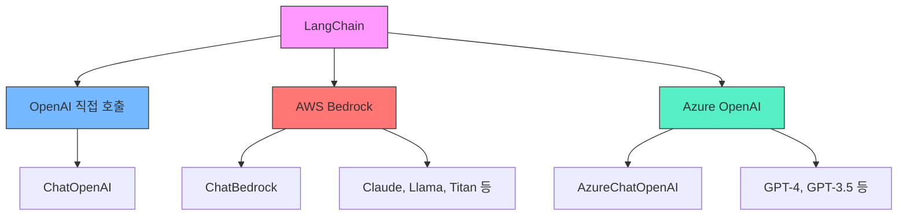
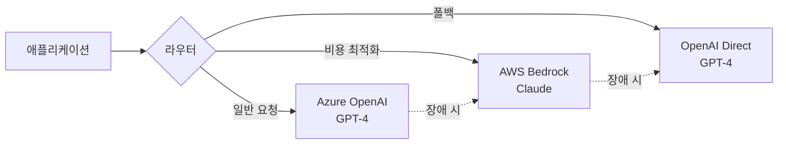

# Chapter 13: Cloud Providers

## 학습 목표

- AWS Bedrock을 통해 Anthropic Claude 모델을 LangChain에서 사용할 수 있다
- Azure OpenAI를 통해 GPT 모델을 LangChain에서 사용할 수 있다
- 멀티 클라우드 전략의 장점과 고려사항을 이해할 수 있다

---

## 핵심 개념 설명

### 클라우드 LLM 프로바이더 비교



### 멀티 클라우드 아키텍처



---

## 커밋별 코드 해설

### 13.3 BedrockChat (`b5665ee`)

AWS Bedrock은 AWS에서 제공하는 관리형 AI 서비스로, 다양한 AI 모델(Anthropic Claude, Meta Llama, Amazon Titan 등)을 하나의 API로 사용할 수 있습니다.

**1단계: boto3로 AWS 세션 생성**

```python
import boto3

session = boto3.Session(
    aws_access_key_id=os.getenv("AWS_ACCESS_KEY"),
    aws_secret_access_key=os.getenv("AWS_SECRET_KEY"),
)

bedrock_client = session.client("bedrock-runtime", "us-east-1")
```

- `boto3.Session`으로 AWS 자격 증명을 설정합니다
- `bedrock-runtime` 서비스 클라이언트를 `us-east-1` 리전에 생성합니다
- Bedrock은 모든 리전에서 사용 가능하지 않으므로, 지원 리전을 확인해야 합니다

**2단계: LangChain ChatBedrock으로 체인 구성**

```python
from langchain_aws import ChatBedrock
from langchain_core.prompts import ChatPromptTemplate

chat = ChatBedrock(
    client=bedrock_client,
    model_id=os.getenv("AWS_BEDROCK_MODEL_ID", "anthropic.claude-v2"),
    model_kwargs={
        "temperature": 0.1,
    },
)

prompt = ChatPromptTemplate.from_messages(
    [
        (
            "user",
            "Translate this sentence from {lang_a} to {lang_b}: {sentence}",
        ),
    ]
)

chain = prompt | chat

chain.invoke(
    {
        "lang_a": "English",
        "lang_b": "Icelandic",
        "sentence": "I love amazon!",
    }
)
```

**핵심 포인트:**

- `langchain_aws` 패키지의 `ChatBedrock` 클래스를 사용합니다
- `model_id`에 Bedrock에서 제공하는 모델 ID를 지정합니다 (예: `anthropic.claude-v2`). 환경변수 `AWS_BEDROCK_MODEL_ID`로 설정하면 코드 수정 없이 모델을 전환할 수 있습니다
- `model_kwargs`로 temperature 같은 모델 파라미터를 전달합니다
- LangChain의 LCEL 파이프라인(`prompt | chat`)이 그대로 동작합니다

**필요한 패키지:**

```bash
pip install boto3 langchain-aws
```

### 13.4 AzureChatOpenAI (`8d4cc18`)

Azure OpenAI는 Microsoft Azure에서 제공하는 OpenAI 모델 호스팅 서비스입니다. 기업 환경에서 데이터 거버넌스와 SLA가 필요한 경우에 적합합니다.

```python
from langchain_openai import AzureChatOpenAI

chat = AzureChatOpenAI(
    azure_deployment=os.getenv("AZURE_DEPLOYMENT", "gpt-35-turbo"),
    api_version=os.getenv("AZURE_API_VERSION", "2023-05-15"),
)

prompt = ChatPromptTemplate.from_messages(
    [
        (
            "user",
            "Translate this sentence from {lang_a} to {lang_b}: {sentence}",
        ),
    ]
)

chain = prompt | chat

chain.invoke(
    {
        "lang_a": "English",
        "lang_b": "Icelandic",
        "sentence": "I love microsoft!",
    }
)
```

**핵심 포인트:**

- `langchain_openai` 패키지의 `AzureChatOpenAI` 클래스를 사용합니다
- `azure_deployment`: Azure에서 배포한 모델의 디플로이먼트 이름. 환경변수로 관리하면 코드 수정 없이 모델을 전환할 수 있습니다
- `api_version`: Azure OpenAI API 버전 (날짜 형식). Azure는 API 버전이 자주 업데이트되므로 환경변수로 관리하는 것이 좋습니다
- `azure_endpoint`와 `api_key`는 `AzureChatOpenAI`가 자동으로 `AZURE_OPENAI_ENDPOINT`, `AZURE_OPENAI_API_KEY` 환경변수를 읽습니다
- 나머지 LangChain 코드는 `ChatOpenAI`와 완전히 동일합니다

**필요한 환경 변수:**

```bash
# .env 파일
AZURE_OPENAI_ENDPOINT=https://your-resource.openai.azure.com/
AZURE_OPENAI_API_KEY=your-azure-api-key
AZURE_DEPLOYMENT=gpt-35-turbo
AZURE_API_VERSION=2023-05-15
```

> **팁:** `AzureChatOpenAI`는 `AZURE_OPENAI_ENDPOINT`와 `AZURE_OPENAI_API_KEY` 환경변수를 자동으로 인식합니다. 코드에서 명시적으로 전달하지 않아도 되므로, `.env` 파일에만 설정해두면 됩니다.

---

## 이전 방식 vs 현재 방식

| 항목 | OpenAI 직접 호출 | 클라우드 프로바이더 활용 |
|------|-----------------|---------------------|
| 모델 선택 | OpenAI 모델만 가능 | Claude, Llama, Titan 등 다양 |
| 데이터 보안 | OpenAI 서버로 전송 | 자사 클라우드 VPC 내 처리 가능 |
| SLA | OpenAI의 SLA | Azure/AWS 엔터프라이즈 SLA |
| 비용 | OpenAI 요금제 | 클라우드 예약 인스턴스 할인 가능 |
| 장애 대응 | 단일 장애점 | 멀티 프로바이더 폴백 가능 |
| LangChain 코드 | `ChatOpenAI` | `ChatBedrock` / `AzureChatOpenAI` |
| 체인 호환성 | LCEL 파이프라인 | 동일한 LCEL 파이프라인 |

---

## 실습 과제

### 과제 1: 프로바이더 전환 가능한 체인 만들기

환경 변수 하나로 LLM 프로바이더를 전환할 수 있는 팩토리 함수를 만들어 보세요.

**요구 사항:**

```python
def get_llm(provider: str = "openai"):
    """
    provider에 따라 적절한 LLM 인스턴스를 반환하는 함수를 구현하세요.
    - "openai" -> ChatOpenAI
    - "bedrock" -> ChatBedrock
    - "azure" -> AzureChatOpenAI
    """
    pass

# 사용 예시
llm = get_llm(os.getenv("LLM_PROVIDER", "openai"))
chain = prompt | llm
```

### 과제 2: 폴백 체인 구현

메인 프로바이더 호출이 실패하면 다른 프로바이더로 자동 전환하는 폴백 로직을 구현해 보세요.

**힌트:** LangChain의 `.with_fallbacks()` 메서드를 활용할 수 있습니다.

```python
llm_with_fallback = primary_llm.with_fallbacks([fallback_llm])
```

---

## 다음 챕터 예고

다음 챕터에서는 **CrewAI**를 학습합니다. 단일 LLM이 아닌 여러 AI 에이전트가 협력하여 복잡한 작업을 수행하는 멀티 에이전트 시스템을 구축합니다. Agent, Task, Crew의 개념과 함께 커스텀 도구, Pydantic 출력, 비동기 실행까지 다룹니다.
