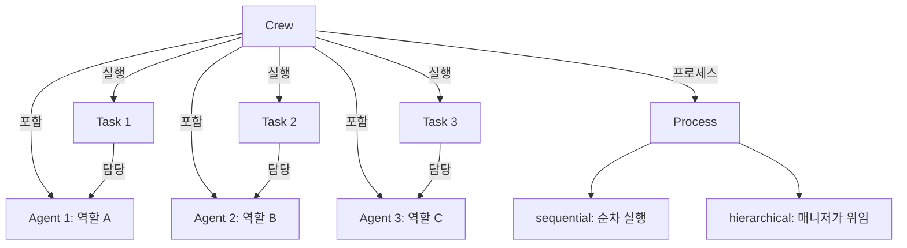
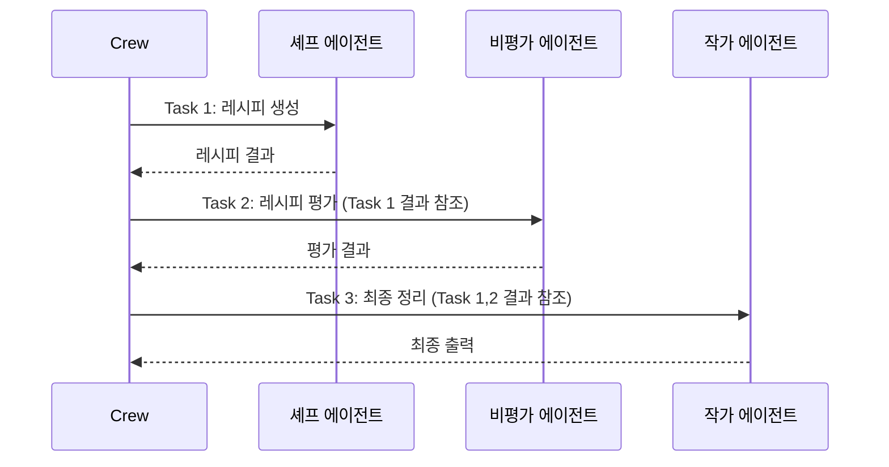
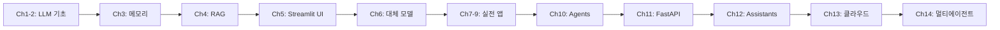

# Chapter 14: CrewAI

## 학습 목표

- CrewAI의 핵심 개념(Agent, Task, Crew, Process)을 이해할 수 있다
- 역할 기반 에이전트를 설계하고 협업 워크플로우를 구성할 수 있다
- Pydantic 모델로 구조화된 출력을 정의할 수 있다
- 비동기 실행과 커스텀 도구를 활용한 고급 Crew를 구축할 수 있다

---

## 핵심 개념 설명

### CrewAI 구조



### 에이전트 협업 흐름



---

## 커밋별 코드 해설

### 14.1 Setup (`a6e5fe4`)

CrewAI는 환경 변수를 통해 OpenAI를 설정합니다:

```python
from dotenv import load_dotenv
import os

load_dotenv()

os.environ["OPENAI_API_KEY"] = os.getenv("OPENAI_API_KEY")
os.environ["OPENAI_API_BASE"] = os.getenv("OPENAI_BASE_URL")
os.environ["OPENAI_MODEL_NAME"] = "gpt-5.1"
```

기본 임포트:

```python
from crewai import Agent, Task, Crew
from crewai.process import Process
from langchain_openai import ChatOpenAI
```

**핵심 포인트:**

- CrewAI는 내부적으로 `OPENAI_API_KEY`, `OPENAI_API_BASE`, `OPENAI_MODEL_NAME` 환경 변수를 읽습니다
- `os.environ`에 직접 설정하면 CrewAI의 모든 에이전트가 해당 설정을 사용합니다

**설치:**

```bash
pip install crewai crewai-tools langchain-openai
```

### 14.3 Chef Crew (`9b20ee0`)

첫 번째 Crew 예제로 요리 관련 에이전트 팀을 구성합니다.

**Agent 정의:**

```python
chef = Agent(
    role="Korean Chef",
    goal="You create simple and delicious Korean recipes.",
    backstory="You are a famous Korean chef known for your simple and tasty recipes.",
    allow_delegation=False,
)

critic = Agent(
    role="Food Critic",
    goal="You give constructive feedback on recipes.",
    backstory="You are a Michelin-star food critic with decades of experience.",
    allow_delegation=False,
)
```

각 Agent는 다음 속성을 가집니다:
- `role`: 에이전트의 역할 (프롬프트에 반영)
- `goal`: 에이전트의 목표
- `backstory`: 배경 설명 (페르소나 설정)
- `allow_delegation`: 다른 에이전트에게 작업을 위임할 수 있는지 여부

**Task 정의:**

```python
create_recipe = Task(
    description="Create a recipe for a {dish}.",
    expected_output="A detailed recipe with ingredients and steps.",
    agent=chef,
)

review_recipe = Task(
    description="Review the recipe and give feedback.",
    expected_output="A constructive review with suggestions.",
    agent=critic,
)
```

각 Task는 다음 속성을 가집니다:
- `description`: 작업 설명 (변수 치환 가능: `{dish}`)
- `expected_output`: 기대하는 출력 형식
- `agent`: 이 작업을 수행할 에이전트

**Crew 실행:**

```python
crew = Crew(
    agents=[chef, critic],
    tasks=[create_recipe, review_recipe],
    process=Process.sequential,
)

result = crew.kickoff(inputs={"dish": "Bibimbap"})
```

- `Process.sequential`: 태스크를 순서대로 실행 (이전 태스크의 결과가 다음 태스크에 전달)
- `kickoff(inputs=...)`: Crew 실행 시 변수 값 전달

### 14.5 Content Farm Crew (`6a5aedb`)

콘텐츠 생성 파이프라인을 Crew로 구성하는 예제입니다. 리서처, 작가, 편집자가 협력하여 블로그 글을 작성합니다.

```python
researcher = Agent(
    role="Content Researcher",
    goal="Research and find interesting topics and information.",
    backstory="You are an experienced content researcher.",
)

writer = Agent(
    role="Content Writer",
    goal="Write engaging blog posts based on research.",
    backstory="You are a skilled content writer.",
)

editor = Agent(
    role="Content Editor",
    goal="Edit and polish content for publication.",
    backstory="You are a meticulous editor with an eye for detail.",
)
```

**Process 옵션:**

| Process | 설명 | 매니저 LLM | 사용 사례 |
|---------|------|-----------|----------|
| `sequential` | 태스크를 순서대로 실행 | 불필요 | 파이프라인형 작업 |
| `hierarchical` | 매니저 에이전트가 태스크를 위임 | `manager_llm` 필수 | 복잡한 의사결정 |

> **참고:** `Process.hierarchical`을 사용할 때는 반드시 `manager_llm` 파라미터를 지정해야 합니다. 매니저 LLM이 각 에이전트에게 작업을 분배하고 결과를 조율하는 역할을 합니다.

### 14.6 Pydantic Outputs (`85fd123`)

Pydantic 모델로 에이전트의 출력 형식을 강제할 수 있습니다:

```python
from pydantic import BaseModel
from typing import List

class Recipe(BaseModel):
    name: str
    ingredients: List[str]
    steps: List[str]
    cooking_time: int

create_recipe = Task(
    description="Create a recipe for a {dish}.",
    expected_output="A recipe in the specified format.",
    agent=chef,
    output_pydantic=Recipe,
)
```

**핵심 포인트:**

- `output_pydantic`에 Pydantic 모델을 지정하면 에이전트의 출력이 해당 모델로 파싱됩니다
- 구조화된 데이터를 후속 처리에 활용할 수 있습니다
- 모델 검증이 자동으로 수행되어 형식이 보장됩니다

### 14.7 Async Youtuber Crew (`bc399f5`)

여러 태스크를 병렬로 실행하는 비동기 Crew입니다:

```python
thumbnail_task = Task(
    description="Design a thumbnail concept for a video about {topic}.",
    expected_output="A detailed thumbnail description.",
    agent=designer,
    async_execution=True,
)

script_task = Task(
    description="Write a script for a video about {topic}.",
    expected_output="A complete video script.",
    agent=writer,
    async_execution=True,
)

# 두 태스크가 동시에 실행됨
crew = Crew(
    agents=[designer, writer, editor],
    tasks=[thumbnail_task, script_task, final_review],
    process=Process.sequential,
)
```

**핵심 포인트:**

- `async_execution=True`인 태스크들은 동시에 실행됩니다
- 비동기 태스크 다음에 동기 태스크가 오면, 모든 비동기 태스크가 완료될 때까지 대기합니다
- 서로 독립적인 작업을 병렬로 처리하여 전체 실행 시간을 단축할 수 있습니다

### 14.8 Custom Tools (`9c6676c`)

CrewAI 에이전트에 커스텀 도구를 추가하여 외부 데이터에 접근할 수 있습니다. `yfinance` 라이브러리를 활용하여 실시간 주식 데이터를 가져오는 도구를 만듭니다:

```python
from crewai.tools import tool
import yfinance as yf

class Tools:
    @tool("One month stock price history")
    def stock_price(ticker):
        """Useful to get a month's worth of stock price data as CSV.
        The input should be a stock ticker symbol."""
        stock = yf.Ticker(ticker)
        return stock.history(period="1mo").to_csv()

    @tool("Stock news URLs")
    def stock_news(ticker):
        """Useful to get URLs of news articles related to a stock.
        The input should be a stock ticker symbol."""
        stock = yf.Ticker(ticker)
        return list(map(lambda x: x["link"], stock.news))

    @tool("Company's income statement")
    def income_stmt(ticker):
        """Useful to get the income statement of a stock as CSV.
        The input should be a stock ticker symbol."""
        stock = yf.Ticker(ticker)
        return stock.income_stmt.to_csv()

    @tool("Balance sheet")
    def balance_sheet(ticker):
        """Useful to get the balance sheet of a stock as CSV.
        The input should be a stock ticker symbol."""
        stock = yf.Ticker(ticker)
        return stock.balance_sheet.to_csv()

    @tool("Get insider transactions")
    def insider_transactions(ticker):
        """Useful to get insider transactions of a stock as CSV.
        The input should be a stock ticker symbol."""
        stock = yf.Ticker(ticker)
        return stock.insider_transactions.to_csv()
```

**핵심 포인트:**

- **`from crewai.tools import tool`**: CrewAI 내장 `@tool` 데코레이터를 사용합니다 (주의: `crewai_tools`가 아닌 `crewai.tools`에서 임포트)
- **docstring의 중요성**: 에이전트가 도구를 선택할 때 이름과 docstring을 읽고 판단합니다. 명확한 설명이 필수입니다
- **yfinance 활용**: `yf.Ticker(ticker)`로 주식 정보에 접근하고, `.history()`, `.income_stmt`, `.balance_sheet`, `.insider_transactions`, `.news` 등의 속성으로 다양한 재무 데이터를 가져옵니다
- **CSV 반환**: 숫자 데이터는 `.to_csv()` 형태로 반환하여 LLM이 테이블 형식으로 분석할 수 있게 합니다
- **클래스로 그룹핑**: 관련 도구들을 `Tools` 클래스 안에 정적 메서드로 묶어 관리합니다

**외부 도구 활용 - ScrapeWebsiteTool:**

```python
from crewai_tools import ScrapeWebsiteTool

researcher = Agent(
    role="Researcher",
    tools=[Tools.stock_news, ScrapeWebsiteTool()],
)
```

`crewai_tools` 패키지에서는 `ScrapeWebsiteTool` 같은 미리 만들어진 도구도 제공합니다. 뉴스 URL을 가져온 후 해당 웹페이지를 스크래핑하는 데 사용합니다.

### 14.9 Stock Market Crew (`ce88f16`)

모든 개념을 종합한 주식 시장 분석 Crew입니다. **4명의 전문 에이전트**가 협력하여 종합적인 투자 분석 보고서를 작성합니다:

**에이전트 정의 (4개의 전문 역할):**

```python
from crewai import Agent
from crewai_tools import ScrapeWebsiteTool

class Agents:
    def technical_analyst(self):
        return Agent(
            role="Technical Analyst",
            goal="Analyses the movements of a stock and provides insights on trends, "
                 "entry points, resistance and support levels.",
            backstory="An expert in technical analysis with deep knowledge of "
                      "indicators and chart patterns.",
            verbose=True,
            tools=[Tools.stock_price],
        )

    def researcher(self):
        return Agent(
            role="Researcher",
            goal="Gathers, interprets and summarizes vast amounts of data to "
                 "provide a comprehensive overview of the sentiment and news "
                 "surrounding a stock.",
            backstory="You're skilled in gathering and interpreting data from "
                      "various sources to give a complete picture of a stock's "
                      "sentiment and news.",
            verbose=True,
            tools=[Tools.stock_news, ScrapeWebsiteTool()],
        )

    def financial_analyst(self):
        return Agent(
            role="Financial Analyst",
            goal="Uses financial statements, insider trading data, and other "
                 "metrics to evaluate a stock's financial health and performance.",
            backstory="You're a very experienced investment advisor that looks "
                      "at a company's financial health, market sentiment, and "
                      "qualitative data to make informed recommendations.",
            verbose=True,
            tools=[Tools.balance_sheet, Tools.income_stmt, Tools.insider_transactions],
        )

    def hedge_fund_manager(self):
        return Agent(
            role="Hedge Fund Manager",
            goal="Manages a portfolio of stocks and makes strategic investment "
                 "decisions to maximize returns using insights from analysts.",
            backstory="You're a seasoned hedge fund manager with a proven track "
                      "record. You leverage insights from your team of analysts.",
            verbose=True,
        )
```

**태스크 정의 (각각 output_file로 결과 저장):**

```python
from crewai import Task

class Tasks:
    def research(self, agent):
        return Task(
            description="Gather and analyze the latest news and market sentiment "
                        "surrounding the stock of {company}...",
            expected_output="Your final answer MUST be a detailed summary of the "
                            "overall market sentiment...",
            agent=agent,
            output_file="stock_news.md",
        )

    def technical_analysis(self, agent):
        return Task(
            description="Conduct a detailed technical analysis of the price "
                        "movements of {company}'s stock...",
            expected_output="Your final answer MUST be a detailed technical "
                            "analysis report...",
            agent=agent,
            output_file="technical_analysis.md",
        )

    def financial_analysis(self, agent):
        return Task(
            description="Analyze {company}'s financial statements, insider "
                        "trading data, and other financial metrics...",
            expected_output="Your final answer MUST be a detailed financial "
                            "analysis report...",
            agent=agent,
            output_file="financial_analysis.md",
        )

    def investment_recommendation(self, agent, context):
        return Task(
            description="Based on the research, technical analysis, and financial "
                        "analysis reports, provide a detailed investment "
                        "recommendation for {company}'s stock.",
            expected_output="Your final answer MUST be a detailed investment "
                            "recommendation report...",
            agent=agent,
            context=context,
            output_file="investment_recommendation.md",
        )
```

**Crew 실행 (Hierarchical Process + Memory):**

```python
from crewai import Crew
from crewai.process import Process
from langchain_openai import ChatOpenAI

agents = Agents()
tasks = Tasks()

researcher = agents.researcher()
technical_analyst = agents.technical_analyst()
financial_analyst = agents.financial_analyst()
hedge_fund_manager = agents.hedge_fund_manager()

research_task = tasks.research(researcher)
technical_task = tasks.technical_analysis(technical_analyst)
financial_task = tasks.financial_analysis(financial_analyst)
recommend_task = tasks.investment_recommendation(
    hedge_fund_manager,
    [research_task, technical_task, financial_task],
)

crew = Crew(
    agents=[researcher, technical_analyst, financial_analyst, hedge_fund_manager],
    tasks=[research_task, technical_task, financial_task, recommend_task],
    verbose=True,
    process=Process.hierarchical,
    manager_llm=ChatOpenAI(
        base_url=os.getenv("OPENAI_BASE_URL"),
        api_key=os.getenv("OPENAI_API_KEY"),
        model=os.getenv("OPENAI_MODEL_NAME", "gpt-5.1"),
    ),
    memory=True,
    embedder=dict(
        provider="openai",
        config=dict(
            model=os.getenv("OPENAI_EMBEDDING_MODEL", "text-embedding-3-small"),
        ),
    ),
)

result = crew.kickoff(inputs=dict(company="Salesforce"))
```

**이 Stock Market Crew의 핵심 특징:**

1. **4명의 전문 에이전트**: 각 에이전트가 자기 전문 분야의 도구만 보유합니다
   - Technical Analyst: `stock_price` → 차트 분석
   - Researcher: `stock_news` + `ScrapeWebsiteTool` → 뉴스 수집/스크래핑
   - Financial Analyst: `balance_sheet` + `income_stmt` + `insider_transactions` → 재무 분석
   - Hedge Fund Manager: 도구 없음 → 다른 에이전트의 결과를 종합하여 최종 판단

2. **output_file**: 각 태스크의 결과가 별도 마크다운 파일로 저장됩니다. 디버깅과 결과 보관에 유용합니다

3. **context 파라미터**: `investment_recommendation` 태스크에 `context=[research_task, technical_task, financial_task]`를 전달하여 앞선 3개 태스크의 결과를 참조합니다

4. **Process.hierarchical + manager_llm**: 매니저 LLM이 태스크의 실행 순서와 위임을 자율적으로 판단합니다. `Process.sequential`과 달리 매니저가 상황에 따라 에이전트를 재활용하거나 추가 작업을 지시할 수 있습니다

5. **memory=True + embedder**: Crew에 장기 기억을 부여합니다. 에이전트 간 대화 내용이 임베딩되어 저장되고, 후속 에이전트가 이전 맥락을 검색할 수 있습니다. `embedder` 설정으로 OpenAI의 `text-embedding-3-small` 모델을 사용합니다

**Sequential vs Hierarchical 비교:**

| 항목 | Sequential | Hierarchical |
|------|-----------|-------------|
| 실행 순서 | 태스크 순서 고정 | 매니저가 동적으로 결정 |
| 매니저 LLM | 불필요 | `manager_llm` 필수 |
| 유연성 | 낮음 (파이프라인) | 높음 (매니저가 위임/재실행) |
| 비용 | 낮음 | 높음 (매니저 LLM 추가 호출) |
| 적합한 사례 | 단순 파이프라인 | 복잡한 의사결정, 상호 의존적 태스크 |

---

## 이전 방식 vs 현재 방식

| 항목 | LangChain Agent (단일) | CrewAI (멀티 에이전트) |
|------|----------------------|---------------------|
| 에이전트 수 | 하나의 에이전트 | 역할별 여러 에이전트 |
| 역할 분담 | 하나가 모든 작업 수행 | 역할별 전문화 |
| 작업 흐름 | 단일 루프 (ReAct) | Sequential / Hierarchical |
| 도구 관리 | 에이전트에 모든 도구 부여 | 역할별 필요한 도구만 부여 |
| 출력 형식 | OutputParser로 파싱 | Pydantic 모델로 강제 (`output_pydantic`) |
| 결과 저장 | 수동 관리 | `output_file`로 자동 저장 |
| 병렬 처리 | 지원 안 함 | `async_execution=True` |
| 메모리 | Memory 클래스 수동 설정 | `memory=True` + `embedder` 설정으로 자동 |
| 커스텀 도구 | `BaseTool` 상속 | `@tool` 데코레이터 (간결) |
| 매니저 기능 | 없음 | `Process.hierarchical` + `manager_llm` |
| 적합한 작업 | 단순 QA, 검색 | 콘텐츠 생성, 분석, 리서치 |

### CrewAI 1.x의 새로운 기능

이 프로젝트에서 사용하는 CrewAI 1.x에서는 다음과 같은 주요 기능이 추가되었습니다:

| 기능 | 설명 | 사용 예 |
|------|------|--------|
| **memory** | 에이전트 간 장기 기억 공유 | `Crew(memory=True, embedder={...})` |
| **embedder** | 메모리에 사용할 임베딩 모델 설정 | `embedder=dict(provider="openai", config=dict(model="text-embedding-3-small"))` |
| **manager_llm** | Hierarchical 프로세스의 매니저 LLM | `Crew(process=Process.hierarchical, manager_llm=ChatOpenAI(...))` |
| **output_file** | 태스크 결과를 파일로 자동 저장 | `Task(output_file="report.md")` |
| **context** | 다른 태스크의 결과를 참조 | `Task(context=[task1, task2])` |
| **@tool 데코레이터** | 함수를 도구로 간편 변환 | `from crewai.tools import tool` |
| **ScrapeWebsiteTool** | 웹 스크래핑 내장 도구 | `from crewai_tools import ScrapeWebsiteTool` |

---

## 실습 과제

### 과제 1: 여행 계획 Crew

3명의 에이전트로 구성된 여행 계획 Crew를 만들어 보세요.

**요구 사항:**

1. **Travel Researcher**: 목적지의 관광 정보를 조사
2. **Budget Planner**: 예산 계획 수립
3. **Itinerary Writer**: 최종 여행 일정표 작성
4. `Process.sequential`로 실행
5. Pydantic 모델로 최종 출력 형식 정의:

```python
class TravelPlan(BaseModel):
    destination: str
    duration: int  # days
    budget: float
    daily_itinerary: List[str]
    tips: List[str]
```

### 과제 2: 비동기 뉴스 분석 Crew

뉴스를 수집하고 분석하는 Crew를 비동기 실행으로 구현해 보세요.

**요구 사항:**

1. 3개 분야(기술, 경제, 사회)의 뉴스를 동시에 수집하는 비동기 태스크
2. 수집 완료 후 종합 분석을 수행하는 동기 태스크
3. 커스텀 도구를 하나 이상 구현

---

## 전체 과정 정리

이 교재를 통해 우리는 LLM 애플리케이션 개발의 전체 스펙트럼을 다뤘습니다:



| 단계 | 챕터 | 배운 것 |
|------|------|---------|
| 기초 | 1-3 | LLM, 프롬프트, 메모리 |
| 데이터 | 4 | RAG, 임베딩, 벡터 스토어 |
| UI | 5 | Streamlit 웹 애플리케이션 |
| 확장 | 6 | HuggingFace, Ollama 등 대체 모델 |
| 실전 | 7-9 | QuizGPT, SiteGPT, MeetingGPT |
| 자동화 | 10 | Agent, Tools, ReAct |
| API | 11 | FastAPI, GPT Actions, 인증 |
| 플랫폼 | 12 | Assistants API, Thread, Run |
| 인프라 | 13 | AWS Bedrock, Azure OpenAI |
| 협업 | 14 | CrewAI 멀티 에이전트 시스템 |

이제 여러분은 LLM 기초부터 멀티 에이전트 시스템까지, 풀스택 GPT 애플리케이션을 구축하는 데 필요한 모든 도구와 개념을 갖추게 되었습니다.
