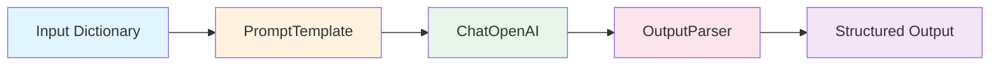
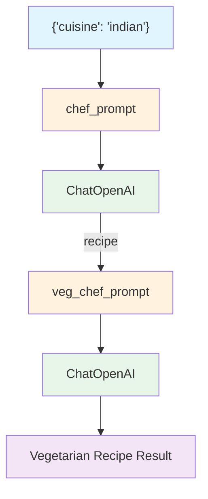

# Chapter 1: LLMs and Chat Models

## Learning Objectives

By the end of this chapter, you will be able to:

- Write code to interact with an LLM using **ChatOpenAI**
- Understand the roles of **message types** (SystemMessage, HumanMessage, AIMessage)
- Create reusable prompts with **PromptTemplate** and **ChatPromptTemplate**
- Build an **OutputParser** to transform LLM output into a desired format
- Compose chains using the **LCEL (LangChain Expression Language)** pipe operator (`|`)
- **Chain multiple chains** together to create complex workflows

---

## Core Concepts

### What is LangChain?

LangChain is a framework that makes it easy to build applications powered by LLMs (Large Language Models). It provides a standardized way to send prompts to LLMs, parse responses, and connect multiple steps together.

### Key Components

| Component | Description |
|---------|------|
| `ChatOpenAI` | A wrapper class that communicates with OpenAI's Chat models |
| `SystemMessage` | A system message that defines the AI's role/personality |
| `HumanMessage` | A message sent by the user |
| `AIMessage` | A message responded by the AI (used for few-shot examples) |
| `PromptTemplate` | A string template with variables |
| `ChatPromptTemplate` | A chat template in the form of a message list |
| `OutputParser` | Transforms LLM output into structured data |
| LCEL `\|` operator | Connects components into a pipeline |

### LCEL Chain Architecture



In LCEL, each component is connected with the `|` operator. Data flows from left to right, and the output of each step becomes the input of the next step.

### Chain Chaining Architecture



---

## Code Walkthrough by Commit

### 1.0 LLMs and Chat Models

> Commit: `d44ad48`

This is the most basic LLM invocation code.

```python
from langchain_openai import ChatOpenAI

chat = ChatOpenAI(
    base_url=os.getenv("OPENAI_BASE_URL"),
    api_key=os.getenv("OPENAI_API_KEY"),
    model="gpt-5.1",
)

response = chat.invoke("How many planets are there?")
response.content
```

**Key Points:**
- `ChatOpenAI` is a LangChain class that wraps OpenAI's Chat Completion API
- When you pass a string to the `invoke()` method, it is internally converted to a `HumanMessage`
- The return value is an `AIMessage` object; use `.content` to extract the text
- `base_url` and `api_key` are read from environment variables (using a `.env` file)

**Terminology:**
- **invoke**: The standard method for executing a component in LangChain. It takes an input and returns an output.
- **dotenv**: A library that makes environment variables stored in a `.env` file available in Python.

---

### 1.1 Predict Messages

> Commit: `d6e7820`

Constructs a conversation context using message types.

```python
from langchain_core.messages import HumanMessage, AIMessage, SystemMessage

messages = [
    SystemMessage(
        content="You are a geography expert. And you only reply in {language}.",
    ),
    AIMessage(content="Ciao, mi chiamo {name}!"),
    HumanMessage(
        content="What is the distance between {country_a} and {country_b}. Also, what is your name?",
    ),
]

chat.invoke(messages)
```

**Key Points:**
- `SystemMessage`: Assigns a role to the AI. "You are a geography expert and only reply in a specific language"
- `AIMessage`: Sets what the AI previously said. Used for few-shot learning or persona configuration
- `HumanMessage`: The user's question
- Passing a message list to `invoke()` sends it to the LLM in conversation format
- At this stage, `{language}`, `{name}`, etc. are still literal strings, not actual variable substitutions

**Adding the `temperature` parameter:**
```python
chat = ChatOpenAI(
    ...
    temperature=0.1,
)
```
- `temperature` controls the randomness of responses (0.0 = deterministic, 1.0 = creative)
- Setting it to 0.1 produces nearly the same output for the same input

---

### 1.2 Prompt Templates

> Commit: `edb339f`

Uses prompt templates that automatically substitute variables.

**PromptTemplate (string-based):**
```python
from langchain_core.prompts import PromptTemplate, ChatPromptTemplate

template = PromptTemplate.from_template(
    "What is the distance between {country_a} and {country_b}",
)

prompt = template.format(country_a="Mexico", country_b="Thailand")
chat.invoke(prompt).content
```

**ChatPromptTemplate (message-based):**
```python
template = ChatPromptTemplate.from_messages(
    [
        ("system", "You are a geography expert. And you only reply in {language}."),
        ("ai", "Ciao, mi chiamo {name}!"),
        ("human", "What is the distance between {country_a} and {country_b}. Also, what is your name?"),
    ]
)

prompt = template.format_messages(
    language="Greek",
    name="Socrates",
    country_a="Mexico",
    country_b="Thailand",
)

chat.invoke(prompt)
```

**Key Points:**
- `PromptTemplate`: Inserts variables into a simple string. Variables are substituted when `format()` is called
- `ChatPromptTemplate`: Templatizes a message list. Message types are specified as tuples like `("system", "...")`
- `format_messages()` returns a message list with variables substituted
- The message structure created manually in 1.1 is now made reusable through templates

**PromptTemplate vs ChatPromptTemplate:**

| | PromptTemplate | ChatPromptTemplate |
|---|---|---|
| Input | String | Message list (tuples) |
| Output | `format()` -> String | `format_messages()` -> Message list |
| Usage | Simple text prompts | Conversational prompts with roles |

---

### 1.3 OutputParser and LCEL

> Commit: `7c529ea`

Creates a custom OutputParser and composes a chain with LCEL.

```python
from langchain_core.output_parsers import BaseOutputParser

class CommaOutputParser(BaseOutputParser):
    def parse(self, text):
        items = text.strip().split(",")
        return list(map(str.strip, items))
```

```python
template = ChatPromptTemplate.from_messages(
    [
        (
            "system",
            "You are a list generating machine. Everything you are asked will be answered with a comma separated list of max {max_items} in lowercase. Do NOT reply with anything else.",
        ),
        ("human", "{question}"),
    ]
)

chain = template | chat | CommaOutputParser()

chain.invoke({"max_items": 5, "question": "What are the pokemons?"})
```

**Key Points:**

1. **Custom OutputParser**: Inherits from `BaseOutputParser` and implements the `parse()` method. If the LLM responds with "pikachu, charmander, bulbasaur", it converts it to the list `["pikachu", "charmander", "bulbasaur"]`.

2. **LCEL pipe operator `|`**:
   - `template | chat | CommaOutputParser()` connects three components into a pipeline
   - Data flow: Dictionary -> Prompt -> LLM -> Parser -> List
   - Same concept as the Unix pipe (`|`)

3. **Input to invoke**: A dictionary is passed to the chain's `invoke()`. The template's variable names become the dictionary keys.

---

### 1.4 Chaining Chains

> Commit: `9153ca6`

Connects multiple chains to create complex workflows.

```python
from langchain_core.callbacks import StreamingStdOutCallbackHandler

chat = ChatOpenAI(
    ...
    streaming=True,
    callbacks=[StreamingStdOutCallbackHandler()],
)

chef_prompt = ChatPromptTemplate.from_messages(
    [
        ("system", ""),
        ("human", "I want to cook {cuisine} food."),
    ]
)

chef_chain = chef_prompt | chat
```

```python
veg_chef_prompt = ChatPromptTemplate.from_messages(
    [
        (
            "system",
            "You are a vegetarian chef specialized on making traditional recipies vegetarian. You find alternative ingredients and explain their preparation. You don't radically modify the recipe. If there is no alternative for a food just say you don't know how to replace it.",
        ),
        ("human", "{recipe}"),
    ]
)

veg_chain = veg_chef_prompt | chat

final_chain = {"recipe": chef_chain} | veg_chain

final_chain.invoke({"cuisine": "indian"})
```

**Key Points:**

1. **Streaming**: Setting `streaming=True` and `StreamingStdOutCallbackHandler()` causes the LLM response to be output in real time, token by token

2. **Core pattern for chaining chains**:
   ```python
   final_chain = {"recipe": chef_chain} | veg_chain
   ```
   - `{"recipe": chef_chain}`: When a chain is placed as a dictionary value, the chain's output is mapped to the key (`recipe`)
   - The output of `chef_chain` (a cooking recipe) is passed to `veg_chain`'s `{recipe}` variable
   - This is the core pattern for chaining chains in LCEL

3. **Data flow**:
   - Input: `{"cuisine": "indian"}`
   - `chef_chain`: Generates an Indian cuisine recipe
   - Intermediate transformation: `{"recipe": "Indian cuisine recipe..."}`
   - `veg_chain`: Converts it to a vegetarian version
   - Output: Vegetarian Indian cuisine recipe

---

### 1.5 Recap

> Commit: `3293b3b`

Finalizes and organizes the code from 1.4. A system message is added to `chef_prompt`:

```python
chef_prompt = ChatPromptTemplate.from_messages(
    [
        (
            "system",
            "You are a world-class international chef. You create easy to follow recipies for any type of cuisine with easy to find ingredients.",
        ),
        ("human", "I want to cook {cuisine} food."),
    ]
)
```

The previously empty system prompt now has a specific role assigned. This causes the AI to act as a "world-class chef" and provide recipes using easy-to-find ingredients.

---

## Legacy Approach vs Current Approach

The code in this project uses LangChain 1.x as of 2026. Compared to LangChain 0.x from 2023, the differences are as follows:

| Item | LangChain 0.x (2023) | LangChain 1.x (2026) |
|------|---------------------|---------------------|
| Chat model import | `from langchain.chat_models import ChatOpenAI` | `from langchain_openai import ChatOpenAI` |
| Message import | `from langchain.schema import HumanMessage` | `from langchain_core.messages import HumanMessage` |
| Prompt import | `from langchain.prompts import ChatPromptTemplate` | `from langchain_core.prompts import ChatPromptTemplate` |
| LLM invocation | `chat.predict("...")` or `chat("...")` | `chat.invoke("...")` |
| Message invocation | `chat.predict_messages([...])` | `chat.invoke([...])` |
| Chain composition | `LLMChain(llm=chat, prompt=prompt)` | `prompt \| chat` (LCEL) |
| OutputParser import | `from langchain.schema import BaseOutputParser` | `from langchain_core.output_parsers import BaseOutputParser` |
| Package structure | Single `langchain` package | Split into `langchain_core`, `langchain_openai`, etc. |

**Summary of major changes:**
- The monolithic `langchain` package has been split into `langchain_core`, `langchain_openai`, `langchain_community`, etc.
- The unified `invoke()` interface replaces `predict()` and `predict_messages()`
- The LCEL pipe operator (`|`) replaces `LLMChain` for chain composition

---

## Exercises

### Exercise 1: Build a Translation Chain

Using LCEL, create a translation chain that works as follows:

1. The user inputs `{"text": "...", "source_lang": "English", "target_lang": "Korean"}`
2. A translation prompt is generated with ChatPromptTemplate
3. ChatOpenAI performs the translation
4. The chain returns only the translated text as a string

**Hints:**
- Define system and human messages in `ChatPromptTemplate.from_messages()`
- Using `StrOutputParser()` extracts only the string from an AIMessage (`from langchain_core.output_parsers import StrOutputParser`)

### Exercise 2: Chain Linking - Summarize then Generate Quiz

Connect two chains:
1. First chain: Given a topic (`{topic}`), explain it in 3 sentences
2. Second chain: Take the output of the first chain (`{summary}`) and generate 1 multiple-choice quiz question

Use the pattern `final_chain = {"summary": summary_chain} | quiz_chain`.

---

## Next Chapter Preview

In **Chapter 2: Prompts**, you will learn more sophisticated ways to handle prompts:
- **FewShotPromptTemplate**: Control LLM output format with prompts that include examples
- **ExampleSelector**: Strategies for dynamically selecting examples
- **Caching**: Reduce costs by avoiding repeated calls for identical questions
- **Token Tracking**: Monitor API usage
