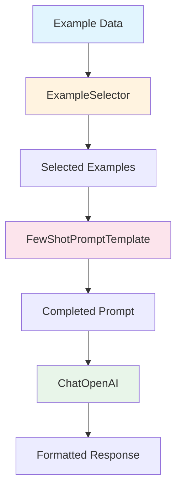
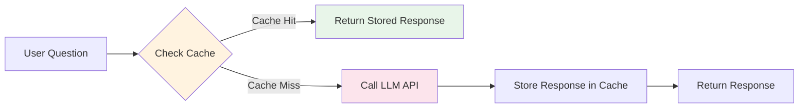

# Chapter 2: Prompts

## Learning Objectives

By the end of this chapter, you will be able to:

- Compose example-based prompts using **FewShotPromptTemplate**
- Create chat-style few-shot prompts with **FewShotChatMessagePromptTemplate**
- Implement a **custom ExampleSelector** to dynamically select examples
- Understand the prompt **Composition** pattern
- Cache LLM responses with **SQLiteCache** to reduce costs
- Track token usage with **get_usage_metadata_callback**

---

## Core Concepts

### What is Few-shot Learning?

Few-shot Learning is a technique where you show the LLM a few examples to teach it the desired output format or style. It involves including "respond like this" examples in the prompt.



### Caching Architecture



### Key Component Comparison

| Component | Purpose | Output Format |
|---------|------|----------|
| `FewShotPromptTemplate` | Text-based Few-shot | String |
| `FewShotChatMessagePromptTemplate` | Chat-based Few-shot | Message list |
| `BaseExampleSelector` | Dynamic example selection | Example list |
| `SQLiteCache` | Response caching | - |
| `get_usage_metadata_callback` | Token tracking | Usage statistics |

---

## Code Walkthrough by Commit

### 2.1 FewShotPromptTemplate

> Commit: `a8ebcc8`

Constructs a text-based few-shot prompt.

```python
from langchain_core.prompts import FewShotPromptTemplate, PromptTemplate

examples = [
    {
        "question": "What do you know about France?",
        "answer": """
        Here is what I know:
        Capital: Paris
        Language: French
        Food: Wine and Cheese
        Currency: Euro
        """,
    },
    {
        "question": "What do you know about Italy?",
        "answer": """
        I know this:
        Capital: Rome
        Language: Italian
        Food: Pizza and Pasta
        Currency: Euro
        """,
    },
    {
        "question": "What do you know about Greece?",
        "answer": """
        I know this:
        Capital: Athens
        Language: Greek
        Food: Souvlaki and Feta Cheese
        Currency: Euro
        """,
    },
]

example_prompt = PromptTemplate.from_template("Human: {question}\nAI:{answer}")

prompt = FewShotPromptTemplate(
    example_prompt=example_prompt,
    examples=examples,
    suffix="Human: What do you know about {country}?",
    input_variables=["country"],
)

chain = prompt | chat
chain.invoke({"country": "Turkey"})
```

**Key Points:**

1. **examples**: A list of dictionaries, each with `question` and `answer` keys
2. **example_prompt**: A template that defines how each example is formatted
3. **FewShotPromptTemplate components**:
   - `example_prompt`: The format for each individual example
   - `examples`: The list of example data
   - `suffix`: The actual question part appended after the examples
   - `input_variables`: The list of variables to be substituted at runtime

**Why use Few-shot?**
- Even without explicitly instructing "respond in the format of Capital, Language, Food, Currency", showing examples causes the LLM to respond in the same format
- It is a powerful technique for naturally controlling output format

---

### 2.2 FewShotChatMessagePromptTemplate

> Commit: `59e9b1c`

Constructs a few-shot prompt in chat message format.

```python
from langchain_core.prompts import FewShotChatMessagePromptTemplate, ChatPromptTemplate

examples = [
    {
        "country": "France",
        "answer": """
        Here is what I know:
        Capital: Paris
        Language: French
        Food: Wine and Cheese
        Currency: Euro
        """,
    },
    # ... Italy, Greece examples
]

example_prompt = ChatPromptTemplate.from_messages(
    [
        ("human", "What do you know about {country}?"),
        ("ai", "{answer}"),
    ]
)

example_prompt = FewShotChatMessagePromptTemplate(
    example_prompt=example_prompt,
    examples=examples,
)

final_prompt = ChatPromptTemplate.from_messages(
    [
        ("system", "You are a geography expert, you give short answers."),
        example_prompt,
        ("human", "What do you know about {country}?"),
    ]
)

chain = final_prompt | chat
chain.invoke({"country": "Thailand"})
```

**Key Points:**

1. **Difference from FewShotPromptTemplate**:
   - `FewShotPromptTemplate` renders everything as a single text string
   - `FewShotChatMessagePromptTemplate` renders each example as a `human`/`ai` message pair
   - The message format is more natural and performs better with Chat models

2. **Composition structure**: `example_prompt` is embedded inside `final_prompt` to combine system message + examples + actual question into a single prompt

3. **Variable name change**: In 2.1 it was `question`/`answer`, but here it is changed to `country`/`answer`. Since the question format is fixed, only the country name is taken as a variable.

---

### 2.3 LengthBasedExampleSelector

> Commit: `b96804d`

Implements a custom ExampleSelector to dynamically select examples.

```python
from langchain_core.example_selectors import BaseExampleSelector

class RandomExampleSelector(BaseExampleSelector):
    def __init__(self, examples):
        self.examples = examples

    def add_example(self, example):
        self.examples.append(example)

    def select_examples(self, input_variables):
        from random import choice
        return [choice(self.examples)]

example_selector = RandomExampleSelector(examples=examples)

prompt = FewShotPromptTemplate(
    example_prompt=example_prompt,
    example_selector=example_selector,
    suffix="Human: What do you know about {country}?",
    input_variables=["country"],
)

prompt.format(country="Brazil")
```

**Key Points:**

1. **BaseExampleSelector interface**: Two methods must be implemented:
   - `add_example(example)`: Adds a new example
   - `select_examples(input_variables)`: Selects and returns examples based on the input

2. **examples vs example_selector**: `FewShotPromptTemplate` can receive either `examples` (the full list) directly, or an `example_selector` (a dynamic selector). Only one of the two is used.

3. **Why is ExampleSelector needed?**
   - If there are many examples, the prompt becomes too long and token costs increase
   - Selecting only the most relevant examples for the input reduces costs and improves performance
   - In practice, selectors like `LengthBasedExampleSelector` (length-based) and `SemanticSimilarityExampleSelector` (similarity-based) are used

**Terminology:**
- **ExampleSelector**: A component that picks a subset of examples from the full example pool based on specific criteria

---

### 2.4 Serialization and Composition

> Commit: `6aa4b39`

Uses the prompt Composition pattern.

```python
from langchain_core.prompts import ChatPromptTemplate

prompt = ChatPromptTemplate.from_messages(
    [
        (
            "system",
            "You are a role playing assistant. And you are impersonating a {character}.\n\n"
            "This is an example of how you talk:\n"
            "Human: {example_question}\n"
            "You: {example_answer}",
        ),
        ("human", "{question}"),
    ]
)

chain = prompt | chat

chain.invoke(
    {
        "character": "Pirate",
        "example_question": "What is your location?",
        "example_answer": "Arrrrg! That is a secret!! Arg arg!!",
        "question": "What is your fav food?",
    }
)
```

**Key Points:**

1. **PipelinePromptTemplate removed**: In LangChain 0.x, `PipelinePromptTemplate` was used to compose multiple prompts, but it has been removed in LangChain 1.x. This is also noted in the code comments.

2. **Modern composition approach**: A single `ChatPromptTemplate` directly manages all variables. The system message contains the character setup, example dialogue, and actual question all in one place.

3. **Flexible variable usage**: Four variables -- `{character}`, `{example_question}`, `{example_answer}`, `{question}` -- are all substituted in a single invoke call.

---

### 2.5 Caching

> Commit: `65960c2`

Caches LLM responses to reduce the cost of repeated identical queries.

```python
from langchain_core.globals import set_llm_cache
from langchain_community.cache import InMemoryCache, SQLiteCache

set_llm_cache(SQLiteCache("cache.db"))

chat = ChatOpenAI(
    base_url=os.getenv("OPENAI_BASE_URL"),
    api_key=os.getenv("OPENAI_API_KEY"),
    model="gpt-5.1",
    temperature=0.1,
)

chat.invoke("How do you make italian pasta").content  # API call
chat.invoke("How do you make italian pasta").content  # Returned instantly from cache
```

**Key Points:**

1. **set_llm_cache**: Sets a global cache. Applies to all LLM calls

2. **Cache types**:
   - `InMemoryCache()`: Stored in memory, lost when the process terminates
   - `SQLiteCache("cache.db")`: Stored in a SQLite file, persists permanently

3. **How it works**:
   - First call: API request -> Store response in cache -> Return
   - Second identical call: Return instantly from cache (no API call)

4. **Cost savings**: Can significantly reduce API costs when repeatedly testing the same prompt during development

**Important note:**
- `temperature` should be set close to 0 for caching to be meaningful. With a high temperature, the same input can produce different outputs.

---

### 2.6 Serialization (Token Tracking)

> Commit: `c9e0014`

Tracks API usage.

```python
from langchain_openai import ChatOpenAI
from langchain_core.callbacks import get_usage_metadata_callback

chat = ChatOpenAI(
    base_url=os.getenv("OPENAI_BASE_URL"),
    api_key=os.getenv("OPENAI_API_KEY"),
    model="gpt-5.1",
    temperature=0.1,
)

with get_usage_metadata_callback() as usage:
    a = chat.invoke("What is the recipe for soju").content
    b = chat.invoke("What is the recipe for bread").content
    print(a, "\n")
    print(b, "\n")
    print(usage)
```

**Key Points:**

1. **get_usage_metadata_callback**: Used as a context manager (with `with` statement). It aggregates token usage from all LLM API calls made within the block

2. **Usage output information** (grouped by model):
   ```python
   # Example output:
   # {'gpt-5.1-2025-11-13': {'input_tokens': 25, 'output_tokens': 1645, 'total_tokens': 1670}}
   ```
   - `input_tokens`: Number of tokens used in the prompt (input)
   - `output_tokens`: Number of tokens used in the response (output)
   - `total_tokens`: Total number of tokens used
   - Usage is displayed separately by model name

3. **Why track tokens?**
   - API costs are proportional to the number of tokens
   - Cost monitoring is essential in production environments
   - It serves as a baseline for prompt optimization

4. **Why `get_openai_callback` was changed to `get_usage_metadata_callback`:**
   - `get_openai_callback` was OpenAI-specific and resided in `langchain_community`
   - `get_usage_metadata_callback` is included in `langchain_core` and **works with all LLM providers**
   - It can track token usage for OpenAI, Bedrock, Azure, Ollama, and more in the same way
   - This new callback is the officially recommended approach in LangChain 1.x

**Terminology:**
- **Token**: The smallest unit of text processing for an LLM. In English, approximately 4 characters equal 1 token; in Korean, 1 character is approximately 2-3 tokens.

---

## Legacy Approach vs Current Approach

| Item | LangChain 0.x (2023) | LangChain 1.x (2026) |
|------|---------------------|---------------------|
| FewShotPromptTemplate import | `from langchain.prompts import FewShotPromptTemplate` | `from langchain_core.prompts import FewShotPromptTemplate` |
| FewShotChatMessagePromptTemplate | `from langchain.prompts import FewShotChatMessagePromptTemplate` | `from langchain_core.prompts import FewShotChatMessagePromptTemplate` |
| ExampleSelector | `from langchain.prompts.example_selector import LengthBasedExampleSelector` | `from langchain_core.example_selectors import BaseExampleSelector` |
| PipelinePromptTemplate | Available (for prompt composition) | **Removed** - compose directly with ChatPromptTemplate |
| Cache setup | `import langchain; langchain.llm_cache = SQLiteCache()` | `from langchain_core.globals import set_llm_cache; set_llm_cache(SQLiteCache())` |
| SQLiteCache import | `from langchain.cache import SQLiteCache` | `from langchain_community.cache import SQLiteCache` |
| Callback manager | `from langchain.callbacks import get_openai_callback` | `from langchain_core.callbacks import get_usage_metadata_callback` |
| Chain composition | `LLMChain(llm=chat, prompt=prompt)` | `prompt \| chat` (LCEL) |

**Major changes:**
- The removal of `PipelinePromptTemplate` simplified prompt composition
- Cache configuration changed from module attribute assignment to a function call
- Community-contributed components were separated into the `langchain_community` package

---

## Exercises

### Exercise 1: Translation Style Few-shot

Create a few-shot chain that meets the following requirements:

1. Prepare 3 translation examples (English -> Korean, with various writing styles)
2. Use `FewShotChatMessagePromptTemplate` to include the examples
3. Use a system message instructing: "Translate to natural Korean while maintaining the same writing style as the examples"
4. Translate a new English sentence

**Hint:** If you use a specific writing style in the examples' `answer` (formal, informal, literary, etc.), the LLM will follow that style.

### Exercise 2: Caching + Token Tracking Combination

1. Set up `SQLiteCache`
2. Track token usage with `get_usage_metadata_callback`
3. Call the same question twice and compare the token usage of each call
4. Verify that token usage is 0 on a cache hit

---

## Next Chapter Preview

In **Chapter 3: Memory**, you will learn how to make LLMs remember conversation context:
- **ConversationBufferMemory**: Store the entire conversation history
- **ConversationBufferWindowMemory**: Store only the most recent N conversations
- **ConversationSummaryMemory**: Summarize and store conversations
- **ConversationKGMemory**: Knowledge graph-based memory
- Patterns for using memory with LCEL
