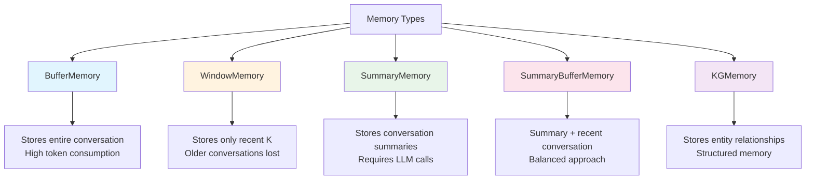
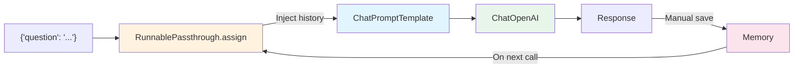

# Chapter 3: Memory

## Learning Objectives

By the end of this chapter, you will be able to:

- Understand the need for and types of **conversation Memory**
- Store entire conversations with **ConversationBufferMemory**
- Keep only recent conversations with **ConversationBufferWindowMemory**
- Summarize and store conversations with **ConversationSummaryMemory**
- Combine summaries and buffers with **ConversationSummaryBufferMemory**
- Use knowledge graph-based memory with **ConversationKGMemory**
- Integrate memory with **LLMChain** and **LCEL**

---

## Core Concepts

### Why is Memory Needed?

LLMs are fundamentally **stateless**. Each API call is independent, so if you say "My name is Cheolsu" and then ask "What is my name?", the LLM will not remember. Memory components solve this problem by automatically including previous conversations in the prompt.

### Memory Type Comparison



| Memory Type | Storage Method | Pros | Cons |
|------------|----------|------|------|
| `ConversationBufferMemory` | Full conversation text | No information loss | Token explosion as conversation grows |
| `ConversationBufferWindowMemory` | Most recent K conversations | Limited token usage | Older information is lost |
| `ConversationSummaryMemory` | LLM-generated summary text | Even long conversations stored compactly | LLM call cost for each summary |
| `ConversationSummaryBufferMemory` | Summary + recent text | Balanced approach | More complex configuration |
| `ConversationKGMemory` | Knowledge graph (entity-relationship) | Structured information retrieval | Relationship extraction accuracy |

### Memory Pattern in LCEL



---

## Code Walkthrough by Commit

### 3.0 ConversationBufferMemory

> Commit: `4662bb8`

The most basic memory type that stores all conversations as-is.

```python
from langchain_openai import ChatOpenAI
from langchain_classic.memory import ConversationBufferMemory
from langchain_core.runnables import RunnablePassthrough
from langchain_core.prompts import ChatPromptTemplate, MessagesPlaceholder

model = ChatOpenAI(
    base_url=os.getenv("OPENAI_BASE_URL"),
    api_key=os.getenv("OPENAI_API_KEY"),
    model="gpt-5.1",
)

prompt = ChatPromptTemplate.from_messages(
    [
        ("system", "You are a helpful chatbot"),
        MessagesPlaceholder(variable_name="history"),
        ("human", "{message}"),
    ]
)

memory = ConversationBufferMemory(return_messages=True)

def load_memory(_):
    return memory.load_memory_variables({})["history"]

chain = RunnablePassthrough.assign(history=load_memory) | prompt | model

inputs = {"message": "hi im bob"}
response = chain.invoke(inputs)
```

**Key Points:**

1. **MessagesPlaceholder**: Creates a slot in the prompt where a message list is dynamically inserted. When specified with `variable_name="history"`, the message list contained in the `history` variable is placed at this position.

2. **ConversationBufferMemory**:
   - `return_messages=True`: Returns conversation history as a list of message objects (instead of a string)
   - `load_memory_variables({})["history"]`: Loads the stored conversation history

3. **RunnablePassthrough.assign(history=load_memory)**:
   - Adds a `history` key to the input dictionary
   - The `load_memory` function is called to fetch conversation history from memory
   - Result: `{"message": "hi im bob", "history": [previous conversation messages]}`

4. **The `_` parameter in load_memory**: `RunnablePassthrough.assign` passes the input dictionary to the function, but since memory loading does not need the input, it is ignored with `_`.

**Terminology:**
- **MessagesPlaceholder**: A placeholder within ChatPromptTemplate that allows dynamic insertion of a message list.
- **RunnablePassthrough**: An LCEL component that passes the input through as-is while allowing new key-value pairs to be added via `.assign()`.

---

### 3.1 ConversationBufferWindowMemory

> Commit: `8a36e99`

Keeps only the most recent K conversations.

```python
from langchain_classic.memory import ConversationBufferWindowMemory

memory = ConversationBufferWindowMemory(
    return_messages=True,
    k=4,
)
```

**Key Points:**

- `k=4`: Keeps only the 4 most recent conversation pairs (human + AI)
- When a 5th conversation is added, the oldest conversation is automatically removed
- **Use case**: When conversations can become very long but only recent context matters (e.g., customer service chatbots)
- The interface is identical to BufferMemory, making it simple to swap

---

### 3.2 ConversationSummaryMemory

> Commit: `9683c60`

Uses an LLM to summarize conversations.

```python
from langchain_classic.memory import ConversationSummaryMemory
from langchain_openai import ChatOpenAI

llm = ChatOpenAI(
    base_url=os.getenv("OPENAI_BASE_URL"),
    api_key=os.getenv("OPENAI_API_KEY"),
    model="gpt-5.1",
    temperature=0.1,
)

memory = ConversationSummaryMemory(llm=llm)

def add_message(input, output):
    memory.save_context({"input": input}, {"output": output})

def get_history():
    return memory.load_memory_variables({})

add_message("Hi I'm Nicolas, I live in South Korea", "Wow that is so cool!")
add_message("South Korea is so pretty", "I wish I could go!!!")
get_history()
```

**Key Points:**

1. **Requires an LLM**: `ConversationSummaryMemory(llm=llm)` -- A separate LLM call is needed to summarize conversations

2. **save_context**: Stores conversation pairs with `{"input": "..."}`, `{"output": "..."}`. Each time a conversation is saved, the LLM generates a new summary that incorporates the new conversation into the existing summary.

3. **Example result**: Even after many conversations accumulate, only a short summary like "Nicolas lives in Korea and said Korea is beautiful..." is stored in memory

4. **Trade-offs**:
   - Pros: Even long conversations are compressed to a consistent token count
   - Cons: LLM API call cost incurred with each summary, potential loss of details

---

### 3.3 ConversationSummaryBufferMemory

> Commit: `e85fcf9`

A hybrid memory that combines summaries with recent conversations.

```python
from langchain_classic.memory import ConversationSummaryBufferMemory

memory = ConversationSummaryBufferMemory(
    llm=llm,
    max_token_limit=150,
    return_messages=True,
)

def add_message(input, output):
    memory.save_context({"input": input}, {"output": output})

def get_history():
    return memory.load_memory_variables({})

add_message("Hi I'm Nicolas, I live in South Korea", "Wow that is so cool!")
get_history()  # Still under 150 tokens -> original text retained

add_message("South Korea is so pretty", "I wish I could go!!!")
get_history()  # Token count increases

add_message("How far is Korea from Argentina?", "I don't know! Super far!")
get_history()  # Exceeds 150 tokens -> older conversations begin to be summarized

add_message("How far is Brazil from Argentina?", "I don't know! Super far!")
get_history()  # Summary + recent conversations
```

**Key Points:**

1. **max_token_limit=150**: When the total tokens of the conversation exceed this limit, older conversations are converted to summaries

2. **How it works**:
   - Tokens within limit: All conversations are kept in their original text
   - Tokens exceed limit: Older conversations are summarized + recent conversations are kept in original text
   - As conversation continues: The summary is progressively updated and the recent conversation window shifts

3. **Most practical memory**: A balanced approach that maintains the details of recent conversations while not losing older context

---

### 3.4 ConversationKGMemory

> Commit: `44226cd`

Knowledge Graph-based memory.

```python
from langchain_community.memory.kg import ConversationKGMemory

memory = ConversationKGMemory(
    llm=llm,
    return_messages=True,
)

def add_message(input, output):
    memory.save_context({"input": input}, {"output": output})

add_message("Hi I'm Nicolas, I live in South Korea", "Wow that is so cool!")
memory.load_memory_variables({"input": "who is Nicolas"})

add_message("Nicolas likes kimchi", "Wow that is so cool!")
memory.load_memory_variables({"inputs": "what does nicolas like"})
```

**Key Points:**

1. **Knowledge Graph**: Extracts entities and their relationships from conversations and stores them in graph form
   - Entity "Nicolas" -> "lives in South Korea", "likes kimchi"

2. **Query-based retrieval**: Returns only entity information relevant to the question, like `load_memory_variables({"input": "who is Nicolas"})`

3. **Difference from other memories**:
   - Buffer/Summary memory: Stores the entire conversation chronologically
   - KG memory: Stores structured knowledge organized by entity

4. **Import location**: Imported from `langchain_community.memory.kg` (community package)

---

### 3.5 Memory on LLMChain

> Commit: `1ee4696`

Integrates memory with the legacy LLMChain.

```python
from langchain_classic.memory import ConversationSummaryBufferMemory
from langchain_classic.chains import LLMChain
from langchain_core.prompts import PromptTemplate

memory = ConversationSummaryBufferMemory(
    llm=llm,
    max_token_limit=120,
    memory_key="chat_history",
)

template = """
    You are a helpful AI talking to a human.

    {chat_history}
    Human:{question}
    You:
"""

chain = LLMChain(
    llm=llm,
    memory=memory,
    prompt=PromptTemplate.from_template(template),
    verbose=True,
)

chain.invoke({"question": "My name is Nico"})["text"]
chain.invoke({"question": "I live in Seoul"})["text"]
chain.invoke({"question": "What is my name?"})["text"]
```

**Key Points:**

1. **memory_key="chat_history"**: The variable name used when memory is injected into the prompt. It must match `{chat_history}` in the prompt.

2. **Automatic memory management in LLMChain**:
   - Automatically loads memory and inserts it into the prompt on each call
   - Automatically saves the conversation to memory after each response
   - The developer does not need to manually call `save_context`

3. **verbose=True**: Prints the chain's execution process to the console. Useful for debugging.

4. **LLMChain is legacy**: This approach is a LangChain 0.x pattern. Section 3.7 transitions to the LCEL approach.

---

### 3.6 Chat Based Memory

> Commit: `9256b67`

Combines LLMChain + ChatPromptTemplate + MessagesPlaceholder.

```python
from langchain_core.prompts import ChatPromptTemplate, MessagesPlaceholder

memory = ConversationSummaryBufferMemory(
    llm=llm,
    max_token_limit=120,
    memory_key="chat_history",
    return_messages=True,
)

prompt = ChatPromptTemplate.from_messages(
    [
        ("system", "You are a helpful AI talking to a human"),
        MessagesPlaceholder(variable_name="chat_history"),
        ("human", "{question}"),
    ]
)

chain = LLMChain(
    llm=llm,
    memory=memory,
    prompt=prompt,
    verbose=True,
)

chain.invoke({"question": "My name is Nico"})["text"]
```

**Key Points:**

- Difference from 3.5: Uses `ChatPromptTemplate` + `MessagesPlaceholder` instead of `PromptTemplate`
- `return_messages=True`: Memory returns message objects instead of strings, working correctly with `MessagesPlaceholder`
- The `memory_key` and `MessagesPlaceholder`'s `variable_name` must be identical ("chat_history")

---

### 3.7 LCEL Based Memory

> Commit: `5117422`

Implements memory with LCEL only, without LLMChain. **This is the modern recommended pattern.**

```python
from langchain_classic.memory import ConversationSummaryBufferMemory
from langchain_openai import ChatOpenAI
from langchain_core.runnables import RunnablePassthrough
from langchain_core.prompts import ChatPromptTemplate, MessagesPlaceholder

llm = ChatOpenAI(
    base_url=os.getenv("OPENAI_BASE_URL"),
    api_key=os.getenv("OPENAI_API_KEY"),
    model="gpt-5.1",
    temperature=0.1,
)

memory = ConversationSummaryBufferMemory(
    llm=llm,
    max_token_limit=120,
    return_messages=True,
)

prompt = ChatPromptTemplate.from_messages(
    [
        ("system", "You are a helpful AI talking to a human"),
        MessagesPlaceholder(variable_name="history"),
        ("human", "{question}"),
    ]
)

def load_memory(_):
    return memory.load_memory_variables({})["history"]

chain = RunnablePassthrough.assign(history=load_memory) | prompt | llm

def invoke_chain(question):
    result = chain.invoke({"question": question})
    memory.save_context(
        {"input": question},
        {"output": result.content},
    )
    print(result)

invoke_chain("My name is nico")
invoke_chain("What is my name?")
```

**Key Points:**

1. **Pure LCEL without LLMChain**: Composed with `RunnablePassthrough.assign()` + the `|` operator

2. **Manual memory management**: In LCEL, memory loading/saving must be done manually
   - Loading: `RunnablePassthrough.assign(history=load_memory)`
   - Saving: Manually calling `memory.save_context()` inside the `invoke_chain` function

3. **invoke_chain helper function**: Handles both chain invocation and memory saving together. Conversation history only accumulates properly when using this function.

4. **LLMChain vs LCEL memory comparison**:

| | LLMChain (3.5~3.6) | LCEL (3.7) |
|---|---|---|
| Memory loading | Automatic | `RunnablePassthrough.assign` |
| Memory saving | Automatic | Manual `memory.save_context()` call |
| Flexibility | Low (fixed pattern) | High (customizable) |
| Recommendation | Legacy | Modern recommended approach |

---

### 3.8 Recap

> Commit: `8803d8c`

Same code as 3.7. This is the final summary of the LCEL-based memory pattern.

---

## Legacy Approach vs Current Approach

| Item | LangChain 0.x (2023) | LangChain 1.x (2026) |
|------|---------------------|---------------------|
| Memory import | `from langchain.memory import ConversationBufferMemory` | `from langchain_classic.memory import ConversationBufferMemory` |
| KG memory import | `from langchain.memory import ConversationKGMemory` | `from langchain_community.memory.kg import ConversationKGMemory` |
| Chain + memory | `LLMChain(llm=llm, memory=memory, prompt=prompt)` | `RunnablePassthrough.assign(history=load_memory) \| prompt \| llm` |
| Memory saving | Automatic (handled by LLMChain) | Manual (`memory.save_context()`) |
| Package | `langchain` | `langchain_classic` (legacy compatibility package) |

**Major changes:**
- Memory classes have been moved to the `langchain_classic` package. This indicates that this memory pattern has been classified as "legacy".
- LangChain 1.x recommends `LangGraph` for state management, but this course uses the existing memory API to learn the concepts.
- When using memory with LCEL, loading and saving must be managed manually.

---

## Exercises

### Exercise 1: Memory Type Comparison Experiment

Conduct 10 rounds of the same conversation using each of the following three memory types, and compare the memory states:

1. `ConversationBufferMemory`
2. `ConversationBufferWindowMemory(k=3)`
3. `ConversationSummaryBufferMemory(max_token_limit=100)`

Items to compare:
- Contents stored in memory after the 10th conversation
- Whether the information from the first conversation is remembered
- Token count of the memory

### Exercise 2: Build an LCEL Chatbot

Using the pattern from 3.7, build a chatbot with the following features:

1. Uses `ConversationSummaryBufferMemory`
2. Assigns a specific role in the system prompt (e.g., "You are a Python programming tutor")
3. Conducts conversations using the `invoke_chain` function
4. After 3 conversations, prints `memory.load_memory_variables({})` to check the memory state

---

## Next Chapter Preview

In **Chapter 4: RAG (Retrieval-Augmented Generation)**, you will learn techniques for retrieving information from external documents to have the LLM answer questions:
- **TextLoader**: Loading text files
- **CharacterTextSplitter**: Splitting documents into chunks
- **Embeddings**: Converting text to vectors
- **FAISS Vector Store**: Vector similarity search
- **Stuff/MapReduce chains**: Strategies for passing retrieved documents to the LLM
