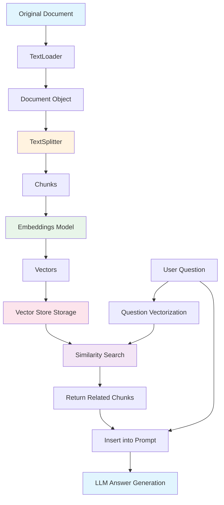
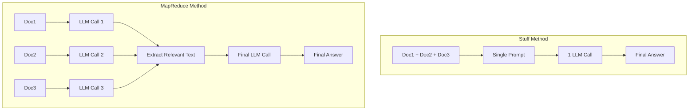

# Chapter 4: RAG (Retrieval-Augmented Generation)

## Learning Objectives

By the end of this chapter, you will be able to:

- Understand the concept and necessity of **RAG**
- Load documents with **TextLoader** and split them with **CharacterTextSplitter**
- Understand the advantages of **tiktoken**-based token splitting
- Convert text into vectors using **OpenAIEmbeddings**
- Build a vector store with **FAISS** and perform similarity searches
- Understand and implement the differences between **RetrievalQA**, **Stuff Chain**, and **MapReduce Chain**

---

## Core Concepts

### What is RAG?

**RAG (Retrieval-Augmented Generation)** is a technique that retrieves external data that the LLM was not trained on and uses it for answer generation. It overcomes the knowledge limitations of LLMs and enables accurate answers based on specific documents.

### RAG Pipeline



### Key Terminology

| Term | Description |
|------|-------------|
| **Document** | An object in LangChain that holds text and metadata (`page_content`, `metadata`) |
| **Chunk** | A small piece of a split document. Each chunk becomes one Document object |
| **Embedding** | Text converted into a high-dimensional numerical vector. Enables numerical comparison of semantic similarity |
| **Vector Store** | A database that stores vectors and performs similarity searches |
| **Retriever** | An interface that searches for related documents from a Vector Store |
| **Stuff** | A method that combines all retrieved documents into a single prompt |
| **MapReduce** | A method that processes each document individually (Map) and then synthesizes the results (Reduce) |

### Stuff vs MapReduce



| | Stuff | MapReduce |
|---|---|---|
| Number of LLM Calls | 1 | N+1 (number of documents + final) |
| Token Limit | All documents must fit in the context | Each document is processed individually, so less constrained |
| Cost | Low | High |
| Accuracy | High, since everything is seen at once | Extracts only relevant parts from each document |
| Best For | Few or short documents | Many or long documents |

---

## Code Walkthrough by Commit

### 4.1 Data Loaders and Splitters

> Commit: `75c3c6f`

This is the basic process of loading and splitting documents.

```python
from langchain_community.document_loaders import TextLoader
from langchain_text_splitters import RecursiveCharacterTextSplitter

splitter = RecursiveCharacterTextSplitter()

loader = TextLoader("./files/chapter_one.txt")

loader.load_and_split(text_splitter=splitter)
```

**Key Points:**

1. **TextLoader**: Reads a text file and converts it into a `Document` object
   - A `Document` has `page_content` (text) and `metadata` (file path, etc.)

2. **RecursiveCharacterTextSplitter**: Recursively splits documents
   - Default separators: tries `["\n\n", "\n", " ", ""]` in order
   - First splits by paragraphs (`\n\n`), then by line breaks (`\n`) if still too large, then by spaces (` `)
   - This preserves semantic units as much as possible during splitting

3. **load_and_split**: Performs loading and splitting in one step

**Why split documents?**
- LLMs have context window limits (the number of tokens they can process at once)
- Since you cannot feed an entire long document at once, you need to find and include only the relevant parts
- Split chunks are converted to vectors for use in similarity search

---

### 4.2 Tiktoken

> Commit: `e3f9151`

Splits with precise token count control based on tiktoken.

```python
from langchain_community.document_loaders import TextLoader
from langchain_text_splitters import CharacterTextSplitter

splitter = CharacterTextSplitter.from_tiktoken_encoder(
    separator="\n",
    chunk_size=600,
    chunk_overlap=100,
)

loader = TextLoader("./files/chapter_one.txt")
```

**Key Points:**

1. **CharacterTextSplitter.from_tiktoken_encoder**: Uses the tiktoken library to split based on token count

2. **Parameter Descriptions**:
   - `separator="\n"`: Splits based on line breaks
   - `chunk_size=600`: Ensures each chunk does not exceed 600 tokens
   - `chunk_overlap=100`: Creates a 100-token overlap between consecutive chunks

3. **Why tiktoken?**
   - `RecursiveCharacterTextSplitter` splits based on **character count**
   - `from_tiktoken_encoder` splits based on **token count**
   - Since an LLM's context window is measured in tokens, token-based splitting is more accurate

4. **Role of chunk_overlap**: Prevents context from being cut off at chunk boundaries. With a 100-token overlap, the end of the previous chunk is also included at the beginning of the next chunk.

**Terminology:**
- **tiktoken**: A tokenizer library created by OpenAI. It provides the same tokenization method that GPT models actually use.

---

### 4.4 Vector Store

> Commit: `3bd911a`

Building embeddings and a vector store.

```python
from langchain_openai import OpenAIEmbeddings
from langchain_classic.embeddings import CacheBackedEmbeddings
from langchain_community.vectorstores import FAISS
from langchain_classic.storage import LocalFileStore

cache_dir = LocalFileStore("./.cache/")

splitter = CharacterTextSplitter.from_tiktoken_encoder(
    separator="\n",
    chunk_size=600,
    chunk_overlap=100,
)
loader = TextLoader("./files/chapter_one.txt")
docs = loader.load_and_split(text_splitter=splitter)

embeddings = OpenAIEmbeddings(
    base_url=os.getenv("OPENAI_EMBEDDING_BASE_URL"),
    api_key=os.getenv("OPENAI_API_KEY"),
    model=os.getenv("OPENAI_EMBEDDING_MODEL"),
)

cached_embeddings = CacheBackedEmbeddings.from_bytes_store(embeddings, cache_dir)

vectorstore = FAISS.from_documents(docs, cached_embeddings)
```

```python
results = vectorstore.similarity_search("where does winston live")
results
```

**Key Points:**

1. **OpenAIEmbeddings**: Converts text into vectors (arrays of numbers)
   - Semantically similar texts have nearby vectors
   - Example: The vectors for "cat" and "kitten" are closer than those for "cat" and "car"

2. **CacheBackedEmbeddings**: Caches embedding results to local files
   - When re-embedding the same text, returns from cache without making an API call
   - `LocalFileStore("./.cache/")`: Cache storage location

3. **FAISS**: A vector similarity search library created by Facebook AI Research
   - `from_documents`: Vectorizes a list of Documents and builds an index
   - `similarity_search`: Searches for chunks most similar to the query

4. **Data Flow**:
   ```
   Text file -> TextLoader -> Documents -> TextSplitter -> Chunks
   -> OpenAIEmbeddings -> Vectors -> FAISS Index
   ```

---

### 4.5 RetrievalQA

> Commit: `84bb41b`

Performs document-based QA using the legacy RetrievalQA chain.

```python
from langchain_classic.chains import RetrievalQA

llm = ChatOpenAI(
    base_url=os.getenv("OPENAI_BASE_URL"),
    api_key=os.getenv("OPENAI_API_KEY"),
    model="gpt-5.1",
)

# ... (same document loading, embedding, and vector store construction)

chain = RetrievalQA.from_chain_type(
    llm=llm,
    chain_type="map_rerank",
    retriever=vectorstore.as_retriever(),
)

chain.invoke("Describe Victory Mansions")
```

**Key Points:**

1. **RetrievalQA**: A legacy component that combines vector store search + LLM answer generation into a single chain

2. **chain_type Options**:
   - `"stuff"`: Combines all search results into a single prompt
   - `"map_reduce"`: Processes each document individually and then synthesizes
   - `"map_rerank"`: Generates an answer from each document and selects the best one
   - `"refine"`: Processes documents sequentially, refining the answer

3. **as_retriever()**: Converts the Vector Store into a Retriever interface. This allows the chain to automatically search for relevant documents.

4. **Legacy Notice**: `RetrievalQA` is in `langchain_classic`, and the modern approach is to implement it directly with LCEL as shown in sections 4.7-4.8.

---

### 4.7 Stuff LCEL Chain

> Commit: `bbb85ab`

Directly implements a Stuff-style RAG chain using LCEL.

```python
from langchain_core.prompts import ChatPromptTemplate
from langchain_core.runnables import RunnablePassthrough

# ... (same document loading, embedding, and vector store construction)

retriever = vectorstore.as_retriever()

prompt = ChatPromptTemplate.from_messages(
    [
        (
            "system",
            "You are a helpful assistant. Answer questions using only the following context. "
            "If you don't know the answer just say you don't know, don't make it up:\n\n{context}",
        ),
        ("human", "{question}"),
    ]
)

chain = (
    {
        "context": retriever,
        "question": RunnablePassthrough(),
    }
    | prompt
    | llm
)

chain.invoke("Describe Victory Mansions")
```

**Key Points:**

1. **Core LCEL RAG Pattern**:
   ```python
   {
       "context": retriever,
       "question": RunnablePassthrough(),
   }
   ```
   - `retriever`: Performs a vector search with the input string and returns related documents
   - `RunnablePassthrough()`: Passes the input string through as-is
   - Result: `{"context": [related Documents], "question": "original question"}`

2. **Prompt Design**:
   - The system message includes `{context}` to provide the retrieved documents as context
   - "If you don't know the answer just say you don't know" -- an important instruction to prevent hallucination

3. **Characteristics of the Stuff Approach**: All retrieved documents are combined into a single `{context}`. Simple and effective, but if there are many documents, it may exceed the context window.

4. **RetrievalQA vs LCEL**:
   - `RetrievalQA`: Internal behavior is hidden like a black box
   - LCEL: Every step is explicit, making customization easy

---

### 4.8 Map Reduce LCEL Chain

> Commit: `fcebffa`

Implements a MapReduce-style RAG chain using LCEL.

```python
from langchain_core.runnables import RunnablePassthrough, RunnableLambda

# Map stage: Extract relevant text from each document
map_doc_prompt = ChatPromptTemplate.from_messages(
    [
        (
            "system",
            """
            Use the following portion of a long document to see if any of the text is relevant to answer the question. Return any relevant text verbatim. If there is no relevant text, return : ''
            -------
            {context}
            """,
        ),
        ("human", "{question}"),
    ]
)

map_doc_chain = map_doc_prompt | llm

def map_docs(inputs):
    documents = inputs["documents"]
    question = inputs["question"]
    return "\n\n".join(
        map_doc_chain.invoke(
            {"context": doc.page_content, "question": question}
        ).content
        for doc in documents
    )

map_chain = {
    "documents": retriever,
    "question": RunnablePassthrough(),
} | RunnableLambda(map_docs)

# Reduce stage: Synthesize extracted texts to generate a final answer
final_prompt = ChatPromptTemplate.from_messages(
    [
        (
            "system",
            """
            Given the following extracted parts of a long document and a question, create a final answer.
            If you don't know the answer, just say that you don't know. Don't try to make up an answer.
            ------
            {context}
            """,
        ),
        ("human", "{question}"),
    ]
)

chain = {"context": map_chain, "question": RunnablePassthrough()} | final_prompt | llm

chain.invoke("How many ministries are mentioned")
```

**Key Points:**

1. **Two-Stage Structure**:
   - **Map Stage**: Sends each retrieved document individually to the LLM to extract only the relevant text
   - **Reduce Stage**: Synthesizes the extracted texts to generate a final answer

2. **map_docs Function**:
   - Receives the list of retrieved Documents from `inputs["documents"]`
   - Calls `map_doc_chain` on each Document to extract relevant text
   - Joins the results with `\n\n` and returns them as a single string

3. **RunnableLambda**: A wrapper that allows inserting a regular Python function into an LCEL chain
   - `RunnableLambda(map_docs)`: Uses the `map_docs` function as a step in the chain

4. **Chain Composition Order**:
   ```
   Question -> Search documents with retriever
            -> Extract relevant text from each document with map_docs
            -> Insert extracted text and question into final_prompt
            -> Generate final answer with LLM
   ```

5. **Choosing Between Stuff and MapReduce**:
   - If retrieved documents are 4 or fewer and each is short -> Stuff (4.7)
   - If retrieved documents are many or long -> MapReduce (4.8)
   - MapReduce costs more due to more LLM calls, but has less information loss since each document is analyzed individually

---

## Previous vs Current Approach

| Item | LangChain 0.x (2023) | LangChain 1.x (2026) |
|------|---------------------|---------------------|
| Document loader import | `from langchain.document_loaders import TextLoader` | `from langchain_community.document_loaders import TextLoader` |
| Text splitter import | `from langchain.text_splitter import CharacterTextSplitter` | `from langchain_text_splitters import CharacterTextSplitter` |
| Embeddings import | `from langchain.embeddings import OpenAIEmbeddings` | `from langchain_openai import OpenAIEmbeddings` |
| Vector store import | `from langchain.vectorstores import FAISS` | `from langchain_community.vectorstores import FAISS` |
| Cache embeddings | `from langchain.embeddings import CacheBackedEmbeddings` | `from langchain_classic.embeddings import CacheBackedEmbeddings` |
| RetrievalQA | `from langchain.chains import RetrievalQA` | `from langchain_classic.chains import RetrievalQA` (legacy) |
| RAG chain construction | `RetrievalQA.from_chain_type(...)` | LCEL: `{"context": retriever, "question": RunnablePassthrough()} \| prompt \| llm` |
| Text splitter package | Built into `langchain` | Separate `langchain_text_splitters` package |

**Key Changes:**
- The text splitter has been separated into an independent package called `langchain_text_splitters`
- Legacy chains like `RetrievalQA` have been moved to `langchain_classic`, and direct implementation with LCEL is recommended
- Utilities like `CacheBackedEmbeddings` and `LocalFileStore` have been moved to `langchain_classic`

---

## Practice Exercises

### Exercise 1: Build Your Own RAG System

Build a RAG system that meets the following requirements:

1. Prepare a text file of your choice (blog post, wiki article, etc.)
2. Split it with `CharacterTextSplitter.from_tiktoken_encoder` (chunk_size=500, chunk_overlap=50)
3. Cache embeddings with `CacheBackedEmbeddings`
4. Build a FAISS vector store
5. Answer 3 questions using a **Stuff-style** LCEL chain

### Exercise 2: Stuff vs MapReduce Comparison

Run both the Stuff chain (4.7) and MapReduce chain (4.8) with the same document and the same questions, and compare them:

1. Compare the answer quality of both chains
2. Measure the token usage of each chain using `get_usage_metadata_callback()`
3. Summarize which approach is more suitable in which situations

---

## Next Chapter Preview

In **Chapter 5: Streamlit**, we will turn the RAG system we have built so far into a web application:
- **Streamlit**: A framework for building web UIs using only Python
- File upload, chat interface, streaming responses
- Building a complete document QA chatbot
