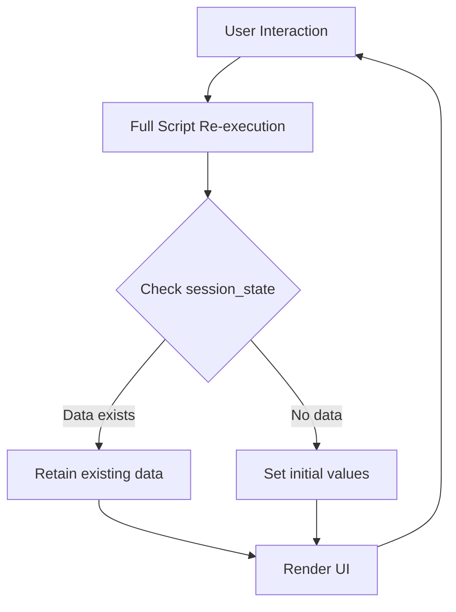
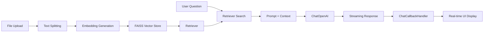
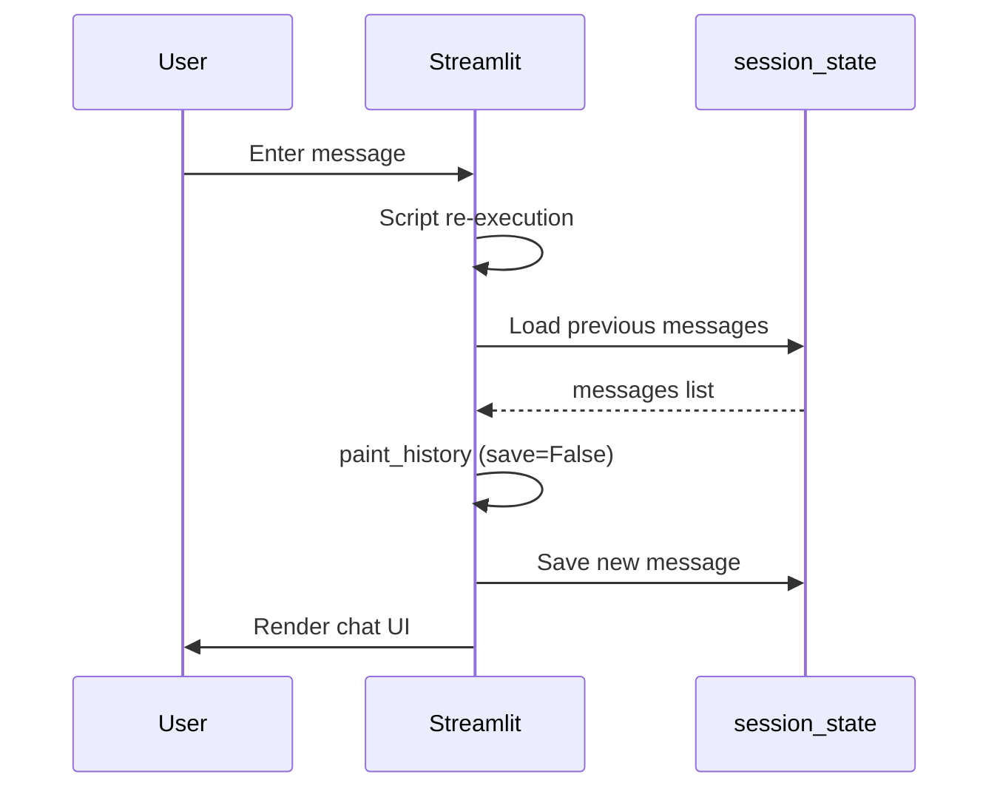
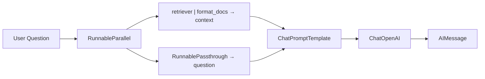
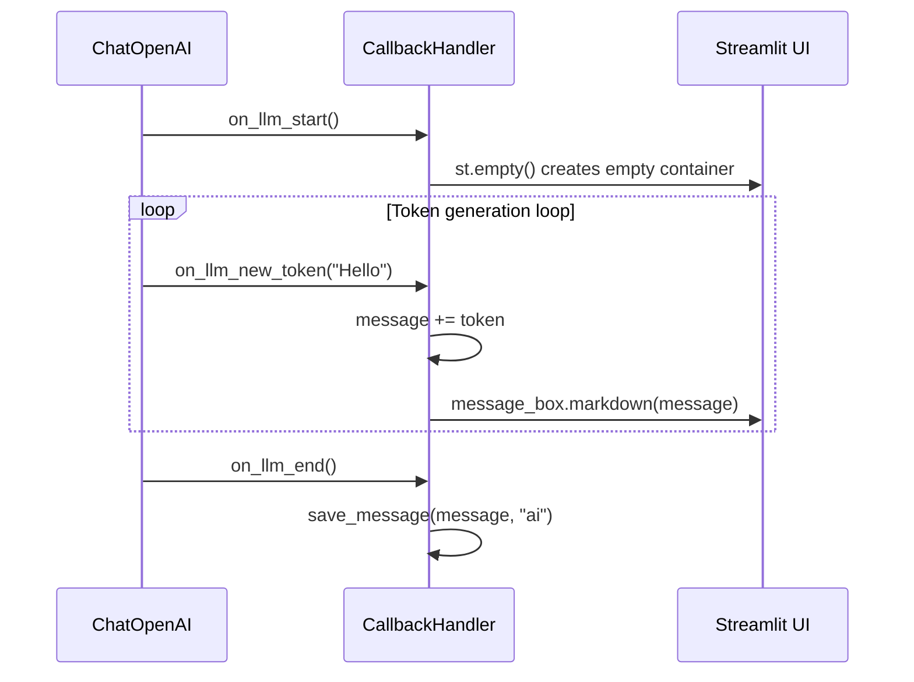

# Chapter 05: Streamlit - Building an AI Chatbot UI

## Learning Objectives

By the end of this chapter, you will be able to:

- Build a web app using Streamlit's basic widgets and layouts
- Maintain conversation history using `st.session_state`
- Upload documents with `st.file_uploader` and connect them to a RAG pipeline
- Implement a `ChatCallbackHandler` to display streaming responses in real time
- Build a complete DocumentGPT chatbot with Streamlit + LangChain

---

## Core Concepts

### What is Streamlit?

Streamlit is a framework that lets you build web applications using only Python. You don't need to know any HTML, CSS, or JavaScript. It is especially useful for data scientists and AI engineers who want to quickly build prototypes.

### Streamlit's Execution Model

The most important characteristic of Streamlit is that **the script is re-executed from the beginning on every interaction**. When you click a button, enter text, or upload a file, the entire Python script runs again from top to bottom.



This is why **`st.session_state`** is essential. If you don't store variables in `session_state`, they will be reset on every execution.

### DocumentGPT Architecture



---

## Code Walkthrough by Commit

### 5.0 Introduction (`bd57168`)

Your first encounter with Streamlit. Using the most basic widgets.

```python
import streamlit as st

st.title("Hello world!")
st.subheader("Welcome to Streamlit!")
st.markdown("""
    #### I love it!
""")
```

`st.title`, `st.subheader`, and `st.markdown` are the most basic functions for displaying text. To run a Streamlit app, enter `streamlit run Home.py` in the terminal.

---

### 5.1 Magic (`4a73e79`)

Introduces Streamlit's "Magic" feature and input widgets.

```python
import streamlit as st

st.selectbox(
    "Choose your model",
    ("GPT-3", "GPT-4"),
)
```

**`st.selectbox`** creates a dropdown menu. Since it returns the user's selected value, you can store it in a variable and use it for conditional branching.

---

### 5.2 Data Flow (`7cf4068`)

A key commit for understanding Streamlit's Data Flow.

```python
import streamlit as st
from datetime import datetime

today = datetime.today().strftime("%H:%M:%S")
st.title(today)

model = st.selectbox(
    "Choose your model",
    ("GPT-3", "GPT-4"),
)

if model == "GPT-3":
    st.write("cheap")
else:
    st.write("not cheap")
    name = st.text_input("What is your name?")
    st.write(name)
    value = st.slider("temperature", min_value=0.1, max_value=1.0)
    st.write(value)
```

**Key Point:** The time displayed in `st.title(today)` changes every time you interact with a widget. This is the proof that "the entire script is re-executed."

New widgets:
- **`st.text_input`**: A text input field
- **`st.slider`**: A slider (used here for temperature control)
- **`st.write`**: A versatile function that automatically displays any type appropriately

---

### 5.3 Multi Page (`7152c0d`)

Sets up Streamlit's multi-page feature. Placing files in the `pages/` folder automatically creates navigation in the sidebar.

```
Project structure:
├── Home.py                      # Main page
├── pages/
│   ├── 01_DocumentGPT.py        # /DocumentGPT
│   ├── 02_PrivateGPT.py         # /PrivateGPT
│   └── 03_QuizGPT.py            # /QuizGPT
```

In `Home.py`, use `st.set_page_config` to set the page title and icon:

```python
st.set_page_config(
    page_title="FullstackGPT Home",
    page_icon="🤖",
)
```

> **Note:** `st.set_page_config` must be called as the **first Streamlit command** in the script. Otherwise, an error will occur.

---

### 5.4 Chat Messages (`473717f`)

Introduces `st.chat_message` and `st.session_state`, the core of the chat UI.

```python
st.set_page_config(
    page_title="DocumentGPT",
    page_icon="📃",
)

if "messages" not in st.session_state:
    st.session_state["messages"] = []

def send_message(message, role, save=True):
    with st.chat_message(role):
        st.write(message)
    if save:
        st.session_state["messages"].append({"message": message, "role": role})

for message in st.session_state["messages"]:
    send_message(message["message"], message["role"], save=False)

message = st.chat_input("Send a message to the ai ")

if message:
    send_message(message, "human")
    time.sleep(2)
    send_message(f"You said: {message}", "ai")
```

**Key Pattern Analysis:**

1. **`st.session_state`**: Acts like a dictionary and persists data between re-executions
2. **`st.chat_message(role)`**: Displays messages with different icons and styles depending on the `"human"` or `"ai"` role
3. **`st.chat_input`**: Creates a chat input box fixed at the bottom of the screen
4. **`save=False` Pattern**: Prevents duplicate saving when re-rendering previous messages



---

### 5.6 Uploading Documents (`5200539`)

Integrates file upload and the RAG pipeline into Streamlit.

```python
def embed_file(file):
    file_content = file.read()
    file_path = f"./.cache/files/{file.name}"
    os.makedirs(os.path.dirname(file_path), exist_ok=True)
    with open(file_path, "wb") as f:
        f.write(file_content)
    cache_dir = LocalFileStore(f"./.cache/embeddings/{file.name}")
    splitter = CharacterTextSplitter.from_tiktoken_encoder(
        separator="\n",
        chunk_size=600,
        chunk_overlap=100,
    )
    if file.name.endswith(".txt"):
        loader = TextLoader(file_path)
    else:
        loader = UnstructuredFileLoader(file_path)
    docs = loader.load_and_split(text_splitter=splitter)
    embeddings = OpenAIEmbeddings(...)
    cached_embeddings = CacheBackedEmbeddings.from_bytes_store(embeddings, cache_dir)
    vectorstore = FAISS.from_documents(docs, cached_embeddings)
    retriever = vectorstore.as_retriever()
    return retriever

file = st.file_uploader(
    "Upload a .txt .pdf or .docx file",
    type=["pdf", "txt", "docx"],
)

if file:
    retriever = embed_file(file)
    s = retriever.invoke("winston")
    s
```

**Key Concepts:**

- **`st.file_uploader`**: A file upload widget. The `type` parameter restricts allowed file extensions
- **`CacheBackedEmbeddings`**: Caches already-embedded documents to local files, preventing duplicate API calls
- **File format branching**: `.txt` files use `TextLoader`, while others use `UnstructuredFileLoader`

> **Cost-saving Tip:** The embedding API incurs costs with every call. Using `CacheBackedEmbeddings` means that even if you re-upload the same document, it uses cached results at no additional cost.

---

### 5.7 Chat History (`3c4b1ac`)

Combines chat history with file upload. Moves file upload to the sidebar and adds `@st.cache_data`.

```python
@st.cache_data(show_spinner="Embedding file...")
def embed_file(file):
    # ... same as before but with caching decorator added
    return retriever

def send_message(message, role, save=True):
    with st.chat_message(role):
        st.markdown(message)
    if save:
        st.session_state["messages"].append({"message": message, "role": role})

def paint_history():
    for message in st.session_state["messages"]:
        send_message(message["message"], message["role"], save=False)

with st.sidebar:
    file = st.file_uploader(
        "Upload a .txt .pdf or .docx file",
        type=["pdf", "txt", "docx"],
    )

if file:
    retriever = embed_file(file)
    send_message("I'm ready! Ask away!", "ai", save=False)
    paint_history()
    message = st.chat_input("Ask anything about your file...")
    if message:
        send_message(message, "human")
else:
    st.session_state["messages"] = []
```

**New Concepts:**

- **`@st.cache_data`**: Caches function results. Uploading the same file skips re-embedding. The `show_spinner` parameter displays a loading message.
- **`with st.sidebar:`**: Places widgets in the sidebar
- **Reset when no file**: `else: st.session_state["messages"] = []` clears the conversation history when the file is removed

---

### 5.8 Chain (`c0c51ef`)

Connects the LangChain LCEL chain with Streamlit. Now the AI actually gives document-based answers.

```python
llm = ChatOpenAI(
    base_url=os.getenv("OPENAI_BASE_URL"),
    api_key=os.getenv("OPENAI_API_KEY"),
    model="gpt-5.1",
    temperature=0.1,
)

def format_docs(docs):
    return "\n\n".join(document.page_content for document in docs)

prompt = ChatPromptTemplate.from_messages([
    ("system", """
    Answer the question using ONLY the following context.
    If you don't know the answer just say you don't know.
    DON'T make anything up.

    Context: {context}
    """),
    ("human", "{question}"),
])

if message:
    send_message(message, "human")
    chain = (
        {
            "context": retriever | RunnableLambda(format_docs),
            "question": RunnablePassthrough(),
        }
        | prompt
        | llm
    )
    response = chain.invoke(message)
    send_message(response.content, "ai")
```

**LCEL Chain Structure Analysis:**



- **`RunnableParallel`** (dictionary form): Prepares `context` and `question` simultaneously
- **`RunnableLambda(format_docs)`**: Converts the Document list returned by the retriever into a single string
- **`RunnablePassthrough()`**: Passes the input through as-is (the user's question text)

---

### 5.9 Streaming (`16c3c12`)

Implements a `ChatCallbackHandler` for real-time streaming. This is the highlight of this chapter.

```python
from langchain_core.callbacks import BaseCallbackHandler

class ChatCallbackHandler(BaseCallbackHandler):
    message = ""

    def on_llm_start(self, *args, **kwargs):
        self.message_box = st.empty()

    def on_llm_end(self, *args, **kwargs):
        save_message(self.message, "ai")

    def on_llm_new_token(self, token, *args, **kwargs):
        self.message += token
        self.message_box.markdown(self.message)

llm = ChatOpenAI(
    base_url=os.getenv("OPENAI_BASE_URL"),
    api_key=os.getenv("OPENAI_API_KEY"),
    model="gpt-5.1",
    temperature=0.1,
    streaming=True,
    callbacks=[ChatCallbackHandler()],
)
```

**How ChatCallbackHandler Works:**



1. **`on_llm_start`**: Called when the LLM starts responding. Creates an empty container with `st.empty()`.
2. **`on_llm_new_token`**: Called each time a token is generated. Appends the new token to the existing message and updates the UI with `message_box.markdown()`.
3. **`on_llm_end`**: When the response is complete, saves the full message to `session_state`.

The invocation part also changes:

```python
if message:
    send_message(message, "human")
    chain = (
        {
            "context": retriever | RunnableLambda(format_docs),
            "question": RunnablePassthrough(),
        }
        | prompt
        | llm
    )
    with st.chat_message("ai"):
        chain.invoke(message)
```

By calling `chain.invoke` inside a `with st.chat_message("ai"):` block, the `st.empty()` created by `ChatCallbackHandler` is positioned inside the AI message container.

---

### 5.10 Recap (`c6b2b04`)

The final completed code is identical to 5.9. This commit reviews the overall flow.

---

## Previous vs Current Approach

| Item | LangChain 0.x (Previous) | LangChain 1.x (Current) |
|------|---------------------|---------------------|
| Chain construction | `RetrievalQA.from_chain_type(llm, retriever=retriever)` | LCEL: `{"context": retriever \| format_docs, "question": RunnablePassthrough()} \| prompt \| llm` |
| Streaming | `llm(streaming=True, callbacks=[...])` | Same, but `BaseCallbackHandler` import path changed to `langchain_core.callbacks` |
| Document retrieval | `retriever.get_relevant_documents(query)` | `retriever.invoke(query)` |
| Embeddings | `from langchain.embeddings import OpenAIEmbeddings` | `from langchain_openai import OpenAIEmbeddings` |
| Vector store | `from langchain.vectorstores import FAISS` | `from langchain_community.vectorstores import FAISS` |
| Callbacks | `from langchain.callbacks.base import BaseCallbackHandler` | `from langchain_core.callbacks import BaseCallbackHandler` |

---

## Practice Exercises

### Exercise 1: Add a Clear Chat History Button

Add a "Clear Chat History" button to the sidebar. When clicked, it should reset `st.session_state["messages"]` to an empty list.

**Hint:**
```python
with st.sidebar:
    if st.button("Clear Chat History"):
        st.session_state["messages"] = []
```

### Exercise 2: Model Selection Feature

Add an `st.selectbox` to the sidebar so users can select a model. Change the `model` parameter of `ChatOpenAI` based on the selection.

**Requirements:**
- Model options: `"gpt-4o-mini"`, `"gpt-4o"`, `"gpt-4-turbo"`
- Existing conversation should be preserved when the model is changed

---

## Next Chapter Preview

In Chapter 06, we learn how to use **open-source LLMs** instead of OpenAI. We will explore various alternative providers such as HuggingFace Hub, GPT4All, and Ollama, and build a **PrivateGPT** that runs LLMs locally. Is it possible to have a completely private AI chatbot without internet, without API keys?
