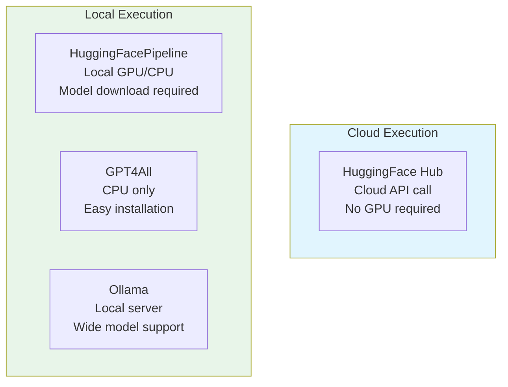
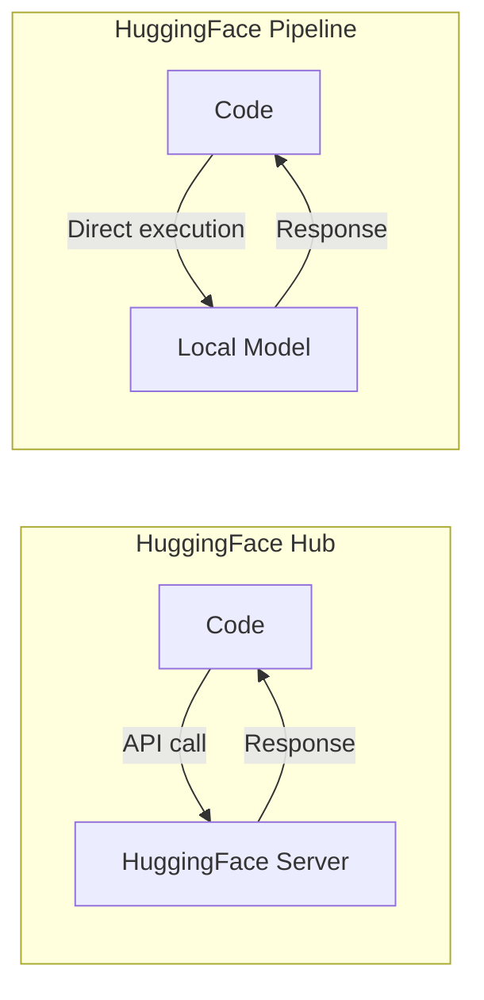
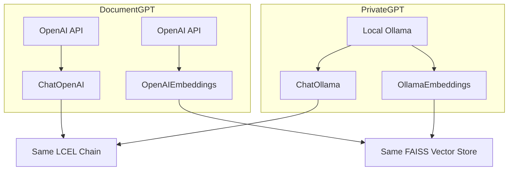

# Chapter 06: Alternative Providers - Using Open-Source LLMs

## Learning Objectives

By the end of this chapter, you will be able to:

- Understand the characteristics and differences of various LLM providers beyond OpenAI
- Use open-source models in the cloud through HuggingFace Hub
- Run models locally with HuggingFacePipeline
- Set up and use GPT4All and Ollama
- Build PrivateGPT, a fully local RAG chatbot

---

## Core Concepts

### Why Are Alternative Providers Needed?

OpenAI's GPT models are powerful but have several limitations:

1. **Cost**: Fees are incurred with every API call
2. **Privacy**: Data is sent to OpenAI's servers
3. **Internet Dependency**: Cannot be used offline
4. **API Key Required**: Requires an account and payment method

Using open-source LLMs, you can build AI applications without these constraints.

### Provider Comparison



| Provider | Execution Location | GPU Required | Internet Required | Difficulty |
|-----------|----------|---------|------------|--------|
| HuggingFace Hub | Cloud | No | Yes | Easy |
| HuggingFacePipeline | Local | Recommended | First time only | Medium |
| GPT4All | Local | No | First time only | Easy |
| Ollama | Local | No | First time only | Easy |

---

## Code Walkthrough by Commit

### 6.1 HuggingFaceHub (`bda470a`)

HuggingFace Hub is a platform that hosts thousands of open-source models. It runs models in the cloud through an API.

```python
from langchain_community.llms import HuggingFaceHub
from langchain_core.prompts import PromptTemplate

prompt = PromptTemplate.from_template("[INST]What is the meaning of {word}[/INST]")

llm = HuggingFaceHub(
    repo_id="mistralai/Mistral-7B-Instruct-v0.1",
    model_kwargs={
        "max_new_tokens": 250,
    },
)

chain = prompt | llm

chain.invoke({"word": "potato"})
```

**Code Analysis:**

- **`repo_id`**: The HuggingFace model repository ID. Here we use Mistral AI's 7B parameter instruction model
- **`[INST]...[/INST]`**: A special prompt format for the Mistral model. Each model expects a different prompt format
- **`max_new_tokens`**: Limits the maximum number of tokens to generate
- **LCEL Chain**: The `prompt | llm` pipeline is completely identical to OpenAI. Thanks to LangChain's abstraction, the chain structure remains the same even when switching providers

> **Terminology:** "7B" means the model has 7 Billion parameters. Generally, more parameters mean a smarter model, but more computing resources are required.

**Prerequisites:**
```bash
pip install langchain-community huggingface_hub
```
You must set a HuggingFace API token in the environment variable `HUGGINGFACEHUB_API_TOKEN`.

---

### 6.2 HuggingFacePipeline (`804ac75`)

This time, we **download the model to the local computer** and run it. It can be used without an internet connection.

```python
from langchain_community.llms import HuggingFacePipeline
from langchain_core.prompts import PromptTemplate

prompt = PromptTemplate.from_template("A {word} is a")

llm = HuggingFacePipeline.from_model_id(
    model_id="gpt2",
    task="text-generation",
    pipeline_kwargs={"max_new_tokens": 150},
)

chain = prompt | llm

chain.invoke({"word": "tomato"})
```

**Code Analysis:**

- **`HuggingFacePipeline.from_model_id`**: Automatically downloads the model when you specify a model ID and runs it locally
- **`model_id="gpt2"`**: OpenAI's GPT-2 model. It's small and lightweight, making it suitable for testing
- **`task="text-generation"`**: Specifies the model's purpose in HuggingFace. Various tasks are available including text generation, translation, summarization, and more

**HuggingFace Hub vs Pipeline Difference:**



> **Note:** GPT-2 is a very old model, so its response quality is not great. For actual production, use modern models like Llama or Mistral. However, these models are several GB in size, so downloading takes time.

---

### 6.3 GPT4All (`ff08536`)

GPT4All is a local LLM solution that can run on CPU only. Its advantage is that it can be used on computers without a GPU.

```python
from langchain_community.llms import GPT4All
from langchain_core.prompts import PromptTemplate

prompt = PromptTemplate.from_template(
    "You are a helpful assistant that defines words. Define this word: {word}."
)

llm = GPT4All(
    model="./falcon.bin",
)

chain = prompt | llm

chain.invoke({"word": "tomato"})
```

**Code Analysis:**

- **`model="./falcon.bin"`**: Specifies the path to a locally downloaded model file
- The prompt format is more natural. GPT4All models generally support standard prompt formats
- No separate API key is required

**GPT4All Installation and Model Download:**

```bash
pip install gpt4all
# Download model files from the GPT4All official website
# https://gpt4all.io/
```

> **Note:** GPT4All uses quantized models. Quantization is a technique that converts model weights to lower precision, reducing file size and memory usage. Quality decreases slightly, but it allows the model to run on regular computers.

---

### 6.4 Ollama (`bf6c317`)

Ollama is the most convenient tool for using local LLMs. Like Docker, you can install and run models with a single command.

**The code in notebook.ipynb is the same as 6.3**, but the key part of this commit is the **`pages/02_PrivateGPT.py`** file.

#### PrivateGPT - A Fully Local RAG Chatbot

```python
from langchain_community.chat_models import ChatOllama
from langchain_community.embeddings import OllamaEmbeddings

llm = ChatOllama(
    model="mistral:latest",
    temperature=0.1,
    streaming=True,
    callbacks=[ChatCallbackHandler()],
)

@st.cache_data(show_spinner="Embedding file...")
def embed_file(file):
    # ... file saving and splitting ...
    embeddings = OllamaEmbeddings(model="mistral:latest")
    cached_embeddings = CacheBackedEmbeddings.from_bytes_store(embeddings, cache_dir)
    vectorstore = FAISS.from_documents(docs, cached_embeddings)
    retriever = vectorstore.as_retriever()
    return retriever
```

**Key Differences from DocumentGPT:**

| Item | DocumentGPT | PrivateGPT |
|------|------------|------------|
| LLM | `ChatOpenAI` (OpenAI API) | `ChatOllama` (local Ollama) |
| Embeddings | `OpenAIEmbeddings` | `OllamaEmbeddings` |
| Internet | Required | Not required |
| API Key | Required | Not required |
| Cost | Paid | Free |
| Response Quality | High | Moderate |

The rest of the code structure (chain, chat history, streaming) is **nearly identical to DocumentGPT**. This is the power of LangChain's abstraction. You only need to swap the LLM and embedding objects, and the rest of the code can be reused as-is.



**Ollama Installation and Model Download:**

```bash
# macOS
brew install ollama

# Download and run a model
ollama pull mistral
ollama run mistral
```

**The prompt structure is also slightly different:**

```python
prompt = ChatPromptTemplate.from_template(
    """Answer the question using ONLY the following context and not your training data.
    If you don't know the answer just say you don't know. DON'T make anything up.

    Context: {context}
    Question:{question}
    """
)
```

DocumentGPT used `from_messages`, but PrivateGPT uses `from_template`. Local models often work better with a single prompt rather than separate system/user messages.

---

## Previous vs Current Approach

| Item | LangChain 0.x (Previous) | LangChain 1.x (Current) |
|------|---------------------|---------------------|
| HuggingFace Hub | `from langchain.llms import HuggingFaceHub` | `from langchain_community.llms import HuggingFaceHub` |
| HuggingFace Pipeline | `from langchain.llms import HuggingFacePipeline` | `from langchain_community.llms import HuggingFacePipeline` |
| GPT4All | `from langchain.llms import GPT4All` | `from langchain_community.llms import GPT4All` |
| Ollama (LLM) | `from langchain.llms import Ollama` | `from langchain_community.llms import Ollama` |
| Ollama (Chat) | N/A | `from langchain_community.chat_models import ChatOllama` |
| Ollama Embeddings | `from langchain.embeddings import OllamaEmbeddings` | `from langchain_community.embeddings import OllamaEmbeddings` |
| Package structure | Everything inside the `langchain` package | Community modules separated into `langchain-community` |

> **Key Change:** In LangChain 1.x, all community providers have been separated into the `langchain-community` package. You need to install it separately with `pip install langchain-community`.

---

## Practice Exercises

### Exercise 1: Ollama Model Comparison

Download two or more models from Ollama (e.g., `mistral`, `llama2`) and compare their responses to the same questions.

**Requirements:**
- Add a model selection `st.selectbox` to Streamlit
- Compare each model's response time and quality for the same questions
- Display model information (name, parameter count) in `st.sidebar`

### Exercise 2: PrivateGPT Improvements

Add the following features to PrivateGPT:

1. Add a `temperature` slider to the sidebar (0.0 to 1.0)
2. Add `.csv` to the uploadable file types
3. Display the currently used model name in the sidebar

---

## Next Chapter Preview

In Chapter 07, we build **QuizGPT**. We search for information from Wikipedia and have the LLM automatically generate quizzes. We will learn how to parse LLM output as JSON, how to chain two chains together, and how to use OpenAI's **Function Calling** (structured output).
