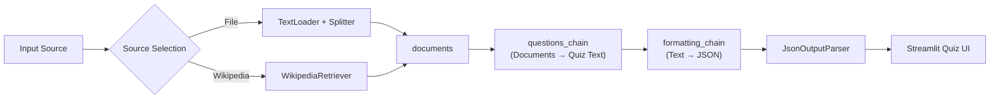
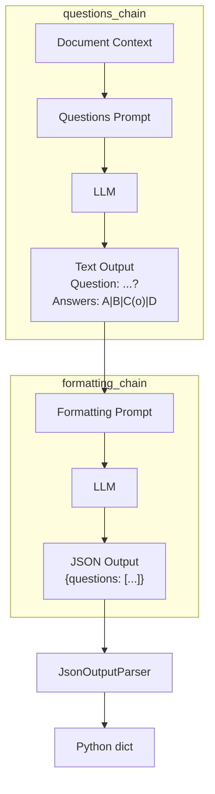
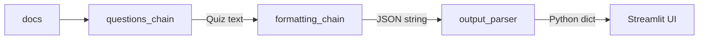
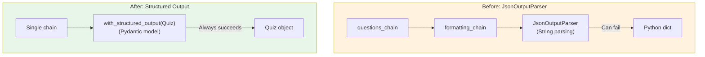

# Chapter 07: QuizGPT - AI Quiz Generator

## Learning Objectives

By the end of this chapter, you will be able to:

- Use `WikipediaRetriever` to search documents from Wikipedia
- Connect two LCEL chains to build a complex pipeline
- Create a custom `JsonOutputParser` to convert LLM output into structured data
- Understand caching strategies using `@st.cache_data`
- Use OpenAI's `with_structured_output` (Function Calling) to get reliable structured output
- Build an interactive quiz UI using Streamlit's `st.form` and `st.radio`

---

## Core Concepts

### QuizGPT Architecture

QuizGPT has a structure that connects two chains in series. The first chain generates questions as text based on the documents, and the second chain converts that text into JSON.



### Role Separation of the Two Chains



**Why split the chain into two?**

If you ask the LLM to "read the document, create a quiz, and output it as JSON" all at once, the failure rate is high. By separating the tasks:
1. The LLM focuses on only one task at each step
2. Debugging is easier (you can identify which step caused the problem)
3. You can validate intermediate results

---

## Code Walkthrough by Commit

### 7.1 WikipediaRetriever (`65f2af8`)

Creates the basic skeleton of QuizGPT. Supports two input sources: file upload and Wikipedia search.

```python
from langchain_community.retrievers import WikipediaRetriever

st.set_page_config(page_title="QuizGPT", page_icon="❓")
st.title("QuizGPT")

@st.cache_data(show_spinner="Loading file...")
def split_file(file):
    file_content = file.read()
    file_path = f"./.cache/quiz_files/{file.name}"
    with open(file_path, "wb") as f:
        f.write(file_content)
    splitter = CharacterTextSplitter.from_tiktoken_encoder(
        separator="\n", chunk_size=600, chunk_overlap=100,
    )
    loader = TextLoader(file_path)
    docs = loader.load_and_split(text_splitter=splitter)
    return docs

with st.sidebar:
    choice = st.selectbox(
        "Choose what you want to use.",
        ("File", "Wikipedia Article"),
    )
    if choice == "File":
        file = st.file_uploader(
            "Upload a .docx , .txt or .pdf file",
            type=["pdf", "txt", "docx"],
        )
        if file:
            docs = split_file(file)
            st.write(docs)
    else:
        topic = st.text_input("Search Wikipedia...")
        if topic:
            retriever = WikipediaRetriever(top_k_results=5)
            with st.status("Searching Wikipedia..."):
                docs = retriever.invoke(topic)
```

**Key Concepts:**

- **`WikipediaRetriever`**: A Wikipedia search tool provided by LangChain. `top_k_results=5` fetches the top 5 documents
- **`retriever.invoke(topic)`**: Pass a search term and it returns related Wikipedia pages as a list of `Document` objects
- **`st.status`**: A container that displays progress status. Lets the user know that a search is in progress
- **Source selection with `st.selectbox`**: Lets the user choose between file upload and Wikipedia search

> **Terminology:** A `Retriever` is an interface that takes a query and returns related documents. Both a vector store's `as_retriever()` and WikipediaRetriever implement the same interface, making them easily interchangeable.

---

### 7.2 GPT-4 Turbo (`9787dee`)

Sets up ChatOpenAI.

```python
llm = ChatOpenAI(
    base_url=os.getenv("OPENAI_BASE_URL"),
    api_key=os.getenv("OPENAI_API_KEY"),
    model="gpt-5.1",
    temperature=0.1,
    streaming=True,
    callbacks=[StreamingStdOutCallbackHandler()],
)
```

Here, `StreamingStdOutCallbackHandler` is used to **output to the terminal** rather than streaming to the Streamlit UI. Unlike chat, quiz generation needs to display the full result in the UI only after completion, so terminal output is used for debugging during development.

---

### 7.3 Questions Prompt (`a6cbb0d`)

Creates the prompt and chain for generating quiz questions.

```python
def format_docs(docs):
    return "\n\n".join(document.page_content for document in docs)

prompt = ChatPromptTemplate.from_messages([
    ("system", """
    You are a helpful assistant that is role playing as a teacher.

    Based ONLY on the following context make 10 questions to test the
    user's knowledge about the text.

    Each question should have 4 answers, three of them must be incorrect
    and one should be correct.

    Use (o) to signal the correct answer.

    Question examples:

    Question: What is the color of the ocean?
    Answers: Red|Yellow|Green|Blue(o)

    Question: What is the capital or Georgia?
    Answers: Baku|Tbilisi(o)|Manila|Beirut

    Your turn!

    Context: {context}
    """)
])

chain = {"context": format_docs} | prompt | llm

start = st.button("Generate Quiz")
if start:
    chain.invoke(docs)
```

**Key Aspects of Prompt Design:**

1. **Role Assignment**: Assigns the "teacher" role to guide the generation of educational questions
2. **Format Specification**: Defines a clear format using `(o)` to mark correct answers and `|` to separate answers
3. **Providing Examples**: Uses few-shot prompting to show the model the desired output format
4. **Constraints**: "Based ONLY on the following context" prevents hallucination

**Chain Structure:**

```python
{"context": format_docs} | prompt | llm
```

Here, `{"context": format_docs}` is a `RunnableParallel`. It takes the `docs` list, transforms it with the `format_docs` function, and maps the result to the `context` key.

---

### 7.4 Formatter Prompt (`ba1dc05`)

Adds a second chain that converts the first chain's text output into JSON.

```python
questions_chain = {"context": format_docs} | questions_prompt | llm

formatting_prompt = ChatPromptTemplate.from_messages([
    ("system", """
    You are a powerful formatting algorithm.

    You format exam questions into JSON format.
    Answers with (o) are the correct ones.

    Example Input:

    Question: What is the color of the ocean?
    Answers: Red|Yellow|Green|Blue(o)

    Example Output:

    ```json
    {{ "questions": [
            {{
                "question": "What is the color of the ocean?",
                "answers": [
                        {{
                            "answer": "Red",
                            "correct": false
                        }},
                        {{
                            "answer": "Blue",
                            "correct": true
                        }}
                ]
            }}
        ]
     }}
    ```
    Your turn!

    Questions: {context}
    """)
])

formatting_chain = formatting_prompt | llm
```

**Important Notes:**

- When using JSON curly braces `{}` inside a prompt, you must escape them as `{{ }}`. This is because LangChain interprets `{variable}` as a template variable.
- The role is set to "formatting algorithm" to focus on precise format conversion rather than creative responses

---

### 7.5 Output Parser (`7a31123`)

Creates a custom parser that converts the LLM's JSON string output into a Python dictionary.

```python
import json
from langchain_core.output_parsers import BaseOutputParser

class JsonOutputParser(BaseOutputParser):
    def parse(self, text):
        text = text.replace("```", "").replace("json", "")
        return json.loads(text)

output_parser = JsonOutputParser()
```

**Why is a custom parser needed?**

LLMs often wrap JSON in markdown code blocks when returning it:

```
```json
{"questions": [...]}
```
```

The `parse` method removes the ` ``` ` and `json` text, then parses with `json.loads()`.

**`BaseOutputParser` Interface:**

By inheriting from `BaseOutputParser`, you can connect it directly to an LCEL chain with the `|` operator. You only need to implement the `parse` method.

---

### 7.6 Caching (`5cbcbb6`)

Combines all elements and applies caching to prevent repeated API calls for the same input.

```python
@st.cache_data(show_spinner="Making quiz...")
def run_quiz_chain(_docs, topic):
    chain = {"context": questions_chain} | formatting_chain | output_parser
    return chain.invoke(_docs)

@st.cache_data(show_spinner="Searching Wikipedia...")
def wiki_search(term):
    retriever = WikipediaRetriever(top_k_results=5)
    docs = retriever.invoke(term)
    return docs
```

**Caching Strategy:**

- **`@st.cache_data`**: Reuses previous results if the function arguments are the same
- **`_docs` parameter**: Parameters starting with an underscore (`_`) are not hashed by Streamlit. This approach is used because `Document` objects are difficult to hash
- **`topic` parameter**: Used as the actual cache key. The same topic returns the same quiz

**Final Chain Structure:**

```python
chain = {"context": questions_chain} | formatting_chain | output_parser
```

This single line is the entire pipeline:
1. `questions_chain` reads the documents and generates quiz text
2. That text goes into `formatting_chain`'s `{context}` and is converted to JSON
3. `output_parser` parses the JSON string into a Python dictionary



---

### 7.7 Grading Questions (`7d017ba`)

Creates the quiz UI using Streamlit's `st.form` and `st.radio`, and implements grading functionality.

```python
if not docs:
    st.markdown("""
    Welcome to QuizGPT.
    I will make a quiz from Wikipedia articles or files you upload
    to test your knowledge and help you study.
    Get started by uploading a file or searching on Wikipedia in the sidebar.
    """)
else:
    response = run_quiz_chain(docs, topic if topic else file.name)
    with st.form("questions_form"):
        for question in response["questions"]:
            st.write(question["question"])
            value = st.radio(
                "Select an option.",
                [answer["answer"] for answer in question["answers"]],
                index=None,
            )
            if {"answer": value, "correct": True} in question["answers"]:
                st.success("Correct!")
            elif value is not None:
                st.error("Wrong!")
        button = st.form_submit_button()
```

**UI Component Analysis:**

- **`st.form`**: Widget changes inside a form do not immediately trigger script re-execution. Re-execution only happens when the "Submit" button is pressed. This is useful when submitting multiple answers at once, like in a quiz.
- **`st.radio`**: Creates a single-selection UI with radio buttons. `index=None` creates an initial state with nothing selected.
- **Grading Logic**: `{"answer": value, "correct": True} in question["answers"]` checks whether the user's selection exists in the correct answers list.
- **`st.success` / `st.error`**: Displays green/red alert boxes.

---

### 7.8 Function Calling (`5372c9d`)

Explores using OpenAI's **Structured Output** instead of the custom `JsonOutputParser`. This code is experimented with in `notebook.ipynb`.

```python
from pydantic import BaseModel, Field

class Answer(BaseModel):
    answer: str
    correct: bool

class Question(BaseModel):
    question: str
    answers: list[Answer]

class Quiz(BaseModel):
    """A quiz with a list of questions and answers."""
    questions: list[Question]

llm = ChatOpenAI(
    base_url=os.getenv("OPENAI_BASE_URL"),
    api_key=os.getenv("OPENAI_API_KEY"),
    model="gpt-5.1",
    temperature=0.1,
).with_structured_output(Quiz)

prompt = PromptTemplate.from_template("Make a quiz about {city}")

chain = prompt | llm

response = chain.invoke({"city": "rome"})
```

**Function Calling vs JsonOutputParser Comparison:**



| Item | JsonOutputParser (Before) | Structured Output (After) |
|------|----------------------|------------------------|
| Number of chains | 2 (question generation + JSON conversion) | 1 |
| Output format guarantee | LLM may generate invalid JSON | Enforced by Pydantic schema |
| Type safety | `dict` (runtime errors possible) | Pydantic model (type validation) |
| Error handling | `json.loads` can fail | OpenAI guarantees output matches the schema |

**Pydantic Model Explanation:**

- **`BaseModel`**: Pydantic's base class. Defines the structure and types of data
- **`Answer`**: A single answer (text + correctness flag)
- **`Question`**: A single question (question text + list of answers)
- **`Quiz`**: The entire quiz (list of questions)
- **`with_structured_output(Quiz)`**: Forces the LLM to always generate output matching the `Quiz` schema

> **Terminology:** **Function Calling** is a feature introduced by OpenAI that lets you instruct the LLM to "return data in this specific format." In LangChain, it can be easily used via the `with_structured_output()` method.

---

### 7.9 Conclusions (`6d4121c`)

The final version is identical to the code from 7.6. The Function Calling approach remains as a notebook experiment only, and the actual QuizGPT app maintains the two-chain + JsonOutputParser approach.

---

## Previous vs Current Approach

| Item | LangChain 0.x (Previous) | LangChain 1.x (Current) |
|------|---------------------|---------------------|
| Wikipedia search | `from langchain.retrievers import WikipediaRetriever` | `from langchain_community.retrievers import WikipediaRetriever` |
| Output Parser | `from langchain.schema import BaseOutputParser` | `from langchain_core.output_parsers import BaseOutputParser` |
| Chain connection | `SequentialChain([chain1, chain2])` | LCEL: `{"context": chain1} \| chain2 \| parser` |
| Function Calling | `llm.bind(functions=[...])` + manual schema definition | `llm.with_structured_output(PydanticModel)` |
| Callbacks | `from langchain.callbacks import StreamingStdOutCallbackHandler` | `from langchain_core.callbacks import StreamingStdOutCallbackHandler` |
| Document retrieval | `retriever.get_relevant_documents(query)` | `retriever.invoke(query)` |

---

## Practice Exercises

### Exercise 1: Difficulty Selection Feature

Add a difficulty selection (`st.selectbox`) to the sidebar. Users can choose between "Easy", "Medium", and "Hard", and the prompt changes based on the difficulty to adjust the question level.

**Hints:**
- Easy: "Make questions that a 10-year-old could answer"
- Hard: "Make questions that require deep expertise"
- Include the difficulty information in the system message of the prompt

### Exercise 2: Switch to Function Calling Approach

Apply the `with_structured_output(Quiz)` approach experimented with in the notebook to the actual QuizGPT app.

**Requirements:**
- Define Pydantic models (`Quiz`, `Question`, `Answer`)
- Replace the two chains + JsonOutputParser with a single chain + `with_structured_output`
- Keep the existing quiz UI as-is (use Pydantic model's `.model_dump()`)

---

## Next Chapter Preview

In Chapter 08, we build **SiteGPT**. We use `AsyncChromiumLoader` and `SitemapLoader` to automatically collect website content, and implement a **Map Re-Rank** chain that finds the most relevant answers from multiple documents. Let's combine web scraping and LLMs to build a chatbot that can answer questions about any website.
