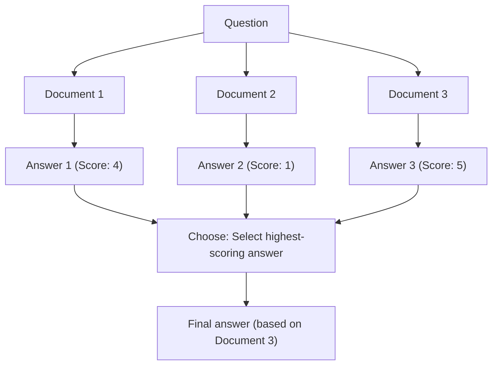

# Chapter 08: SiteGPT

## Learning Objectives

By the end of this chapter, you will be able to:

- Use **SitemapLoader** to automatically collect all pages from a website
- Use the **parse_page** function to remove unnecessary elements from HTML and extract clean text
- Understand and implement the **Map Re-Rank chain** pattern
- Build a pipeline that generates answers from multiple documents, scores them, and selects the optimal answer

---

## Core Concepts

### What is SiteGPT?

SiteGPT is a chatbot that reads a website's sitemap.xml to collect all pages and answers user questions based on the content of that website.

```mermaid
flowchart LR
    A[User: Enter Sitemap URL] --> B[Collect pages with SitemapLoader]
    B --> C[Clean text with parse_page]
    C --> D[Text splitting + FAISS vector store]
    D --> E[User question]
    E --> F[Retrieve relevant documents]
    F --> G[Generate answer + score for each document]
    G --> H[Select highest-scoring answer]
    H --> I[Output final answer]
```



### Map Re-Rank Pattern

The core of this chapter is the **Map Re-Rank** pattern. The typical Stuff approach puts all documents into a single prompt, but Map Re-Rank generates answers independently for each document and then selects the optimal answer based on scores.



---

## Code Walkthrough by Commit

### 8.1 AsyncChromiumLoader

**Commit:** `d07cd31`

In the first step, we set up the basic structure for website loading. We import `SitemapLoader` and create a UI in the Streamlit sidebar for URL input.

```python
from langchain_community.document_loaders import SitemapLoader

st.set_page_config(
    page_title="SiteGPT",
    page_icon="🖥️",
)

with st.sidebar:
    url = st.text_input(
        "Write down a URL",
        placeholder="https://example.com",
    )

if url:
    loader = SitemapLoader(url)
    docs = loader.load()
    st.write(docs)
```

> **Note:** The course also introduces `AsyncChromiumLoader`, but the final code only uses `SitemapLoader`. `AsyncChromiumLoader` is useful for fetching JavaScript-rendered pages, but the sitemap-based approach is more efficient.

### 8.2 SitemapLoader

**Commit:** `8aa9ee4`

This is where we build the full pipeline. We set up the LLM, prompts, vector store, and chains.

**answers_prompt** - A prompt that generates an answer and score for each document:

```python
answers_prompt = ChatPromptTemplate.from_template(
    """
    Using ONLY the following context answer the user's question. If you can't just say you don't know, don't make anything up.

    Then, give a score to the answer between 0 and 5.
    ...
    Context: {context}
    ...
    Question: {question}
"""
)
```

**get_answers** function - Generates answers independently for each document:

```python
def get_answers(inputs):
    docs = inputs["docs"]
    question = inputs["question"]
    answers_chain = answers_prompt | llm
    return {
        "question": question,
        "answers": [
            {
                "answer": answers_chain.invoke(
                    {"question": question, "context": doc.page_content}
                ).content,
                "source": doc.metadata["source"],
                "date": doc.metadata["lastmod"],
            }
            for doc in docs
        ],
    }
```

Key points:
- The LLM is called **individually** for each document (`doc`)
- The **source** and **date** metadata are preserved alongside each answer

**choose_prompt** and **choose_answer** - Selects the optimal answer from multiple candidates:

```python
choose_prompt = ChatPromptTemplate.from_messages(
    [
        (
            "system",
            """
            Use ONLY the following pre-existing answers to answer the user's question.
            Use the answers that have the highest score (more helpful) and favor the most recent ones.
            Cite sources and return the sources of the answers as they are, do not change them.
            Answers: {answers}
            """,
        ),
        ("human", "{question}"),
    ]
)
```

### 8.3 Parsing Function

**Commit:** `ddd4a94`

Adds a parsing function that removes unnecessary header/footer elements from the web page HTML:

```python
def parse_page(soup):
    header = soup.find("header")
    footer = soup.find("footer")
    if header:
        header.decompose()
    if footer:
        footer.decompose()
    return (
        str(soup.get_text())
        .replace("\n", " ")
        .replace("\xa0", " ")
        .replace("CloseSearch Submit Blog", "")
    )
```

This function is passed as the `parsing_function` parameter to `SitemapLoader`:

```python
loader = SitemapLoader(
    url,
    parsing_function=parse_page,
)
```

**Why is parsing necessary?**
- Web pages contain many elements irrelevant to question answering, such as navigation, footers, and ads
- Removing this noise improves the accuracy of vector search
- Special characters like `\xa0` (non-breaking space) are also cleaned up

### 8.4~8.5 Map Re-Rank Chain

**Commit:** `dc95d87`, `f6d9a02`

The full chain is connected using LCEL:

```python
chain = (
    {
        "docs": retriever,
        "question": RunnablePassthrough(),
    }
    | RunnableLambda(get_answers)
    | RunnableLambda(choose_answer)
)
result = chain.invoke(query)
```

**Execution flow:**

1. The `retriever` searches for documents relevant to the question
2. `RunnablePassthrough()` passes the original question through as-is
3. `get_answers` generates an answer + score for each document
4. `choose_answer` selects the highest-scoring answer to produce the final response

### 8.6 Code Challenge

**Commit:** `a450edf`

Adds caching for website loading with `@st.cache_data` and `.xml` extension validation:

```python
@st.cache_data(show_spinner="Loading website...")
def load_website(url):
    splitter = RecursiveCharacterTextSplitter.from_tiktoken_encoder(
        chunk_size=1000,
        chunk_overlap=200,
    )
    loader = SitemapLoader(
        url,
        parsing_function=parse_page,
    )
    loader.requests_per_second = 2
    docs = loader.load_and_split(text_splitter=splitter)
    vector_store = FAISS.from_documents(docs, OpenAIEmbeddings(...))
    return vector_store.as_retriever()
```

- `requests_per_second = 2`: Limits the request rate to avoid overloading the server
- `@st.cache_data`: Prevents repeated loading for the same URL

---

## Comparison: Previous Approach vs Current Approach

| Category | Stuff Approach (Chapter 04) | Map Re-Rank Approach (Chapter 08) |
|----------|---------------------------|----------------------------------|
| **Document handling** | Puts all documents into a single prompt | Calls LLM individually for each document |
| **Context window** | Exceeds token limit with many documents | No limit due to independent per-document processing |
| **Answer quality** | Irrelevant documents act as noise | Selects optimal answer based on scores |
| **Source tracking** | Difficult | Maintains source/date metadata per answer |
| **Cost** | 1 LLM call | N+1 LLM calls (number of documents + selection) |
| **Data source** | File upload | Website sitemap |

---

## Practice Exercises

### Exercise 1: Add Filtering

Use the `filter_urls` parameter of `SitemapLoader` to load only pages from specific paths.

```python
# Hint: You can pass a list of regular expressions to filter_urls
loader = SitemapLoader(
    url,
    parsing_function=parse_page,
    filter_urls=["https://example.com/blog/.*"],  # Load only blog pages
)
```

### Exercise 2: Display Answer Scores

Currently, only the final answer is displayed. Add a feature to show each document's answer and score in the Streamlit UI using the results from `get_answers`. You can use `st.expander` for a clean presentation.

---

## Next Chapter Preview

In **Chapter 09: MeetingGPT**, we will build an application that extracts audio from video files, converts it to text using OpenAI Whisper, and summarizes long meeting transcripts using the **Refine Chain** pattern. You will learn how to combine multimedia processing tools like ffmpeg and pydub with LangChain.
