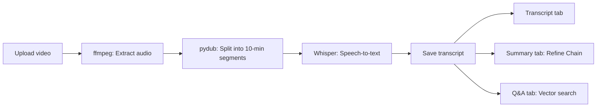
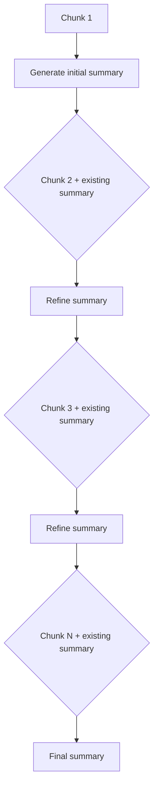

# Chapter 09: MeetingGPT

## Learning Objectives

By the end of this chapter, you will be able to:

- Use **ffmpeg** to extract audio from video files
- Use **pydub** to split long audio files into fixed-size chunks (Python 3.13+ compatible)
- Use the **OpenAI Whisper API** to convert audio to text (STT)
- Understand the **Refine Chain** pattern and progressively summarize long documents
- Use Streamlit's **Tabs** UI to separate transcript, summary, and Q&A functionality

---

## Core Concepts

### MeetingGPT Pipeline

MeetingGPT is an application that automatically provides text transcription, summarization, and Q&A when a meeting video is uploaded.



### Refine Chain Pattern

The Refine Chain is an approach that processes documents sequentially while **progressively improving** the summary. Unlike MapReduce, it preserves the context of previous summaries while incorporating new information.



---

## Code Walkthrough by Commit

### 9.1 Audio Extraction

**Commit:** `ae4f7f4`

Adds the basic Streamlit page configuration. At this stage, only the UI shell is created without any functionality.

```python
st.set_page_config(
    page_title="MeetingGPT",
    page_icon="💼",
)
```

### 9.2 Cutting The Audio

**Commit:** `10efbea`

Implements a function to extract audio from video using `ffmpeg`:

```python
def extract_audio_from_video(video_path):
    if has_transcript:
        return
    audio_path = video_path.replace("mp4", "mp3")
    command = [
        "ffmpeg",
        "-y",        # Overwrite existing file
        "-i",        # Input file
        video_path,
        "-vn",       # Remove video stream (extract audio only)
        audio_path,
    ]
    subprocess.run(command)
```

**ffmpeg option descriptions:**
- `-y`: Overwrites the output file if it already exists
- `-i`: Specifies the input file path
- `-vn`: Excludes the video stream and outputs only the audio

Then splits the audio into 10-minute segments using `pydub`:

```python
def cut_audio_in_chunks(audio_path, chunk_size, chunks_folder):
    if has_transcript:
        return
    track = AudioSegment.from_mp3(audio_path)
    chunk_len = chunk_size * 60 * 1000  # Convert minutes to milliseconds
    chunks = math.ceil(len(track) / chunk_len)
    for i in range(chunks):
        start_time = i * chunk_len
        end_time = (i + 1) * chunk_len
        chunk = track[start_time:end_time]
        chunk.export(
            f"./{chunks_folder}/chunk_{i}.mp3",
            format="mp3",
        )
```

**Why split the audio?**
- The Whisper API can only process audio files up to **25MB**
- Long meeting videos exceed this limit, so they are split into 10-minute segments for processing

**Python 3.13+ compatibility note:**

Starting with Python 3.13, the `audioop` module was removed from the standard library. Since `pydub` internally depends on `audioop`, you must additionally install the **`audioop-lts`** package on Python 3.13 and above:

```bash
pip install pydub audioop-lts
```

`audioop-lts` provides the removed `audioop` module as a third-party package, maintaining compatibility with `pydub`. Make sure to include it in your project's `requirements.txt`:

```
pydub
audioop-lts    # Required for Python 3.13+
```

> **Note:** On Python 3.12 and below, `audioop` is built-in, so it works without `audioop-lts`. However, it is recommended to add it in advance for future compatibility.

### 9.3 Whisper Transcript

**Commit:** `585ae23`

Converts the split audio chunks to text using the OpenAI Whisper API:

```python
openai_client = OpenAI(
    base_url=os.getenv("OPENAI_BASE_URL"),
    api_key=os.getenv("OPENAI_API_KEY"),
)

@st.cache_data()
def transcribe_chunks(chunk_folder, destination):
    if has_transcript:
        return
    files = glob.glob(f"{chunk_folder}/*.mp3")
    files.sort()
    for file in files:
        with open(file, "rb") as audio_file, open(destination, "a") as text_file:
            transcript = openai_client.audio.transcriptions.create(
                model="whisper-1",
                file=audio_file,
            )
            text_file.write(transcript.text)
```

Key points:
- `glob.glob` finds the chunk files and `sort()` ensures correct ordering
- The file is opened in `"a"` mode to **append** each chunk's text
- The `has_transcript` flag prevents redundant processing when transcription has already been done

### 9.4 Recap

**Commit:** `15f2321`

An intermediate review step.

### 9.5 Upload UI

**Commit:** `3034ee5`

Sets up the Streamlit file uploader, status display, and tab UI:

```python
with st.sidebar:
    video = st.file_uploader(
        "Video",
        type=["mp4", "avi", "mkv", "mov"],
    )

if video:
    chunks_folder = "./.cache/chunks"
    with st.status("Loading video...") as status:
        video_content = video.read()
        video_path = f"./.cache/{video.name}"
        audio_path = video_path.replace("mp4", "mp3")
        transcript_path = video_path.replace("mp4", "txt")
        with open(video_path, "wb") as f:
            f.write(video_content)
        status.update(label="Extracting audio...")
        extract_audio_from_video(video_path)
        status.update(label="Cutting audio segments...")
        cut_audio_in_chunks(audio_path, 10, chunks_folder)
        status.update(label="Transcribing audio...")
        transcribe_chunks(chunks_folder, transcript_path)

    transcript_tab, summary_tab, qa_tab = st.tabs(
        ["Transcript", "Summary", "Q&A"]
    )
```

- `st.status` is a container that shows progress in real time
- `st.tabs` creates three tabs (Transcript, Summary, Q&A)

### 9.6~9.7 Refine Chain

**Commit:** `0b74530`, `c761f3e`

This is the core implementation of the Refine Chain. It uses two prompts:

**Step 1 - Initial summary for the first chunk:**

```python
first_summary_prompt = ChatPromptTemplate.from_template(
    """
    Write a concise summary of the following:
    "{text}"
    CONCISE SUMMARY:
"""
)

first_summary_chain = first_summary_prompt | llm | StrOutputParser()

summary = first_summary_chain.invoke(
    {"text": docs[0].page_content},
)
```

**Step 2 - Progressively refine the summary with remaining chunks:**

```python
refine_prompt = ChatPromptTemplate.from_template(
    """
    Your job is to produce a final summary.
    We have provided an existing summary up to a certain point: {existing_summary}
    We have the opportunity to refine the existing summary (only if needed) with some more context below.
    ------------
    {context}
    ------------
    Given the new context, refine the original summary.
    If the context isn't useful, RETURN the original summary.
    """
)

refine_chain = refine_prompt | llm | StrOutputParser()

with st.status("Summarizing...") as status:
    for i, doc in enumerate(docs[1:]):
        status.update(label=f"Processing document {i+1}/{len(docs)-1} ")
        summary = refine_chain.invoke(
            {
                "existing_summary": summary,
                "context": doc.page_content,
            }
        )
        st.write(summary)
st.write(summary)
```

**How the Refine Chain works:**
1. An initial summary is generated from the first document
2. From the second document onward, `existing_summary` (the current summary) and `context` (the new document) are passed together
3. The LLM improves the summary if the new information is useful; otherwise, it keeps the existing summary
4. After iterating through all documents, the final summary is complete

### 9.8 Q&A Tab

**Commit:** `662a528`

The Q&A tab is left as an implementation exercise in this code. You can implement the functionality of storing the transcript in a vector store and performing Q&A using the RAG pattern learned in Chapter 04.

---

## Comparison: Previous Approach vs Current Approach

| Category | MapReduce (Chapter 04) | Refine (Chapter 09) |
|----------|----------------------|---------------------|
| **Processing method** | Summarizes each chunk in parallel, then combines | Improves summary sequentially |
| **Context retention** | Context is disconnected between chunks | Preserves context from previous summary |
| **Processing speed** | Parallel processing possible, fast | Sequential processing, slow |
| **Summary quality** | May have duplications/omissions | High quality through progressive refinement |
| **Best suited for** | Independent document collections | Continuous text (meeting transcripts, etc.) |
| **LLM calls** | N+1 (N summaries + 1 combination) | N (1 initial + N-1 refinements) |

---

## Practice Exercises

### Exercise 1: Implement Q&A Tab

Load the transcript file with `TextLoader`, store it in a FAISS vector store, and implement Q&A functionality that answers user questions.

```python
# Hint: Use the RAG pattern from Chapter 04
with qa_tab:
    question = st.text_input("Ask a question about the meeting.")
    if question:
        loader = TextLoader(transcript_path)
        docs = loader.load_and_split(text_splitter=splitter)
        vector_store = FAISS.from_documents(docs, embeddings)
        # Create a retriever and build the chain
```

### Exercise 2: Cache Summary Results

Currently, the summary is regenerated every time the "Generate summary" button is pressed. Use `st.session_state` to cache the generated summary and avoid regeneration for the same video.

---

## Next Chapter Preview

In **Chapter 10: Agents**, we will learn about the **Agent** concept where LLMs autonomously select and execute tools. We will create tools such as DuckDuckGo search and the Alpha Vantage stock API, and implement InvestorGPT where the LLM autonomously decides which tools to call.
