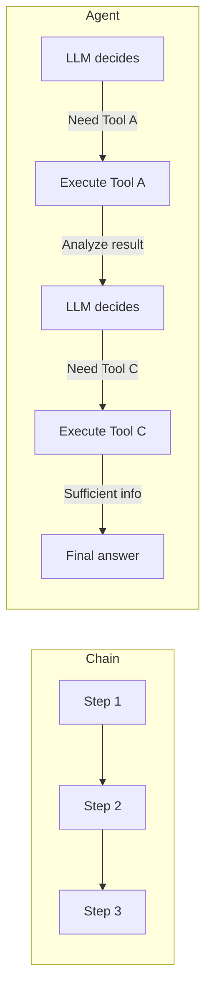

# Chapter 10: Agents

## Learning Objectives

By the end of this chapter, you will be able to:

- Understand the concept of an **Agent** and how it differs from a regular chain
- Use `initialize_agent` with various **AgentTypes**
- Create custom tools by inheriting from **BaseTool**
- Integrate external services such as DuckDuckGo search and Alpha Vantage API as tools
- Set an agent's persona using **system messages**

---

## Core Concepts

### What is an Agent?

All the chains we have built so far had a **predetermined** execution order. Agents are different. The LLM analyzes the user's question and **decides on its own which tools to call and in what order**.

```mermaid
flowchart TB
    U[User: "Should I buy Apple stock?"] --> A[Agent: Analyze question]
    A --> T1["1. StockMarketSymbolSearchTool → AAPL"]
    T1 --> T2["2. CompanyOverview → Financial overview"]
    T2 --> T3["3. CompanyIncomeStatement → Income statement"]
    T3 --> T4["4. CompanyStockPerformance → Stock price trend"]
    T4 --> F[Agent: Comprehensive assessment and response]
```

### Agent vs Chain



### AgentType Comparison

| AgentType | Characteristics |
|-----------|----------------|
| `STRUCTURED_CHAT_ZERO_SHOT_REACT_DESCRIPTION` | ReAct pattern, supports multi-argument tools |
| `OPENAI_FUNCTIONS` | Leverages OpenAI Function Calling, most stable |

---

## Code Walkthrough by Commit

### 10.1 Your First Agent

**Commit:** `f504c4d`

We create the simplest possible agent in a notebook. We register an addition function as a tool and have the agent use it:

```python
from langchain_openai import ChatOpenAI
from langchain_core.tools import StructuredTool
from langchain_classic.agents import initialize_agent, AgentType

llm = ChatOpenAI(
    base_url=os.getenv("OPENAI_BASE_URL"),
    api_key=os.getenv("OPENAI_API_KEY"),
    model="gpt-5.1",
    temperature=0.1,
)


def plus(a, b):
    return a + b


agent = initialize_agent(
    llm=llm,
    verbose=True,
    agent=AgentType.STRUCTURED_CHAT_ZERO_SHOT_REACT_DESCRIPTION,
    tools=[
        StructuredTool.from_function(
            func=plus,
            name="Sum Calculator",
            description="Use this to perform sums of two numbers. This tool take two arguments, both should be numbers.",
        ),
    ],
)

prompt = "Cost of $355.39 + $924.87 + $721.2 + $1940.29 + $573.63 + $65.72 + $35.00 + $552.00 + $76.16 + $29.12"

agent.invoke(prompt)
```

Key points:
- `StructuredTool.from_function` converts a regular Python function into a tool
- The `description` is very important. The LLM reads this description to decide which tool to use
- `verbose=True` allows you to observe the agent's reasoning process

### 10.3 Zero-shot ReAct Agent

**Commit:** `c15fd71`

This is an agent that uses the **ReAct (Reasoning + Acting)** pattern. The LLM repeats cycles of "Thought -> Action -> Observation."

```
Thought: The user is asking for the sum of multiple numbers. I need to use the Sum Calculator.
Action: Sum Calculator
Action Input: {"a": 355.39, "b": 924.87}
Observation: 1280.26
Thought: I still need to add the remaining numbers...
```

### 10.4 OpenAI Functions Agent

**Commit:** `0402758`

Using `AgentType.OPENAI_FUNCTIONS` leverages OpenAI's Function Calling capability. It is more stable and accurate than ReAct.

### 10.5 Search Tool

**Commit:** `46ea170`

We create a DuckDuckGo search tool. From this point on, we use the **BaseTool class inheritance** approach:

```python
from langchain_core.tools import BaseTool
from pydantic import BaseModel, Field
from langchain_community.utilities import DuckDuckGoSearchAPIWrapper


class StockMarketSymbolSearchToolArgsSchema(BaseModel):
    query: str = Field(
        description="The query you will search for. Example query: Stock Market Symbol for Apple Company"
    )


class StockMarketSymbolSearchTool(BaseTool):
    name: str = "StockMarketSymbolSearchTool"
    description: str = """
    Use this tool to find the stock market symbol for a company.
    It takes a query as an argument.
    """
    args_schema: Type[
        StockMarketSymbolSearchToolArgsSchema
    ] = StockMarketSymbolSearchToolArgsSchema

    def _run(self, query):
        ddg = DuckDuckGoSearchAPIWrapper()
        return ddg.run(query)
```

**Why inherit from BaseTool:**
- `args_schema` lets you define input parameters as a Pydantic model
- `description` provides a detailed explanation of the tool's purpose
- The `_run` method contains the actual logic
- The LLM reads `Field(description=...)` to understand what values to pass

### 10.6 Stock Information Tools

**Commit:** `3fa82c9`

We create three financial tools using the Alpha Vantage API:

```python
class CompanyOverviewTool(BaseTool):
    name: str = "CompanyOverview"
    description: str = """
    Use this to get an overview of the financials of the company.
    You should enter a stock symbol.
    """
    args_schema: Type[CompanyOverviewArgsSchema] = CompanyOverviewArgsSchema

    def _run(self, symbol):
        r = requests.get(
            f"https://www.alphavantage.co/query?function=OVERVIEW&symbol={symbol}&apikey={alpha_vantage_api_key}"
        )
        return r.json()


class CompanyIncomeStatementTool(BaseTool):
    name: str = "CompanyIncomeStatement"
    description: str = """
    Use this to get the income statement of a company.
    You should enter a stock symbol.
    """
    args_schema: Type[CompanyOverviewArgsSchema] = CompanyOverviewArgsSchema

    def _run(self, symbol):
        r = requests.get(
            f"https://www.alphavantage.co/query?function=INCOME_STATEMENT&symbol={symbol}&apikey={alpha_vantage_api_key}"
        )
        return r.json()["annualReports"]


class CompanyStockPerformanceTool(BaseTool):
    name: str = "CompanyStockPerformance"
    description: str = """
    Use this to get the weekly performance of a company stock.
    You should enter a stock symbol.
    """
    args_schema: Type[CompanyOverviewArgsSchema] = CompanyOverviewArgsSchema

    def _run(self, symbol):
        r = requests.get(
            f"https://www.alphavantage.co/query?function=TIME_SERIES_WEEKLY&symbol={symbol}&apikey={alpha_vantage_api_key}"
        )
        response = r.json()
        return list(response["Weekly Time Series"].items())[:200]
```

**Roles of the three tools:**

| Tool | API Function | Returned Data |
|------|-------------|---------------|
| `CompanyOverview` | `OVERVIEW` | Financial overview including market cap, P/E ratio, dividend yield, etc. |
| `CompanyIncomeStatement` | `INCOME_STATEMENT` | Income statement including revenue, operating profit, etc. |
| `CompanyStockPerformance` | `TIME_SERIES_WEEKLY` | Stock price data for the most recent 200 weeks |

> **Note:** All three tools use the same `CompanyOverviewArgsSchema`. This is because the input for all of them is a single `symbol` (stock symbol).

### 10.7 Agent Prompt

**Commit:** `102aaf3`

We set a **system message** for the agent, giving it a "hedge fund manager" persona:

```python
agent = initialize_agent(
    llm=llm,
    verbose=True,
    agent=AgentType.OPENAI_FUNCTIONS,
    handle_parsing_errors=True,
    tools=[
        CompanyIncomeStatementTool(),
        CompanyStockPerformanceTool(),
        StockMarketSymbolSearchTool(),
        CompanyOverviewTool(),
    ],
    agent_kwargs={
        "system_message": SystemMessage(
            content="""
            You are a hedge fund manager.

            You evaluate a company and provide your opinion and reasons why the stock is a buy or not.

            Consider the performance of a stock, the company overview and the income statement.

            Be assertive in your judgement and recommend the stock or advise the user against it.
        """
        )
    },
)
```

Key parameters:
- `handle_parsing_errors=True`: Automatically retries when LLM output parsing errors occur
- `agent_kwargs["system_message"]`: Sets the agent's role and behavioral guidelines
- The system message instructs to "consider stock performance, company overview, and income statement," encouraging the agent to utilize all available tools

### 10.8 SQLDatabaseToolkit

**Commit:** `4d75579`

The course also introduces `SQLDatabaseToolkit`. Using this tool, the agent can directly query SQL databases. It is a powerful feature that converts natural language questions into SQL queries and executes them.

### 10.9 Conclusions

**Commit:** `9a99520`

Completes the Streamlit UI:

```python
st.set_page_config(
    page_title="InvestorGPT",
    page_icon="💼",
)

company = st.text_input("Write the name of the company you are interested on.")

if company:
    result = agent.invoke(company)
    st.write(result["output"].replace("$", "\$"))
```

> **Note:** The `$` symbol is escaped as `\$`. This is because Streamlit's markdown renderer interprets `$...$` as LaTeX math expressions.

---

## Comparison: Previous Approach vs Current Approach

| Category | Chain (Previous chapters) | Agent (Chapter 10) |
|----------|--------------------------|-------------------|
| **Execution flow** | Predefined by the developer | Decided by LLM at runtime |
| **Tool selection** | Hard-coded in the code | LLM chooses based on context |
| **Flexibility** | Low (fixed pipeline) | High (dynamic decision-making) |
| **Predictability** | High | Low (same input may follow different paths) |
| **Debugging** | Easy | Difficult (`verbose=True` required) |
| **Tool definition** | Not required | Inherit `BaseTool` or use `StructuredTool` |
| **Best suited for** | Fixed workflows | Exploratory/complex questions |

---

## Practice Exercises

### Exercise 1: Add a Custom Tool

Create a `CompanyNewsSearchTool` and add it to the agent. This tool uses DuckDuckGo search to find recent news about the given company.

```python
# Hint
class CompanyNewsSearchTool(BaseTool):
    name: str = "CompanyNewsSearch"
    description: str = """
    Use this to search for recent news about a company.
    You should enter the company name.
    """
    # Implement args_schema and the _run method
```

### Exercise 2: Change the Agent Persona

Modify the system message to change the persona to a "conservative personal investment advisor." Write a prompt that emphasizes risk, recommends diversification, and provides advice from a long-term investment perspective.

---

## Next Chapter Preview

In **Chapter 11: FastAPI & GPT Actions**, we will turn our LangChain application into an API server using **FastAPI** and integrate it so that GPT can directly call our server's API through ChatGPT's **GPT Actions** feature. We will also cover the Pinecone vector database and OAuth authentication.
