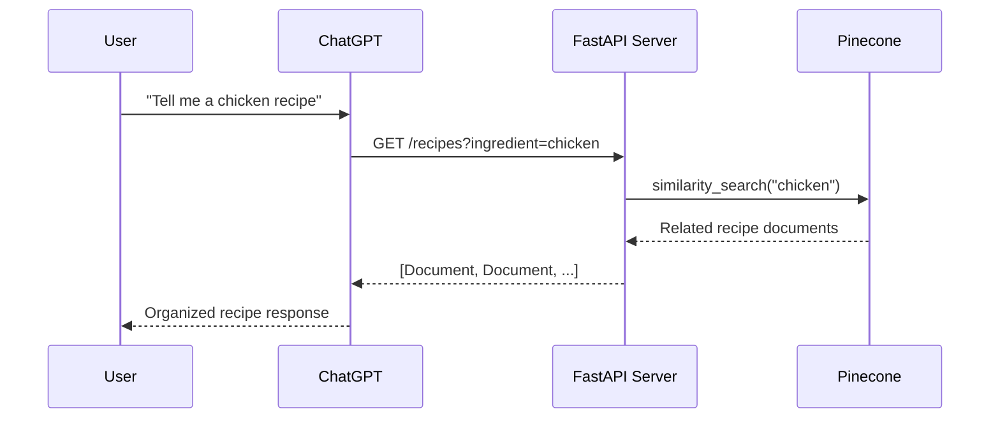

# Chapter 11: FastAPI & GPT Actions

## Learning Objectives

- Build a REST API server using FastAPI
- Configure ChatGPT to call external APIs through GPT Actions
- Implement API Key authentication and OAuth authentication flows
- Create a similarity search API by integrating a Pinecone vector store

---

## Core Concepts

### What are GPT Actions?

GPT Actions is a feature that allows ChatGPT to call external APIs. When a user asks ChatGPT a question, ChatGPT calls the API we built and generates a response based on the results.



### Authentication Method Comparison

```mermaid
graph LR
    subgraph "API Key Auth"
        A[GPT] -->|Header: X-API-Key| B[FastAPI]
    end
    subgraph "OAuth Auth"
        C[GPT] -->|1. authorize request| D[Login page]
        D -->|2. return code| C
        C -->|3. request token with code| E[/token endpoint]
        E -->|4. return access_token| C
        C -->|5. call API with Bearer token| F[FastAPI]
    end
```

---

## Code Walkthrough by Commit

### 11.2 FastAPI Server (`574eee9`)

In the first step, we create a basic FastAPI app.

```python
from fastapi import FastAPI
from pydantic import BaseModel

app = FastAPI(
    title="ChefGPT. The best provider of Indian Recipes in the world.",
    description="Give ChefGPT the name of an ingredient and it will give you multiple recipes to use that ingredient on in return.",
    servers=[
        {
            "url": "https://example.trycloudflare.com",
        },
    ],
)
```

**Key points:**

- `title` and `description` are used by GPT to understand the purpose of this API
- `servers` is set to an externally accessible URL (using Cloudflare Tunnel, etc.)

We define the response format using a Pydantic model:

```python
class Document(BaseModel):
    page_content: str
```

Detailed metadata required for GPT Actions is added to the endpoints:

```python
@app.get(
    "/recipes",
    summary="Returns a list of recipes.",
    description="Upon receiving an ingredient, this endpoint will return a list of recipes that contain that ingredient.",
    response_description="A Document object that contains the recipe and preparation instructions",
    response_model=list[Document],
    openapi_extra={
        "x-openai-isConsequential": False,
    },
)
def get_recipe(ingredient: str):
    return [
        Document(page_content=f"Recipe for {ingredient}: coming soon..."),
    ]
```

`x-openai-isConsequential: False` means GPT can call the API without user confirmation.

**Running the server:**

```bash
uvicorn main:app --reload
```

### 11.3 GPT Action (`4d926fb`)

By pasting the OpenAPI spec auto-generated by FastAPI (`/openapi.json`) into the ChatGPT GPT Actions settings, ChatGPT becomes able to call our API.

**GPT Actions setup steps:**

1. Create a GPT in ChatGPT (Create a GPT)
2. Configure > Actions > Create new action
3. Paste the `/openapi.json` content into the Schema field
4. Verify that the server URL is externally accessible

### 11.5 API Key Auth (`2737111`)

API Key authentication is the simplest authentication method. When you register an API Key in the GPT Actions settings, ChatGPT includes that key in the header with every request.

In the GPT Actions settings:
- Authentication Type: API Key
- API Key: Enter the actual key value
- Auth Type: Custom Header or Bearer

### 11.6 OAuth (`0649030`)

The OAuth flow is used when per-user authentication is required. Two endpoints are needed:

```python
@app.get(
    "/authorize",
    response_class=HTMLResponse,
    include_in_schema=False,
)
def handle_authorize(client_id: str, redirect_uri: str, state: str):
    return f"""
    <html>
        <head>
            <title>Nicolacus Maximus Log In</title>
        </head>
        <body>
            <h1>Log Into Nicolacus Maximus</h1>
            <a href="{redirect_uri}?code=ABCDEF&state={state}">Authorize Nicolacus Maximus GPT</a>
        </body>
    </html>
    """
```

- `/authorize`: Displays a login page to the user
- Returns an authorization code (`code`) and `state` via the `redirect_uri`
- `include_in_schema=False` excludes it from the OpenAPI spec (this endpoint should not be called directly by GPT)

```python
@app.post(
    "/token",
    include_in_schema=False,
)
def handle_token(code=Form(...)):
    return {
        "access_token": user_token_db[code],
    }
```

- `/token`: Receives an authorization code and issues an access_token
- `Form(...)` handles the request in form-data format

### 11.8 Pinecone (`fbe45e3`)

Integrates the Pinecone vector store to enable searching for actual recipe data:

```python
from dotenv import load_dotenv
import os

load_dotenv()

from pinecone import Pinecone
from langchain_openai import OpenAIEmbeddings
from langchain_pinecone import PineconeVectorStore

pc = Pinecone(api_key=os.getenv("PINECONE_API_KEY"))

embeddings = OpenAIEmbeddings(
    base_url=os.getenv("OPENAI_EMBEDDING_BASE_URL"),
    api_key=os.getenv("OPENAI_API_KEY"),
    model=os.getenv("OPENAI_EMBEDDING_MODEL"),
)

vector_store = PineconeVectorStore.from_existing_index(
    "recipes",
    embeddings,
)
```

**Key points:**

- The `Pinecone` client connects to the Pinecone service
- `OpenAIEmbeddings` converts text into vectors
- `PineconeVectorStore.from_existing_index` connects to an already created index

### 11.9 Chef API (`746afa2`)

Finally, the endpoint performs actual vector search:

```python
def get_recipe(ingredient: str):
    docs = vector_store.similarity_search(ingredient)
    return docs
```

Instead of dummy data, `similarity_search` is used to search for and return actually similar recipes.

---

## Previous Approach vs Current Approach

| Item | Previous Approach (Plugins) | Current Approach (GPT Actions) |
|------|---------------------------|-------------------------------|
| Configuration | Plugin manifest + OpenAPI | Add Action in GPT Builder |
| Authentication | Plugin-specific OAuth | Standard OAuth / API Key |
| Deployment | Plugin Store review required | Simple deployment via GPT sharing |
| API spec | `.well-known/ai-plugin.json` required | Only OpenAPI spec needed |
| Accessibility | ChatGPT Plus only | Accessible via GPT share link |

---

## Practice Exercises

### Exercise 1: Build a Weather API Server

Create an API that returns weather information using FastAPI.

**Requirements:**

1. Implement a `GET /weather?city=Seoul` endpoint
2. Define the response format with a Pydantic model (city name, temperature, weather condition)
3. Set `x-openai-isConsequential: False`
4. Write `summary` and `description` suitable for GPT Actions

### Exercise 2: Add OAuth Authentication

Add OAuth authentication to the API from Exercise 1.

**Requirements:**

1. `/authorize` endpoint (returns a login page)
2. `/token` endpoint (issues an access_token)
3. Set `include_in_schema=False` for both endpoints

---

## Next Chapter Preview

In the next chapter, we will learn about OpenAI's **Assistants API**. The Assistants API manages stateful conversations (Threads), provides built-in tools like file_search, and supports custom function calls. We will learn how to embed ChatGPT's capabilities directly into our applications.
