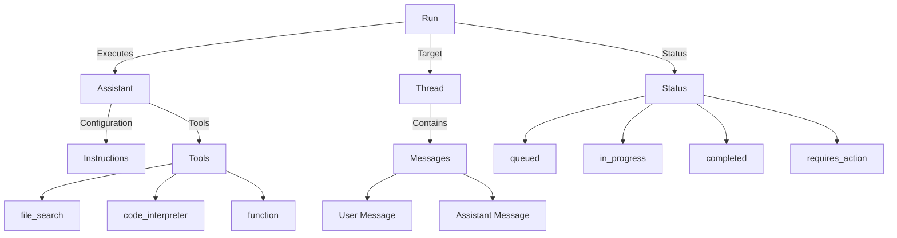
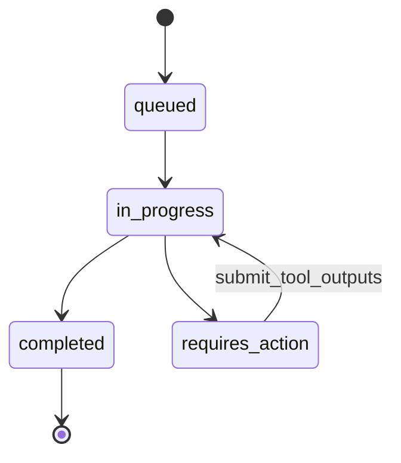

# Chapter 12: Assistants API

## Learning Objectives

- Understand the core concepts of the OpenAI Assistants API (Assistant, Thread, Run)
- Build a RAG-based assistant using the `file_search` tool
- Implement stateful conversations through Threads
- Integrate custom functions with an assistant by submitting tool outputs

---

## Core Concepts

### Assistants API Architecture



### Run Lifecycle



**Core Concepts Summary:**

| Concept | Description |
|---------|-------------|
| **Assistant** | A configuration object that bundles a model, instructions, and tools |
| **Thread** | A container that stores conversation history (maintains state) |
| **Message** | An individual message within a Thread (user / assistant) |
| **Run** | A unit of execution that runs an Assistant on a Thread |
| **Tool** | A tool the Assistant can use (file_search, function, etc.) |

---

## Code Walkthrough by Commit

### 12.2 Creating The Assistant (`b383cf8`)

Initialize the OpenAI client and create an Assistant:

```python
from openai import OpenAI

client = OpenAI(
    base_url=os.getenv("OPENAI_BASE_URL"),
    api_key=os.getenv("OPENAI_API_KEY"),
)

assistant = client.beta.assistants.create(
    name="Book Assistant",
    instructions="You help users with their question on the files they upload.",
    model="gpt-5.1",
    tools=[{"type": "file_search"}],
)
assistant_id = assistant.id
```

**Key Points:**

- Create an Assistant with `client.beta.assistants.create` (uses the beta namespace)
- `name`: The name of the assistant
- `instructions`: Directives that serve as the system prompt
- `tools`: List of tools to use. `file_search` is a built-in tool that searches file contents
- After creation, save the `assistant_id` for reuse

### 12.3 Assistant Tools (`8d4ee27`)

Create a Thread and set initial messages:

```python
thread = client.beta.threads.create(
    messages=[
        {
            "role": "user",
            "content": "I want you to help me with this file",
        }
    ]
)
```

Upload a file and attach it to a message:

```python
file = client.files.create(
    file=open("./files/chapter_one.txt", "rb"), purpose="assistants"
)

client.beta.threads.messages.create(
    thread_id=thread.id,
    role="user",
    content="Please analyze this file.",
    attachments=[{"file_id": file.id, "tools": [{"type": "file_search"}]}],
)
```

**Key Points:**

- Upload a file with `client.files.create` (`purpose="assistants"`)
- Attach the file to a message using `attachments`
- Specifying `file_search` in `tools` when attaching includes that file in the search scope

### 12.4 Running A Thread (`6801466`)

Create a Run to have the Assistant process messages in the Thread:

```python
run = client.beta.threads.runs.create(
    thread_id=thread.id,
    assistant_id=assistant_id,
)
```

Define helper functions to check the Run's status:

```python
def get_run(run_id, thread_id):
    return client.beta.threads.runs.retrieve(
        run_id=run_id,
        thread_id=thread_id,
    )

def send_message(thread_id, content):
    return client.beta.threads.messages.create(
        thread_id=thread_id, role="user", content=content
    )

def get_messages(thread_id):
    messages = client.beta.threads.messages.list(thread_id=thread_id)
    messages = list(messages)
    messages.reverse()
    for message in messages:
        print(f"{message.role}: {message.content[0].text.value}")
```

**Key Points:**

- Runs execute asynchronously. You need to poll the status using `get_run`
- Once the `status` becomes `completed`, you can check the results
- `get_messages` prints the entire conversation history in chronological order

### 12.5 Assistant Actions (`5153705`)

When a Run enters the `requires_action` state, you must submit the results of custom functions:

```python
def get_tool_outputs(run_id, thread_id):
    run = get_run(run_id, thread_id)
    outputs = []
    for action in run.required_action.submit_tool_outputs.tool_calls:
        action_id = action.id
        function = action.function
        print(f"Calling function: {function.name} with arg {function.arguments}")
        outputs.append(
            {
                "output": functions_map[function.name](json.loads(function.arguments)),
                "tool_call_id": action_id,
            }
        )
    return outputs

def submit_tool_outputs(run_id, thread_id):
    outputs = get_tool_outputs(run_id, thread_id)
    return client.beta.threads.runs.submit_tool_outputs(
        run_id=run_id,
        thread_id=thread_id,
        tool_outputs=outputs,
    )
```

**Key Points:**

- Retrieve the function call information from `run.required_action.submit_tool_outputs.tool_calls`
- `functions_map` is a dictionary that maps function names to actual Python functions
- Submitting function execution results to OpenAI via `submit_tool_outputs` allows the Run to continue

### 12.8 RAG Assistant (`9b8da4b`)

The final file-based RAG assistant is complete. When a user uploads a file, the `file_search` tool searches the file contents and answers follow-up questions while maintaining conversation context:

```python
send_message(
    thread.id,
    "Where does he work?",
)
```

Since the Thread remembers the previous conversation and file contents, it can determine from context who "he" refers to and provide an appropriate answer.

---

## Previous Approach vs Current Approach

| Aspect | Manual Implementation (LangChain RAG) | Assistants API |
|--------|---------------------------------------|----------------|
| Memory Management | Configure Memory class manually | Thread manages automatically |
| File Search | Set up VectorStore + Retriever | Single line with `file_search` tool |
| Conversation State | Manage per-session memory manually | Automatically maintained via Thread ID |
| Function Calling | LangChain Agent + Tools | `function` tool + tool_outputs |
| Code Execution | Requires separate sandbox | Built-in `code_interpreter` |
| Infrastructure | Operate vector DB yourself | Managed by OpenAI |

---

## Practice Exercises

### Exercise 1: Document QA Assistant

Build an assistant that answers questions from an uploaded PDF file.

**Requirements:**

1. Create an Assistant with the `file_search` tool enabled
2. Upload a PDF file and attach it to a Thread
3. Send 3 or more consecutive questions and verify that conversation context is maintained
4. Print the full conversation history using `get_messages`

### Exercise 2: Automatic Run Status Polling

Implement a polling loop that automatically checks the Run status.

**Requirements:**

```python
import time

def wait_for_run(run_id, thread_id, timeout=60):
    """Implement a function that waits until the Run completes."""
    # 1. Check the status with get_run
    # 2. If completed, return the result
    # 3. If requires_action, submit tool_outputs
    # 4. If failed, print the error
    # 5. Otherwise, wait 2 seconds and check again
    pass
```

---

## Next Chapter Preview

The next chapter covers **Cloud Providers**. You will learn how to integrate not only OpenAI but also AWS Bedrock (Claude models) and Azure OpenAI with LangChain. We will explore how a multi-cloud strategy can optimize costs and improve resilience against outages.
