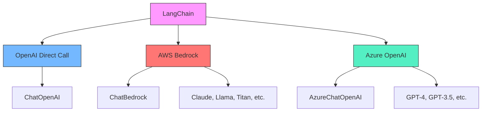
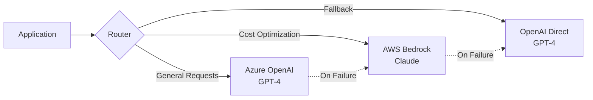

# Chapter 13: Cloud Providers

## Learning Objectives

- Use Anthropic Claude models in LangChain via AWS Bedrock
- Use GPT models in LangChain via Azure OpenAI
- Understand the advantages and considerations of a multi-cloud strategy

---

## Core Concepts

### Cloud LLM Provider Comparison



### Multi-Cloud Architecture



---

## Code Walkthrough by Commit

### 13.3 BedrockChat (`b5665ee`)

AWS Bedrock is a managed AI service provided by AWS that lets you access various AI models (Anthropic Claude, Meta Llama, Amazon Titan, etc.) through a single API.

**Step 1: Create an AWS session with boto3**

```python
import boto3

session = boto3.Session(
    aws_access_key_id=os.getenv("AWS_ACCESS_KEY"),
    aws_secret_access_key=os.getenv("AWS_SECRET_KEY"),
)

bedrock_client = session.client("bedrock-runtime", "us-east-1")
```

- Set up AWS credentials with `boto3.Session`
- Create a `bedrock-runtime` service client in the `us-east-1` region
- Bedrock is not available in all regions, so you need to check supported regions

**Step 2: Build a chain with LangChain ChatBedrock**

```python
from langchain_aws import ChatBedrock
from langchain_core.prompts import ChatPromptTemplate

chat = ChatBedrock(
    client=bedrock_client,
    model_id=os.getenv("AWS_BEDROCK_MODEL_ID", "anthropic.claude-v2"),
    model_kwargs={
        "temperature": 0.1,
    },
)

prompt = ChatPromptTemplate.from_messages(
    [
        (
            "user",
            "Translate this sentence from {lang_a} to {lang_b}: {sentence}",
        ),
    ]
)

chain = prompt | chat

chain.invoke(
    {
        "lang_a": "English",
        "lang_b": "Icelandic",
        "sentence": "I love amazon!",
    }
)
```

**Key Points:**

- Use the `ChatBedrock` class from the `langchain_aws` package
- Specify the Bedrock model ID in `model_id` (e.g., `anthropic.claude-v2`). Setting it via the `AWS_BEDROCK_MODEL_ID` environment variable allows switching models without code changes
- Pass model parameters like temperature through `model_kwargs`
- LangChain's LCEL pipeline (`prompt | chat`) works exactly the same way

**Required Packages:**

```bash
pip install boto3 langchain-aws
```

### 13.4 AzureChatOpenAI (`8d4cc18`)

Azure OpenAI is an OpenAI model hosting service provided by Microsoft Azure. It is ideal for enterprise environments that require data governance and SLAs.

```python
from langchain_openai import AzureChatOpenAI

chat = AzureChatOpenAI(
    azure_deployment=os.getenv("AZURE_DEPLOYMENT", "gpt-35-turbo"),
    api_version=os.getenv("AZURE_API_VERSION", "2023-05-15"),
)

prompt = ChatPromptTemplate.from_messages(
    [
        (
            "user",
            "Translate this sentence from {lang_a} to {lang_b}: {sentence}",
        ),
    ]
)

chain = prompt | chat

chain.invoke(
    {
        "lang_a": "English",
        "lang_b": "Icelandic",
        "sentence": "I love microsoft!",
    }
)
```

**Key Points:**

- Use the `AzureChatOpenAI` class from the `langchain_openai` package
- `azure_deployment`: The deployment name of the model deployed on Azure. Managing it via environment variables allows switching models without code changes
- `api_version`: The Azure OpenAI API version (date format). Since Azure updates API versions frequently, it is best to manage this via environment variables
- `azure_endpoint` and `api_key` are automatically read by `AzureChatOpenAI` from the `AZURE_OPENAI_ENDPOINT` and `AZURE_OPENAI_API_KEY` environment variables
- The rest of the LangChain code is completely identical to `ChatOpenAI`

**Required Environment Variables:**

```bash
# .env file
AZURE_OPENAI_ENDPOINT=https://your-resource.openai.azure.com/
AZURE_OPENAI_API_KEY=your-azure-api-key
AZURE_DEPLOYMENT=gpt-35-turbo
AZURE_API_VERSION=2023-05-15
```

> **Tip:** `AzureChatOpenAI` automatically recognizes the `AZURE_OPENAI_ENDPOINT` and `AZURE_OPENAI_API_KEY` environment variables. You don't need to pass them explicitly in code -- just set them in your `.env` file.

---

## Previous Approach vs Current Approach

| Aspect | OpenAI Direct Call | Using Cloud Providers |
|--------|-------------------|----------------------|
| Model Selection | Only OpenAI models available | Diverse options: Claude, Llama, Titan, etc. |
| Data Security | Sent to OpenAI servers | Can be processed within your own cloud VPC |
| SLA | OpenAI's SLA | Azure/AWS enterprise SLA |
| Cost | OpenAI pricing | Cloud reserved instance discounts available |
| Failure Handling | Single point of failure | Multi-provider fallback possible |
| LangChain Code | `ChatOpenAI` | `ChatBedrock` / `AzureChatOpenAI` |
| Chain Compatibility | LCEL pipeline | Same LCEL pipeline |

---

## Practice Exercises

### Exercise 1: Build a Provider-Switchable Chain

Create a factory function that can switch LLM providers with a single environment variable.

**Requirements:**

```python
def get_llm(provider: str = "openai"):
    """
    Implement a function that returns the appropriate LLM instance based on the provider.
    - "openai" -> ChatOpenAI
    - "bedrock" -> ChatBedrock
    - "azure" -> AzureChatOpenAI
    """
    pass

# Usage example
llm = get_llm(os.getenv("LLM_PROVIDER", "openai"))
chain = prompt | llm
```

### Exercise 2: Implement a Fallback Chain

Implement fallback logic that automatically switches to another provider when the primary provider call fails.

**Hint:** You can use LangChain's `.with_fallbacks()` method.

```python
llm_with_fallback = primary_llm.with_fallbacks([fallback_llm])
```

---

## Next Chapter Preview

The next chapter covers **CrewAI**. Instead of a single LLM, you will build a multi-agent system where multiple AI agents collaborate to perform complex tasks. We will cover the concepts of Agent, Task, and Crew, along with custom tools, Pydantic outputs, and asynchronous execution.
