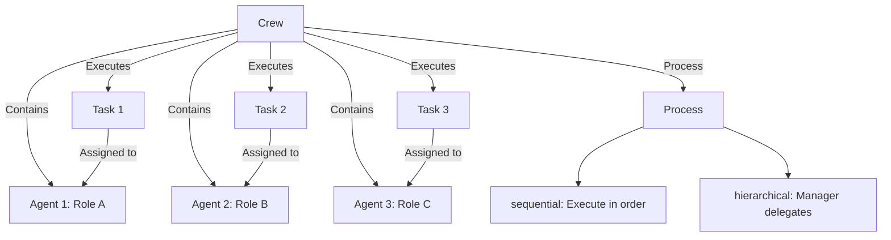
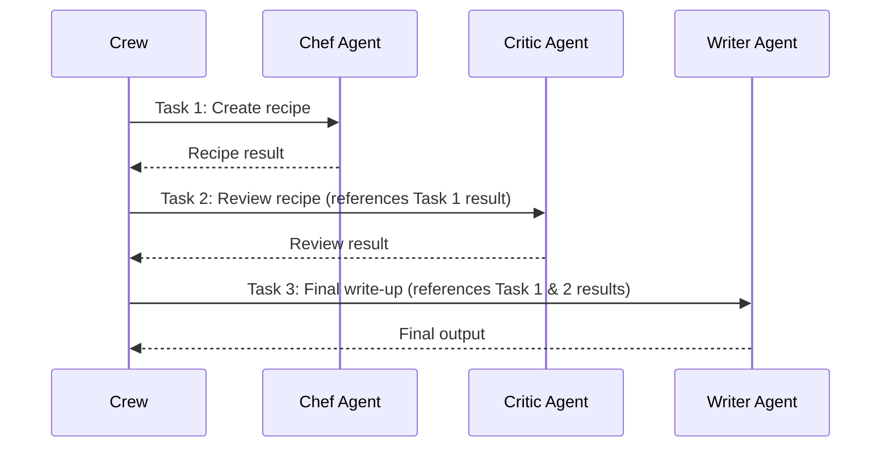

# Chapter 14: CrewAI

## Learning Objectives

- Understand the core concepts of CrewAI (Agent, Task, Crew, Process)
- Design role-based agents and configure collaborative workflows
- Define structured outputs using Pydantic models
- Build advanced Crews with asynchronous execution and custom tools

---

## Core Concepts

### CrewAI Structure



### Agent Collaboration Flow



---

## Code Walkthrough by Commit

### 14.1 Setup (`a6e5fe4`)

CrewAI configures OpenAI through environment variables:

```python
from dotenv import load_dotenv
import os

load_dotenv()

os.environ["OPENAI_API_KEY"] = os.getenv("OPENAI_API_KEY")
os.environ["OPENAI_API_BASE"] = os.getenv("OPENAI_BASE_URL")
os.environ["OPENAI_MODEL_NAME"] = "gpt-5.1"
```

Basic imports:

```python
from crewai import Agent, Task, Crew
from crewai.process import Process
from langchain_openai import ChatOpenAI
```

**Key Points:**

- CrewAI internally reads the `OPENAI_API_KEY`, `OPENAI_API_BASE`, and `OPENAI_MODEL_NAME` environment variables
- Setting them directly in `os.environ` makes all CrewAI agents use those settings

**Installation:**

```bash
pip install crewai crewai-tools langchain-openai
```

### 14.3 Chef Crew (`9b20ee0`)

The first Crew example assembles a team of cooking-related agents.

**Agent Definitions:**

```python
chef = Agent(
    role="Korean Chef",
    goal="You create simple and delicious Korean recipes.",
    backstory="You are a famous Korean chef known for your simple and tasty recipes.",
    allow_delegation=False,
)

critic = Agent(
    role="Food Critic",
    goal="You give constructive feedback on recipes.",
    backstory="You are a Michelin-star food critic with decades of experience.",
    allow_delegation=False,
)
```

Each Agent has the following attributes:
- `role`: The agent's role (reflected in the prompt)
- `goal`: The agent's objective
- `backstory`: Background description (persona setup)
- `allow_delegation`: Whether the agent can delegate work to other agents

**Task Definitions:**

```python
create_recipe = Task(
    description="Create a recipe for a {dish}.",
    expected_output="A detailed recipe with ingredients and steps.",
    agent=chef,
)

review_recipe = Task(
    description="Review the recipe and give feedback.",
    expected_output="A constructive review with suggestions.",
    agent=critic,
)
```

Each Task has the following attributes:
- `description`: Task description (supports variable substitution: `{dish}`)
- `expected_output`: The expected output format
- `agent`: The agent assigned to perform this task

**Crew Execution:**

```python
crew = Crew(
    agents=[chef, critic],
    tasks=[create_recipe, review_recipe],
    process=Process.sequential,
)

result = crew.kickoff(inputs={"dish": "Bibimbap"})
```

- `Process.sequential`: Executes tasks in order (the result of each task is passed to the next)
- `kickoff(inputs=...)`: Passes variable values when launching the Crew

### 14.5 Content Farm Crew (`6a5aedb`)

This example builds a content creation pipeline as a Crew. A researcher, writer, and editor collaborate to produce a blog post.

```python
researcher = Agent(
    role="Content Researcher",
    goal="Research and find interesting topics and information.",
    backstory="You are an experienced content researcher.",
)

writer = Agent(
    role="Content Writer",
    goal="Write engaging blog posts based on research.",
    backstory="You are a skilled content writer.",
)

editor = Agent(
    role="Content Editor",
    goal="Edit and polish content for publication.",
    backstory="You are a meticulous editor with an eye for detail.",
)
```

**Process Options:**

| Process | Description | Manager LLM | Use Case |
|---------|-------------|-------------|----------|
| `sequential` | Executes tasks in order | Not required | Pipeline-style work |
| `hierarchical` | Manager agent delegates tasks | `manager_llm` required | Complex decision-making |

> **Note:** When using `Process.hierarchical`, you must specify the `manager_llm` parameter. The manager LLM is responsible for distributing tasks to each agent and coordinating the results.

### 14.6 Pydantic Outputs (`85fd123`)

You can enforce the output format of an agent using Pydantic models:

```python
from pydantic import BaseModel
from typing import List

class Recipe(BaseModel):
    name: str
    ingredients: List[str]
    steps: List[str]
    cooking_time: int

create_recipe = Task(
    description="Create a recipe for a {dish}.",
    expected_output="A recipe in the specified format.",
    agent=chef,
    output_pydantic=Recipe,
)
```

**Key Points:**

- Specifying a Pydantic model in `output_pydantic` causes the agent's output to be parsed into that model
- Structured data can be used for downstream processing
- Model validation is performed automatically, guaranteeing the output format

### 14.7 Async Youtuber Crew (`bc399f5`)

An asynchronous Crew that runs multiple tasks in parallel:

```python
thumbnail_task = Task(
    description="Design a thumbnail concept for a video about {topic}.",
    expected_output="A detailed thumbnail description.",
    agent=designer,
    async_execution=True,
)

script_task = Task(
    description="Write a script for a video about {topic}.",
    expected_output="A complete video script.",
    agent=writer,
    async_execution=True,
)

# Both tasks run simultaneously
crew = Crew(
    agents=[designer, writer, editor],
    tasks=[thumbnail_task, script_task, final_review],
    process=Process.sequential,
)
```

**Key Points:**

- Tasks with `async_execution=True` run concurrently
- If a synchronous task follows asynchronous tasks, it waits until all asynchronous tasks complete
- Independent tasks can be processed in parallel to reduce overall execution time

### 14.8 Custom Tools (`9c6676c`)

You can add custom tools to CrewAI agents to access external data. Here we create tools that fetch real-time stock data using the `yfinance` library:

```python
from crewai.tools import tool
import yfinance as yf

class Tools:
    @tool("One month stock price history")
    def stock_price(ticker):
        """Useful to get a month's worth of stock price data as CSV.
        The input should be a stock ticker symbol."""
        stock = yf.Ticker(ticker)
        return stock.history(period="1mo").to_csv()

    @tool("Stock news URLs")
    def stock_news(ticker):
        """Useful to get URLs of news articles related to a stock.
        The input should be a stock ticker symbol."""
        stock = yf.Ticker(ticker)
        return list(map(lambda x: x["link"], stock.news))

    @tool("Company's income statement")
    def income_stmt(ticker):
        """Useful to get the income statement of a stock as CSV.
        The input should be a stock ticker symbol."""
        stock = yf.Ticker(ticker)
        return stock.income_stmt.to_csv()

    @tool("Balance sheet")
    def balance_sheet(ticker):
        """Useful to get the balance sheet of a stock as CSV.
        The input should be a stock ticker symbol."""
        stock = yf.Ticker(ticker)
        return stock.balance_sheet.to_csv()

    @tool("Get insider transactions")
    def insider_transactions(ticker):
        """Useful to get insider transactions of a stock as CSV.
        The input should be a stock ticker symbol."""
        stock = yf.Ticker(ticker)
        return stock.insider_transactions.to_csv()
```

**Key Points:**

- **`from crewai.tools import tool`**: Uses CrewAI's built-in `@tool` decorator (note: import from `crewai.tools`, not `crewai_tools`)
- **Importance of docstrings**: Agents read the tool name and docstring to decide which tool to use. Clear descriptions are essential
- **Using yfinance**: Access stock information with `yf.Ticker(ticker)`, and retrieve various financial data through attributes like `.history()`, `.income_stmt`, `.balance_sheet`, `.insider_transactions`, and `.news`
- **CSV return format**: Numerical data is returned as `.to_csv()` so the LLM can analyze it in tabular format
- **Class grouping**: Related tools are organized as static methods within the `Tools` class

**Using External Tools - ScrapeWebsiteTool:**

```python
from crewai_tools import ScrapeWebsiteTool

researcher = Agent(
    role="Researcher",
    tools=[Tools.stock_news, ScrapeWebsiteTool()],
)
```

The `crewai_tools` package also provides pre-built tools like `ScrapeWebsiteTool`. It is used here to scrape web pages after retrieving news URLs.

### 14.9 Stock Market Crew (`ce88f16`)

A stock market analysis Crew that combines all the concepts. **4 specialized agents** collaborate to produce a comprehensive investment analysis report:

**Agent Definitions (4 specialized roles):**

```python
from crewai import Agent
from crewai_tools import ScrapeWebsiteTool

class Agents:
    def technical_analyst(self):
        return Agent(
            role="Technical Analyst",
            goal="Analyses the movements of a stock and provides insights on trends, "
                 "entry points, resistance and support levels.",
            backstory="An expert in technical analysis with deep knowledge of "
                      "indicators and chart patterns.",
            verbose=True,
            tools=[Tools.stock_price],
        )

    def researcher(self):
        return Agent(
            role="Researcher",
            goal="Gathers, interprets and summarizes vast amounts of data to "
                 "provide a comprehensive overview of the sentiment and news "
                 "surrounding a stock.",
            backstory="You're skilled in gathering and interpreting data from "
                      "various sources to give a complete picture of a stock's "
                      "sentiment and news.",
            verbose=True,
            tools=[Tools.stock_news, ScrapeWebsiteTool()],
        )

    def financial_analyst(self):
        return Agent(
            role="Financial Analyst",
            goal="Uses financial statements, insider trading data, and other "
                 "metrics to evaluate a stock's financial health and performance.",
            backstory="You're a very experienced investment advisor that looks "
                      "at a company's financial health, market sentiment, and "
                      "qualitative data to make informed recommendations.",
            verbose=True,
            tools=[Tools.balance_sheet, Tools.income_stmt, Tools.insider_transactions],
        )

    def hedge_fund_manager(self):
        return Agent(
            role="Hedge Fund Manager",
            goal="Manages a portfolio of stocks and makes strategic investment "
                 "decisions to maximize returns using insights from analysts.",
            backstory="You're a seasoned hedge fund manager with a proven track "
                      "record. You leverage insights from your team of analysts.",
            verbose=True,
        )
```

**Task Definitions (each saves results via output_file):**

```python
from crewai import Task

class Tasks:
    def research(self, agent):
        return Task(
            description="Gather and analyze the latest news and market sentiment "
                        "surrounding the stock of {company}...",
            expected_output="Your final answer MUST be a detailed summary of the "
                            "overall market sentiment...",
            agent=agent,
            output_file="stock_news.md",
        )

    def technical_analysis(self, agent):
        return Task(
            description="Conduct a detailed technical analysis of the price "
                        "movements of {company}'s stock...",
            expected_output="Your final answer MUST be a detailed technical "
                            "analysis report...",
            agent=agent,
            output_file="technical_analysis.md",
        )

    def financial_analysis(self, agent):
        return Task(
            description="Analyze {company}'s financial statements, insider "
                        "trading data, and other financial metrics...",
            expected_output="Your final answer MUST be a detailed financial "
                            "analysis report...",
            agent=agent,
            output_file="financial_analysis.md",
        )

    def investment_recommendation(self, agent, context):
        return Task(
            description="Based on the research, technical analysis, and financial "
                        "analysis reports, provide a detailed investment "
                        "recommendation for {company}'s stock.",
            expected_output="Your final answer MUST be a detailed investment "
                            "recommendation report...",
            agent=agent,
            context=context,
            output_file="investment_recommendation.md",
        )
```

**Crew Execution (Hierarchical Process + Memory):**

```python
from crewai import Crew
from crewai.process import Process
from langchain_openai import ChatOpenAI

agents = Agents()
tasks = Tasks()

researcher = agents.researcher()
technical_analyst = agents.technical_analyst()
financial_analyst = agents.financial_analyst()
hedge_fund_manager = agents.hedge_fund_manager()

research_task = tasks.research(researcher)
technical_task = tasks.technical_analysis(technical_analyst)
financial_task = tasks.financial_analysis(financial_analyst)
recommend_task = tasks.investment_recommendation(
    hedge_fund_manager,
    [research_task, technical_task, financial_task],
)

crew = Crew(
    agents=[researcher, technical_analyst, financial_analyst, hedge_fund_manager],
    tasks=[research_task, technical_task, financial_task, recommend_task],
    verbose=True,
    process=Process.hierarchical,
    manager_llm=ChatOpenAI(
        base_url=os.getenv("OPENAI_BASE_URL"),
        api_key=os.getenv("OPENAI_API_KEY"),
        model=os.getenv("OPENAI_MODEL_NAME", "gpt-5.1"),
    ),
    memory=True,
    embedder=dict(
        provider="openai",
        config=dict(
            model=os.getenv("OPENAI_EMBEDDING_MODEL", "text-embedding-3-small"),
        ),
    ),
)

result = crew.kickoff(inputs=dict(company="Salesforce"))
```

**Key Features of This Stock Market Crew:**

1. **4 specialized agents**: Each agent only has tools relevant to their domain
   - Technical Analyst: `stock_price` -- chart analysis
   - Researcher: `stock_news` + `ScrapeWebsiteTool` -- news gathering/scraping
   - Financial Analyst: `balance_sheet` + `income_stmt` + `insider_transactions` -- financial analysis
   - Hedge Fund Manager: No tools -- synthesizes results from other agents for the final judgment

2. **output_file**: Each task's result is saved as a separate markdown file. Useful for debugging and archiving results

3. **context parameter**: The `investment_recommendation` task receives `context=[research_task, technical_task, financial_task]`, referencing the results of the preceding 3 tasks

4. **Process.hierarchical + manager_llm**: The manager LLM autonomously determines task execution order and delegation. Unlike `Process.sequential`, the manager can reuse agents or assign additional work as needed

5. **memory=True + embedder**: Gives the Crew long-term memory. Conversations between agents are embedded and stored, allowing subsequent agents to search previous context. The `embedder` configuration uses OpenAI's `text-embedding-3-small` model

**Sequential vs Hierarchical Comparison:**

| Aspect | Sequential | Hierarchical |
|--------|-----------|-------------|
| Execution Order | Fixed task order | Dynamically determined by manager |
| Manager LLM | Not required | `manager_llm` required |
| Flexibility | Low (pipeline) | High (manager delegates/re-executes) |
| Cost | Low | High (additional manager LLM calls) |
| Best For | Simple pipelines | Complex decision-making, interdependent tasks |

---

## Previous Approach vs Current Approach

| Aspect | LangChain Agent (Single) | CrewAI (Multi-Agent) |
|--------|-------------------------|---------------------|
| Number of Agents | One agent | Multiple role-based agents |
| Role Division | One handles all tasks | Specialized by role |
| Workflow | Single loop (ReAct) | Sequential / Hierarchical |
| Tool Management | All tools given to one agent | Only necessary tools per role |
| Output Format | Parsing with OutputParser | Enforced with Pydantic model (`output_pydantic`) |
| Result Storage | Manual management | Auto-saved with `output_file` |
| Parallel Processing | Not supported | `async_execution=True` |
| Memory | Manual Memory class setup | Automatic with `memory=True` + `embedder` configuration |
| Custom Tools | Inherit from `BaseTool` | `@tool` decorator (concise) |
| Manager Capability | None | `Process.hierarchical` + `manager_llm` |
| Best For | Simple QA, search | Content creation, analysis, research |

### New Features in CrewAI 1.x

CrewAI 1.x, used in this project, introduces the following major features:

| Feature | Description | Usage Example |
|---------|-------------|---------------|
| **memory** | Shared long-term memory between agents | `Crew(memory=True, embedder={...})` |
| **embedder** | Embedding model configuration for memory | `embedder=dict(provider="openai", config=dict(model="text-embedding-3-small"))` |
| **manager_llm** | Manager LLM for hierarchical process | `Crew(process=Process.hierarchical, manager_llm=ChatOpenAI(...))` |
| **output_file** | Auto-save task results to file | `Task(output_file="report.md")` |
| **context** | Reference results from other tasks | `Task(context=[task1, task2])` |
| **@tool decorator** | Easily convert functions into tools | `from crewai.tools import tool` |
| **ScrapeWebsiteTool** | Built-in web scraping tool | `from crewai_tools import ScrapeWebsiteTool` |

---

## Practice Exercises

### Exercise 1: Travel Planning Crew

Create a travel planning Crew composed of 3 agents.

**Requirements:**

1. **Travel Researcher**: Investigates tourism information about the destination
2. **Budget Planner**: Creates a budget plan
3. **Itinerary Writer**: Writes the final travel itinerary
4. Execute with `Process.sequential`
5. Define the final output format with a Pydantic model:

```python
class TravelPlan(BaseModel):
    destination: str
    duration: int  # days
    budget: float
    daily_itinerary: List[str]
    tips: List[str]
```

### Exercise 2: Async News Analysis Crew

Implement a Crew that collects and analyzes news with asynchronous execution.

**Requirements:**

1. Async tasks that simultaneously collect news from 3 domains (technology, economy, society)
2. A synchronous task that performs a comprehensive analysis after collection is complete
3. Implement at least one custom tool

---

## Full Course Summary

Through this course, we have covered the entire spectrum of LLM application development:

```mermaid
graph LR
    A[Ch1-2: LLM Basics] --> B[Ch3: Memory]
    B --> C[Ch4: RAG]
    C --> D[Ch5: Streamlit UI]
    D --> E[Ch6: Alternative Models]
    E --> F[Ch7-9: Real-World Apps]
    F --> G[Ch10: Agents]
    G --> H[Ch11: FastAPI]
    H --> I[Ch12: Assistants]
    I --> J[Ch13: Cloud]
    J --> K[Ch14: Multi-Agent]
```



| Stage | Chapter | What We Learned |
|-------|---------|----------------|
| Fundamentals | 1-3 | LLM, Prompts, Memory |
| Data | 4 | RAG, Embeddings, Vector Stores |
| UI | 5 | Streamlit Web Applications |
| Extension | 6 | Alternative Models: HuggingFace, Ollama, etc. |
| Real-World | 7-9 | QuizGPT, SiteGPT, MeetingGPT |
| Automation | 10 | Agent, Tools, ReAct |
| API | 11 | FastAPI, GPT Actions, Authentication |
| Platform | 12 | Assistants API, Thread, Run |
| Infrastructure | 13 | AWS Bedrock, Azure OpenAI |
| Collaboration | 14 | CrewAI Multi-Agent Systems |

You now have all the tools and concepts needed to build full-stack GPT applications, from LLM fundamentals to multi-agent systems.
