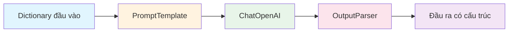
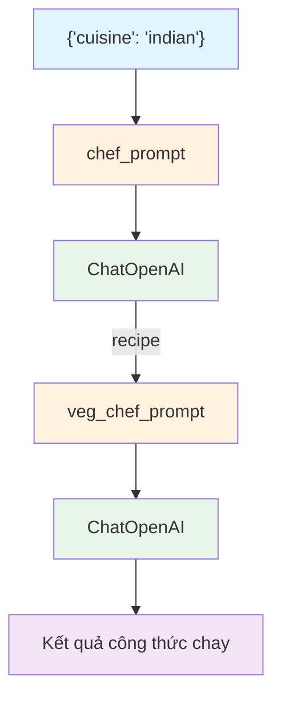

# Chapter 1: LLMs and Chat Models

## Mục tiêu học tập

Sau khi hoàn thành chương này, bạn có thể:

- Viết mã giao tiếp với LLM bằng **ChatOpenAI**
- Hiểu vai trò của các **loại tin nhắn** (SystemMessage, HumanMessage, AIMessage)
- Tạo prompt tái sử dụng được với **PromptTemplate** và **ChatPromptTemplate**
- Tạo **OutputParser** để chuyển đổi đầu ra LLM sang định dạng mong muốn
- Xây dựng chuỗi (chain) bằng toán tử pipe (`|`) của **LCEL (LangChain Expression Language)**
- **Kết nối (Chaining)** nhiều chuỗi để tạo quy trình làm việc phức tạp

---

## Giải thích khái niệm cốt lõi

### LangChain là gì?

LangChain là một framework giúp dễ dàng xây dựng ứng dụng sử dụng LLM (Large Language Model). Nó cho phép xử lý theo cách chuẩn hóa các tác vụ như gửi prompt đến LLM, phân tích phản hồi và kết nối nhiều bước với nhau.

### Các thành phần cốt lõi

| Thành phần | Mô tả |
|-----------|-------|
| `ChatOpenAI` | Lớp wrapper giao tiếp với mô hình Chat của OpenAI |
| `SystemMessage` | Tin nhắn hệ thống định nghĩa vai trò/tính cách của AI |
| `HumanMessage` | Tin nhắn do người dùng gửi |
| `AIMessage` | Tin nhắn AI đã phản hồi (dùng cho ví dụ Few-shot) |
| `PromptTemplate` | Template chuỗi chứa biến |
| `ChatPromptTemplate` | Template chat dạng danh sách tin nhắn |
| `OutputParser` | Chuyển đổi đầu ra LLM thành dữ liệu có cấu trúc |
| Toán tử LCEL `\|` | Kết nối các thành phần thành pipeline |

### Kiến trúc chuỗi LCEL



Trong LCEL, mỗi thành phần được kết nối bằng toán tử `|`. Dữ liệu chảy từ trái sang phải, đầu ra của mỗi bước trở thành đầu vào của bước tiếp theo.

### Kiến trúc kết nối chuỗi (Chaining Chains)



---

## Giải thích mã theo từng commit

### 1.0 LLMs and Chat Models

> Commit: `d44ad48`

Đây là mã gọi LLM cơ bản nhất.

```python
from langchain_openai import ChatOpenAI

chat = ChatOpenAI(
    base_url=os.getenv("OPENAI_BASE_URL"),
    api_key=os.getenv("OPENAI_API_KEY"),
    model="gpt-5.1",
)

response = chat.invoke("How many planets are there?")
response.content
```

**Điểm chính:**
- `ChatOpenAI` là lớp LangChain bọc (wrap) Chat Completion API của OpenAI
- Khi truyền chuỗi vào phương thức `invoke()`, nó được tự động chuyển đổi thành `HumanMessage` bên trong
- Giá trị trả về là đối tượng `AIMessage`, lấy văn bản bằng `.content`
- `base_url` và `api_key` được đọc từ biến môi trường (sử dụng tệp `.env`)

**Giải thích thuật ngữ:**
- **invoke**: Phương thức chuẩn để thực thi thành phần trong LangChain. Nhận đầu vào và trả về đầu ra.
- **dotenv**: Thư viện cho phép sử dụng các biến môi trường được lưu trong tệp `.env` trong Python.

---

### 1.1 Predict Messages

> Commit: `d6e7820`

Xây dựng ngữ cảnh hội thoại bằng các loại tin nhắn.

```python
from langchain_core.messages import HumanMessage, AIMessage, SystemMessage

messages = [
    SystemMessage(
        content="You are a geography expert. And you only reply in {language}.",
    ),
    AIMessage(content="Ciao, mi chiamo {name}!"),
    HumanMessage(
        content="What is the distance between {country_a} and {country_b}. Also, what is your name?",
    ),
]

chat.invoke(messages)
```

**Điểm chính:**
- `SystemMessage`: Gán vai trò cho AI. "Là chuyên gia địa lý và chỉ trả lời bằng ngôn ngữ cụ thể"
- `AIMessage`: Thiết lập những gì AI đã nói trước đó. Được sử dụng cho học Few-shot hoặc thiết lập nhân vật
- `HumanMessage`: Câu hỏi của người dùng
- Khi truyền danh sách tin nhắn vào `invoke()`, chúng được gửi đến LLM dưới dạng hội thoại
- Ở bước này, `{language}`, `{name}` v.v. vẫn là chuỗi ký tự nguyên bản, chưa phải là thay thế biến thực sự

**Thêm tham số `temperature`:**
```python
chat = ChatOpenAI(
    ...
    temperature=0.1,
)
```
- `temperature` điều chỉnh độ ngẫu nhiên của phản hồi (0.0 = xác định, 1.0 = sáng tạo)
- Khi đặt 0.1, cùng một đầu vào sẽ cho ra gần như cùng một đầu ra

---

### 1.2 Prompt Templates

> Commit: `edb339f`

Sử dụng prompt template để tự động thay thế biến.

**PromptTemplate (dựa trên chuỗi):**
```python
from langchain_core.prompts import PromptTemplate, ChatPromptTemplate

template = PromptTemplate.from_template(
    "What is the distance between {country_a} and {country_b}",
)

prompt = template.format(country_a="Mexico", country_b="Thailand")
chat.invoke(prompt).content
```

**ChatPromptTemplate (dựa trên tin nhắn):**
```python
template = ChatPromptTemplate.from_messages(
    [
        ("system", "You are a geography expert. And you only reply in {language}."),
        ("ai", "Ciao, mi chiamo {name}!"),
        ("human", "What is the distance between {country_a} and {country_b}. Also, what is your name?"),
    ]
)

prompt = template.format_messages(
    language="Greek",
    name="Socrates",
    country_a="Mexico",
    country_b="Thailand",
)

chat.invoke(prompt)
```

**Điểm chính:**
- `PromptTemplate`: Chèn biến vào chuỗi đơn giản. Được thay thế khi gọi `format()`
- `ChatPromptTemplate`: Template hóa danh sách tin nhắn. Chỉ định loại tin nhắn bằng tuple `("system", "...")`
- `format_messages()` trả về danh sách tin nhắn đã thay thế biến
- Biến cấu trúc tin nhắn được tạo thủ công ở 1.1 thành dạng tái sử dụng thông qua template

**PromptTemplate vs ChatPromptTemplate:**

| | PromptTemplate | ChatPromptTemplate |
|---|---|---|
| Đầu vào | Chuỗi | Danh sách tin nhắn (tuple) |
| Đầu ra | `format()` -> Chuỗi | `format_messages()` -> Danh sách tin nhắn |
| Sử dụng | Prompt văn bản đơn giản | Prompt hội thoại có vai trò |

---

### 1.3 OutputParser and LCEL

> Commit: `7c529ea`

Tạo OutputParser tùy chỉnh và xây dựng chuỗi bằng LCEL.

```python
from langchain_core.output_parsers import BaseOutputParser

class CommaOutputParser(BaseOutputParser):
    def parse(self, text):
        items = text.strip().split(",")
        return list(map(str.strip, items))
```

```python
template = ChatPromptTemplate.from_messages(
    [
        (
            "system",
            "You are a list generating machine. Everything you are asked will be answered with a comma separated list of max {max_items} in lowercase. Do NOT reply with anything else.",
        ),
        ("human", "{question}"),
    ]
)

chain = template | chat | CommaOutputParser()

chain.invoke({"max_items": 5, "question": "What are the pokemons?"})
```

**Điểm chính:**

1. **OutputParser tùy chỉnh**: Kế thừa `BaseOutputParser` và triển khai phương thức `parse()`. Khi LLM phản hồi "pikachu, charmander, bulbasaur", nó sẽ chuyển đổi thành danh sách `["pikachu", "charmander", "bulbasaur"]`.

2. **Toán tử pipe LCEL `|`**:
   - `template | chat | CommaOutputParser()` kết nối ba thành phần thành một pipeline
   - Luồng dữ liệu: Dictionary -> Prompt -> LLM -> Parser -> Danh sách
   - Cùng khái niệm với pipe (`|`) trong Unix

3. **Đầu vào của invoke**: Truyền dictionary vào `invoke()` của chuỗi. Tên biến trong template trở thành key của dictionary.

---

### 1.4 Chaining Chains

> Commit: `9153ca6`

Kết nối nhiều chuỗi để tạo quy trình làm việc phức tạp.

```python
from langchain_core.callbacks import StreamingStdOutCallbackHandler

chat = ChatOpenAI(
    ...
    streaming=True,
    callbacks=[StreamingStdOutCallbackHandler()],
)

chef_prompt = ChatPromptTemplate.from_messages(
    [
        ("system", ""),
        ("human", "I want to cook {cuisine} food."),
    ]
)

chef_chain = chef_prompt | chat
```

```python
veg_chef_prompt = ChatPromptTemplate.from_messages(
    [
        (
            "system",
            "You are a vegetarian chef specialized on making traditional recipies vegetarian. You find alternative ingredients and explain their preparation. You don't radically modify the recipe. If there is no alternative for a food just say you don't know how to replace it.",
        ),
        ("human", "{recipe}"),
    ]
)

veg_chain = veg_chef_prompt | chat

final_chain = {"recipe": chef_chain} | veg_chain

final_chain.invoke({"cuisine": "indian"})
```

**Điểm chính:**

1. **Streaming**: Khi thiết lập `streaming=True` và `StreamingStdOutCallbackHandler()`, phản hồi LLM được xuất ra theo thời gian thực từng token một

2. **Mẫu cốt lõi của kết nối chuỗi**:
   ```python
   final_chain = {"recipe": chef_chain} | veg_chain
   ```
   - `{"recipe": chef_chain}`: Khi đặt chuỗi làm giá trị của dictionary, đầu ra của chuỗi đó được ánh xạ vào key (`recipe`)
   - Đầu ra của `chef_chain` (công thức nấu ăn) được truyền vào biến `{recipe}` của `veg_chain`
   - Đây là mẫu cốt lõi để kết nối chuỗi trong LCEL

3. **Luồng dữ liệu**:
   - Đầu vào: `{"cuisine": "indian"}`
   - `chef_chain`: Tạo công thức món Ấn Độ
   - Chuyển đổi trung gian: `{"recipe": "Công thức món Ấn Độ..."}`
   - `veg_chain`: Chuyển đổi sang phiên bản chay
   - Đầu ra: Công thức món Ấn Độ chay

---

### 1.5 Recap

> Commit: `3293b3b`

Hoàn thiện mã của 1.4 thành dạng hoàn chỉnh. Tin nhắn system của `chef_prompt` được thêm vào:

```python
chef_prompt = ChatPromptTemplate.from_messages(
    [
        (
            "system",
            "You are a world-class international chef. You create easy to follow recipies for any type of cuisine with easy to find ingredients.",
        ),
        ("human", "I want to cook {cuisine} food."),
    ]
)
```

Prompt system trước đó để trống đã được gán vai trò cụ thể. Nhờ đó, AI sẽ cung cấp công thức có thể làm với nguyên liệu dễ tìm với tư cách là "đầu bếp đẳng cấp thế giới".

---

## Cách cũ vs Cách hiện tại

Mã nguồn của dự án này sử dụng LangChain 1.x tính đến năm 2026. So sánh với LangChain 0.x năm 2023 có những khác biệt sau:

| Mục | LangChain 0.x (2023) | LangChain 1.x (2026) |
|-----|---------------------|---------------------|
| Import mô hình Chat | `from langchain.chat_models import ChatOpenAI` | `from langchain_openai import ChatOpenAI` |
| Import tin nhắn | `from langchain.schema import HumanMessage` | `from langchain_core.messages import HumanMessage` |
| Import prompt | `from langchain.prompts import ChatPromptTemplate` | `from langchain_core.prompts import ChatPromptTemplate` |
| Cách gọi LLM | `chat.predict("...")` hoặc `chat("...")` | `chat.invoke("...")` |
| Gọi tin nhắn | `chat.predict_messages([...])` | `chat.invoke([...])` |
| Xây dựng chuỗi | `LLMChain(llm=chat, prompt=prompt)` | `prompt \| chat` (LCEL) |
| Import OutputParser | `from langchain.schema import BaseOutputParser` | `from langchain_core.output_parsers import BaseOutputParser` |
| Cấu trúc package | Package đơn `langchain` | Tách thành `langchain_core`, `langchain_openai` v.v. |

**Tóm tắt thay đổi chính:**
- Package monolithic `langchain` đã được tách thành `langchain_core`, `langchain_openai`, `langchain_community` v.v.
- Thay vì `predict()`, `predict_messages()`, sử dụng giao diện `invoke()` thống nhất
- Thay vì `LLMChain`, xây dựng chuỗi bằng toán tử pipe LCEL (`|`)

---

## Bài tập thực hành

### Bài tập 1: Tạo chuỗi dịch thuật

Sử dụng LCEL để tạo chuỗi dịch thuật như sau:

1. Người dùng nhập `{"text": "...", "source_lang": "English", "target_lang": "Korean"}`
2. Tạo prompt dịch thuật bằng ChatPromptTemplate
3. Thực hiện dịch thuật bằng ChatOpenAI
4. Chuỗi trả về chỉ chuỗi văn bản kết quả dịch

**Gợi ý:**
- Định nghĩa tin nhắn system và human trong `ChatPromptTemplate.from_messages()`
- Sử dụng `StrOutputParser()` để trích xuất chỉ chuỗi từ AIMessage (`from langchain_core.output_parsers import StrOutputParser`)

### Bài tập 2: Kết nối chuỗi - Tạo câu đố sau khi tóm tắt

Kết nối hai chuỗi:
1. Chuỗi thứ nhất: Chuỗi giải thích chủ đề (`{topic}`) cho trước bằng 3 câu
2. Chuỗi thứ hai: Chuỗi nhận đầu ra của chuỗi thứ nhất (`{summary}`) và tạo 1 câu hỏi trắc nghiệm

Sử dụng mẫu `final_chain = {"summary": summary_chain} | quiz_chain`.

---

## Giới thiệu chương tiếp theo

Trong **Chapter 2: Prompts**, chúng ta sẽ học cách xử lý prompt tinh vi hơn:
- **FewShotPromptTemplate**: Điều khiển định dạng đầu ra LLM bằng prompt chứa ví dụ
- **ExampleSelector**: Chiến lược chọn ví dụ động
- **Bộ nhớ đệm (Caching)**: Giảm chi phí bằng cách giảm các lệnh gọi lặp lại cho cùng một câu hỏi
- **Theo dõi token**: Giám sát lượng sử dụng API
