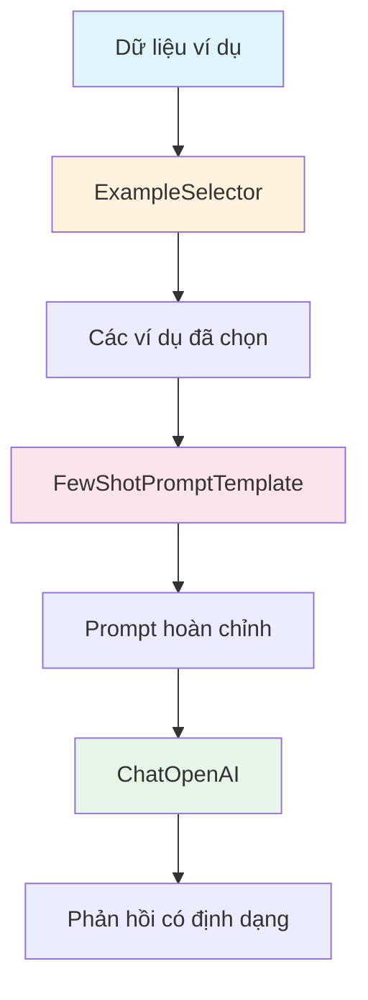
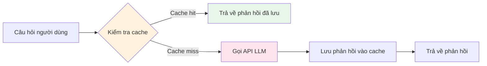

# Chapter 2: Prompts

## Mục tiêu học tập

Sau khi hoàn thành chương này, bạn có thể:

- Xây dựng prompt dựa trên ví dụ bằng **FewShotPromptTemplate**
- Tạo prompt Few-shot dạng chat bằng **FewShotChatMessagePromptTemplate**
- Triển khai **ExampleSelector tùy chỉnh** để chọn ví dụ động
- Hiểu mẫu **kết hợp (Composition)** prompt
- Lưu bộ nhớ đệm phản hồi LLM bằng **SQLiteCache** để giảm chi phí
- Theo dõi lượng token sử dụng bằng **get_usage_metadata_callback**

---

## Giải thích khái niệm cốt lõi

### Few-shot Learning là gì?

Few-shot Learning là kỹ thuật cho LLM học định dạng hoặc phong cách đầu ra mong muốn bằng cách cho xem một vài ví dụ (example). Nó bao gồm các ví dụ "hãy trả lời theo cách này" trong prompt.



### Kiến trúc bộ nhớ đệm



### So sánh các thành phần chính

| Thành phần | Mục đích | Dạng đầu ra |
|-----------|----------|-------------|
| `FewShotPromptTemplate` | Few-shot dựa trên văn bản | Chuỗi |
| `FewShotChatMessagePromptTemplate` | Few-shot dựa trên chat | Danh sách tin nhắn |
| `BaseExampleSelector` | Chọn ví dụ động | Danh sách ví dụ |
| `SQLiteCache` | Lưu bộ nhớ đệm phản hồi | - |
| `get_usage_metadata_callback` | Theo dõi token | Thống kê sử dụng |

---

## Giải thích mã theo từng commit

### 2.1 FewShotPromptTemplate

> Commit: `a8ebcc8`

Xây dựng prompt Few-shot dựa trên văn bản.

```python
from langchain_core.prompts import FewShotPromptTemplate, PromptTemplate

examples = [
    {
        "question": "What do you know about France?",
        "answer": """
        Here is what I know:
        Capital: Paris
        Language: French
        Food: Wine and Cheese
        Currency: Euro
        """,
    },
    {
        "question": "What do you know about Italy?",
        "answer": """
        I know this:
        Capital: Rome
        Language: Italian
        Food: Pizza and Pasta
        Currency: Euro
        """,
    },
    {
        "question": "What do you know about Greece?",
        "answer": """
        I know this:
        Capital: Athens
        Language: Greek
        Food: Souvlaki and Feta Cheese
        Currency: Euro
        """,
    },
]

example_prompt = PromptTemplate.from_template("Human: {question}\nAI:{answer}")

prompt = FewShotPromptTemplate(
    example_prompt=example_prompt,
    examples=examples,
    suffix="Human: What do you know about {country}?",
    input_variables=["country"],
)

chain = prompt | chat
chain.invoke({"country": "Turkey"})
```

**Điểm chính:**

1. **examples**: Danh sách dictionary, mỗi ví dụ có key `question` và `answer`
2. **example_prompt**: Template định nghĩa cách format mỗi ví dụ
3. **Các thành phần của FewShotPromptTemplate**:
   - `example_prompt`: Định dạng của từng ví dụ riêng lẻ
   - `examples`: Danh sách dữ liệu ví dụ
   - `suffix`: Phần câu hỏi thực tế được thêm sau các ví dụ
   - `input_variables`: Danh sách biến sẽ được thay thế tại thời điểm chạy

**Tại sao dùng Few-shot?**
- Không cần chỉ dẫn rõ ràng "hãy trả lời theo định dạng Capital, Language, Food, Currency", chỉ cần cho xem ví dụ thì LLM sẽ phản hồi theo cùng định dạng
- Đây là kỹ thuật mạnh mẽ để điều khiển định dạng đầu ra một cách tự nhiên

---

### 2.2 FewShotChatMessagePromptTemplate

> Commit: `59e9b1c`

Xây dựng prompt Few-shot dạng tin nhắn chat.

```python
from langchain_core.prompts import FewShotChatMessagePromptTemplate, ChatPromptTemplate

examples = [
    {
        "country": "France",
        "answer": """
        Here is what I know:
        Capital: Paris
        Language: French
        Food: Wine and Cheese
        Currency: Euro
        """,
    },
    # ... Ví dụ Italy, Greece
]

example_prompt = ChatPromptTemplate.from_messages(
    [
        ("human", "What do you know about {country}?"),
        ("ai", "{answer}"),
    ]
)

example_prompt = FewShotChatMessagePromptTemplate(
    example_prompt=example_prompt,
    examples=examples,
)

final_prompt = ChatPromptTemplate.from_messages(
    [
        ("system", "You are a geography expert, you give short answers."),
        example_prompt,
        ("human", "What do you know about {country}?"),
    ]
)

chain = final_prompt | chat
chain.invoke({"country": "Thailand"})
```

**Điểm chính:**

1. **Sự khác biệt với FewShotPromptTemplate**:
   - `FewShotPromptTemplate` tạo mọi thứ thành một chuỗi văn bản duy nhất
   - `FewShotChatMessagePromptTemplate` tạo mỗi ví dụ thành cặp tin nhắn `human`/`ai`
   - Với mô hình Chat, dạng tin nhắn tự nhiên hơn và cho hiệu suất tốt hơn

2. **Cấu trúc kết hợp**: Đặt `example_prompt` bên trong `final_prompt` để kết hợp tin nhắn system + ví dụ + câu hỏi thực tế thành một prompt duy nhất

3. **Thay đổi tên biến**: Ở 2.1 là `question`/`answer`, nhưng ở đây đổi thành `country`/`answer`. Vì định dạng câu hỏi đã cố định nên chỉ nhận tên quốc gia làm biến.

---

### 2.3 LengthBasedExampleSelector

> Commit: `b96804d`

Triển khai ExampleSelector tùy chỉnh để chọn ví dụ động.

```python
from langchain_core.example_selectors import BaseExampleSelector

class RandomExampleSelector(BaseExampleSelector):
    def __init__(self, examples):
        self.examples = examples

    def add_example(self, example):
        self.examples.append(example)

    def select_examples(self, input_variables):
        from random import choice
        return [choice(self.examples)]

example_selector = RandomExampleSelector(examples=examples)

prompt = FewShotPromptTemplate(
    example_prompt=example_prompt,
    example_selector=example_selector,
    suffix="Human: What do you know about {country}?",
    input_variables=["country"],
)

prompt.format(country="Brazil")
```

**Điểm chính:**

1. **Giao diện BaseExampleSelector**: Cần triển khai hai phương thức:
   - `add_example(example)`: Thêm ví dụ mới
   - `select_examples(input_variables)`: Chọn và trả về ví dụ theo đầu vào

2. **examples vs example_selector**: `FewShotPromptTemplate` có thể nhận `examples` (toàn bộ ví dụ) trực tiếp hoặc `example_selector` (bộ chọn động). Chỉ sử dụng một trong hai.

3. **Tại sao cần ExampleSelector?**
   - Nếu có nhiều ví dụ, prompt sẽ quá dài và tăng chi phí token
   - Chỉ chọn các ví dụ liên quan nhất đến đầu vào giúp giảm chi phí và tăng hiệu suất
   - Trong thực tế, sử dụng `LengthBasedExampleSelector` (dựa trên độ dài), `SemanticSimilarityExampleSelector` (dựa trên độ tương đồng) v.v.

**Giải thích thuật ngữ:**
- **ExampleSelector**: Thành phần chọn một số ví dụ từ tập ví dụ theo tiêu chí nhất định

---

### 2.4 Serialization and Composition

> Commit: `6aa4b39`

Sử dụng mẫu kết hợp (Composition) prompt.

```python
from langchain_core.prompts import ChatPromptTemplate

prompt = ChatPromptTemplate.from_messages(
    [
        (
            "system",
            "You are a role playing assistant. And you are impersonating a {character}.\n\n"
            "This is an example of how you talk:\n"
            "Human: {example_question}\n"
            "You: {example_answer}",
        ),
        ("human", "{question}"),
    ]
)

chain = prompt | chat

chain.invoke(
    {
        "character": "Pirate",
        "example_question": "What is your location?",
        "example_answer": "Arrrrg! That is a secret!! Arg arg!!",
        "question": "What is your fav food?",
    }
)
```

**Điểm chính:**

1. **Loại bỏ PipelinePromptTemplate**: Trong LangChain 0.x, `PipelinePromptTemplate` được sử dụng để kết hợp nhiều prompt, nhưng trong LangChain 1.x đã bị loại bỏ. Điều này cũng được ghi chú trong mã nguồn.

2. **Cách kết hợp hiện đại**: Quản lý trực tiếp tất cả biến bằng một `ChatPromptTemplate`. Bao gồm thiết lập nhân vật, hội thoại ví dụ, câu hỏi thực tế tất cả trong tin nhắn system.

3. **Sử dụng biến linh hoạt**: Bốn biến `{character}`, `{example_question}`, `{example_answer}`, `{question}` đều được thay thế trong một lần gọi invoke.

---

### 2.5 Caching

> Commit: `65960c2`

Lưu bộ nhớ đệm phản hồi LLM để giảm chi phí gọi lặp cùng câu hỏi.

```python
from langchain_core.globals import set_llm_cache
from langchain_community.cache import InMemoryCache, SQLiteCache

set_llm_cache(SQLiteCache("cache.db"))

chat = ChatOpenAI(
    base_url=os.getenv("OPENAI_BASE_URL"),
    api_key=os.getenv("OPENAI_API_KEY"),
    model="gpt-5.1",
    temperature=0.1,
)

chat.invoke("How do you make italian pasta").content  # Gọi API
chat.invoke("How do you make italian pasta").content  # Trả về ngay từ cache
```

**Điểm chính:**

1. **set_llm_cache**: Thiết lập cache toàn cục. Áp dụng cho tất cả các lệnh gọi LLM

2. **Các loại cache**:
   - `InMemoryCache()`: Lưu trong bộ nhớ, mất khi kết thúc tiến trình
   - `SQLiteCache("cache.db")`: Lưu vào tệp SQLite, bảo toàn vĩnh viễn

3. **Cách hoạt động**:
   - Lần gọi đầu: Yêu cầu API -> Lưu phản hồi vào cache -> Trả về
   - Lần gọi thứ hai giống nhau: Trả về ngay từ cache (không gọi API)

4. **Hiệu quả giảm chi phí**: Có thể giảm đáng kể chi phí API khi thử nghiệm lặp lại cùng prompt trong quá trình phát triển

**Lưu ý:**
- Cần đặt `temperature` gần 0 thì việc cache mới có ý nghĩa. Vì khi temperature cao, cùng đầu vào vẫn cho ra đầu ra khác nhau.

---

### 2.6 Serialization (Theo dõi token)

> Commit: `c9e0014`

Theo dõi lượng sử dụng API.

```python
from langchain_openai import ChatOpenAI
from langchain_core.callbacks import get_usage_metadata_callback

chat = ChatOpenAI(
    base_url=os.getenv("OPENAI_BASE_URL"),
    api_key=os.getenv("OPENAI_API_KEY"),
    model="gpt-5.1",
    temperature=0.1,
)

with get_usage_metadata_callback() as usage:
    a = chat.invoke("What is the recipe for soju").content
    b = chat.invoke("What is the recipe for bread").content
    print(a, "\n")
    print(b, "\n")
    print(usage)
```

**Điểm chính:**

1. **get_usage_metadata_callback**: Sử dụng như context manager (câu lệnh `with`). Tổng hợp lượng token sử dụng của tất cả các lệnh gọi API LLM trong khối

2. **Thông tin đầu ra usage** (được nhóm theo mô hình):
   ```python
   # Ví dụ đầu ra:
   # {'gpt-5.1-2025-11-13': {'input_tokens': 25, 'output_tokens': 1645, 'total_tokens': 1670}}
   ```
   - `input_tokens`: Số token sử dụng cho prompt (đầu vào)
   - `output_tokens`: Số token sử dụng cho phản hồi (đầu ra)
   - `total_tokens`: Tổng số token đã sử dụng
   - Lượng sử dụng được hiển thị tách biệt theo tên mô hình

3. **Tại sao theo dõi token?**
   - Chi phí API tỷ lệ thuận với số token
   - Giám sát chi phí là bắt buộc trong môi trường production
   - Là cơ sở cho việc tối ưu hóa prompt

4. **Lý do thay đổi `get_openai_callback` -> `get_usage_metadata_callback`:**
   - `get_openai_callback` chỉ dành cho OpenAI và nằm trong `langchain_community`
   - `get_usage_metadata_callback` nằm trong `langchain_core` và **hoạt động với tất cả nhà cung cấp LLM**
   - Có thể theo dõi lượng token sử dụng không chỉ OpenAI mà còn Bedrock, Azure, Ollama v.v.
   - Trong LangChain 1.x, callback mới này là phương thức chính thức được khuyến nghị

**Giải thích thuật ngữ:**
- **Token**: Đơn vị nhỏ nhất mà LLM xử lý văn bản. Với tiếng Anh khoảng 4 ký tự là 1 token, với tiếng Hàn 1 ký tự khoảng 2~3 token.

---

## Cách cũ vs Cách hiện tại

| Mục | LangChain 0.x (2023) | LangChain 1.x (2026) |
|-----|---------------------|---------------------|
| Import FewShotPromptTemplate | `from langchain.prompts import FewShotPromptTemplate` | `from langchain_core.prompts import FewShotPromptTemplate` |
| FewShotChatMessagePromptTemplate | `from langchain.prompts import FewShotChatMessagePromptTemplate` | `from langchain_core.prompts import FewShotChatMessagePromptTemplate` |
| ExampleSelector | `from langchain.prompts.example_selector import LengthBasedExampleSelector` | `from langchain_core.example_selectors import BaseExampleSelector` |
| PipelinePromptTemplate | Có thể sử dụng (kết hợp prompt) | **Đã loại bỏ** - Kết hợp trực tiếp bằng ChatPromptTemplate |
| Thiết lập cache | `import langchain; langchain.llm_cache = SQLiteCache()` | `from langchain_core.globals import set_llm_cache; set_llm_cache(SQLiteCache())` |
| Import SQLiteCache | `from langchain.cache import SQLiteCache` | `from langchain_community.cache import SQLiteCache` |
| Callback manager | `from langchain.callbacks import get_openai_callback` | `from langchain_core.callbacks import get_usage_metadata_callback` |
| Xây dựng chuỗi | `LLMChain(llm=chat, prompt=prompt)` | `prompt \| chat` (LCEL) |

**Thay đổi chính:**
- Với việc loại bỏ `PipelinePromptTemplate`, việc kết hợp prompt trở nên đơn giản hơn
- Cách thiết lập cache thay đổi từ thuộc tính module sang gọi hàm
- Các thành phần đóng góp cộng đồng được tách ra package `langchain_community`

---

## Bài tập thực hành

### Bài tập 1: Few-shot phong cách dịch thuật

Tạo chuỗi Few-shot đáp ứng các yêu cầu sau:

1. Chuẩn bị 3 ví dụ dịch thuật (Tiếng Anh -> Tiếng Hàn, nhiều phong cách khác nhau)
2. Sử dụng `FewShotChatMessagePromptTemplate` để bao gồm các ví dụ
3. Chỉ dẫn trong tin nhắn system "Dịch sang tiếng Hàn tự nhiên, giữ nguyên phong cách như trong ví dụ"
4. Dịch một câu tiếng Anh mới

**Gợi ý:** Nếu sử dụng phong cách cụ thể (kính ngữ, thân mật, văn viết v.v.) trong `answer` của ví dụ, LLM sẽ theo phong cách đó.

### Bài tập 2: Kết hợp Caching + Theo dõi token

1. Thiết lập `SQLiteCache`
2. Theo dõi lượng token sử dụng bằng `get_usage_metadata_callback`
3. Gọi cùng câu hỏi hai lần và so sánh lượng token sử dụng của mỗi lần gọi
4. Xác nhận lượng token sử dụng là 0 khi cache hit

---

## Giới thiệu chương tiếp theo

Trong **Chapter 3: Memory**, chúng ta sẽ học cách giúp LLM ghi nhớ ngữ cảnh hội thoại:
- **ConversationBufferMemory**: Lưu trữ toàn bộ lịch sử hội thoại
- **ConversationBufferWindowMemory**: Chỉ lưu N hội thoại gần nhất
- **ConversationSummaryMemory**: Tóm tắt và lưu trữ hội thoại
- **ConversationKGMemory**: Bộ nhớ dựa trên đồ thị tri thức
- Mẫu sử dụng bộ nhớ trong LCEL
