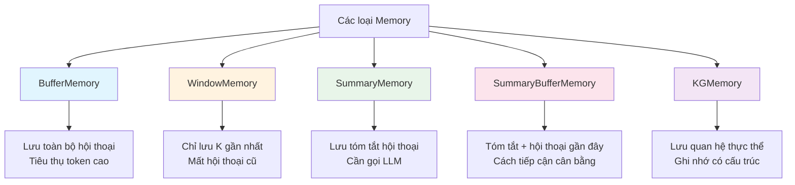
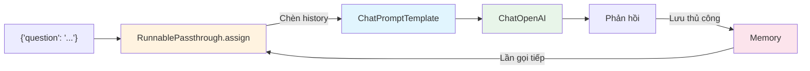

# Chapter 3: Memory

## Mục tiêu học tập

Sau khi hoàn thành chương này, bạn có thể:

- Hiểu sự cần thiết và các loại **bộ nhớ hội thoại (Memory)**
- Lưu toàn bộ hội thoại bằng **ConversationBufferMemory**
- Chỉ giữ lại các hội thoại gần đây bằng **ConversationBufferWindowMemory**
- Tóm tắt và lưu trữ hội thoại bằng **ConversationSummaryMemory**
- Kết hợp tóm tắt và bộ đệm bằng **ConversationSummaryBufferMemory**
- Sử dụng bộ nhớ dựa trên đồ thị tri thức bằng **ConversationKGMemory**
- Biết cách tích hợp bộ nhớ trong **LLMChain** và **LCEL**

---

## Giải thích khái niệm cốt lõi

### Tại sao cần bộ nhớ?

LLM về cơ bản là **không có trạng thái (stateless)**. Mỗi lệnh gọi API là độc lập, nên nếu nói "Tôi tên là Cheolsu" rồi hỏi "Tên tôi là gì?", LLM sẽ không nhớ. Thành phần bộ nhớ giải quyết vấn đề này bằng cách tự động bao gồm hội thoại trước đó vào prompt.

### So sánh các loại bộ nhớ



| Loại bộ nhớ | Cách lưu trữ | Ưu điểm | Nhược điểm |
|-------------|-------------|----------|------------|
| `ConversationBufferMemory` | Toàn bộ hội thoại gốc | Không mất thông tin | Token tăng vọt khi hội thoại dài |
| `ConversationBufferWindowMemory` | K hội thoại gần nhất | Giới hạn lượng token | Mất thông tin cũ |
| `ConversationSummaryMemory` | Văn bản tóm tắt bởi LLM | Nén hội thoại dài thành ngắn | Chi phí gọi API LLM khi tóm tắt |
| `ConversationSummaryBufferMemory` | Tóm tắt + bản gốc gần đây | Cách tiếp cận cân bằng | Thiết lập phức tạp |
| `ConversationKGMemory` | Đồ thị tri thức (thực thể-quan hệ) | Tìm kiếm thông tin có cấu trúc | Độ chính xác trích xuất quan hệ |

### Mẫu bộ nhớ trong LCEL



---

## Giải thích mã theo từng commit

### 3.0 ConversationBufferMemory

> Commit: `4662bb8`

Loại bộ nhớ cơ bản nhất, lưu toàn bộ hội thoại nguyên bản.

```python
from langchain_openai import ChatOpenAI
from langchain_classic.memory import ConversationBufferMemory
from langchain_core.runnables import RunnablePassthrough
from langchain_core.prompts import ChatPromptTemplate, MessagesPlaceholder

model = ChatOpenAI(
    base_url=os.getenv("OPENAI_BASE_URL"),
    api_key=os.getenv("OPENAI_API_KEY"),
    model="gpt-5.1",
)

prompt = ChatPromptTemplate.from_messages(
    [
        ("system", "You are a helpful chatbot"),
        MessagesPlaceholder(variable_name="history"),
        ("human", "{message}"),
    ]
)

memory = ConversationBufferMemory(return_messages=True)

def load_memory(_):
    return memory.load_memory_variables({})["history"]

chain = RunnablePassthrough.assign(history=load_memory) | prompt | model

inputs = {"message": "hi im bob"}
response = chain.invoke(inputs)
```

**Điểm chính:**

1. **MessagesPlaceholder**: Tạo vị trí trong prompt để danh sách tin nhắn được chèn động. Khi chỉ định `variable_name="history"`, danh sách tin nhắn chứa trong biến `history` sẽ được đặt vào vị trí này.

2. **ConversationBufferMemory**:
   - `return_messages=True`: Trả về lịch sử hội thoại dưới dạng danh sách đối tượng tin nhắn (thay vì chuỗi)
   - `load_memory_variables({})["history"]`: Tải lịch sử hội thoại đã lưu

3. **RunnablePassthrough.assign(history=load_memory)**:
   - Thêm key `history` vào dictionary đầu vào
   - Hàm `load_memory` được gọi để lấy lịch sử hội thoại từ bộ nhớ
   - Kết quả: `{"message": "hi im bob", "history": [các tin nhắn hội thoại trước đó]}`

4. **Tham số `_` của hàm load_memory**: `RunnablePassthrough.assign` truyền dictionary đầu vào cho hàm, nhưng vì không cần đầu vào để tải bộ nhớ nên bỏ qua bằng `_`.

**Giải thích thuật ngữ:**
- **MessagesPlaceholder**: Trình giữ chỗ cho phép chèn động danh sách tin nhắn trong ChatPromptTemplate.
- **RunnablePassthrough**: Thành phần LCEL cho phép truyền đầu vào nguyên trạng và thêm cặp key-value mới bằng `.assign()`.

---

### 3.1 ConversationBufferWindowMemory

> Commit: `8a36e99`

Chỉ giữ K hội thoại gần nhất.

```python
from langchain_classic.memory import ConversationBufferWindowMemory

memory = ConversationBufferWindowMemory(
    return_messages=True,
    k=4,
)
```

**Điểm chính:**

- `k=4`: Chỉ giữ 4 cặp hội thoại gần nhất (human + AI)
- Khi thêm hội thoại thứ 5, hội thoại cũ nhất sẽ tự động bị xóa
- **Trường hợp sử dụng**: Khi hội thoại có thể rất dài nhưng chỉ cần ngữ cảnh gần đây (ví dụ: chatbot dịch vụ khách hàng)
- Giao diện giống hệt BufferMemory nên việc thay thế rất đơn giản

---

### 3.2 ConversationSummaryMemory

> Commit: `9683c60`

Sử dụng LLM để tóm tắt hội thoại.

```python
from langchain_classic.memory import ConversationSummaryMemory
from langchain_openai import ChatOpenAI

llm = ChatOpenAI(
    base_url=os.getenv("OPENAI_BASE_URL"),
    api_key=os.getenv("OPENAI_API_KEY"),
    model="gpt-5.1",
    temperature=0.1,
)

memory = ConversationSummaryMemory(llm=llm)

def add_message(input, output):
    memory.save_context({"input": input}, {"output": output})

def get_history():
    return memory.load_memory_variables({})

add_message("Hi I'm Nicolas, I live in South Korea", "Wow that is so cool!")
add_message("South Korea is so pretty", "I wish I could go!!!")
get_history()
```

**Điểm chính:**

1. **Cần LLM**: `ConversationSummaryMemory(llm=llm)` -- Cần một lệnh gọi LLM riêng để tóm tắt hội thoại

2. **save_context**: Lưu cặp hội thoại bằng `{"input": "..."}`, `{"output": "..."}`. Mỗi lần lưu, LLM tạo bản tóm tắt mới phản ánh hội thoại mới vào bản tóm tắt hiện có.

3. **Ví dụ kết quả**: Dù nhiều hội thoại tích lũy, bộ nhớ chỉ lưu bản tóm tắt ngắn như "Nicolas sống ở Hàn Quốc, anh ấy nói Hàn Quốc đẹp..."

4. **Đánh đổi**:
   - Ưu điểm: Nén hội thoại dài thành số token cố định
   - Nhược điểm: Chi phí gọi API LLM mỗi lần tóm tắt, có thể mất chi tiết

---

### 3.3 ConversationSummaryBufferMemory

> Commit: `e85fcf9`

Bộ nhớ lai kết hợp tóm tắt và hội thoại gần đây.

```python
from langchain_classic.memory import ConversationSummaryBufferMemory

memory = ConversationSummaryBufferMemory(
    llm=llm,
    max_token_limit=150,
    return_messages=True,
)

def add_message(input, output):
    memory.save_context({"input": input}, {"output": output})

def get_history():
    return memory.load_memory_variables({})

add_message("Hi I'm Nicolas, I live in South Korea", "Wow that is so cool!")
get_history()  # Vẫn dưới 150 token -> Giữ nguyên bản gốc

add_message("South Korea is so pretty", "I wish I could go!!!")
get_history()  # Token tăng lên

add_message("How far is Korea from Argentina?", "I don't know! Super far!")
get_history()  # Vượt 150 token -> Bắt đầu tóm tắt hội thoại cũ

add_message("How far is Brazil from Argentina?", "I don't know! Super far!")
get_history()  # Tóm tắt + hội thoại gần đây
```

**Điểm chính:**

1. **max_token_limit=150**: Khi tổng token của hội thoại vượt quá giới hạn này, các hội thoại cũ sẽ được chuyển sang dạng tóm tắt trước

2. **Cách hoạt động**:
   - Token trong giới hạn: Giữ nguyên bản gốc tất cả hội thoại
   - Token vượt giới hạn: Tóm tắt hội thoại cũ + giữ nguyên bản gốc hội thoại gần đây
   - Khi hội thoại tiếp tục: Bản tóm tắt dần được cập nhật, cửa sổ hội thoại gần đây di chuyển

3. **Bộ nhớ thực tế nhất**: Cách tiếp cận cân bằng giữ chi tiết hội thoại gần đây trong khi không mất ngữ cảnh cũ

---

### 3.4 ConversationKGMemory

> Commit: `44226cd`

Bộ nhớ dựa trên đồ thị tri thức (Knowledge Graph).

```python
from langchain_community.memory.kg import ConversationKGMemory

memory = ConversationKGMemory(
    llm=llm,
    return_messages=True,
)

def add_message(input, output):
    memory.save_context({"input": input}, {"output": output})

add_message("Hi I'm Nicolas, I live in South Korea", "Wow that is so cool!")
memory.load_memory_variables({"input": "who is Nicolas"})

add_message("Nicolas likes kimchi", "Wow that is so cool!")
memory.load_memory_variables({"inputs": "what does nicolas like"})
```

**Điểm chính:**

1. **Đồ thị tri thức**: Trích xuất thực thể (entity) và quan hệ của chúng từ hội thoại và lưu dưới dạng đồ thị
   - Thực thể "Nicolas" -> "lives in South Korea", "likes kimchi"

2. **Tìm kiếm dựa trên truy vấn**: Như `load_memory_variables({"input": "who is Nicolas"})`, chỉ trả về thông tin thực thể liên quan đến câu hỏi

3. **Sự khác biệt với các bộ nhớ khác**:
   - Bộ nhớ Buffer/Summary: Lưu toàn bộ hội thoại theo thứ tự thời gian
   - Bộ nhớ KG: Lưu tri thức có cấu trúc theo từng thực thể

4. **Vị trí import**: Import từ `langchain_community.memory.kg` (package cộng đồng)

---

### 3.5 Memory on LLMChain

> Commit: `1ee4696`

Tích hợp bộ nhớ vào LLMChain legacy.

```python
from langchain_classic.memory import ConversationSummaryBufferMemory
from langchain_classic.chains import LLMChain
from langchain_core.prompts import PromptTemplate

memory = ConversationSummaryBufferMemory(
    llm=llm,
    max_token_limit=120,
    memory_key="chat_history",
)

template = """
    You are a helpful AI talking to a human.

    {chat_history}
    Human:{question}
    You:
"""

chain = LLMChain(
    llm=llm,
    memory=memory,
    prompt=PromptTemplate.from_template(template),
    verbose=True,
)

chain.invoke({"question": "My name is Nico"})["text"]
chain.invoke({"question": "I live in Seoul"})["text"]
chain.invoke({"question": "What is my name?"})["text"]
```

**Điểm chính:**

1. **memory_key="chat_history"**: Tên biến sử dụng khi bộ nhớ được chèn vào prompt. Phải khớp với `{chat_history}` trong prompt.

2. **Quản lý bộ nhớ tự động của LLMChain**:
   - Tự động tải bộ nhớ và chèn vào prompt khi gọi
   - Tự động lưu hội thoại vào bộ nhớ sau khi phản hồi
   - Lập trình viên không cần gọi `save_context` thủ công

3. **verbose=True**: Xuất quá trình thực thi của chuỗi ra console. Hữu ích cho việc gỡ lỗi.

4. **LLMChain là legacy**: Đây là mẫu của LangChain 0.x. Sẽ chuyển sang cách LCEL ở 3.7.

---

### 3.6 Chat Based Memory

> Commit: `9256b67`

Kết hợp LLMChain + ChatPromptTemplate + MessagesPlaceholder.

```python
from langchain_core.prompts import ChatPromptTemplate, MessagesPlaceholder

memory = ConversationSummaryBufferMemory(
    llm=llm,
    max_token_limit=120,
    memory_key="chat_history",
    return_messages=True,
)

prompt = ChatPromptTemplate.from_messages(
    [
        ("system", "You are a helpful AI talking to a human"),
        MessagesPlaceholder(variable_name="chat_history"),
        ("human", "{question}"),
    ]
)

chain = LLMChain(
    llm=llm,
    memory=memory,
    prompt=prompt,
    verbose=True,
)

chain.invoke({"question": "My name is Nico"})["text"]
```

**Điểm chính:**

- Sự khác biệt với 3.5: Sử dụng `ChatPromptTemplate` + `MessagesPlaceholder` thay vì `PromptTemplate`
- `return_messages=True`: Bộ nhớ trả về dưới dạng đối tượng tin nhắn thay vì chuỗi, hoạt động phù hợp với `MessagesPlaceholder`
- `memory_key` và `variable_name của MessagesPlaceholder` phải giống nhau ("chat_history")

---

### 3.7 LCEL Based Memory

> Commit: `5117422`

Triển khai bộ nhớ chỉ bằng LCEL mà không dùng LLMChain. **Đây là mẫu hiện đại được khuyến nghị.**

```python
from langchain_classic.memory import ConversationSummaryBufferMemory
from langchain_openai import ChatOpenAI
from langchain_core.runnables import RunnablePassthrough
from langchain_core.prompts import ChatPromptTemplate, MessagesPlaceholder

llm = ChatOpenAI(
    base_url=os.getenv("OPENAI_BASE_URL"),
    api_key=os.getenv("OPENAI_API_KEY"),
    model="gpt-5.1",
    temperature=0.1,
)

memory = ConversationSummaryBufferMemory(
    llm=llm,
    max_token_limit=120,
    return_messages=True,
)

prompt = ChatPromptTemplate.from_messages(
    [
        ("system", "You are a helpful AI talking to a human"),
        MessagesPlaceholder(variable_name="history"),
        ("human", "{question}"),
    ]
)

def load_memory(_):
    return memory.load_memory_variables({})["history"]

chain = RunnablePassthrough.assign(history=load_memory) | prompt | llm

def invoke_chain(question):
    result = chain.invoke({"question": question})
    memory.save_context(
        {"input": question},
        {"output": result.content},
    )
    print(result)

invoke_chain("My name is nico")
invoke_chain("What is my name?")
```

**Điểm chính:**

1. **LCEL thuần không dùng LLMChain**: Xây dựng bằng `RunnablePassthrough.assign()` + toán tử `|`

2. **Quản lý bộ nhớ thủ công**: Trong LCEL, cần tự tải/lưu bộ nhớ
   - Tải: `RunnablePassthrough.assign(history=load_memory)`
   - Lưu: Gọi thủ công `memory.save_context()` trong hàm `invoke_chain`

3. **Hàm trợ giúp invoke_chain**: Xử lý đồng thời việc gọi chuỗi và lưu bộ nhớ. Phải thông qua hàm này thì lịch sử hội thoại mới được tích lũy đúng cách.

4. **So sánh bộ nhớ LLMChain vs LCEL**:

| | LLMChain (3.5~3.6) | LCEL (3.7) |
|---|---|---|
| Tải bộ nhớ | Tự động | `RunnablePassthrough.assign` |
| Lưu bộ nhớ | Tự động | Gọi thủ công `memory.save_context()` |
| Tính linh hoạt | Thấp (mẫu cố định) | Cao (có thể tùy chỉnh) |
| Khuyến nghị | Legacy | Cách hiện đại được khuyến nghị |

---

### 3.8 Recap

> Commit: `8803d8c`

Mã giống với 3.7. Là bản tổng kết cuối cùng của mẫu bộ nhớ dựa trên LCEL.

---

## Cách cũ vs Cách hiện tại

| Mục | LangChain 0.x (2023) | LangChain 1.x (2026) |
|-----|---------------------|---------------------|
| Import bộ nhớ | `from langchain.memory import ConversationBufferMemory` | `from langchain_classic.memory import ConversationBufferMemory` |
| Import KG Memory | `from langchain.memory import ConversationKGMemory` | `from langchain_community.memory.kg import ConversationKGMemory` |
| Chuỗi + bộ nhớ | `LLMChain(llm=llm, memory=memory, prompt=prompt)` | `RunnablePassthrough.assign(history=load_memory) \| prompt \| llm` |
| Lưu bộ nhớ | Tự động (LLMChain xử lý) | Thủ công (`memory.save_context()`) |
| Package | `langchain` | `langchain_classic` (package tương thích legacy) |

**Thay đổi chính:**
- Các lớp bộ nhớ đã chuyển sang package `langchain_classic`. Điều này có nghĩa mẫu bộ nhớ này đã được phân loại là "legacy".
- Trong LangChain 1.x, `LangGraph` được khuyến nghị cho quản lý trạng thái, nhưng trong khóa học này chúng ta sử dụng API bộ nhớ hiện có để học các khái niệm.
- Để sử dụng bộ nhớ trong LCEL, cần tự quản lý việc tải/lưu.

---

## Bài tập thực hành

### Bài tập 1: Thí nghiệm so sánh các loại bộ nhớ

Sử dụng ba loại bộ nhớ sau để thực hiện cùng 10 lượt hội thoại và so sánh trạng thái bộ nhớ:

1. `ConversationBufferMemory`
2. `ConversationBufferWindowMemory(k=3)`
3. `ConversationSummaryBufferMemory(max_token_limit=100)`

Các mục cần so sánh:
- Nội dung lưu trong bộ nhớ sau hội thoại thứ 10
- Có nhớ thông tin từ hội thoại đầu tiên không
- Số token của bộ nhớ

### Bài tập 2: Tạo chatbot LCEL

Sử dụng mẫu của 3.7 để tạo chatbot có các chức năng sau:

1. Sử dụng `ConversationSummaryBufferMemory`
2. Gán vai trò cụ thể trong prompt system (ví dụ: "Bạn là gia sư lập trình Python")
3. Tiến hành hội thoại bằng hàm `invoke_chain`
4. Sau 3 lượt hội thoại, xuất `memory.load_memory_variables({})` để kiểm tra trạng thái bộ nhớ

---

## Giới thiệu chương tiếp theo

Trong **Chapter 4: RAG (Retrieval-Augmented Generation)**, chúng ta sẽ học công nghệ tìm kiếm thông tin từ tài liệu bên ngoài để LLM trả lời:
- **TextLoader**: Tải tệp văn bản
- **CharacterTextSplitter**: Chia tài liệu thành các đoạn (chunk)
- **Embeddings**: Chuyển đổi văn bản thành vector
- **FAISS Vector Store**: Tìm kiếm tương đồng vector
- **Chuỗi Stuff/MapReduce**: Chiến lược truyền tài liệu đã tìm kiếm cho LLM
