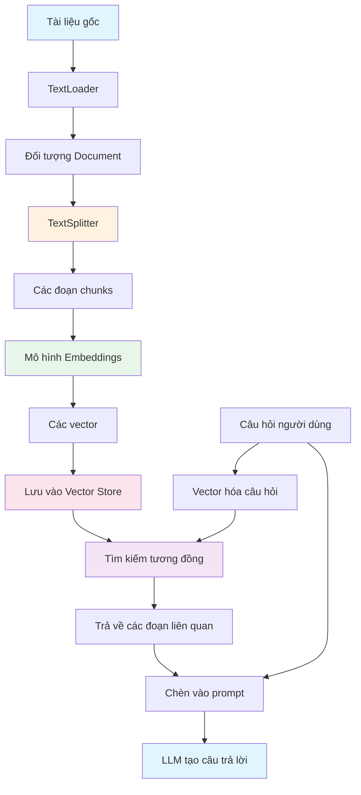
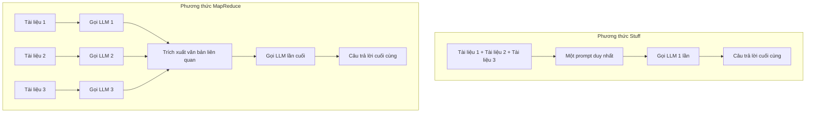

# Chapter 4: RAG (Retrieval-Augmented Generation)

## Mục tiêu học tập

Sau khi hoàn thành chương này, bạn có thể:

- Hiểu khái niệm và sự cần thiết của **RAG**
- Tải tài liệu bằng **TextLoader** và phân tách bằng **CharacterTextSplitter**
- Hiểu ưu điểm của phân tách token dựa trên **tiktoken**
- Chuyển đổi văn bản thành vector bằng **OpenAIEmbeddings**
- Xây dựng vector store bằng **FAISS** và thực hiện tìm kiếm tương đồng
- Hiểu và triển khai sự khác biệt giữa **RetrievalQA**, **Stuff Chain**, **MapReduce Chain**

---

## Giải thích khái niệm cốt lõi

### RAG là gì?

**RAG (Retrieval-Augmented Generation)** là kỹ thuật tìm kiếm (Retrieval) dữ liệu bên ngoài mà LLM chưa được huấn luyện và sử dụng cho việc tạo câu trả lời (Generation). Nó giúp vượt qua giới hạn kiến thức của LLM và cho phép tạo câu trả lời chính xác dựa trên tài liệu cụ thể.

### Pipeline RAG



### Thuật ngữ chính

| Thuật ngữ | Giải thích |
|------|------|
| **Document** | Đối tượng chứa văn bản và metadata trong LangChain (`page_content`, `metadata`) |
| **Chunk** | Mảnh nhỏ được phân tách từ tài liệu. Mỗi chunk trở thành một đối tượng Document |
| **Embedding** | Chuyển đổi văn bản thành vector số nhiều chiều. Có thể so sánh độ tương đồng ngữ nghĩa bằng số |
| **Vector Store** | Cơ sở dữ liệu lưu trữ vector và thực hiện tìm kiếm tương đồng |
| **Retriever** | Giao diện tìm kiếm tài liệu liên quan từ Vector Store |
| **Stuff** | Phương thức gộp tất cả tài liệu tìm được vào một prompt duy nhất |
| **MapReduce** | Phương thức xử lý từng tài liệu riêng lẻ (Map) rồi tổng hợp kết quả (Reduce) |

### Stuff vs MapReduce



| | Stuff | MapReduce |
|---|---|---|
| Số lần gọi LLM | 1 lần | N+1 lần (số tài liệu + lần cuối) |
| Giới hạn token | Toàn bộ tài liệu phải nằm trong context | Xử lý từng tài liệu riêng nên ít bị giới hạn |
| Chi phí | Thấp | Cao |
| Độ chính xác | Cao vì xem toàn bộ cùng lúc | Chỉ trích xuất phần liên quan từ mỗi tài liệu |
| Phù hợp khi | Tài liệu ít hoặc ngắn | Tài liệu nhiều hoặc dài |

---

## Giải thích code theo từng commit

### 4.1 Data Loaders and Splitters

> Commit: `75c3c6f`

Đây là quy trình cơ bản tải và phân tách tài liệu.

```python
from langchain_community.document_loaders import TextLoader
from langchain_text_splitters import RecursiveCharacterTextSplitter

splitter = RecursiveCharacterTextSplitter()

loader = TextLoader("./files/chapter_one.txt")

loader.load_and_split(text_splitter=splitter)
```

**Điểm chính:**

1. **TextLoader**: Đọc file văn bản và chuyển đổi thành đối tượng `Document`
   - `Document` có `page_content` (văn bản) và `metadata` (đường dẫn file, v.v.)

2. **RecursiveCharacterTextSplitter**: Phân tách tài liệu theo cách đệ quy
   - Ký tự phân tách mặc định: thử theo thứ tự `["\n\n", "\n", " ", ""]`
   - Đầu tiên tách theo đoạn (`\n\n`), nếu vẫn lớn thì tách theo dòng (`\n`), nếu vẫn lớn thì tách theo khoảng trắng (` `)
   - Cách này giúp duy trì tối đa đơn vị ngữ nghĩa khi phân tách

3. **load_and_split**: Thực hiện tải và phân tách cùng một lúc

**Tại sao phải phân tách tài liệu?**
- LLM có giới hạn cửa sổ ngữ cảnh (context window - số token có thể xử lý cùng lúc)
- Không thể đưa toàn bộ tài liệu dài vào, nên cần tìm và đưa vào chỉ phần liên quan
- Các chunk đã phân tách được chuyển thành vector để sử dụng cho tìm kiếm tương đồng

---

### 4.2 Tiktoken

> Commit: `e3f9151`

Phân tách với kiểm soát chính xác số token dựa trên tiktoken.

```python
from langchain_community.document_loaders import TextLoader
from langchain_text_splitters import CharacterTextSplitter

splitter = CharacterTextSplitter.from_tiktoken_encoder(
    separator="\n",
    chunk_size=600,
    chunk_overlap=100,
)

loader = TextLoader("./files/chapter_one.txt")
```

**Điểm chính:**

1. **CharacterTextSplitter.from_tiktoken_encoder**: Phân tách dựa trên số token sử dụng thư viện tiktoken

2. **Giải thích tham số**:
   - `separator="\n"`: Phân tách dựa trên ký tự xuống dòng
   - `chunk_size=600`: Đảm bảo mỗi chunk không vượt quá 600 token
   - `chunk_overlap=100`: Đảm bảo 100 token chồng lấp giữa các chunk liên tiếp

3. **Tại sao dùng tiktoken?**
   - `RecursiveCharacterTextSplitter` phân tách dựa trên **số ký tự**
   - `from_tiktoken_encoder` phân tách dựa trên **số token**
   - Vì cửa sổ ngữ cảnh của LLM tính theo đơn vị token, nên phân tách theo token chính xác hơn

4. **Vai trò của chunk_overlap**: Ngăn ngừa việc mất ngữ cảnh tại ranh giới chunk. Khi chồng lấp 100 token, phần cuối của chunk trước cũng được bao gồm ở đầu chunk tiếp theo.

**Giải thích thuật ngữ:**
- **tiktoken**: Thư viện tokenizer do OpenAI tạo ra. Cung cấp phương thức phân tách token mà các mô hình GPT thực tế sử dụng.

---

### 4.4 Vector Store

> Commit: `3bd911a`

Xây dựng embedding và vector store.

```python
from langchain_openai import OpenAIEmbeddings
from langchain_classic.embeddings import CacheBackedEmbeddings
from langchain_community.vectorstores import FAISS
from langchain_classic.storage import LocalFileStore

cache_dir = LocalFileStore("./.cache/")

splitter = CharacterTextSplitter.from_tiktoken_encoder(
    separator="\n",
    chunk_size=600,
    chunk_overlap=100,
)
loader = TextLoader("./files/chapter_one.txt")
docs = loader.load_and_split(text_splitter=splitter)

embeddings = OpenAIEmbeddings(
    base_url=os.getenv("OPENAI_EMBEDDING_BASE_URL"),
    api_key=os.getenv("OPENAI_API_KEY"),
    model=os.getenv("OPENAI_EMBEDDING_MODEL"),
)

cached_embeddings = CacheBackedEmbeddings.from_bytes_store(embeddings, cache_dir)

vectorstore = FAISS.from_documents(docs, cached_embeddings)
```

```python
results = vectorstore.similarity_search("where does winston live")
results
```

**Điểm chính:**

1. **OpenAIEmbeddings**: Chuyển đổi văn bản thành vector (mảng số)
   - Văn bản có ngữ nghĩa tương tự sẽ có vector gần nhau
   - Ví dụ: vector của "mèo" và "cat" gần hơn so với "mèo" và "ô tô"

2. **CacheBackedEmbeddings**: Lưu cache kết quả embedding vào file cục bộ
   - Khi embedding lại cùng văn bản, trả về từ cache mà không cần gọi API
   - `LocalFileStore("./.cache/")`: Vị trí lưu cache

3. **FAISS**: Thư viện tìm kiếm tương đồng vector do Facebook AI Research phát triển
   - `from_documents`: Vector hóa danh sách Document và xây dựng chỉ mục
   - `similarity_search`: Tìm kiếm các chunk tương tự nhất với câu hỏi

4. **Luồng dữ liệu**:
   ```
   File văn bản -> TextLoader -> Documents -> TextSplitter -> Các chunk
   -> OpenAIEmbeddings -> Các vector -> Chỉ mục FAISS
   ```

---

### 4.5 RetrievalQA

> Commit: `84bb41b`

Thực hiện QA dựa trên tài liệu với chuỗi RetrievalQA legacy.

```python
from langchain_classic.chains import RetrievalQA

llm = ChatOpenAI(
    base_url=os.getenv("OPENAI_BASE_URL"),
    api_key=os.getenv("OPENAI_API_KEY"),
    model="gpt-5.1",
)

# ... (cùng quy trình tải tài liệu, embedding, xây dựng vector store)

chain = RetrievalQA.from_chain_type(
    llm=llm,
    chain_type="map_rerank",
    retriever=vectorstore.as_retriever(),
)

chain.invoke("Describe Victory Mansions")
```

**Điểm chính:**

1. **RetrievalQA**: Component legacy gộp tìm kiếm vector store + tạo câu trả lời LLM thành một chuỗi

2. **Tùy chọn chain_type**:
   - `"stuff"`: Gộp tất cả kết quả tìm kiếm vào một prompt
   - `"map_reduce"`: Xử lý từng tài liệu riêng rồi tổng hợp
   - `"map_rerank"`: Tạo câu trả lời từ mỗi tài liệu và chọn câu trả lời tốt nhất
   - `"refine"`: Xử lý tài liệu tuần tự và cải thiện câu trả lời dần

3. **as_retriever()**: Chuyển đổi Vector Store thành giao diện Retriever. Nhờ đó chuỗi có thể tự động tìm kiếm tài liệu liên quan.

4. **Lưu ý legacy**: `RetrievalQA` nằm trong `langchain_classic`, phương pháp hiện đại được triển khai trực tiếp bằng LCEL ở phần 4.7~4.8.

---

### 4.7 Stuff LCEL Chain

> Commit: `bbb85ab`

Triển khai trực tiếp chuỗi RAG phương thức Stuff bằng LCEL.

```python
from langchain_core.prompts import ChatPromptTemplate
from langchain_core.runnables import RunnablePassthrough

# ... (cùng quy trình tải tài liệu, embedding, xây dựng vector store)

retriever = vectorstore.as_retriever()

prompt = ChatPromptTemplate.from_messages(
    [
        (
            "system",
            "You are a helpful assistant. Answer questions using only the following context. "
            "If you don't know the answer just say you don't know, don't make it up:\n\n{context}",
        ),
        ("human", "{question}"),
    ]
)

chain = (
    {
        "context": retriever,
        "question": RunnablePassthrough(),
    }
    | prompt
    | llm
)

chain.invoke("Describe Victory Mansions")
```

**Điểm chính:**

1. **Cốt lõi của mẫu RAG LCEL**:
   ```python
   {
       "context": retriever,
       "question": RunnablePassthrough(),
   }
   ```
   - `retriever`: Thực hiện tìm kiếm vector bằng chuỗi đầu vào và trả về tài liệu liên quan
   - `RunnablePassthrough()`: Truyền chuỗi đầu vào nguyên vẹn
   - Kết quả: `{"context": [Các Document liên quan], "question": "Câu hỏi gốc"}`

2. **Thiết kế prompt**:
   - Bao gồm `{context}` trong tin nhắn system để cung cấp tài liệu tìm được làm ngữ cảnh
   - "If you don't know the answer just say you don't know" -- Chỉ thị quan trọng để ngăn chặn ảo giác (hallucination)

3. **Đặc điểm của phương thức Stuff**: Tất cả tài liệu tìm được được gộp vào một `{context}`. Đơn giản và hiệu quả, nhưng nếu có nhiều tài liệu có thể vượt quá cửa sổ ngữ cảnh.

4. **RetrievalQA vs LCEL**:
   - `RetrievalQA`: Hoạt động bên trong bị ẩn như hộp đen
   - LCEL: Mỗi bước đều rõ ràng nên dễ tùy chỉnh

---

### 4.8 Map Reduce LCEL Chain

> Commit: `fcebffa`

Triển khai chuỗi RAG phương thức MapReduce bằng LCEL.

```python
from langchain_core.runnables import RunnablePassthrough, RunnableLambda

# Giai đoạn Map: Trích xuất văn bản liên quan từ mỗi tài liệu
map_doc_prompt = ChatPromptTemplate.from_messages(
    [
        (
            "system",
            """
            Use the following portion of a long document to see if any of the text is relevant to answer the question. Return any relevant text verbatim. If there is no relevant text, return : ''
            -------
            {context}
            """,
        ),
        ("human", "{question}"),
    ]
)

map_doc_chain = map_doc_prompt | llm

def map_docs(inputs):
    documents = inputs["documents"]
    question = inputs["question"]
    return "\n\n".join(
        map_doc_chain.invoke(
            {"context": doc.page_content, "question": question}
        ).content
        for doc in documents
    )

map_chain = {
    "documents": retriever,
    "question": RunnablePassthrough(),
} | RunnableLambda(map_docs)

# Giai đoạn Reduce: Tổng hợp văn bản đã trích xuất để tạo câu trả lời cuối cùng
final_prompt = ChatPromptTemplate.from_messages(
    [
        (
            "system",
            """
            Given the following extracted parts of a long document and a question, create a final answer.
            If you don't know the answer, just say that you don't know. Don't try to make up an answer.
            ------
            {context}
            """,
        ),
        ("human", "{question}"),
    ]
)

chain = {"context": map_chain, "question": RunnablePassthrough()} | final_prompt | llm

chain.invoke("How many ministries are mentioned")
```

**Điểm chính:**

1. **Cấu trúc 2 giai đoạn**:
   - **Giai đoạn Map**: Gửi từng tài liệu tìm được riêng lẻ đến LLM để trích xuất chỉ văn bản liên quan
   - **Giai đoạn Reduce**: Tổng hợp các văn bản đã trích xuất để tạo câu trả lời cuối cùng

2. **Hàm map_docs**:
   - Nhận danh sách Document tìm được từ `inputs["documents"]`
   - Gọi `map_doc_chain` cho mỗi Document để trích xuất văn bản liên quan
   - Nối kết quả bằng `\n\n` và trả về dưới dạng một chuỗi

3. **RunnableLambda**: Wrapper cho phép chèn hàm Python thông thường vào chuỗi LCEL
   - `RunnableLambda(map_docs)`: Sử dụng hàm `map_docs` như một bước trong chuỗi

4. **Thứ tự cấu thành chuỗi**:
   ```
   Câu hỏi -> Tìm kiếm tài liệu bằng retriever
            -> Trích xuất văn bản liên quan từ mỗi tài liệu bằng map_docs
            -> Chèn văn bản đã trích xuất và câu hỏi vào final_prompt
            -> Tạo câu trả lời cuối cùng bằng LLM
   ```

5. **Tiêu chí chọn Stuff vs MapReduce**:
   - Nếu tài liệu tìm được 4 cái trở xuống và mỗi cái ngắn -> Stuff (4.7)
   - Nếu tài liệu tìm được nhiều hoặc dài -> MapReduce (4.8)
   - MapReduce có chi phí cao hơn do nhiều lần gọi LLM, nhưng phân tích từng tài liệu riêng nên ít bỏ sót thông tin

---

## Phương thức trước đây vs hiện tại

| Hạng mục | LangChain 0.x (2023) | LangChain 1.x (2026) |
|------|---------------------|---------------------|
| Import document loader | `from langchain.document_loaders import TextLoader` | `from langchain_community.document_loaders import TextLoader` |
| Import text splitter | `from langchain.text_splitter import CharacterTextSplitter` | `from langchain_text_splitters import CharacterTextSplitter` |
| Import embedding | `from langchain.embeddings import OpenAIEmbeddings` | `from langchain_openai import OpenAIEmbeddings` |
| Import vector store | `from langchain.vectorstores import FAISS` | `from langchain_community.vectorstores import FAISS` |
| Cache embedding | `from langchain.embeddings import CacheBackedEmbeddings` | `from langchain_classic.embeddings import CacheBackedEmbeddings` |
| RetrievalQA | `from langchain.chains import RetrievalQA` | `from langchain_classic.chains import RetrievalQA` (legacy) |
| Cấu hình chuỗi RAG | `RetrievalQA.from_chain_type(...)` | LCEL: `{"context": retriever, "question": RunnablePassthrough()} \| prompt \| llm` |
| Package text splitter | Tích hợp trong `langchain` | Package riêng `langchain_text_splitters` |

**Thay đổi chính:**
- Text splitter đã được tách thành package độc lập `langchain_text_splitters`
- Các chuỗi legacy như `RetrievalQA` đã chuyển sang `langchain_classic`, khuyến nghị triển khai trực tiếp bằng LCEL
- Các tiện ích như `CacheBackedEmbeddings`, `LocalFileStore` đã chuyển sang `langchain_classic`

---

## Bài tập thực hành

### Bài tập 1: Hệ thống RAG của riêng bạn

Xây dựng hệ thống RAG theo các yêu cầu sau:

1. Chuẩn bị file văn bản do bạn chọn (bài blog, tài liệu wiki, v.v.)
2. Phân tách bằng `CharacterTextSplitter.from_tiktoken_encoder` (chunk_size=500, chunk_overlap=50)
3. Lưu cache embedding bằng `CacheBackedEmbeddings`
4. Xây dựng FAISS vector store
5. Trả lời 3 câu hỏi bằng chuỗi LCEL **phương thức Stuff**

### Bài tập 2: So sánh Stuff vs MapReduce

Chạy chuỗi Stuff (4.7) và chuỗi MapReduce (4.8) với cùng tài liệu và cùng câu hỏi, rồi so sánh:

1. So sánh chất lượng câu trả lời của hai chuỗi
2. Đo lường lượng token sử dụng của mỗi chuỗi bằng `get_usage_metadata_callback()`
3. Tổng hợp phương thức nào phù hợp hơn trong tình huống nào

---

## Giới thiệu chương tiếp theo

Trong **Chapter 5: Streamlit**, chúng ta sẽ biến hệ thống RAG đã xây dựng thành ứng dụng web:
- **Streamlit**: Framework tạo giao diện web chỉ bằng Python
- Upload file, giao diện chat, phản hồi streaming
- Hoàn thiện chatbot QA tài liệu
