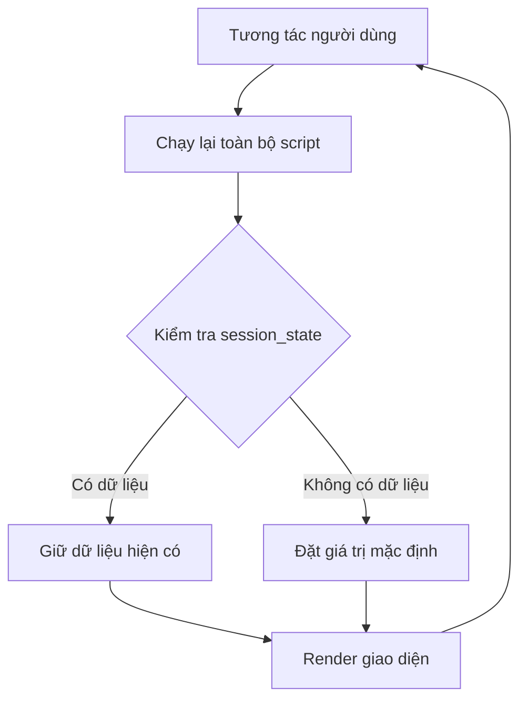
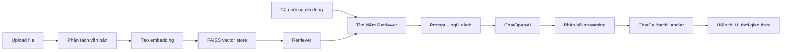
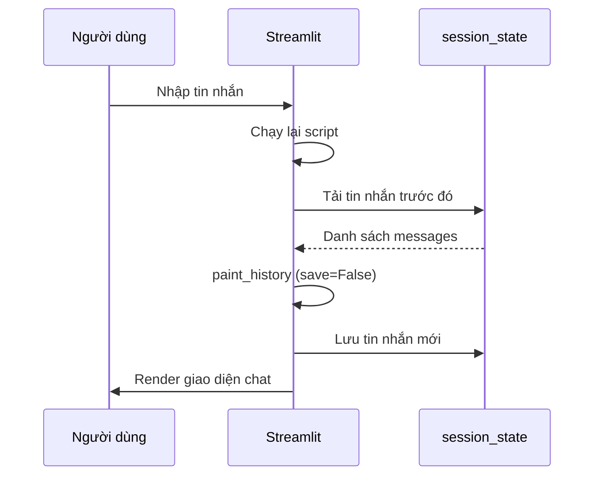
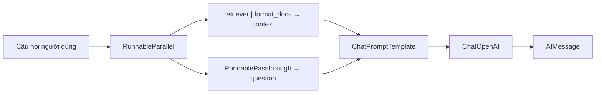
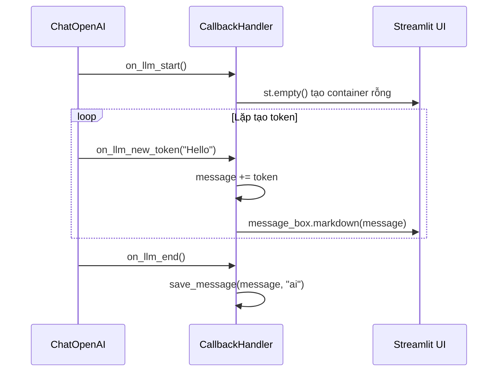

# Chapter 05: Streamlit - Tạo giao diện chatbot AI

## Mục tiêu học tập

Sau khi hoàn thành chương này, bạn có thể:

- Tạo ứng dụng web sử dụng các widget cơ bản và layout của Streamlit
- Duy trì lịch sử hội thoại bằng `st.session_state`
- Upload tài liệu bằng `st.file_uploader` và kết nối với pipeline RAG
- Triển khai `ChatCallbackHandler` để hiển thị phản hồi streaming theo thời gian thực
- Hoàn thiện chatbot DocumentGPT với Streamlit + LangChain

---

## Giải thích khái niệm cốt lõi

### Streamlit là gì?

Streamlit là framework cho phép tạo ứng dụng web chỉ bằng Python. Bạn hoàn toàn không cần biết HTML, CSS, JavaScript. Đặc biệt hữu ích khi các nhà khoa học dữ liệu và kỹ sư AI cần tạo prototype nhanh chóng.

### Mô hình thực thi của Streamlit

Đặc điểm quan trọng nhất của Streamlit là **script được chạy lại từ đầu mỗi khi có tương tác**. Khi nhấn nút, nhập văn bản, hoặc upload file, toàn bộ script Python được chạy lại từ trên xuống dưới.



Vì lý do này, **`st.session_state`** là bắt buộc. Nếu không lưu biến vào `session_state`, nó sẽ bị khởi tạo lại mỗi lần chạy.

### Kiến trúc DocumentGPT



---

## Giải thích code theo từng commit

### 5.0 Introduction (`bd57168`)

Lần đầu tiếp xúc với Streamlit. Sử dụng các widget cơ bản nhất.

```python
import streamlit as st

st.title("Hello world!")
st.subheader("Welcome to Streamlit!")
st.markdown("""
    #### I love it!
""")
```

`st.title`, `st.subheader`, `st.markdown` là các hàm cơ bản nhất để hiển thị văn bản. Để chạy ứng dụng Streamlit, nhập `streamlit run Home.py` trong terminal.

---

### 5.1 Magic (`4a73e79`)

Giới thiệu tính năng "Magic" của Streamlit và các widget nhập liệu.

```python
import streamlit as st

st.selectbox(
    "Choose your model",
    ("GPT-3", "GPT-4"),
)
```

**`st.selectbox`** tạo menu dropdown. Vì nó trả về giá trị mà người dùng đã chọn, bạn có thể lưu vào biến và sử dụng cho phân nhánh điều kiện.

---

### 5.2 Data Flow (`7cf4068`)

Commit cốt lõi để hiểu luồng dữ liệu (Data Flow) của Streamlit.

```python
import streamlit as st
from datetime import datetime

today = datetime.today().strftime("%H:%M:%S")
st.title(today)

model = st.selectbox(
    "Choose your model",
    ("GPT-3", "GPT-4"),
)

if model == "GPT-3":
    st.write("cheap")
else:
    st.write("not cheap")
    name = st.text_input("What is your name?")
    st.write(name)
    value = st.slider("temperature", min_value=0.1, max_value=1.0)
    st.write(value)
```

**Điểm chính:** Thời gian hiển thị trong `st.title(today)` thay đổi mỗi khi thao tác với widget. Đây chính là bằng chứng cho việc "toàn bộ script được chạy lại".

Các widget mới:
- **`st.text_input`**: Trường nhập văn bản
- **`st.slider`**: Thanh trượt (ở đây dùng để điều chỉnh temperature)
- **`st.write`**: Hàm đa năng tự động hiển thị phù hợp với mọi kiểu dữ liệu

---

### 5.3 Multi Page (`7152c0d`)

Thiết lập tính năng đa trang của Streamlit. Đặt file vào thư mục `pages/` thì thanh điều hướng tự động xuất hiện ở sidebar.

```
Cấu trúc dự án:
├── Home.py                      # Trang chính
├── pages/
│   ├── 01_DocumentGPT.py        # /DocumentGPT
│   ├── 02_PrivateGPT.py         # /PrivateGPT
│   └── 03_QuizGPT.py            # /QuizGPT
```

Thiết lập tiêu đề và icon trang bằng `st.set_page_config` trong `Home.py`:

```python
st.set_page_config(
    page_title="FullstackGPT Home",
    page_icon="🤖",
)
```

> **Giải thích thuật ngữ:** `st.set_page_config` phải được gọi là **lệnh Streamlit đầu tiên** trong script. Nếu không sẽ gây ra lỗi.

---

### 5.4 Chat Messages (`473717f`)

Giới thiệu `st.chat_message` và `st.session_state` - cốt lõi của giao diện chat.

```python
st.set_page_config(
    page_title="DocumentGPT",
    page_icon="📃",
)

if "messages" not in st.session_state:
    st.session_state["messages"] = []

def send_message(message, role, save=True):
    with st.chat_message(role):
        st.write(message)
    if save:
        st.session_state["messages"].append({"message": message, "role": role})

for message in st.session_state["messages"]:
    send_message(message["message"], message["role"], save=False)

message = st.chat_input("Send a message to the ai ")

if message:
    send_message(message, "human")
    time.sleep(2)
    send_message(f"You said: {message}", "ai")
```

**Phân tích mẫu cốt lõi:**

1. **`st.session_state`**: Hoạt động như dictionary và dữ liệu được duy trì giữa các lần chạy lại
2. **`st.chat_message(role)`**: Hiển thị tin nhắn với icon và style khác nhau tùy theo vai trò `"human"` hoặc `"ai"`
3. **`st.chat_input`**: Tạo ô nhập chat cố định ở cuối màn hình
4. **Mẫu `save=False`**: Khi vẽ lại tin nhắn trước đó, tránh lưu trùng lặp



---

### 5.6 Uploading Documents (`5200539`)

Tích hợp upload file và pipeline RAG vào Streamlit.

```python
def embed_file(file):
    file_content = file.read()
    file_path = f"./.cache/files/{file.name}"
    os.makedirs(os.path.dirname(file_path), exist_ok=True)
    with open(file_path, "wb") as f:
        f.write(file_content)
    cache_dir = LocalFileStore(f"./.cache/embeddings/{file.name}")
    splitter = CharacterTextSplitter.from_tiktoken_encoder(
        separator="\n",
        chunk_size=600,
        chunk_overlap=100,
    )
    if file.name.endswith(".txt"):
        loader = TextLoader(file_path)
    else:
        loader = UnstructuredFileLoader(file_path)
    docs = loader.load_and_split(text_splitter=splitter)
    embeddings = OpenAIEmbeddings(...)
    cached_embeddings = CacheBackedEmbeddings.from_bytes_store(embeddings, cache_dir)
    vectorstore = FAISS.from_documents(docs, cached_embeddings)
    retriever = vectorstore.as_retriever()
    return retriever

file = st.file_uploader(
    "Upload a .txt .pdf or .docx file",
    type=["pdf", "txt", "docx"],
)

if file:
    retriever = embed_file(file)
    s = retriever.invoke("winston")
    s
```

**Khái niệm chính:**

- **`st.file_uploader`**: Widget upload file. Giới hạn phần mở rộng cho phép bằng tham số `type`
- **`CacheBackedEmbeddings`**: Cache tài liệu đã embedding vào file cục bộ để tránh gọi API trùng lặp
- **Phân nhánh theo định dạng file**: File `.txt` dùng `TextLoader`, còn lại dùng `UnstructuredFileLoader`

> **Mẹo tiết kiệm chi phí:** API embedding phát sinh chi phí mỗi lần gọi. Sử dụng `CacheBackedEmbeddings`, ngay cả khi upload lại cùng tài liệu, sẽ dùng kết quả đã cache nên không tốn chi phí.

---

### 5.7 Chat History (`3c4b1ac`)

Kết hợp lịch sử chat và upload file. Chuyển upload file sang sidebar và thêm `@st.cache_data`.

```python
@st.cache_data(show_spinner="Embedding file...")
def embed_file(file):
    # ... giống phần trước nhưng thêm decorator caching
    return retriever

def send_message(message, role, save=True):
    with st.chat_message(role):
        st.markdown(message)
    if save:
        st.session_state["messages"].append({"message": message, "role": role})

def paint_history():
    for message in st.session_state["messages"]:
        send_message(message["message"], message["role"], save=False)

with st.sidebar:
    file = st.file_uploader(
        "Upload a .txt .pdf or .docx file",
        type=["pdf", "txt", "docx"],
    )

if file:
    retriever = embed_file(file)
    send_message("I'm ready! Ask away!", "ai", save=False)
    paint_history()
    message = st.chat_input("Ask anything about your file...")
    if message:
        send_message(message, "human")
else:
    st.session_state["messages"] = []
```

**Khái niệm mới:**

- **`@st.cache_data`**: Cache kết quả của hàm. Khi upload cùng file sẽ không embedding lại. Tham số `show_spinner` hiển thị thông báo đang tải.
- **`with st.sidebar:`**: Đặt widget vào sidebar
- **Khởi tạo khi không có file**: `else: st.session_state["messages"] = []` để xóa lịch sử hội thoại khi xóa file

---

### 5.8 Chain (`c0c51ef`)

Kết nối chuỗi LCEL LangChain với Streamlit. Bây giờ AI thực sự trả lời dựa trên tài liệu.

```python
llm = ChatOpenAI(
    base_url=os.getenv("OPENAI_BASE_URL"),
    api_key=os.getenv("OPENAI_API_KEY"),
    model="gpt-5.1",
    temperature=0.1,
)

def format_docs(docs):
    return "\n\n".join(document.page_content for document in docs)

prompt = ChatPromptTemplate.from_messages([
    ("system", """
    Answer the question using ONLY the following context.
    If you don't know the answer just say you don't know.
    DON'T make anything up.

    Context: {context}
    """),
    ("human", "{question}"),
])

if message:
    send_message(message, "human")
    chain = (
        {
            "context": retriever | RunnableLambda(format_docs),
            "question": RunnablePassthrough(),
        }
        | prompt
        | llm
    )
    response = chain.invoke(message)
    send_message(response.content, "ai")
```

**Phân tích cấu trúc chuỗi LCEL:**



- **`RunnableParallel`** (dạng dictionary): Chuẩn bị `context` và `question` đồng thời
- **`RunnableLambda(format_docs)`**: Chuyển đổi danh sách Document trả về từ retriever thành một chuỗi văn bản
- **`RunnablePassthrough()`**: Truyền đầu vào nguyên vẹn (văn bản câu hỏi của người dùng)

---

### 5.9 Streaming (`16c3c12`)

Triển khai `ChatCallbackHandler` cho streaming thời gian thực. Đây là điểm nhấn của chương này.

```python
from langchain_core.callbacks import BaseCallbackHandler

class ChatCallbackHandler(BaseCallbackHandler):
    message = ""

    def on_llm_start(self, *args, **kwargs):
        self.message_box = st.empty()

    def on_llm_end(self, *args, **kwargs):
        save_message(self.message, "ai")

    def on_llm_new_token(self, token, *args, **kwargs):
        self.message += token
        self.message_box.markdown(self.message)

llm = ChatOpenAI(
    base_url=os.getenv("OPENAI_BASE_URL"),
    api_key=os.getenv("OPENAI_API_KEY"),
    model="gpt-5.1",
    temperature=0.1,
    streaming=True,
    callbacks=[ChatCallbackHandler()],
)
```

**Nguyên lý hoạt động của ChatCallbackHandler:**



1. **`on_llm_start`**: Được gọi khi LLM bắt đầu phản hồi. Tạo container rỗng bằng `st.empty()`.
2. **`on_llm_new_token`**: Được gọi mỗi khi một token được tạo ra. Thêm token mới vào tin nhắn hiện có và cập nhật UI bằng `message_box.markdown()`.
3. **`on_llm_end`**: Khi phản hồi hoàn tất, lưu toàn bộ tin nhắn vào `session_state`.

Phần gọi cũng thay đổi:

```python
if message:
    send_message(message, "human")
    chain = (
        {
            "context": retriever | RunnableLambda(format_docs),
            "question": RunnablePassthrough(),
        }
        | prompt
        | llm
    )
    with st.chat_message("ai"):
        chain.invoke(message)
```

Khi gọi `chain.invoke` trong block `with st.chat_message("ai"):`, `st.empty()` do `ChatCallbackHandler` tạo ra sẽ được đặt bên trong container tin nhắn AI.

---

### 5.10 Recap (`c6b2b04`)

Code hoàn thiện cuối cùng giống với 5.9. Đây là commit ôn tập toàn bộ luồng xử lý.

---

## Phương thức trước đây vs hiện tại

| Hạng mục | LangChain 0.x (trước đây) | LangChain 1.x (hiện tại) |
|------|---------------------|---------------------|
| Cấu hình chuỗi | `RetrievalQA.from_chain_type(llm, retriever=retriever)` | LCEL: `{"context": retriever \| format_docs, "question": RunnablePassthrough()} \| prompt \| llm` |
| Streaming | `llm(streaming=True, callbacks=[...])` | Tương tự nhưng đường dẫn import `BaseCallbackHandler` đổi sang `langchain_core.callbacks` |
| Tìm kiếm tài liệu | `retriever.get_relevant_documents(query)` | `retriever.invoke(query)` |
| Embedding | `from langchain.embeddings import OpenAIEmbeddings` | `from langchain_openai import OpenAIEmbeddings` |
| Vector store | `from langchain.vectorstores import FAISS` | `from langchain_community.vectorstores import FAISS` |
| Callback | `from langchain.callbacks.base import BaseCallbackHandler` | `from langchain_core.callbacks import BaseCallbackHandler` |

---

## Bài tập thực hành

### Bài tập 1: Thêm nút xóa lịch sử hội thoại

Thêm nút "Clear Chat History" vào sidebar. Khi nhấn nút, khởi tạo `st.session_state["messages"]` thành danh sách rỗng.

**Gợi ý:**
```python
with st.sidebar:
    if st.button("Clear Chat History"):
        st.session_state["messages"] = []
```

### Bài tập 2: Tính năng chọn mô hình

Thêm `st.selectbox` vào sidebar để người dùng có thể chọn mô hình. Thay đổi tham số `model` của `ChatOpenAI` tùy theo mô hình được chọn.

**Yêu cầu:**
- Tùy chọn mô hình: `"gpt-4o-mini"`, `"gpt-4o"`, `"gpt-4-turbo"`
- Giữ nguyên hội thoại hiện có khi thay đổi mô hình

---

## Giới thiệu chương tiếp theo

Trong Chapter 06, chúng ta sẽ học cách sử dụng **LLM mã nguồn mở** thay vì OpenAI. Khám phá các nhà cung cấp thay thế đa dạng như HuggingFace Hub, GPT4All, Ollama, và tạo **PrivateGPT** chạy LLM cục bộ. Liệu có thể tạo chatbot AI hoàn toàn riêng tư, không cần internet, không cần API key?
