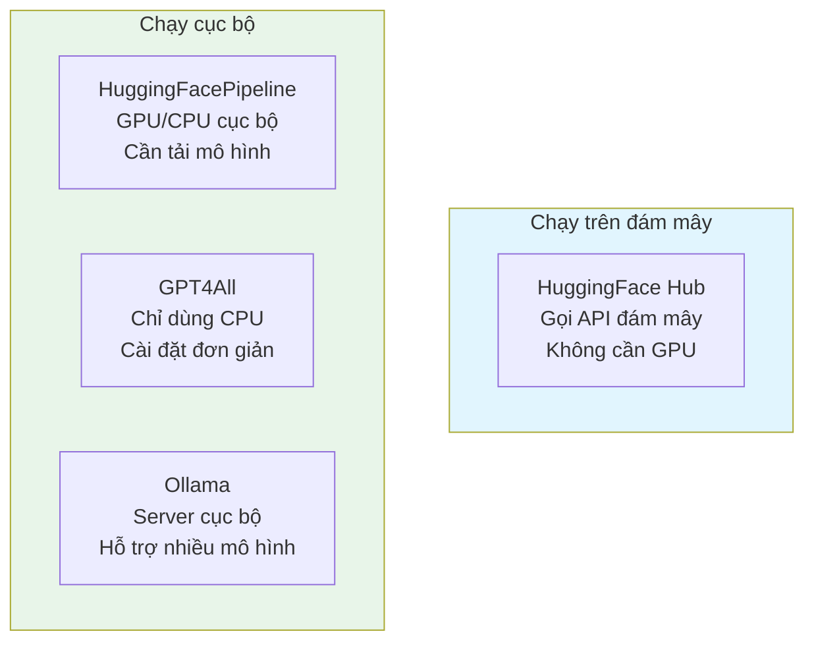
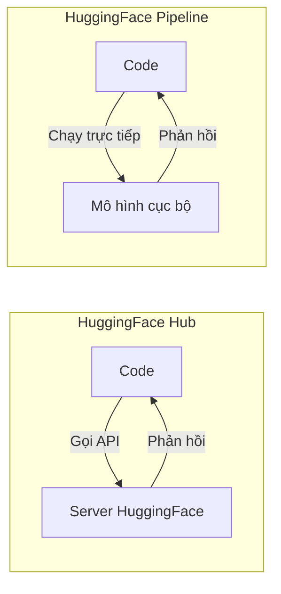
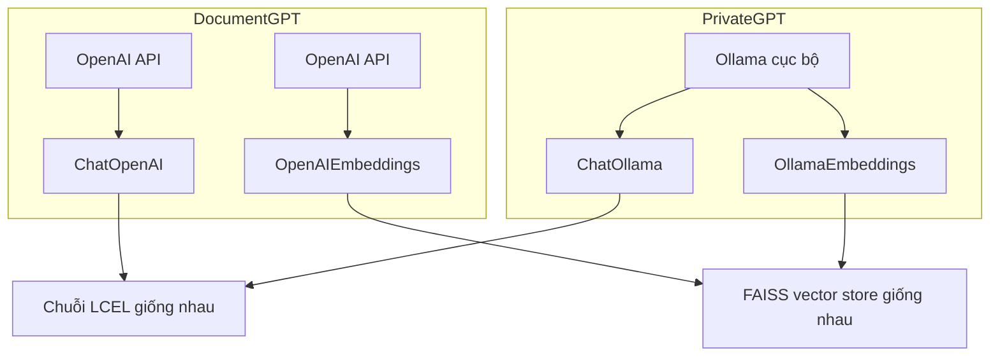

# Chapter 06: Alternative Providers - Sử dụng LLM mã nguồn mở

## Mục tiêu học tập

Sau khi hoàn thành chương này, bạn có thể:

- Hiểu đặc điểm và sự khác biệt của các nhà cung cấp LLM ngoài OpenAI
- Sử dụng mô hình mã nguồn mở trên đám mây thông qua HuggingFace Hub
- Chạy mô hình trực tiếp cục bộ bằng HuggingFacePipeline
- Thiết lập và sử dụng GPT4All và Ollama
- Tạo PrivateGPT - chatbot RAG hoạt động hoàn toàn cục bộ

---

## Giải thích khái niệm cốt lõi

### Tại sao cần nhà cung cấp thay thế?

Mô hình GPT của OpenAI rất mạnh mẽ nhưng có một số hạn chế:

1. **Chi phí**: Phát sinh phí mỗi lần gọi API
2. **Quyền riêng tư**: Dữ liệu được gửi đến máy chủ OpenAI
3. **Phụ thuộc internet**: Không thể sử dụng offline
4. **Cần API key**: Cần tài khoản và phương thức thanh toán

Sử dụng LLM mã nguồn mở, bạn có thể tạo ứng dụng AI mà không có những hạn chế này.

### So sánh theo nhà cung cấp



| Nhà cung cấp | Vị trí chạy | Cần GPU | Cần internet | Độ khó |
|-----------|----------|---------|------------|--------|
| HuggingFace Hub | Đám mây | X | O | Dễ |
| HuggingFacePipeline | Cục bộ | Khuyến nghị | Lần đầu tiên | Trung bình |
| GPT4All | Cục bộ | X | Lần đầu tiên | Dễ |
| Ollama | Cục bộ | X | Lần đầu tiên | Dễ |

---

## Giải thích code theo từng commit

### 6.1 HuggingFaceHub (`bda470a`)

HuggingFace Hub là nền tảng lưu trữ hàng ngàn mô hình mã nguồn mở. Chạy mô hình trên đám mây thông qua API.

```python
from langchain_community.llms import HuggingFaceHub
from langchain_core.prompts import PromptTemplate

prompt = PromptTemplate.from_template("[INST]What is the meaning of {word}[/INST]")

llm = HuggingFaceHub(
    repo_id="mistralai/Mistral-7B-Instruct-v0.1",
    model_kwargs={
        "max_new_tokens": 250,
    },
)

chain = prompt | llm

chain.invoke({"word": "potato"})
```

**Phân tích code:**

- **`repo_id`**: ID kho lưu trữ mô hình trên HuggingFace. Ở đây sử dụng mô hình instruction 7B tham số của Mistral AI
- **`[INST]...[/INST]`**: Định dạng prompt đặc biệt của mô hình Mistral. Mỗi mô hình có định dạng prompt kỳ vọng khác nhau
- **`max_new_tokens`**: Giới hạn số token tối đa được tạo ra
- **Chuỗi LCEL**: Pipeline `prompt | llm` hoàn toàn giống với OpenAI. Nhờ khả năng trừu tượng hóa của LangChain, cấu trúc chuỗi vẫn giữ nguyên khi thay đổi nhà cung cấp

> **Giải thích thuật ngữ:** "7B" nghĩa là mô hình có 7 tỷ (7 Billion) tham số. Càng nhiều tham số thì mô hình thường càng thông minh, nhưng cần nhiều tài nguyên tính toán hơn.

**Chuẩn bị trước:**
```bash
pip install langchain-community huggingface_hub
```
Cần đặt token API HuggingFace vào biến môi trường `HUGGINGFACEHUB_API_TOKEN`.

---

### 6.2 HuggingFacePipeline (`804ac75`)

Lần này **tải mô hình về máy tính cục bộ** và chạy. Có thể sử dụng mà không cần kết nối internet.

```python
from langchain_community.llms import HuggingFacePipeline
from langchain_core.prompts import PromptTemplate

prompt = PromptTemplate.from_template("A {word} is a")

llm = HuggingFacePipeline.from_model_id(
    model_id="gpt2",
    task="text-generation",
    pipeline_kwargs={"max_new_tokens": 150},
)

chain = prompt | llm

chain.invoke({"word": "tomato"})
```

**Phân tích code:**

- **`HuggingFacePipeline.from_model_id`**: Chỉ định model ID sẽ tự động tải về và chạy cục bộ
- **`model_id="gpt2"`**: Mô hình GPT-2 của OpenAI. Nhỏ và nhẹ nên phù hợp để thử nghiệm
- **`task="text-generation"`**: Chỉ định mục đích sử dụng mô hình trên HuggingFace. Có nhiều task đa dạng như sinh văn bản, dịch thuật, tóm tắt

**Sự khác biệt giữa HuggingFace Hub vs Pipeline:**



> **Lưu ý:** GPT-2 là mô hình rất cũ nên chất lượng câu trả lời không tốt. Trong sản phẩm thực tế, hãy sử dụng các mô hình mới như Llama, Mistral. Tuy nhiên các mô hình này có dung lượng vài GB nên mất thời gian tải về.

---

### 6.3 GPT4All (`ff08536`)

GPT4All là giải pháp LLM cục bộ có thể chạy chỉ với CPU. Ưu điểm là có thể sử dụng trên máy tính không có GPU.

```python
from langchain_community.llms import GPT4All
from langchain_core.prompts import PromptTemplate

prompt = PromptTemplate.from_template(
    "You are a helpful assistant that defines words. Define this word: {word}."
)

llm = GPT4All(
    model="./falcon.bin",
)

chain = prompt | llm

chain.invoke({"word": "tomato"})
```

**Phân tích code:**

- **`model="./falcon.bin"`**: Chỉ định đường dẫn file mô hình đã tải về cục bộ
- Định dạng prompt tự nhiên hơn. Các mô hình của GPT4All thường hỗ trợ định dạng prompt tiêu chuẩn
- Không cần API key riêng

**Cài đặt GPT4All và tải mô hình:**

```bash
pip install gpt4all
# Tải file mô hình từ trang chính thức GPT4All
# https://gpt4all.io/
```

> **Tham khảo:** GPT4All sử dụng mô hình đã lượng tử hóa (quantized). Lượng tử hóa là kỹ thuật chuyển đổi trọng số mô hình sang độ chính xác thấp hơn để giảm kích thước file và mức sử dụng bộ nhớ. Chất lượng giảm nhẹ nhưng có thể chạy trên máy tính thông thường.

---

### 6.4 Ollama (`bf6c317`)

Ollama là công cụ sử dụng LLM cục bộ tiện lợi nhất. Giống như Docker, cài đặt và chạy mô hình chỉ với một dòng lệnh.

**Code trong notebook.ipynb giống với 6.3**, nhưng điểm cốt lõi của commit này là file **`pages/02_PrivateGPT.py`**.

#### PrivateGPT - Chatbot RAG cục bộ hoàn chỉnh

```python
from langchain_community.chat_models import ChatOllama
from langchain_community.embeddings import OllamaEmbeddings

llm = ChatOllama(
    model="mistral:latest",
    temperature=0.1,
    streaming=True,
    callbacks=[ChatCallbackHandler()],
)

@st.cache_data(show_spinner="Embedding file...")
def embed_file(file):
    # ... lưu file và phân tách ...
    embeddings = OllamaEmbeddings(model="mistral:latest")
    cached_embeddings = CacheBackedEmbeddings.from_bytes_store(embeddings, cache_dir)
    vectorstore = FAISS.from_documents(docs, cached_embeddings)
    retriever = vectorstore.as_retriever()
    return retriever
```

**Sự khác biệt cốt lõi so với DocumentGPT:**

| Hạng mục | DocumentGPT | PrivateGPT |
|------|------------|------------|
| LLM | `ChatOpenAI` (OpenAI API) | `ChatOllama` (Ollama cục bộ) |
| Embedding | `OpenAIEmbeddings` | `OllamaEmbeddings` |
| Internet | Cần | Không cần |
| API key | Cần | Không cần |
| Chi phí | Có phí | Miễn phí |
| Chất lượng phản hồi | Cao | Trung bình |

Phần còn lại của cấu trúc code (chuỗi, lịch sử chat, streaming) **gần như giống hệt DocumentGPT**. Đây là sức mạnh trừu tượng hóa của LangChain. Chỉ cần thay thế đối tượng LLM và embedding, phần code còn lại có thể tái sử dụng nguyên vẹn.



**Cài đặt Ollama và tải mô hình:**

```bash
# macOS
brew install ollama

# Tải và chạy mô hình
ollama pull mistral
ollama run mistral
```

**Cấu trúc prompt cũng hơi khác:**

```python
prompt = ChatPromptTemplate.from_template(
    """Answer the question using ONLY the following context and not your training data.
    If you don't know the answer just say you don't know. DON'T make anything up.

    Context: {context}
    Question:{question}
    """
)
```

DocumentGPT sử dụng `from_messages`, nhưng PrivateGPT sử dụng `from_template`. Mô hình cục bộ thường hoạt động tốt hơn với prompt đơn thay vì phân biệt tin nhắn system/user.

---

## Phương thức trước đây vs hiện tại

| Hạng mục | LangChain 0.x (trước đây) | LangChain 1.x (hiện tại) |
|------|---------------------|---------------------|
| HuggingFace Hub | `from langchain.llms import HuggingFaceHub` | `from langchain_community.llms import HuggingFaceHub` |
| HuggingFace Pipeline | `from langchain.llms import HuggingFacePipeline` | `from langchain_community.llms import HuggingFacePipeline` |
| GPT4All | `from langchain.llms import GPT4All` | `from langchain_community.llms import GPT4All` |
| Ollama (LLM) | `from langchain.llms import Ollama` | `from langchain_community.llms import Ollama` |
| Ollama (Chat) | Không có | `from langchain_community.chat_models import ChatOllama` |
| Ollama Embeddings | `from langchain.embeddings import OllamaEmbeddings` | `from langchain_community.embeddings import OllamaEmbeddings` |
| Cấu trúc package | Mọi thứ trong package `langchain` | Module cộng đồng tách sang `langchain-community` |

> **Thay đổi cốt lõi:** Trong LangChain 1.x, tất cả nhà cung cấp cộng đồng đã được tách sang package `langchain-community`. Cần cài đặt riêng bằng `pip install langchain-community`.

---

## Bài tập thực hành

### Bài tập 1: So sánh mô hình Ollama

Tải hai mô hình trở lên từ Ollama (ví dụ: `mistral`, `llama2`) và so sánh phản hồi với cùng câu hỏi.

**Yêu cầu:**
- Thêm `st.selectbox` chọn mô hình vào Streamlit
- So sánh thời gian phản hồi và chất lượng của mỗi mô hình với cùng câu hỏi
- Hiển thị thông tin mô hình (tên, số tham số) trong `st.sidebar`

### Bài tập 2: Cải thiện PrivateGPT

Thêm các tính năng sau vào PrivateGPT:

1. Thêm thanh trượt `temperature` vào sidebar (0.0 ~ 1.0)
2. Thêm định dạng file `.csv` vào các loại file có thể upload
3. Hiển thị tên mô hình đang sử dụng trong sidebar

---

## Giới thiệu chương tiếp theo

Trong Chapter 07, chúng ta sẽ tạo **QuizGPT**. Tìm kiếm thông tin từ Wikipedia và LLM tự động tạo quiz. Bạn sẽ học cách parse đầu ra LLM sang JSON, cách kết nối hai chuỗi, và cách sử dụng **Function Calling** (đầu ra có cấu trúc) của OpenAI.
