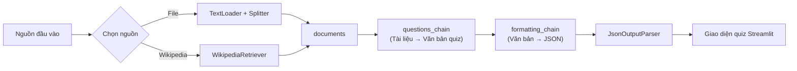
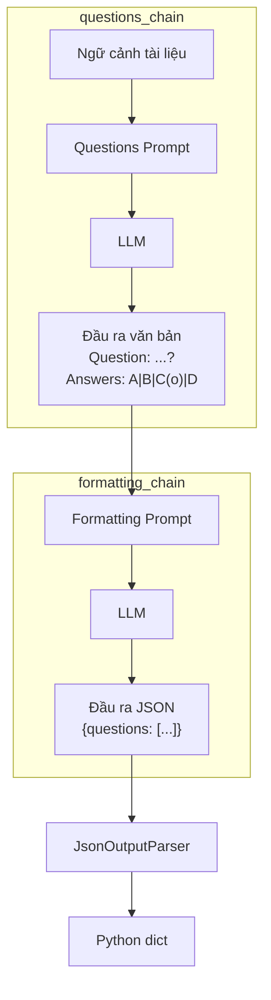
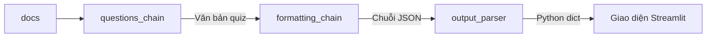
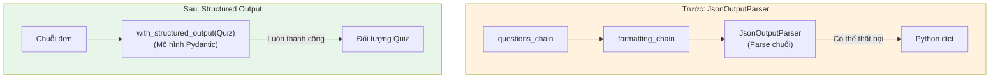

# Chapter 07: QuizGPT - Trình tạo quiz AI

## Mục tiêu học tập

Sau khi hoàn thành chương này, bạn có thể:

- Tìm kiếm tài liệu từ Wikipedia bằng `WikipediaRetriever`
- Kết nối hai chuỗi LCEL để xây dựng pipeline phức tạp
- Tạo `JsonOutputParser` tùy chỉnh để chuyển đổi đầu ra LLM thành dữ liệu có cấu trúc
- Hiểu chiến lược caching với `@st.cache_data`
- Có được đầu ra có cấu trúc ổn định bằng `with_structured_output` (Function Calling) của OpenAI
- Tạo giao diện quiz tương tác bằng `st.form` và `st.radio` của Streamlit

---

## Giải thích khái niệm cốt lõi

### Kiến trúc QuizGPT

QuizGPT có cấu trúc nối tiếp hai chuỗi. Chuỗi đầu tiên tạo câu hỏi dạng văn bản từ tài liệu, chuỗi thứ hai chuyển đổi văn bản đó thành JSON.



### Phân tách vai trò hai chuỗi



**Tại sao tách thành hai chuỗi?**

Nếu yêu cầu LLM "đọc tài liệu, tạo quiz, và xuất JSON" cùng một lúc, xác suất thất bại cao. Khi tách tác vụ:
1. LLM tập trung vào một tác vụ duy nhất ở mỗi bước
2. Dễ debug (có thể xác định vấn đề xảy ra ở bước nào)
3. Có thể kiểm tra kết quả trung gian

---

## Giải thích code theo từng commit

### 7.1 WikipediaRetriever (`65f2af8`)

Tạo khung cơ bản của QuizGPT. Hỗ trợ hai nguồn đầu vào: upload file và tìm kiếm Wikipedia.

```python
from langchain_community.retrievers import WikipediaRetriever

st.set_page_config(page_title="QuizGPT", page_icon="❓")
st.title("QuizGPT")

@st.cache_data(show_spinner="Loading file...")
def split_file(file):
    file_content = file.read()
    file_path = f"./.cache/quiz_files/{file.name}"
    with open(file_path, "wb") as f:
        f.write(file_content)
    splitter = CharacterTextSplitter.from_tiktoken_encoder(
        separator="\n", chunk_size=600, chunk_overlap=100,
    )
    loader = TextLoader(file_path)
    docs = loader.load_and_split(text_splitter=splitter)
    return docs

with st.sidebar:
    choice = st.selectbox(
        "Choose what you want to use.",
        ("File", "Wikipedia Article"),
    )
    if choice == "File":
        file = st.file_uploader(
            "Upload a .docx , .txt or .pdf file",
            type=["pdf", "txt", "docx"],
        )
        if file:
            docs = split_file(file)
            st.write(docs)
    else:
        topic = st.text_input("Search Wikipedia...")
        if topic:
            retriever = WikipediaRetriever(top_k_results=5)
            with st.status("Searching Wikipedia..."):
                docs = retriever.invoke(topic)
```

**Khái niệm cốt lõi:**

- **`WikipediaRetriever`**: Công cụ tìm kiếm Wikipedia do LangChain cung cấp. `top_k_results=5` lấy 5 tài liệu hàng đầu
- **`retriever.invoke(topic)`**: Truyền từ khóa tìm kiếm và trả về các trang Wikipedia liên quan dưới dạng danh sách đối tượng `Document`
- **`st.status`**: Container hiển thị trạng thái tiến trình. Thông báo cho người dùng biết đang tìm kiếm
- **Chọn nguồn bằng `st.selectbox`**: Người dùng có thể chọn giữa upload file và tìm kiếm Wikipedia

> **Giải thích thuật ngữ:** `Retriever` là giao diện nhận truy vấn (query) và trả về tài liệu liên quan. Cả `as_retriever()` của vector store lẫn WikipediaRetriever đều triển khai cùng giao diện nên dễ dàng thay thế.

---

### 7.2 GPT-4 Turbo (`9787dee`)

Thiết lập ChatOpenAI.

```python
llm = ChatOpenAI(
    base_url=os.getenv("OPENAI_BASE_URL"),
    api_key=os.getenv("OPENAI_API_KEY"),
    model="gpt-5.1",
    temperature=0.1,
    streaming=True,
    callbacks=[StreamingStdOutCallbackHandler()],
)
```

Ở đây sử dụng `StreamingStdOutCallbackHandler` để **xuất ra terminal** thay vì streaming lên giao diện Streamlit. Khác với chat, tạo quiz cần hiển thị trên UI sau khi toàn bộ kết quả hoàn thành, nên xuất ra terminal để debug trong quá trình phát triển.

---

### 7.3 Questions Prompt (`a6cbb0d`)

Tạo prompt và chuỗi để sinh câu hỏi quiz.

```python
def format_docs(docs):
    return "\n\n".join(document.page_content for document in docs)

prompt = ChatPromptTemplate.from_messages([
    ("system", """
    You are a helpful assistant that is role playing as a teacher.

    Based ONLY on the following context make 10 questions to test the
    user's knowledge about the text.

    Each question should have 4 answers, three of them must be incorrect
    and one should be correct.

    Use (o) to signal the correct answer.

    Question examples:

    Question: What is the color of the ocean?
    Answers: Red|Yellow|Green|Blue(o)

    Question: What is the capital or Georgia?
    Answers: Baku|Tbilisi(o)|Manila|Beirut

    Your turn!

    Context: {context}
    """)
])

chain = {"context": format_docs} | prompt | llm

start = st.button("Generate Quiz")
if start:
    chain.invoke(docs)
```

**Điểm cốt lõi trong thiết kế prompt:**

1. **Gán vai trò**: Chỉ định vai trò "teacher" để tạo câu hỏi mang tính giáo dục
2. **Chỉ định định dạng**: Định nghĩa định dạng rõ ràng: dùng `(o)` phân biệt đáp án đúng, dùng `|` phân tách các câu trả lời
3. **Cung cấp ví dụ**: Few-shot prompting cho mô hình thấy định dạng đầu ra mong muốn
4. **Ràng buộc**: "Based ONLY on the following context" để ngăn chặn ảo giác (hallucination)

**Cấu trúc chuỗi:**

```python
{"context": format_docs} | prompt | llm
```

Ở đây `{"context": format_docs}` là `RunnableParallel`. Nhận danh sách `docs`, chuyển đổi bằng hàm `format_docs` và ánh xạ kết quả vào key `context`.

---

### 7.4 Formatter Prompt (`ba1dc05`)

Thêm chuỗi thứ hai để chuyển đổi đầu ra văn bản của chuỗi đầu tiên thành JSON.

```python
questions_chain = {"context": format_docs} | questions_prompt | llm

formatting_prompt = ChatPromptTemplate.from_messages([
    ("system", """
    You are a powerful formatting algorithm.

    You format exam questions into JSON format.
    Answers with (o) are the correct ones.

    Example Input:

    Question: What is the color of the ocean?
    Answers: Red|Yellow|Green|Blue(o)

    Example Output:

    ```json
    {{ "questions": [
            {{
                "question": "What is the color of the ocean?",
                "answers": [
                        {{
                            "answer": "Red",
                            "correct": false
                        }},
                        {{
                            "answer": "Blue",
                            "correct": true
                        }}
                ]
            }}
        ]
     }}
    ```
    Your turn!

    Questions: {context}
    """)
])

formatting_chain = formatting_prompt | llm
```

**Điểm cần lưu ý:**

- Khi sử dụng dấu ngoặc nhọn JSON `{}` trong prompt, phải escape bằng `{{ }}`. Vì LangChain nhận diện `{variable}` là biến template.
- Gán vai trò "formatting algorithm" để tập trung vào chuyển đổi định dạng chính xác thay vì câu trả lời sáng tạo

---

### 7.5 Output Parser (`7a31123`)

Tạo parser tùy chỉnh để chuyển đổi chuỗi JSON đầu ra của LLM thành dictionary Python.

```python
import json
from langchain_core.output_parsers import BaseOutputParser

class JsonOutputParser(BaseOutputParser):
    def parse(self, text):
        text = text.replace("```", "").replace("json", "")
        return json.loads(text)

output_parser = JsonOutputParser()
```

**Tại sao cần parser tùy chỉnh?**

LLM khi trả về JSON thường bọc trong khối code markdown:

```
```json
{"questions": [...]}
```
```

Phương thức `parse` loại bỏ ` ``` ` và văn bản `json`, sau đó parse bằng `json.loads()`.

**Giao diện `BaseOutputParser`:**

Khi kế thừa `BaseOutputParser`, có thể kết nối trực tiếp bằng toán tử `|` trong chuỗi LCEL. Chỉ cần triển khai phương thức `parse`.

---

### 7.6 Caching (`5cbcbb6`)

Kết hợp tất cả các thành phần và áp dụng caching để tránh gọi API lặp lại với cùng đầu vào.

```python
@st.cache_data(show_spinner="Making quiz...")
def run_quiz_chain(_docs, topic):
    chain = {"context": questions_chain} | formatting_chain | output_parser
    return chain.invoke(_docs)

@st.cache_data(show_spinner="Searching Wikipedia...")
def wiki_search(term):
    retriever = WikipediaRetriever(top_k_results=5)
    docs = retriever.invoke(term)
    return docs
```

**Chiến lược caching:**

- **`@st.cache_data`**: Nếu tham số hàm giống nhau thì tái sử dụng kết quả trước đó
- **Tham số `_docs`**: Tham số bắt đầu bằng gạch dưới (`_`) thì Streamlit không hash. Vì đối tượng `Document` khó hash nên sử dụng phương pháp này
- **Tham số `topic`**: Được sử dụng làm cache key thực tế. Cùng topic sẽ trả về cùng quiz

**Cấu trúc chuỗi cuối cùng:**

```python
chain = {"context": questions_chain} | formatting_chain | output_parser
```

Một dòng này là toàn bộ pipeline:
1. `questions_chain` đọc tài liệu và tạo văn bản quiz
2. Văn bản đó đi vào `{context}` của `formatting_chain` để chuyển thành JSON
3. `output_parser` parse chuỗi JSON thành dictionary Python



---

### 7.7 Grading Questions (`7d017ba`)

Tạo giao diện quiz bằng `st.form` và `st.radio` của Streamlit, và triển khai chức năng chấm điểm.

```python
if not docs:
    st.markdown("""
    Welcome to QuizGPT.
    I will make a quiz from Wikipedia articles or files you upload
    to test your knowledge and help you study.
    Get started by uploading a file or searching on Wikipedia in the sidebar.
    """)
else:
    response = run_quiz_chain(docs, topic if topic else file.name)
    with st.form("questions_form"):
        for question in response["questions"]:
            st.write(question["question"])
            value = st.radio(
                "Select an option.",
                [answer["answer"] for answer in question["answers"]],
                index=None,
            )
            if {"answer": value, "correct": True} in question["answers"]:
                st.success("Correct!")
            elif value is not None:
                st.error("Wrong!")
        button = st.form_submit_button()
```

**Phân tích component UI:**

- **`st.form`**: Thay đổi widget trong form không chạy lại script ngay lập tức. Chỉ chạy lại khi nhấn nút "Submit". Hữu ích khi cần gửi nhiều câu trả lời cùng lúc như quiz.
- **`st.radio`**: Tạo UI chọn đơn bằng nút radio. `index=None` tạo trạng thái ban đầu chưa chọn gì.
- **Logic chấm điểm**: `{"answer": value, "correct": True} in question["answers"]` kiểm tra lựa chọn của người dùng có nằm trong danh sách đáp án đúng không.
- **`st.success` / `st.error`**: Hiển thị hộp thông báo màu xanh/đỏ.

---

### 7.8 Function Calling (`5372c9d`)

Khám phá phương pháp sử dụng **Structured Output** (đầu ra có cấu trúc) của OpenAI thay vì `JsonOutputParser` tùy chỉnh. Code này được thử nghiệm trong `notebook.ipynb`.

```python
from pydantic import BaseModel, Field

class Answer(BaseModel):
    answer: str
    correct: bool

class Question(BaseModel):
    question: str
    answers: list[Answer]

class Quiz(BaseModel):
    """A quiz with a list of questions and answers."""
    questions: list[Question]

llm = ChatOpenAI(
    base_url=os.getenv("OPENAI_BASE_URL"),
    api_key=os.getenv("OPENAI_API_KEY"),
    model="gpt-5.1",
    temperature=0.1,
).with_structured_output(Quiz)

prompt = PromptTemplate.from_template("Make a quiz about {city}")

chain = prompt | llm

response = chain.invoke({"city": "rome"})
```

**So sánh Function Calling vs JsonOutputParser:**



| Hạng mục | JsonOutputParser (trước) | Structured Output (sau) |
|------|----------------------|------------------------|
| Số chuỗi | 2 (tạo câu hỏi + chuyển JSON) | 1 |
| Đảm bảo định dạng đầu ra | LLM có thể tạo JSON sai | Bắt buộc theo schema Pydantic |
| An toàn kiểu dữ liệu | `dict` (có thể lỗi runtime) | Mô hình Pydantic (xác thực kiểu) |
| Xử lý lỗi | `json.loads` có thể thất bại | OpenAI đảm bảo đầu ra đúng schema |

**Giải thích mô hình Pydantic:**

- **`BaseModel`**: Lớp cơ sở của Pydantic. Định nghĩa cấu trúc và kiểu dữ liệu
- **`Answer`**: Một câu trả lời (văn bản + đúng/sai)
- **`Question`**: Một câu hỏi (văn bản câu hỏi + danh sách câu trả lời)
- **`Quiz`**: Toàn bộ quiz (danh sách câu hỏi)
- **`with_structured_output(Quiz)`**: Bắt buộc LLM tạo đầu ra đúng schema `Quiz`

> **Giải thích thuật ngữ:** **Function Calling** là tính năng do OpenAI giới thiệu, cho phép chỉ thị LLM "trả về dữ liệu theo dạng này". Trong LangChain có thể sử dụng dễ dàng qua phương thức `with_structured_output()`.

---

### 7.9 Conclusions (`6d4121c`)

Phiên bản cuối cùng giống với code ở 7.6. Phương thức Function Calling chỉ giữ lại như thử nghiệm trong notebook, ứng dụng QuizGPT thực tế vẫn duy trì phương thức hai chuỗi + JsonOutputParser.

---

## Phương thức trước đây vs hiện tại

| Hạng mục | LangChain 0.x (trước đây) | LangChain 1.x (hiện tại) |
|------|---------------------|---------------------|
| Tìm kiếm Wikipedia | `from langchain.retrievers import WikipediaRetriever` | `from langchain_community.retrievers import WikipediaRetriever` |
| Output Parser | `from langchain.schema import BaseOutputParser` | `from langchain_core.output_parsers import BaseOutputParser` |
| Kết nối chuỗi | `SequentialChain([chain1, chain2])` | LCEL: `{"context": chain1} \| chain2 \| parser` |
| Function Calling | `llm.bind(functions=[...])` + định nghĩa schema thủ công | `llm.with_structured_output(PydanticModel)` |
| Callback | `from langchain.callbacks import StreamingStdOutCallbackHandler` | `from langchain_core.callbacks import StreamingStdOutCallbackHandler` |
| Tìm kiếm tài liệu | `retriever.get_relevant_documents(query)` | `retriever.invoke(query)` |

---

## Bài tập thực hành

### Bài tập 1: Tính năng chọn độ khó

Thêm chọn độ khó (`st.selectbox`) vào sidebar. Có thể chọn "Easy", "Medium", "Hard", và thay đổi prompt tùy theo độ khó để điều chỉnh mức độ câu hỏi.

**Gợi ý:**
- Easy: "Make questions that a 10-year-old could answer"
- Hard: "Make questions that require deep expertise"
- Bao gồm thông tin độ khó trong tin nhắn system của prompt

### Bài tập 2: Chuyển sang phương thức Function Calling

Áp dụng phương thức `with_structured_output(Quiz)` đã thử nghiệm trong notebook vào ứng dụng QuizGPT thực tế.

**Yêu cầu:**
- Định nghĩa mô hình Pydantic (`Quiz`, `Question`, `Answer`)
- Thay thế hai chuỗi + JsonOutputParser bằng một chuỗi + `with_structured_output`
- Giữ nguyên giao diện quiz hiện có (sử dụng `.model_dump()` của mô hình Pydantic)

---

## Giới thiệu chương tiếp theo

Trong Chapter 08, chúng ta sẽ tạo **SiteGPT**. Sử dụng `AsyncChromiumLoader` và `SitemapLoader` để tự động thu thập nội dung website, và triển khai chuỗi **Map Re-Rank** để tìm câu trả lời liên quan nhất từ nhiều tài liệu. Hãy kết hợp web scraping và LLM để tạo chatbot có thể trả lời câu hỏi về bất kỳ website nào.
