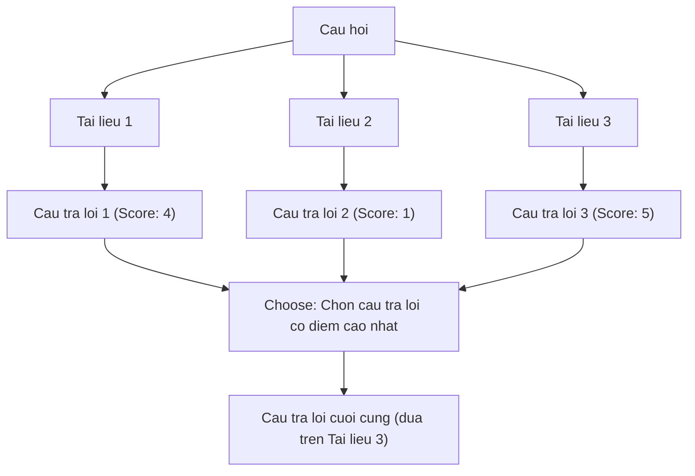

# Chapter 08: SiteGPT

## Muc tieu hoc tap

Sau khi hoan thanh chapter nay, ban co the:

- Su dung **SitemapLoader** de tu dong thu thap tat ca cac trang cua mot website
- Su dung ham **parse_page** de loai bo cac thanh phan khong can thiet trong HTML va trich xuat van ban sach
- Hieu va trien khai mo hinh **Map Re-Rank chain**
- Xay dung pipeline tao cau tra loi tu nhieu tai lieu, cham diem va chon cau tra loi toi uu

---

## Giai thich cac khai niem cot loi

### SiteGPT la gi?

SiteGPT la mot chatbot doc sitemap.xml cua website de thu thap tat ca cac trang, sau do tra loi cau hoi cua nguoi dung dua tren noi dung cua website do.

```mermaid
flowchart LR
    A[Nguoi dung: Nhap URL Sitemap] --> B[Thu thap trang bang SitemapLoader]
    B --> C[Lam sach van ban bang parse_page]
    C --> D[Tach van ban + FAISS vector store]
    D --> E[Cau hoi cua nguoi dung]
    E --> F[Tim kiem tai lieu lien quan]
    F --> G[Tao cau tra loi + diem cho tung tai lieu]
    G --> H[Chon cau tra loi co diem cao nhat]
    H --> I[Xuat cau tra loi cuoi cung]
```



### Mo hinh Map Re-Rank

Khai niem cot loi cua chapter nay la mo hinh **Map Re-Rank**. Phuong phap Stuff thong thuong dua tat ca tai lieu vao mot prompt duy nhat, trong khi Map Re-Rank tao cau tra loi doc lap cho tung tai lieu, sau do chon cau tra loi toi uu dua tren diem so.



---

## Giai thich code theo tung commit

### 8.1 AsyncChromiumLoader

**Commit:** `d07cd31`

Buoc dau tien thiet lap cau truc co ban de tai website. Import `SitemapLoader` va tao giao dien nhap URL tren thanh sidebar cua Streamlit.

```python
from langchain_community.document_loaders import SitemapLoader

st.set_page_config(
    page_title="SiteGPT",
    page_icon="🖥️",
)

with st.sidebar:
    url = st.text_input(
        "Write down a URL",
        placeholder="https://example.com",
    )

if url:
    loader = SitemapLoader(url)
    docs = loader.load()
    st.write(docs)
```

> **Luu y:** Trong bai giang co gioi thieu `AsyncChromiumLoader`, nhung code cuoi cung chi su dung `SitemapLoader`. `AsyncChromiumLoader` huu ich khi can lay trang da duoc render JavaScript, nhung cach tiep can dua tren sitemap hieu qua hon.

### 8.2 SitemapLoader

**Commit:** `8aa9ee4`

Xay dung toan bo pipeline. Thiet lap LLM, prompt, vector store va chain.

**answers_prompt** - Prompt tao cau tra loi va diem so cho tung tai lieu:

```python
answers_prompt = ChatPromptTemplate.from_template(
    """
    Using ONLY the following context answer the user's question. If you can't just say you don't know, don't make anything up.

    Then, give a score to the answer between 0 and 5.
    ...
    Context: {context}
    ...
    Question: {question}
"""
)
```

**Ham get_answers** - Tao cau tra loi doc lap cho tung tai lieu:

```python
def get_answers(inputs):
    docs = inputs["docs"]
    question = inputs["question"]
    answers_chain = answers_prompt | llm
    return {
        "question": question,
        "answers": [
            {
                "answer": answers_chain.invoke(
                    {"question": question, "context": doc.page_content}
                ).content,
                "source": doc.metadata["source"],
                "date": doc.metadata["lastmod"],
            }
            for doc in docs
        ],
    }
```

Diem chinh:
- Goi LLM **doc lap** cho tung tai lieu (`doc`)
- Bao toan metadata **nguon (source)** va **ngay (date)** cung voi cau tra loi

**choose_prompt** va **choose_answer** - Chon cau tra loi toi uu trong so nhieu cau tra loi:

```python
choose_prompt = ChatPromptTemplate.from_messages(
    [
        (
            "system",
            """
            Use ONLY the following pre-existing answers to answer the user's question.
            Use the answers that have the highest score (more helpful) and favor the most recent ones.
            Cite sources and return the sources of the answers as they are, do not change them.
            Answers: {answers}
            """,
        ),
        ("human", "{question}"),
    ]
)
```

### 8.3 Parsing Function

**Commit:** `ddd4a94`

Them ham phan tich cu phap de loai bo header/footer khong can thiet tu HTML cua trang web:

```python
def parse_page(soup):
    header = soup.find("header")
    footer = soup.find("footer")
    if header:
        header.decompose()
    if footer:
        footer.decompose()
    return (
        str(soup.get_text())
        .replace("\n", " ")
        .replace("\xa0", " ")
        .replace("CloseSearch Submit Blog", "")
    )
```

Ham nay duoc truyen vao tham so `parsing_function` cua `SitemapLoader`:

```python
loader = SitemapLoader(
    url,
    parsing_function=parse_page,
)
```

**Tai sao can phan tich cu phap?**
- Trang web chua nhieu thanh phan khong can thiet cho viec tra loi cau hoi nhu thanh dieu huong, footer, quang cao
- Can loai bo nhung nhieu nay de tang do chinh xac cua tim kiem vector
- Cung can xu ly cac ky tu dac biet nhu `\xa0` (non-breaking space)

### 8.4~8.5 Map Re-Rank Chain

**Commit:** `dc95d87`, `f6d9a02`

Ket noi toan bo chain bang LCEL:

```python
chain = (
    {
        "docs": retriever,
        "question": RunnablePassthrough(),
    }
    | RunnableLambda(get_answers)
    | RunnableLambda(choose_answer)
)
result = chain.invoke(query)
```

**Luong thuc thi:**

1. `retriever` tim kiem cac tai lieu lien quan den cau hoi
2. `RunnablePassthrough()` truyen cau hoi goc nguyen ven
3. `get_answers` tao cau tra loi + diem so cho tung tai lieu
4. `choose_answer` chon cau tra loi co diem cao nhat de tao cau tra loi cuoi cung

### 8.6 Code Challenge

**Commit:** `a450edf`

Cache viec tai website bang `@st.cache_data` va them kiem tra phan mo rong `.xml`:

```python
@st.cache_data(show_spinner="Loading website...")
def load_website(url):
    splitter = RecursiveCharacterTextSplitter.from_tiktoken_encoder(
        chunk_size=1000,
        chunk_overlap=200,
    )
    loader = SitemapLoader(
        url,
        parsing_function=parse_page,
    )
    loader.requests_per_second = 2
    docs = loader.load_and_split(text_splitter=splitter)
    vector_store = FAISS.from_documents(docs, OpenAIEmbeddings(...))
    return vector_store.as_retriever()
```

- `requests_per_second = 2`: Gioi han toc do yeu cau de khong gay qua tai cho server
- `@st.cache_data`: Tranh tai lai lap khi truy cap cung URL

---

## So sanh phuong phap cu va phuong phap moi

| Hang muc | Phuong phap Stuff (Chapter 04) | Phuong phap Map Re-Rank (Chapter 08) |
|------|------------------------|------------------------------|
| **Xu ly tai lieu** | Dua tat ca tai lieu vao mot prompt duy nhat | Goi LLM doc lap cho tung tai lieu |
| **Cua so ngu canh** | Vuot gioi han token khi co nhieu tai lieu | Xu ly doc lap tung tai lieu nen khong bi gioi han |
| **Chat luong cau tra loi** | Tai lieu khong lien quan tao nhieu | Chon cau tra loi toi uu dua tren diem so |
| **Theo doi nguon** | Kho khan | Bao toan metadata source/date cho tung cau tra loi |
| **Chi phi** | 1 lan goi LLM | N+1 lan goi LLM (so tai lieu + chon) |
| **Nguon du lieu** | Upload file | Sitemap cua website |

---

## Bai tap thuc hanh

### Bai tap 1: Them chuc nang loc

Su dung tham so `filter_urls` cua `SitemapLoader` de chi tai cac trang thuoc duong dan cu the.

```python
# Goi y: Co the truyen danh sach bieu thuc chinh quy vao filter_urls
loader = SitemapLoader(
    url,
    parsing_function=parse_page,
    filter_urls=["https://example.com/blog/.*"],  # Chi tai cac trang blog
)
```

### Bai tap 2: Hien thi diem cau tra loi

Hien tai chi hien thi cau tra loi cuoi cung. Hay hien thi ket qua cua `get_answers` tren giao dien Streamlit de nguoi dung co the xem cau tra loi va diem so cua tung tai lieu. Co the su dung `st.expander` de hien thi gon gang.

---

## Gioi thieu chapter tiep theo

Trong **Chapter 09: MeetingGPT**, chung ta se trich xuat audio tu file video, chuyen doi thanh van ban bang OpenAI Whisper, sau do tom tat bien ban hop dai bang mo hinh **Refine Chain**. Ban se hoc cach ket hop cac cong cu xu ly da phuong tien nhu ffmpeg, pydub voi LangChain.
