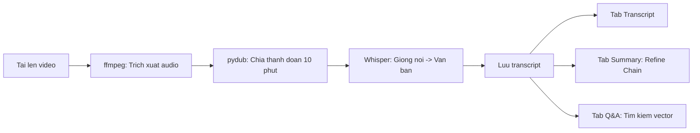
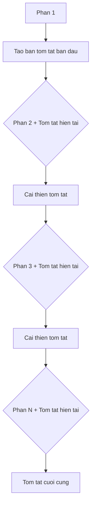

# Chapter 09: MeetingGPT

## Muc tieu hoc tap

Sau khi hoan thanh chapter nay, ban co the:

- Su dung **ffmpeg** de trich xuat audio tu video
- Su dung **pydub** de chia file audio dai thanh cac phan co kich thuoc nhat dinh (tuong thich Python 3.13+)
- Su dung **OpenAI Whisper API** de chuyen doi giong noi thanh van ban (STT)
- Hieu va ap dung mo hinh **Refine Chain** de tom tat tai lieu dai mot cach tuan tu
- Su dung giao dien **Tabs** cua Streamlit de tach biet chuc nang transcript, tom tat va hoi dap

---

## Giai thich cac khai niem cot loi

### Pipeline cua MeetingGPT

MeetingGPT la ung dung tu dong chuyen doi van ban, tom tat va hoi dap khi nguoi dung tai len video cuoc hop.



### Mo hinh Refine Chain

Refine Chain la phuong phap xu ly tai lieu tuan tu, **cai thien tom tat dan dan**. Khac voi MapReduce, phuong phap nay duy tri ngu canh cua ban tom tat truoc do trong khi tich hop thong tin moi.



---

## Giai thich code theo tung commit

### 9.1 Audio Extraction

**Commit:** `ae4f7f4`

Them cau hinh co ban cho trang Streamlit. O buoc nay chua co chuc nang, chi tao khung giao dien.

```python
st.set_page_config(
    page_title="MeetingGPT",
    page_icon="💼",
)
```

### 9.2 Cutting The Audio

**Commit:** `10efbea`

Trien khai ham trich xuat audio tu video bang `ffmpeg`:

```python
def extract_audio_from_video(video_path):
    if has_transcript:
        return
    audio_path = video_path.replace("mp4", "mp3")
    command = [
        "ffmpeg",
        "-y",        # Ghi de file da ton tai
        "-i",        # File dau vao
        video_path,
        "-vn",       # Loai bo luong video (chi trich xuat audio)
        audio_path,
    ]
    subprocess.run(command)
```

**Giai thich cac tuy chon ffmpeg:**
- `-y`: Ghi de neu file dau ra da ton tai
- `-i`: Chi dinh duong dan file dau vao
- `-vn`: Loai bo luong video, chi xuat audio

Sau do su dung `pydub` de chia audio thanh cac doan 10 phut:

```python
def cut_audio_in_chunks(audio_path, chunk_size, chunks_folder):
    if has_transcript:
        return
    track = AudioSegment.from_mp3(audio_path)
    chunk_len = chunk_size * 60 * 1000  # Chuyen doi phut -> mili giay
    chunks = math.ceil(len(track) / chunk_len)
    for i in range(chunks):
        start_time = i * chunk_len
        end_time = (i + 1) * chunk_len
        chunk = track[start_time:end_time]
        chunk.export(
            f"./{chunks_folder}/chunk_{i}.mp3",
            format="mp3",
        )
```

**Tai sao can chia nho audio?**
- Whisper API chi xu ly duoc file audio **toi da 25MB**
- Video cuoc hop dai se vuot qua gioi han nay, nen can chia thanh cac doan 10 phut de xu ly

**Luu y ve tuong thich Python 3.13+:**

Tu Python 3.13, module `audioop` da bi loai bo khoi thu vien chuan. Vi `pydub` su dung `audioop` noi bo, nen tren Python 3.13 tro len can cai them goi **`audioop-lts`**:

```bash
pip install pydub audioop-lts
```

`audioop-lts` cung cap module `audioop` da bi loai bo duoi dang goi ben thu ba, dam bao tuong thich voi `pydub`. Nho them vao `requirements.txt` cua du an:

```
pydub
audioop-lts    # Bat buoc cho Python 3.13+
```

> **Luu y:** Tren Python 3.12 tro xuong, `audioop` da duoc tich hop san nen khong can `audioop-lts`. Tuy nhien, khuyen nghi them truoc de dam bao tuong thich trong tuong lai.

### 9.3 Whisper Transcript

**Commit:** `585ae23`

Chuyen doi cac doan audio da chia thanh van ban bang OpenAI Whisper API:

```python
openai_client = OpenAI(
    base_url=os.getenv("OPENAI_BASE_URL"),
    api_key=os.getenv("OPENAI_API_KEY"),
)

@st.cache_data()
def transcribe_chunks(chunk_folder, destination):
    if has_transcript:
        return
    files = glob.glob(f"{chunk_folder}/*.mp3")
    files.sort()
    for file in files:
        with open(file, "rb") as audio_file, open(destination, "a") as text_file:
            transcript = openai_client.audio.transcriptions.create(
                model="whisper-1",
                file=audio_file,
            )
            text_file.write(transcript.text)
```

Diem chinh:
- Su dung `glob.glob` de tim cac file chunk va `sort()` de dam bao thu tu
- Mo file o che do `"a"` de **noi tiep** van ban cua tung chunk
- Co `has_transcript` de tranh xu ly trung lap khi da chuyen doi roi

### 9.4 Recap

**Commit:** `15f2321`

Buoc tong ket giua ky.

### 9.5 Upload UI

**Commit:** `3034ee5`

Cau hinh giao dien upload file, hien thi trang thai va tabs cua Streamlit:

```python
with st.sidebar:
    video = st.file_uploader(
        "Video",
        type=["mp4", "avi", "mkv", "mov"],
    )

if video:
    chunks_folder = "./.cache/chunks"
    with st.status("Loading video...") as status:
        video_content = video.read()
        video_path = f"./.cache/{video.name}"
        audio_path = video_path.replace("mp4", "mp3")
        transcript_path = video_path.replace("mp4", "txt")
        with open(video_path, "wb") as f:
            f.write(video_content)
        status.update(label="Extracting audio...")
        extract_audio_from_video(video_path)
        status.update(label="Cutting audio segments...")
        cut_audio_in_chunks(audio_path, 10, chunks_folder)
        status.update(label="Transcribing audio...")
        transcribe_chunks(chunks_folder, transcript_path)

    transcript_tab, summary_tab, qa_tab = st.tabs(
        ["Transcript", "Summary", "Q&A"]
    )
```

- `st.status` la container hien thi tien trinh theo thoi gian thuc
- `st.tabs` tao ba tab (Transcript, Summary, Q&A)

### 9.6~9.7 Refine Chain

**Commit:** `0b74530`, `c761f3e`

Day la phan trien khai cot loi cua Refine Chain. Su dung hai prompt:

**Buoc 1 - Tao ban tom tat ban dau tu phan dau tien:**

```python
first_summary_prompt = ChatPromptTemplate.from_template(
    """
    Write a concise summary of the following:
    "{text}"
    CONCISE SUMMARY:
"""
)

first_summary_chain = first_summary_prompt | llm | StrOutputParser()

summary = first_summary_chain.invoke(
    {"text": docs[0].page_content},
)
```

**Buoc 2 - Cai thien tom tat dan dan voi cac phan con lai:**

```python
refine_prompt = ChatPromptTemplate.from_template(
    """
    Your job is to produce a final summary.
    We have provided an existing summary up to a certain point: {existing_summary}
    We have the opportunity to refine the existing summary (only if needed) with some more context below.
    ------------
    {context}
    ------------
    Given the new context, refine the original summary.
    If the context isn't useful, RETURN the original summary.
    """
)

refine_chain = refine_prompt | llm | StrOutputParser()

with st.status("Summarizing...") as status:
    for i, doc in enumerate(docs[1:]):
        status.update(label=f"Processing document {i+1}/{len(docs)-1} ")
        summary = refine_chain.invoke(
            {
                "existing_summary": summary,
                "context": doc.page_content,
            }
        )
        st.write(summary)
st.write(summary)
```

**Cach hoat dong cua Refine Chain:**
1. Tao ban tom tat ban dau tu tai lieu dau tien
2. Tu tai lieu thu hai tro di, truyen `existing_summary` (ban tom tat hien tai) cung voi `context` (tai lieu moi)
3. LLM se cai thien ban tom tat neu thong tin moi huu ich, neu khong thi giu nguyen ban tom tat cu
4. Sau khi duyet qua tat ca tai lieu, ban tom tat cuoi cung duoc hoan thanh

### 9.8 Q&A Tab

**Commit:** `662a528`

Tab Q&A duoc de lai nhu bai tap. Ban co the trien khai chuc nang hoi dap bang cach luu transcript vao vector store va su dung mo hinh RAG da hoc o Chapter 04.

---

## So sanh phuong phap cu va phuong phap moi

| Hang muc | MapReduce (Chapter 04) | Refine (Chapter 09) |
|------|----------------------|---------------------|
| **Phuong thuc xu ly** | Tom tat tung phan song song roi gop lai | Cai thien tom tat tuan tu |
| **Duy tri ngu canh** | Ngu canh bi cat doan giua cac phan | Duy tri ngu canh cua ban tom tat truoc |
| **Toc do xu ly** | Xu ly song song, nhanh | Xu ly tuan tu, cham |
| **Chat luong tom tat** | Co the trung lap/thieu sot | Chat luong cao nho cai thien dan dan |
| **Truong hop phu hop** | Tap hop tai lieu doc lap | Van ban co tinh lien tuc (bien ban hop, v.v.) |
| **So lan goi LLM** | N+1 lan (tom tat N + gop 1) | N lan (ban dau 1 + cai thien N-1) |

---

## Bai tap thuc hanh

### Bai tap 1: Trien khai tab Q&A

Tai file transcript bang `TextLoader`, luu vao FAISS vector store, sau do trien khai chuc nang Q&A tra loi cau hoi cua nguoi dung.

```python
# Goi y: Su dung mo hinh RAG cua Chapter 04
with qa_tab:
    question = st.text_input("Ask a question about the meeting.")
    if question:
        loader = TextLoader(transcript_path)
        docs = loader.load_and_split(text_splitter=splitter)
        vector_store = FAISS.from_documents(docs, embeddings)
        # Tao retriever va cau hinh chain
```

### Bai tap 2: Cache ket qua tom tat

Hien tai moi lan nhan nut "Generate summary" deu tao lai ban tom tat. Hay su dung `st.session_state` de cache ban tom tat da tao, tranh tao lai cho cung video.

---

## Gioi thieu chapter tiep theo

Trong **Chapter 10: Agents**, ban se hoc khai niem **Agent** - LLM tu chon va thuc thi cong cu. Ban se tao cac cong cu nhu tim kiem DuckDuckGo, API co phieu Alpha Vantage, va trien khai InvestorGPT noi LLM tu dong phan doan va goi cong cu.
