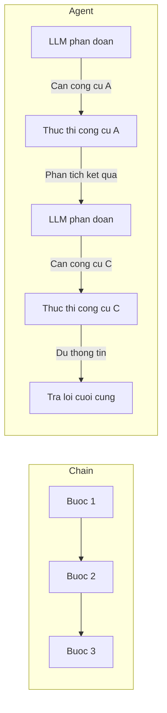

# Chapter 10: Agents

## Muc tieu hoc tap

Sau khi hoan thanh chapter nay, ban co the:

- Hieu khai niem **Agent** va su khac biet voi chain thong thuong
- Su dung `initialize_agent` va cac **AgentType** khac nhau
- Tao cong cu tuy chinh bang cach ke thua **BaseTool**
- Tich hop cac dich vu ben ngoai nhu tim kiem DuckDuckGo, API Alpha Vantage lam cong cu
- Thiet lap persona cua agent bang **system message**

---

## Giai thich cac khai niem cot loi

### Agent la gi?

Cac chain da tao truoc day co thu tu thuc thi **duoc dinh san**. Agent thi khac. LLM phan tich cau hoi cua nguoi dung va **tu quyet dinh goi cong cu nao theo thu tu nao**.

```mermaid
flowchart TB
    U[Nguoi dung: "Toi co nen mua co phieu Apple khong?"] --> A[Agent: Phan tich cau hoi]
    A --> T1["1. StockMarketSymbolSearchTool -> AAPL"]
    T1 --> T2["2. CompanyOverview -> Tong quan tai chinh"]
    T2 --> T3["3. CompanyIncomeStatement -> Bao cao ket qua kinh doanh"]
    T3 --> T4["4. CompanyStockPerformance -> Dien bien gia co phieu"]
    T4 --> F[Agent: Danh gia tong hop va tra loi]
```

### Agent vs Chain



### So sanh AgentType

| AgentType | Dac diem |
|-----------|------|
| `STRUCTURED_CHAT_ZERO_SHOT_REACT_DESCRIPTION` | Mo hinh ReAct, ho tro cong cu nhieu tham so |
| `OPENAI_FUNCTIONS` | Su dung OpenAI Function Calling, on dinh nhat |

---

## Giai thich code theo tung commit

### 10.1 Your First Agent

**Commit:** `f504c4d`

Tao agent don gian nhat trong notebook. Dang ky ham cong nhu mot cong cu va de agent su dung no:

```python
from langchain_openai import ChatOpenAI
from langchain_core.tools import StructuredTool
from langchain_classic.agents import initialize_agent, AgentType

llm = ChatOpenAI(
    base_url=os.getenv("OPENAI_BASE_URL"),
    api_key=os.getenv("OPENAI_API_KEY"),
    model="gpt-5.1",
    temperature=0.1,
)


def plus(a, b):
    return a + b


agent = initialize_agent(
    llm=llm,
    verbose=True,
    agent=AgentType.STRUCTURED_CHAT_ZERO_SHOT_REACT_DESCRIPTION,
    tools=[
        StructuredTool.from_function(
            func=plus,
            name="Sum Calculator",
            description="Use this to perform sums of two numbers. This tool take two arguments, both should be numbers.",
        ),
    ],
)

prompt = "Cost of $355.39 + $924.87 + $721.2 + $1940.29 + $573.63 + $65.72 + $35.00 + $552.00 + $76.16 + $29.12"

agent.invoke(prompt)
```

Diem chinh:
- `StructuredTool.from_function` chuyen doi ham Python thong thuong thanh cong cu
- `description` rat quan trong. LLM doc mo ta nay de quyet dinh su dung cong cu nao
- `verbose=True` cho phep xem qua trinh suy nghi cua agent

### 10.3 Zero-shot ReAct Agent

**Commit:** `c15fd71`

Agent su dung mo hinh **ReAct (Reasoning + Acting)**. LLM lap lai chu ky "Suy nghi (Thought) -> Hanh dong (Action) -> Quan sat (Observation)".

```
Thought: Nguoi dung hoi tong cua nhieu so. Toi can su dung Sum Calculator.
Action: Sum Calculator
Action Input: {"a": 355.39, "b": 924.87}
Observation: 1280.26
Thought: Toi can cong tiep cac so con lai...
```

### 10.4 OpenAI Functions Agent

**Commit:** `0402758`

Su dung `AgentType.OPENAI_FUNCTIONS` de tan dung tinh nang Function Calling cua OpenAI. On dinh va chinh xac hon ReAct.

### 10.5 Search Tool

**Commit:** `46ea170`

Tao cong cu tim kiem DuckDuckGo. Tu day su dung phuong phap **ke thua lop BaseTool**:

```python
from langchain_core.tools import BaseTool
from pydantic import BaseModel, Field
from langchain_community.utilities import DuckDuckGoSearchAPIWrapper


class StockMarketSymbolSearchToolArgsSchema(BaseModel):
    query: str = Field(
        description="The query you will search for. Example query: Stock Market Symbol for Apple Company"
    )


class StockMarketSymbolSearchTool(BaseTool):
    name: str = "StockMarketSymbolSearchTool"
    description: str = """
    Use this tool to find the stock market symbol for a company.
    It takes a query as an argument.
    """
    args_schema: Type[
        StockMarketSymbolSearchToolArgsSchema
    ] = StockMarketSymbolSearchToolArgsSchema

    def _run(self, query):
        ddg = DuckDuckGoSearchAPIWrapper()
        return ddg.run(query)
```

**Ly do ke thua BaseTool:**
- Dinh nghia tham so dau vao bang Pydantic model thong qua `args_schema`
- Mo ta chi tiet muc dich cua cong cu trong `description`
- Trien khai logic thuc te trong phuong thuc `_run`
- LLM doc `Field(description=...)` de hieu can truyen gia tri gi

### 10.6 Stock Information Tools

**Commit:** `3fa82c9`

Tao ba cong cu tai chinh su dung API Alpha Vantage:

```python
class CompanyOverviewTool(BaseTool):
    name: str = "CompanyOverview"
    description: str = """
    Use this to get an overview of the financials of the company.
    You should enter a stock symbol.
    """
    args_schema: Type[CompanyOverviewArgsSchema] = CompanyOverviewArgsSchema

    def _run(self, symbol):
        r = requests.get(
            f"https://www.alphavantage.co/query?function=OVERVIEW&symbol={symbol}&apikey={alpha_vantage_api_key}"
        )
        return r.json()


class CompanyIncomeStatementTool(BaseTool):
    name: str = "CompanyIncomeStatement"
    description: str = """
    Use this to get the income statement of a company.
    You should enter a stock symbol.
    """
    args_schema: Type[CompanyOverviewArgsSchema] = CompanyOverviewArgsSchema

    def _run(self, symbol):
        r = requests.get(
            f"https://www.alphavantage.co/query?function=INCOME_STATEMENT&symbol={symbol}&apikey={alpha_vantage_api_key}"
        )
        return r.json()["annualReports"]


class CompanyStockPerformanceTool(BaseTool):
    name: str = "CompanyStockPerformance"
    description: str = """
    Use this to get the weekly performance of a company stock.
    You should enter a stock symbol.
    """
    args_schema: Type[CompanyOverviewArgsSchema] = CompanyOverviewArgsSchema

    def _run(self, symbol):
        r = requests.get(
            f"https://www.alphavantage.co/query?function=TIME_SERIES_WEEKLY&symbol={symbol}&apikey={alpha_vantage_api_key}"
        )
        response = r.json()
        return list(response["Weekly Time Series"].items())[:200]
```

**Vai tro cua ba cong cu:**

| Cong cu | Ham API | Du lieu tra ve |
|------|----------|------------|
| `CompanyOverview` | `OVERVIEW` | Tong quan tai chinh: von hoa thi truong, PER, ty suat co tuc, v.v. |
| `CompanyIncomeStatement` | `INCOME_STATEMENT` | Bao cao ket qua kinh doanh: doanh thu, loi nhuan hoat dong, v.v. |
| `CompanyStockPerformance` | `TIME_SERIES_WEEKLY` | Du lieu gia co phieu 200 tuan gan nhat |

> **Luu y:** Ca ba cong cu deu su dung cung `CompanyOverviewArgsSchema` vi dau vao deu chi la `symbol` (ma co phieu).

### 10.7 Agent Prompt

**Commit:** `102aaf3`

Thiet lap **system message** cho agent de gan persona "nha quan ly quy phong ho":

```python
agent = initialize_agent(
    llm=llm,
    verbose=True,
    agent=AgentType.OPENAI_FUNCTIONS,
    handle_parsing_errors=True,
    tools=[
        CompanyIncomeStatementTool(),
        CompanyStockPerformanceTool(),
        StockMarketSymbolSearchTool(),
        CompanyOverviewTool(),
    ],
    agent_kwargs={
        "system_message": SystemMessage(
            content="""
            You are a hedge fund manager.

            You evaluate a company and provide your opinion and reasons why the stock is a buy or not.

            Consider the performance of a stock, the company overview and the income statement.

            Be assertive in your judgement and recommend the stock or advise the user against it.
        """
        )
    },
)
```

Cac tham so chinh:
- `handle_parsing_errors=True`: Tu dong thu lai khi gap loi phan tich cu phap dau ra LLM
- `agent_kwargs["system_message"]`: Thiet lap vai tro va huong dan hanh vi cua agent
- System message chi thi "xem xet hieu suat co phieu, tong quan doanh nghiep va bao cao ket qua kinh doanh" de huong agent su dung tat ca cac cong cu

### 10.8 SQLDatabaseToolkit

**Commit:** `4d75579`

Bai giang cung gioi thieu `SQLDatabaseToolkit`. Cong cu nay cho phep agent truy van truc tiep co so du lieu SQL. Day la tinh nang manh me chuyen doi cau hoi ngon ngu tu nhien thanh truy van SQL va thuc thi.

### 10.9 Conclusions

**Commit:** `9a99520`

Hoan thien giao dien Streamlit:

```python
st.set_page_config(
    page_title="InvestorGPT",
    page_icon="💼",
)

company = st.text_input("Write the name of the company you are interested on.")

if company:
    result = agent.invoke(company)
    st.write(result["output"].replace("$", "\$"))
```

> **Luu y:** Ky tu `$` duoc escape thanh `\$`. Vi trinh render markdown cua Streamlit se hieu `$...$` la cong thuc LaTeX.

---

## So sanh phuong phap cu va phuong phap moi

| Hang muc | Chain (cac chapter truoc) | Agent (Chapter 10) |
|------|-------------------|-------------------|
| **Luong thuc thi** | Lap trinh vien dinh nghia truoc | LLM quyet dinh tai thoi diem chay |
| **Chon cong cu** | Hard-code trong ma nguon | LLM chon theo tinh huong |
| **Tinh linh hoat** | Thap (pipeline co dinh) | Cao (phan doan dong) |
| **Tinh du doan** | Cao | Thap (cung dau vao co the di duong khac) |
| **Giai loi** | De | Kho (can `verbose=True`) |
| **Dinh nghia cong cu** | Khong can | Ke thua `BaseTool` hoac `StructuredTool` |
| **Truong hop phu hop** | Workflow co dinh | Cau hoi kham pha/phuc hop |

---

## Bai tap thuc hanh

### Bai tap 1: Them cong cu tuy chinh

Tao `CompanyNewsSearchTool` va them vao agent. Day la cong cu su dung tim kiem DuckDuckGo de tim tin tuc gan day ve doanh nghiep.

```python
# Goi y
class CompanyNewsSearchTool(BaseTool):
    name: str = "CompanyNewsSearch"
    description: str = """
    Use this to search for recent news about a company.
    You should enter the company name.
    """
    # Trien khai args_schema va phuong thuc _run
```

### Bai tap 2: Thay doi persona cua agent

Sua doi system message de chuyen sang "co van dau tu ca nhan than trong". Viet prompt nhan manh rui ro, khuyen nghi da dang hoa danh muc dau tu va tu van tu goc do dau tu dai han.

---

## Gioi thieu chapter tiep theo

Trong **Chapter 11: FastAPI & GPT Actions**, ban se tao API server tu ung dung LangChain bang **FastAPI**, sau do ket noi voi tinh nang **GPT Actions** cua ChatGPT de GPT co the goi truc tiep API cua chung ta. Cung se tim hieu ve co so du lieu vector Pinecone va xac thuc OAuth.
