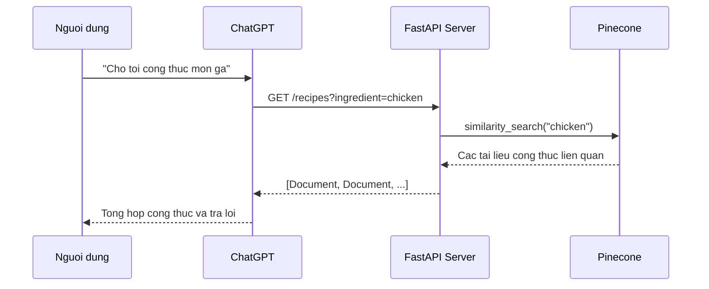
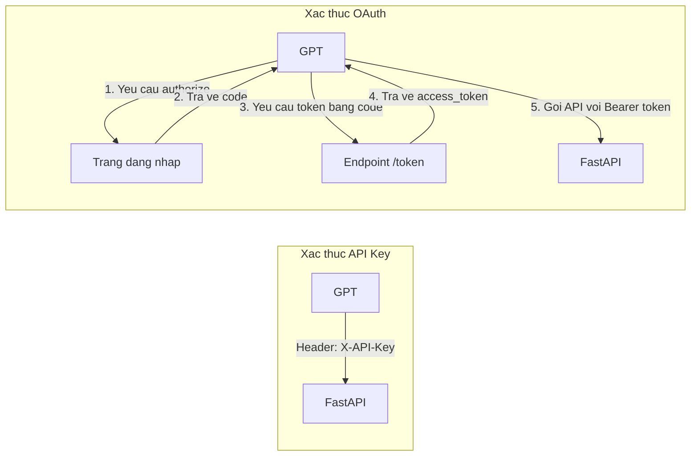

# Chapter 11: FastAPI & GPT Actions

## Muc tieu hoc tap

- Xay dung REST API server bang FastAPI
- Thiet lap GPT Actions de ChatGPT co the goi API ben ngoai
- Trien khai xac thuc bang API Key va luong xac thuc OAuth
- Ket noi Pinecone vector store de tao API tim kiem tuong tu

---

## Giai thich cac khai niem cot loi

### GPT Actions la gi?

GPT Actions la tinh nang cho phep ChatGPT goi API ben ngoai. Khi nguoi dung dat cau hoi cho ChatGPT, ChatGPT se goi API do chung ta tao va tao cau tra loi dua tren ket qua tra ve.



### So sanh cac phuong thuc xac thuc



---

## Giai thich code theo tung commit

### 11.2 FastAPI Server (`574eee9`)

Buoc dau tien tao ung dung FastAPI co ban.

```python
from fastapi import FastAPI
from pydantic import BaseModel

app = FastAPI(
    title="ChefGPT. The best provider of Indian Recipes in the world.",
    description="Give ChefGPT the name of an ingredient and it will give you multiple recipes to use that ingredient on in return.",
    servers=[
        {
            "url": "https://example.trycloudflare.com",
        },
    ],
)
```

**Diem chinh:**

- `title` va `description` duoc GPT su dung de hieu muc dich cua API
- `servers` thiet lap URL co the truy cap tu ben ngoai (su dung Cloudflare Tunnel, v.v.)

Dinh nghia dinh dang phan hoi bang Pydantic model:

```python
class Document(BaseModel):
    page_content: str
```

Them metadata chi tiet can thiet cho GPT Actions vao endpoint:

```python
@app.get(
    "/recipes",
    summary="Returns a list of recipes.",
    description="Upon receiving an ingredient, this endpoint will return a list of recipes that contain that ingredient.",
    response_description="A Document object that contains the recipe and preparation instructions",
    response_model=list[Document],
    openapi_extra={
        "x-openai-isConsequential": False,
    },
)
def get_recipe(ingredient: str):
    return [
        Document(page_content=f"Recipe for {ingredient}: coming soon..."),
    ]
```

`x-openai-isConsequential: False` co nghia la GPT co the goi API ma khong can xac nhan tu nguoi dung.

**Khoi chay server:**

```bash
uvicorn main:app --reload
```

### 11.3 GPT Action (`4d926fb`)

Dan OpenAPI spec (`/openapi.json`) do FastAPI tu dong tao vao phan thiet lap GPT Actions cua ChatGPT, ChatGPT se co the goi API cua chung ta.

**Thu tu thiet lap GPT Actions:**

1. Tao GPT trong ChatGPT (Create a GPT)
2. Configure > Actions > Create new action
3. Dan noi dung `/openapi.json` vao phan Schema
4. Xac nhan URL server co the truy cap tu ben ngoai

### 11.5 API Key Auth (`2737111`)

Xac thuc API Key la phuong thuc xac thuc don gian nhat. Khi dang ky API Key trong phan thiet lap GPT Actions, ChatGPT se gui key do trong header moi yeu cau.

Trong phan thiet lap GPT Actions:
- Authentication Type: API Key
- API Key: Nhap gia tri key thuc te
- Auth Type: Custom Header hoac Bearer

### 11.6 OAuth (`0649030`)

Luong OAuth duoc su dung khi can xac thuc theo tung nguoi dung. Can hai endpoint:

```python
@app.get(
    "/authorize",
    response_class=HTMLResponse,
    include_in_schema=False,
)
def handle_authorize(client_id: str, redirect_uri: str, state: str):
    return f"""
    <html>
        <head>
            <title>Nicolacus Maximus Log In</title>
        </head>
        <body>
            <h1>Log Into Nicolacus Maximus</h1>
            <a href="{redirect_uri}?code=ABCDEF&state={state}">Authorize Nicolacus Maximus GPT</a>
        </body>
    </html>
    """
```

- `/authorize`: Hien thi trang dang nhap cho nguoi dung
- Tra ve ma xac thuc (`code`) va `state` qua `redirect_uri`
- `include_in_schema=False` de loai tru khoi OpenAPI spec (endpoint nay GPT khong duoc goi truc tiep)

```python
@app.post(
    "/token",
    include_in_schema=False,
)
def handle_token(code=Form(...)):
    return {
        "access_token": user_token_db[code],
    }
```

- `/token`: Nhan ma xac thuc va cap phat access_token
- `Form(...)` xu ly yeu cau dang form-data

### 11.8 Pinecone (`fbe45e3`)

Ket noi Pinecone vector store de co the tim kiem du lieu cong thuc thuc te:

```python
from dotenv import load_dotenv
import os

load_dotenv()

from pinecone import Pinecone
from langchain_openai import OpenAIEmbeddings
from langchain_pinecone import PineconeVectorStore

pc = Pinecone(api_key=os.getenv("PINECONE_API_KEY"))

embeddings = OpenAIEmbeddings(
    base_url=os.getenv("OPENAI_EMBEDDING_BASE_URL"),
    api_key=os.getenv("OPENAI_API_KEY"),
    model=os.getenv("OPENAI_EMBEDDING_MODEL"),
)

vector_store = PineconeVectorStore.from_existing_index(
    "recipes",
    embeddings,
)
```

**Diem chinh:**

- Ket noi dich vu Pinecone bang `Pinecone` client
- Chuyen doi van ban thanh vector bang `OpenAIEmbeddings`
- Ket noi voi index da tao bang `PineconeVectorStore.from_existing_index`

### 11.9 Chef API (`746afa2`)

Cuoi cung, endpoint thuc hien tim kiem vector thuc te:

```python
def get_recipe(ingredient: str):
    docs = vector_store.similarity_search(ingredient)
    return docs
```

Thay vi du lieu gia, su dung `similarity_search` de tim kiem va tra ve cac cong thuc tuong tu thuc te.

---

## So sanh phuong phap cu va phuong phap moi

| Hang muc | Phuong phap cu (Plugins) | Phuong phap moi (GPT Actions) |
|------|-------------------|----------------------|
| Cach thiet lap | Plugin manifest + OpenAPI | Them Action trong GPT Builder |
| Xac thuc | OAuth rieng cho Plugin | OAuth chuan / API Key |
| Trien khai | Can duyet qua Plugin Store | Trien khai don gian bang chia se GPT |
| API Spec | Can `.well-known/ai-plugin.json` | Chi can OpenAPI spec |
| Kha nang truy cap | Chi danh cho ChatGPT Plus | Truy cap qua lien ket chia se GPT |

---

## Bai tap thuc hanh

### Bai tap 1: Tao API server thoi tiet

Tao API tra ve thong tin thoi tiet bang FastAPI.

**Yeu cau:**

1. Trien khai endpoint `GET /weather?city=Seoul`
2. Dinh nghia dinh dang phan hoi bang Pydantic model (ten thanh pho, nhiet do, trang thai thoi tiet)
3. Thiet lap `x-openai-isConsequential: False`
4. Viet `summary`, `description` phu hop cho GPT Actions

### Bai tap 2: Them xac thuc OAuth

Them xac thuc OAuth vao API cua bai tap 1.

**Yeu cau:**

1. Endpoint `/authorize` (tra ve trang dang nhap)
2. Endpoint `/token` (cap phat access_token)
3. Ca hai endpoint deu thiet lap `include_in_schema=False`

---

## Gioi thieu chapter tiep theo

Chapter tiep theo se hoc ve **Assistants API** cua OpenAI. Assistants API quan ly hoi thoai co trang thai (Thread), cung cap cac cong cu tich hop nhu tim kiem file (file_search), va ho tro goi ham tuy chinh. Ban se hoc cach tich hop truc tiep cac tinh nang cua ChatGPT vao ung dung cua minh.
