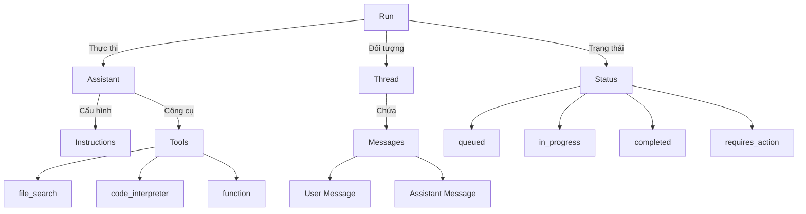
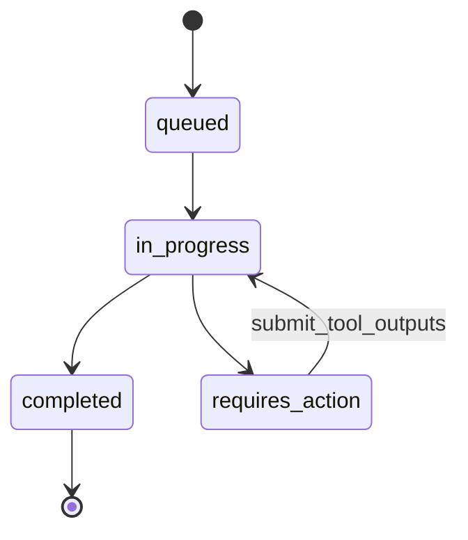

# Chapter 12: Assistants API

## Mục tiêu học tập

- Hiểu được các khái niệm cốt lõi của OpenAI Assistants API (Assistant, Thread, Run)
- Có thể tạo trợ lý dựa trên RAG bằng cách sử dụng công cụ `file_search`
- Có thể triển khai hội thoại duy trì trạng thái thông qua Thread
- Có thể gửi Tool outputs để tích hợp hàm tùy chỉnh vào trợ lý

---

## Giải thích khái niệm cốt lõi

### Kiến trúc Assistants API



### Vòng đời của Run



**Tóm tắt khái niệm cốt lõi:**

| Khái niệm | Mô tả |
|------|------|
| **Assistant** | Đối tượng cấu hình gộp mô hình, chỉ thị và công cụ |
| **Thread** | Container lưu trữ lịch sử hội thoại (duy trì trạng thái) |
| **Message** | Tin nhắn riêng lẻ trong Thread (user / assistant) |
| **Run** | Đơn vị thực thi Assistant trên Thread |
| **Tool** | Công cụ mà Assistant có thể sử dụng (file_search, function, v.v.) |

---

## Giải thích mã nguồn theo từng commit

### 12.2 Creating The Assistant (`b383cf8`)

Khởi tạo OpenAI client và tạo Assistant:

```python
from openai import OpenAI

client = OpenAI(
    base_url=os.getenv("OPENAI_BASE_URL"),
    api_key=os.getenv("OPENAI_API_KEY"),
)

assistant = client.beta.assistants.create(
    name="Book Assistant",
    instructions="You help users with their question on the files they upload.",
    model="gpt-5.1",
    tools=[{"type": "file_search"}],
)
assistant_id = assistant.id
```

**Điểm chính:**

- Tạo Assistant bằng `client.beta.assistants.create` (sử dụng namespace beta)
- `name`: Tên của trợ lý
- `instructions`: Chỉ thị tương đương với system prompt
- `tools`: Danh sách công cụ sử dụng. `file_search` là công cụ tích hợp sẵn để tìm kiếm nội dung file
- Sau khi tạo, lưu `assistant_id` để có thể tái sử dụng

### 12.3 Assistant Tools (`8d4ee27`)

Tạo Thread và thiết lập tin nhắn ban đầu:

```python
thread = client.beta.threads.create(
    messages=[
        {
            "role": "user",
            "content": "I want you to help me with this file",
        }
    ]
)
```

Tải file lên và đính kèm vào tin nhắn:

```python
file = client.files.create(
    file=open("./files/chapter_one.txt", "rb"), purpose="assistants"
)

client.beta.threads.messages.create(
    thread_id=thread.id,
    role="user",
    content="Please analyze this file.",
    attachments=[{"file_id": file.id, "tools": [{"type": "file_search"}]}],
)
```

**Điểm chính:**

- Tải file lên bằng `client.files.create` (`purpose="assistants"`)
- Đính kèm file vào tin nhắn bằng `attachments`
- Khi đính kèm, chỉ định `file_search` trong `tools` để đưa file đó vào đối tượng tìm kiếm

### 12.4 Running A Thread (`6801466`)

Tạo Run để Assistant xử lý các tin nhắn trong Thread:

```python
run = client.beta.threads.runs.create(
    thread_id=thread.id,
    assistant_id=assistant_id,
)
```

Định nghĩa các hàm trợ giúp để kiểm tra trạng thái Run:

```python
def get_run(run_id, thread_id):
    return client.beta.threads.runs.retrieve(
        run_id=run_id,
        thread_id=thread_id,
    )

def send_message(thread_id, content):
    return client.beta.threads.messages.create(
        thread_id=thread_id, role="user", content=content
    )

def get_messages(thread_id):
    messages = client.beta.threads.messages.list(thread_id=thread_id)
    messages = list(messages)
    messages.reverse()
    for message in messages:
        print(f"{message.role}: {message.content[0].text.value}")
```

**Điểm chính:**

- Run được thực thi bất đồng bộ. Cần polling trạng thái bằng `get_run`
- Khi `status` trở thành `completed`, có thể xem kết quả
- `get_messages` in toàn bộ lịch sử hội thoại theo thứ tự thời gian

### 12.5 Assistant Actions (`5153705`)

Khi Run ở trạng thái `requires_action`, cần gửi kết quả của hàm tùy chỉnh:

```python
def get_tool_outputs(run_id, thread_id):
    run = get_run(run_id, thread_id)
    outputs = []
    for action in run.required_action.submit_tool_outputs.tool_calls:
        action_id = action.id
        function = action.function
        print(f"Calling function: {function.name} with arg {function.arguments}")
        outputs.append(
            {
                "output": functions_map[function.name](json.loads(function.arguments)),
                "tool_call_id": action_id,
            }
        )
    return outputs

def submit_tool_outputs(run_id, thread_id):
    outputs = get_tool_outputs(run_id, thread_id)
    return client.beta.threads.runs.submit_tool_outputs(
        run_id=run_id,
        thread_id=thread_id,
        tool_outputs=outputs,
    )
```

**Điểm chính:**

- Lấy thông tin hàm cần gọi từ `run.required_action.submit_tool_outputs.tool_calls`
- `functions_map` là dictionary ánh xạ tên hàm sang hàm Python thực tế
- Khi gửi kết quả thực thi hàm cho OpenAI bằng `submit_tool_outputs`, Run sẽ tiếp tục xử lý

### 12.8 RAG Assistant (`9b8da4b`)

Cuối cùng, trợ lý RAG dựa trên file được hoàn thành. Khi người dùng tải file lên, công cụ `file_search` sẽ tìm kiếm nội dung file, và trả lời các câu hỏi tiếp theo trong khi duy trì ngữ cảnh hội thoại:

```python
send_message(
    thread.id,
    "Where does he work?",
)
```

Vì Thread ghi nhớ cuộc hội thoại trước và nội dung file, nên có thể xác định "he" là ai từ ngữ cảnh và đưa ra câu trả lời.

---

## So sánh cách tiếp cận cũ và mới

| Hạng mục | Tự triển khai (LangChain RAG) | Assistants API |
|------|--------------------------|----------------|
| Quản lý bộ nhớ | Tự thiết lập lớp Memory | Thread tự động quản lý |
| Tìm kiếm file | Cấu hình VectorStore + Retriever | Chỉ một dòng với công cụ `file_search` |
| Trạng thái hội thoại | Tự quản lý bộ nhớ theo từng phiên | Tự động duy trì bằng Thread ID |
| Gọi hàm | LangChain Agent + Tools | Công cụ `function` + tool_outputs |
| Thực thi mã | Cần sandbox riêng | `code_interpreter` tích hợp sẵn |
| Hạ tầng | Tự vận hành vector DB | OpenAI quản lý |

---

## Bài tập thực hành

### Bài tập 1: Trợ lý QA tài liệu

Hãy tạo một trợ lý trả lời câu hỏi bằng cách tải lên file PDF.

**Yêu cầu:**

1. Tạo Assistant với công cụ `file_search` được kích hoạt
2. Tải file PDF lên và đính kèm vào Thread
3. Gửi liên tiếp 3 câu hỏi trở lên và xác nhận ngữ cảnh hội thoại được duy trì
4. In toàn bộ lịch sử hội thoại bằng `get_messages`

### Bài tập 2: Tự động polling trạng thái Run

Hãy triển khai vòng lặp polling tự động kiểm tra trạng thái Run.

**Yêu cầu:**

```python
import time

def wait_for_run(run_id, thread_id, timeout=60):
    """Triển khai hàm chờ cho đến khi Run hoàn thành."""
    # 1. Kiểm tra trạng thái bằng get_run
    # 2. Nếu completed thì trả về kết quả
    # 3. Nếu requires_action thì gửi tool_outputs
    # 4. Nếu failed thì in lỗi
    # 5. Các trường hợp khác thì chờ 2 giây rồi kiểm tra lại
    pass
```

---

## Giới thiệu chương tiếp theo

Trong chương tiếp theo, chúng ta sẽ học về **nhà cung cấp đám mây**. Chúng ta sẽ học cách tích hợp không chỉ OpenAI mà cả AWS Bedrock (mô hình Claude) và Azure OpenAI với LangChain. Chúng ta sẽ tìm hiểu cách tối ưu hóa chi phí và nâng cao khả năng ứng phó sự cố bằng chiến lược đa đám mây.
