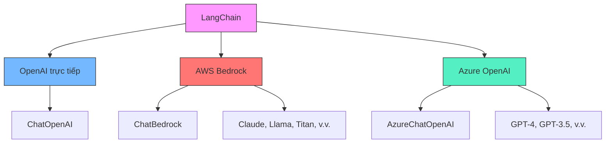
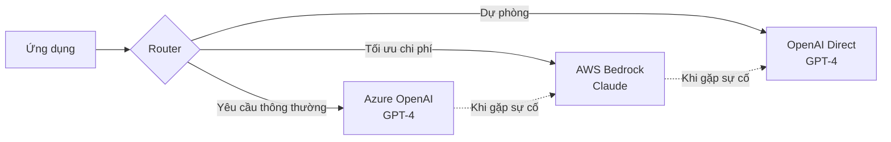

# Chapter 13: Cloud Providers

## Mục tiêu học tập

- Có thể sử dụng mô hình Anthropic Claude trong LangChain thông qua AWS Bedrock
- Có thể sử dụng mô hình GPT trong LangChain thông qua Azure OpenAI
- Hiểu được ưu điểm và các điểm cần lưu ý của chiến lược đa đám mây

---

## Giải thích khái niệm cốt lõi

### So sánh nhà cung cấp LLM trên đám mây



### Kiến trúc đa đám mây



---

## Giải thích mã nguồn theo từng commit

### 13.3 BedrockChat (`b5665ee`)

AWS Bedrock là dịch vụ AI được quản lý bởi AWS, cho phép sử dụng nhiều mô hình AI khác nhau (Anthropic Claude, Meta Llama, Amazon Titan, v.v.) thông qua một API duy nhất.

**Bước 1: Tạo phiên AWS bằng boto3**

```python
import boto3

session = boto3.Session(
    aws_access_key_id=os.getenv("AWS_ACCESS_KEY"),
    aws_secret_access_key=os.getenv("AWS_SECRET_KEY"),
)

bedrock_client = session.client("bedrock-runtime", "us-east-1")
```

- Thiết lập thông tin xác thực AWS bằng `boto3.Session`
- Tạo client dịch vụ `bedrock-runtime` ở vùng `us-east-1`
- Bedrock không khả dụng ở tất cả các vùng, nên cần kiểm tra các vùng được hỗ trợ

**Bước 2: Cấu hình chuỗi xử lý với LangChain ChatBedrock**

```python
from langchain_aws import ChatBedrock
from langchain_core.prompts import ChatPromptTemplate

chat = ChatBedrock(
    client=bedrock_client,
    model_id=os.getenv("AWS_BEDROCK_MODEL_ID", "anthropic.claude-v2"),
    model_kwargs={
        "temperature": 0.1,
    },
)

prompt = ChatPromptTemplate.from_messages(
    [
        (
            "user",
            "Translate this sentence from {lang_a} to {lang_b}: {sentence}",
        ),
    ]
)

chain = prompt | chat

chain.invoke(
    {
        "lang_a": "English",
        "lang_b": "Icelandic",
        "sentence": "I love amazon!",
    }
)
```

**Điểm chính:**

- Sử dụng lớp `ChatBedrock` từ gói `langchain_aws`
- Chỉ định ID mô hình do Bedrock cung cấp trong `model_id` (ví dụ: `anthropic.claude-v2`). Nếu thiết lập bằng biến môi trường `AWS_BEDROCK_MODEL_ID`, có thể chuyển đổi mô hình mà không cần sửa mã
- Truyền các tham số mô hình như temperature qua `model_kwargs`
- Pipeline LCEL của LangChain (`prompt | chat`) hoạt động giống hệt như trước

**Gói cần thiết:**

```bash
pip install boto3 langchain-aws
```

### 13.4 AzureChatOpenAI (`8d4cc18`)

Azure OpenAI là dịch vụ lưu trữ mô hình OpenAI được cung cấp bởi Microsoft Azure. Phù hợp khi cần quản trị dữ liệu và SLA trong môi trường doanh nghiệp.

```python
from langchain_openai import AzureChatOpenAI

chat = AzureChatOpenAI(
    azure_deployment=os.getenv("AZURE_DEPLOYMENT", "gpt-35-turbo"),
    api_version=os.getenv("AZURE_API_VERSION", "2023-05-15"),
)

prompt = ChatPromptTemplate.from_messages(
    [
        (
            "user",
            "Translate this sentence from {lang_a} to {lang_b}: {sentence}",
        ),
    ]
)

chain = prompt | chat

chain.invoke(
    {
        "lang_a": "English",
        "lang_b": "Icelandic",
        "sentence": "I love microsoft!",
    }
)
```

**Điểm chính:**

- Sử dụng lớp `AzureChatOpenAI` từ gói `langchain_openai`
- `azure_deployment`: Tên deployment của mô hình đã triển khai trên Azure. Nếu quản lý bằng biến môi trường, có thể chuyển đổi mô hình mà không cần sửa mã
- `api_version`: Phiên bản API của Azure OpenAI (định dạng ngày). Vì Azure cập nhật phiên bản API thường xuyên, nên tốt nhất là quản lý bằng biến môi trường
- `azure_endpoint` và `api_key` được `AzureChatOpenAI` tự động đọc từ biến môi trường `AZURE_OPENAI_ENDPOINT`, `AZURE_OPENAI_API_KEY`
- Phần còn lại của mã LangChain hoàn toàn giống với `ChatOpenAI`

**Biến môi trường cần thiết:**

```bash
# File .env
AZURE_OPENAI_ENDPOINT=https://your-resource.openai.azure.com/
AZURE_OPENAI_API_KEY=your-azure-api-key
AZURE_DEPLOYMENT=gpt-35-turbo
AZURE_API_VERSION=2023-05-15
```

> **Mẹo:** `AzureChatOpenAI` tự động nhận diện biến môi trường `AZURE_OPENAI_ENDPOINT` và `AZURE_OPENAI_API_KEY`. Không cần truyền trực tiếp trong mã, chỉ cần thiết lập trong file `.env` là đủ.

---

## So sánh cách tiếp cận cũ và mới

| Hạng mục | Gọi trực tiếp OpenAI | Sử dụng nhà cung cấp đám mây |
|------|-----------------|---------------------|
| Lựa chọn mô hình | Chỉ có mô hình OpenAI | Đa dạng: Claude, Llama, Titan, v.v. |
| Bảo mật dữ liệu | Gửi đến máy chủ OpenAI | Có thể xử lý trong VPC đám mây nội bộ |
| SLA | SLA của OpenAI | SLA doanh nghiệp Azure/AWS |
| Chi phí | Gói cước OpenAI | Có thể giảm giá với reserved instance trên đám mây |
| Ứng phó sự cố | Điểm lỗi đơn lẻ | Có thể dự phòng đa nhà cung cấp |
| Mã LangChain | `ChatOpenAI` | `ChatBedrock` / `AzureChatOpenAI` |
| Tương thích chuỗi xử lý | Pipeline LCEL | Pipeline LCEL giống hệt |

---

## Bài tập thực hành

### Bài tập 1: Tạo chuỗi xử lý có thể chuyển đổi nhà cung cấp

Hãy tạo một hàm factory có thể chuyển đổi nhà cung cấp LLM chỉ bằng một biến môi trường.

**Yêu cầu:**

```python
def get_llm(provider: str = "openai"):
    """
    Triển khai hàm trả về instance LLM phù hợp theo provider.
    - "openai" -> ChatOpenAI
    - "bedrock" -> ChatBedrock
    - "azure" -> AzureChatOpenAI
    """
    pass

# Ví dụ sử dụng
llm = get_llm(os.getenv("LLM_PROVIDER", "openai"))
chain = prompt | llm
```

### Bài tập 2: Triển khai chuỗi dự phòng

Hãy triển khai logic dự phòng tự động chuyển sang nhà cung cấp khác khi cuộc gọi đến nhà cung cấp chính thất bại.

**Gợi ý:** Có thể sử dụng phương thức `.with_fallbacks()` của LangChain.

```python
llm_with_fallback = primary_llm.with_fallbacks([fallback_llm])
```

---

## Giới thiệu chương tiếp theo

Trong chương tiếp theo, chúng ta sẽ học về **CrewAI**. Chúng ta sẽ xây dựng hệ thống đa tác tử, nơi nhiều tác tử AI cộng tác để thực hiện các tác vụ phức tạp, thay vì chỉ một LLM duy nhất. Chúng ta sẽ tìm hiểu các khái niệm Agent, Task, Crew cùng với công cụ tùy chỉnh, đầu ra Pydantic và thực thi bất đồng bộ.
