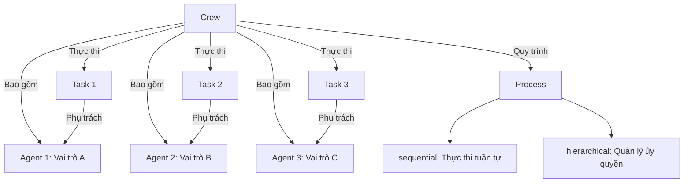
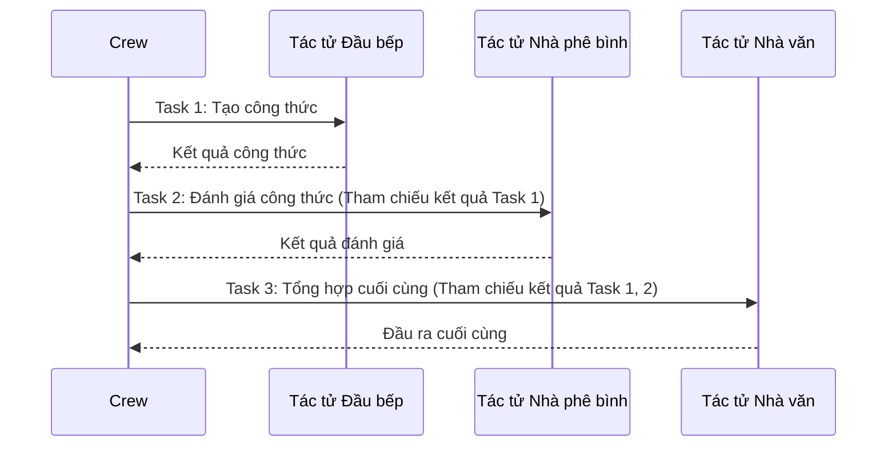

# Chapter 14: CrewAI

## Mục tiêu học tập

- Hiểu được các khái niệm cốt lõi của CrewAI (Agent, Task, Crew, Process)
- Có thể thiết kế tác tử dựa trên vai trò và cấu hình quy trình cộng tác
- Có thể định nghĩa đầu ra có cấu trúc bằng mô hình Pydantic
- Có thể xây dựng Crew nâng cao sử dụng thực thi bất đồng bộ và công cụ tùy chỉnh

---

## Giải thích khái niệm cốt lõi

### Cấu trúc CrewAI



### Luồng cộng tác giữa các tác tử



---

## Giải thích mã nguồn theo từng commit

### 14.1 Setup (`a6e5fe4`)

CrewAI thiết lập OpenAI thông qua biến môi trường:

```python
from dotenv import load_dotenv
import os

load_dotenv()

os.environ["OPENAI_API_KEY"] = os.getenv("OPENAI_API_KEY")
os.environ["OPENAI_API_BASE"] = os.getenv("OPENAI_BASE_URL")
os.environ["OPENAI_MODEL_NAME"] = "gpt-5.1"
```

Import cơ bản:

```python
from crewai import Agent, Task, Crew
from crewai.process import Process
from langchain_openai import ChatOpenAI
```

**Điểm chính:**

- CrewAI nội bộ đọc các biến môi trường `OPENAI_API_KEY`, `OPENAI_API_BASE`, `OPENAI_MODEL_NAME`
- Khi thiết lập trực tiếp vào `os.environ`, tất cả các tác tử của CrewAI sẽ sử dụng cấu hình đó

**Cài đặt:**

```bash
pip install crewai crewai-tools langchain-openai
```

### 14.3 Chef Crew (`9b20ee0`)

Ví dụ đầu tiên về Crew: cấu hình đội tác tử liên quan đến nấu ăn.

**Định nghĩa Agent:**

```python
chef = Agent(
    role="Korean Chef",
    goal="You create simple and delicious Korean recipes.",
    backstory="You are a famous Korean chef known for your simple and tasty recipes.",
    allow_delegation=False,
)

critic = Agent(
    role="Food Critic",
    goal="You give constructive feedback on recipes.",
    backstory="You are a Michelin-star food critic with decades of experience.",
    allow_delegation=False,
)
```

Mỗi Agent có các thuộc tính sau:
- `role`: Vai trò của tác tử (được phản ánh trong prompt)
- `goal`: Mục tiêu của tác tử
- `backstory`: Mô tả bối cảnh (thiết lập nhân vật)
- `allow_delegation`: Có cho phép ủy quyền công việc cho tác tử khác hay không

**Định nghĩa Task:**

```python
create_recipe = Task(
    description="Create a recipe for a {dish}.",
    expected_output="A detailed recipe with ingredients and steps.",
    agent=chef,
)

review_recipe = Task(
    description="Review the recipe and give feedback.",
    expected_output="A constructive review with suggestions.",
    agent=critic,
)
```

Mỗi Task có các thuộc tính sau:
- `description`: Mô tả tác vụ (có thể thay thế biến: `{dish}`)
- `expected_output`: Định dạng đầu ra mong đợi
- `agent`: Tác tử sẽ thực hiện tác vụ này

**Thực thi Crew:**

```python
crew = Crew(
    agents=[chef, critic],
    tasks=[create_recipe, review_recipe],
    process=Process.sequential,
)

result = crew.kickoff(inputs={"dish": "Bibimbap"})
```

- `Process.sequential`: Thực thi các tác vụ theo thứ tự (kết quả của tác vụ trước được truyền cho tác vụ sau)
- `kickoff(inputs=...)`: Truyền giá trị biến khi thực thi Crew

### 14.5 Content Farm Crew (`6a5aedb`)

Ví dụ về cấu hình pipeline tạo nội dung bằng Crew. Nhà nghiên cứu, nhà văn và biên tập viên cộng tác để viết bài blog.

```python
researcher = Agent(
    role="Content Researcher",
    goal="Research and find interesting topics and information.",
    backstory="You are an experienced content researcher.",
)

writer = Agent(
    role="Content Writer",
    goal="Write engaging blog posts based on research.",
    backstory="You are a skilled content writer.",
)

editor = Agent(
    role="Content Editor",
    goal="Edit and polish content for publication.",
    backstory="You are a meticulous editor with an eye for detail.",
)
```

**Tùy chọn Process:**

| Process | Mô tả | Manager LLM | Trường hợp sử dụng |
|---------|------|-----------|----------|
| `sequential` | Thực thi tác vụ theo thứ tự | Không cần | Công việc dạng pipeline |
| `hierarchical` | Tác tử quản lý ủy quyền tác vụ | `manager_llm` bắt buộc | Ra quyết định phức tạp |

> **Lưu ý:** Khi sử dụng `Process.hierarchical`, bắt buộc phải chỉ định tham số `manager_llm`. Manager LLM đóng vai trò phân phối công việc cho từng tác tử và điều phối kết quả.

### 14.6 Pydantic Outputs (`85fd123`)

Có thể ép buộc định dạng đầu ra của tác tử bằng mô hình Pydantic:

```python
from pydantic import BaseModel
from typing import List

class Recipe(BaseModel):
    name: str
    ingredients: List[str]
    steps: List[str]
    cooking_time: int

create_recipe = Task(
    description="Create a recipe for a {dish}.",
    expected_output="A recipe in the specified format.",
    agent=chef,
    output_pydantic=Recipe,
)
```

**Điểm chính:**

- Khi chỉ định mô hình Pydantic trong `output_pydantic`, đầu ra của tác tử sẽ được phân tích thành mô hình đó
- Có thể sử dụng dữ liệu có cấu trúc cho xử lý tiếp theo
- Việc xác thực mô hình được thực hiện tự động, đảm bảo định dạng đầu ra

### 14.7 Async Youtuber Crew (`bc399f5`)

Crew bất đồng bộ thực thi nhiều tác vụ song song:

```python
thumbnail_task = Task(
    description="Design a thumbnail concept for a video about {topic}.",
    expected_output="A detailed thumbnail description.",
    agent=designer,
    async_execution=True,
)

script_task = Task(
    description="Write a script for a video about {topic}.",
    expected_output="A complete video script.",
    agent=writer,
    async_execution=True,
)

# Hai tác vụ được thực thi đồng thời
crew = Crew(
    agents=[designer, writer, editor],
    tasks=[thumbnail_task, script_task, final_review],
    process=Process.sequential,
)
```

**Điểm chính:**

- Các tác vụ có `async_execution=True` sẽ được thực thi đồng thời
- Nếu sau tác vụ bất đồng bộ có tác vụ đồng bộ, sẽ chờ cho đến khi tất cả tác vụ bất đồng bộ hoàn thành
- Có thể rút ngắn tổng thời gian thực thi bằng cách xử lý song song các công việc độc lập

### 14.8 Custom Tools (`9c6676c`)

Có thể thêm công cụ tùy chỉnh vào tác tử CrewAI để truy cập dữ liệu bên ngoài. Tạo công cụ lấy dữ liệu chứng khoán thời gian thực bằng thư viện `yfinance`:

```python
from crewai.tools import tool
import yfinance as yf

class Tools:
    @tool("One month stock price history")
    def stock_price(ticker):
        """Useful to get a month's worth of stock price data as CSV.
        The input should be a stock ticker symbol."""
        stock = yf.Ticker(ticker)
        return stock.history(period="1mo").to_csv()

    @tool("Stock news URLs")
    def stock_news(ticker):
        """Useful to get URLs of news articles related to a stock.
        The input should be a stock ticker symbol."""
        stock = yf.Ticker(ticker)
        return list(map(lambda x: x["link"], stock.news))

    @tool("Company's income statement")
    def income_stmt(ticker):
        """Useful to get the income statement of a stock as CSV.
        The input should be a stock ticker symbol."""
        stock = yf.Ticker(ticker)
        return stock.income_stmt.to_csv()

    @tool("Balance sheet")
    def balance_sheet(ticker):
        """Useful to get the balance sheet of a stock as CSV.
        The input should be a stock ticker symbol."""
        stock = yf.Ticker(ticker)
        return stock.balance_sheet.to_csv()

    @tool("Get insider transactions")
    def insider_transactions(ticker):
        """Useful to get insider transactions of a stock as CSV.
        The input should be a stock ticker symbol."""
        stock = yf.Ticker(ticker)
        return stock.insider_transactions.to_csv()
```

**Điểm chính:**

- **`from crewai.tools import tool`**: Sử dụng decorator `@tool` tích hợp của CrewAI (chú ý: import từ `crewai.tools`, không phải `crewai_tools`)
- **Tầm quan trọng của docstring**: Tác tử đọc tên và docstring để quyết định chọn công cụ nào. Mô tả rõ ràng là bắt buộc
- **Sử dụng yfinance**: Truy cập thông tin cổ phiếu bằng `yf.Ticker(ticker)`, lấy nhiều loại dữ liệu tài chính qua các thuộc tính `.history()`, `.income_stmt`, `.balance_sheet`, `.insider_transactions`, `.news`
- **Trả về CSV**: Dữ liệu số được trả về dạng `.to_csv()` để LLM có thể phân tích dưới dạng bảng
- **Nhóm theo lớp**: Các công cụ liên quan được gộp thành phương thức tĩnh trong lớp `Tools` để quản lý

**Sử dụng công cụ bên ngoài - ScrapeWebsiteTool:**

```python
from crewai_tools import ScrapeWebsiteTool

researcher = Agent(
    role="Researcher",
    tools=[Tools.stock_news, ScrapeWebsiteTool()],
)
```

Gói `crewai_tools` cũng cung cấp các công cụ dựng sẵn như `ScrapeWebsiteTool`. Được sử dụng để lấy URL tin tức và sau đó thu thập dữ liệu từ trang web đó.

### 14.9 Stock Market Crew (`ce88f16`)

Crew phân tích thị trường chứng khoán tổng hợp tất cả các khái niệm. **4 tác tử chuyên gia** cộng tác để viết báo cáo phân tích đầu tư toàn diện:

**Định nghĩa tác tử (4 vai trò chuyên môn):**

```python
from crewai import Agent
from crewai_tools import ScrapeWebsiteTool

class Agents:
    def technical_analyst(self):
        return Agent(
            role="Technical Analyst",
            goal="Analyses the movements of a stock and provides insights on trends, "
                 "entry points, resistance and support levels.",
            backstory="An expert in technical analysis with deep knowledge of "
                      "indicators and chart patterns.",
            verbose=True,
            tools=[Tools.stock_price],
        )

    def researcher(self):
        return Agent(
            role="Researcher",
            goal="Gathers, interprets and summarizes vast amounts of data to "
                 "provide a comprehensive overview of the sentiment and news "
                 "surrounding a stock.",
            backstory="You're skilled in gathering and interpreting data from "
                      "various sources to give a complete picture of a stock's "
                      "sentiment and news.",
            verbose=True,
            tools=[Tools.stock_news, ScrapeWebsiteTool()],
        )

    def financial_analyst(self):
        return Agent(
            role="Financial Analyst",
            goal="Uses financial statements, insider trading data, and other "
                 "metrics to evaluate a stock's financial health and performance.",
            backstory="You're a very experienced investment advisor that looks "
                      "at a company's financial health, market sentiment, and "
                      "qualitative data to make informed recommendations.",
            verbose=True,
            tools=[Tools.balance_sheet, Tools.income_stmt, Tools.insider_transactions],
        )

    def hedge_fund_manager(self):
        return Agent(
            role="Hedge Fund Manager",
            goal="Manages a portfolio of stocks and makes strategic investment "
                 "decisions to maximize returns using insights from analysts.",
            backstory="You're a seasoned hedge fund manager with a proven track "
                      "record. You leverage insights from your team of analysts.",
            verbose=True,
        )
```

**Định nghĩa tác vụ (mỗi tác vụ lưu kết quả bằng output_file):**

```python
from crewai import Task

class Tasks:
    def research(self, agent):
        return Task(
            description="Gather and analyze the latest news and market sentiment "
                        "surrounding the stock of {company}...",
            expected_output="Your final answer MUST be a detailed summary of the "
                            "overall market sentiment...",
            agent=agent,
            output_file="stock_news.md",
        )

    def technical_analysis(self, agent):
        return Task(
            description="Conduct a detailed technical analysis of the price "
                        "movements of {company}'s stock...",
            expected_output="Your final answer MUST be a detailed technical "
                            "analysis report...",
            agent=agent,
            output_file="technical_analysis.md",
        )

    def financial_analysis(self, agent):
        return Task(
            description="Analyze {company}'s financial statements, insider "
                        "trading data, and other financial metrics...",
            expected_output="Your final answer MUST be a detailed financial "
                            "analysis report...",
            agent=agent,
            output_file="financial_analysis.md",
        )

    def investment_recommendation(self, agent, context):
        return Task(
            description="Based on the research, technical analysis, and financial "
                        "analysis reports, provide a detailed investment "
                        "recommendation for {company}'s stock.",
            expected_output="Your final answer MUST be a detailed investment "
                            "recommendation report...",
            agent=agent,
            context=context,
            output_file="investment_recommendation.md",
        )
```

**Thực thi Crew (Hierarchical Process + Memory):**

```python
from crewai import Crew
from crewai.process import Process
from langchain_openai import ChatOpenAI

agents = Agents()
tasks = Tasks()

researcher = agents.researcher()
technical_analyst = agents.technical_analyst()
financial_analyst = agents.financial_analyst()
hedge_fund_manager = agents.hedge_fund_manager()

research_task = tasks.research(researcher)
technical_task = tasks.technical_analysis(technical_analyst)
financial_task = tasks.financial_analysis(financial_analyst)
recommend_task = tasks.investment_recommendation(
    hedge_fund_manager,
    [research_task, technical_task, financial_task],
)

crew = Crew(
    agents=[researcher, technical_analyst, financial_analyst, hedge_fund_manager],
    tasks=[research_task, technical_task, financial_task, recommend_task],
    verbose=True,
    process=Process.hierarchical,
    manager_llm=ChatOpenAI(
        base_url=os.getenv("OPENAI_BASE_URL"),
        api_key=os.getenv("OPENAI_API_KEY"),
        model=os.getenv("OPENAI_MODEL_NAME", "gpt-5.1"),
    ),
    memory=True,
    embedder=dict(
        provider="openai",
        config=dict(
            model=os.getenv("OPENAI_EMBEDDING_MODEL", "text-embedding-3-small"),
        ),
    ),
)

result = crew.kickoff(inputs=dict(company="Salesforce"))
```

**Đặc điểm chính của Stock Market Crew:**

1. **4 tác tử chuyên gia**: Mỗi tác tử chỉ sở hữu công cụ thuộc lĩnh vực chuyên môn của mình
   - Technical Analyst: `stock_price` -> Phân tích biểu đồ
   - Researcher: `stock_news` + `ScrapeWebsiteTool` -> Thu thập/scrape tin tức
   - Financial Analyst: `balance_sheet` + `income_stmt` + `insider_transactions` -> Phân tích tài chính
   - Hedge Fund Manager: Không có công cụ -> Tổng hợp kết quả từ các tác tử khác để đưa ra quyết định cuối cùng

2. **output_file**: Kết quả của mỗi tác vụ được lưu thành file markdown riêng. Hữu ích cho việc debug và lưu trữ kết quả

3. **Tham số context**: Truyền `context=[research_task, technical_task, financial_task]` cho tác vụ `investment_recommendation` để tham chiếu kết quả của 3 tác vụ trước đó

4. **Process.hierarchical + manager_llm**: Manager LLM tự động đánh giá thứ tự thực thi và ủy quyền tác vụ. Khác với `Process.sequential`, manager có thể tái sử dụng tác tử hoặc chỉ đạo công việc bổ sung tùy theo tình huống

5. **memory=True + embedder**: Cung cấp bộ nhớ dài hạn cho Crew. Nội dung hội thoại giữa các tác tử được nhúng (embedding) và lưu trữ, cho phép tác tử tiếp theo tìm kiếm ngữ cảnh trước đó. Cấu hình `embedder` sử dụng mô hình `text-embedding-3-small` của OpenAI

**So sánh Sequential và Hierarchical:**

| Hạng mục | Sequential | Hierarchical |
|------|-----------|-------------|
| Thứ tự thực thi | Thứ tự tác vụ cố định | Manager quyết định động |
| Manager LLM | Không cần | `manager_llm` bắt buộc |
| Tính linh hoạt | Thấp (pipeline) | Cao (manager ủy quyền/thực thi lại) |
| Chi phí | Thấp | Cao (gọi thêm Manager LLM) |
| Trường hợp phù hợp | Pipeline đơn giản | Ra quyết định phức tạp, tác vụ phụ thuộc lẫn nhau |

---

## So sánh cách tiếp cận cũ và mới

| Hạng mục | LangChain Agent (đơn lẻ) | CrewAI (đa tác tử) |
|------|----------------------|---------------------|
| Số lượng tác tử | Một tác tử | Nhiều tác tử theo vai trò |
| Phân chia vai trò | Một tác tử thực hiện mọi công việc | Chuyên môn hóa theo vai trò |
| Luồng công việc | Vòng lặp đơn (ReAct) | Sequential / Hierarchical |
| Quản lý công cụ | Gán tất cả công cụ cho tác tử | Chỉ gán công cụ cần thiết theo vai trò |
| Định dạng đầu ra | Phân tích bằng OutputParser | Ép buộc bằng mô hình Pydantic (`output_pydantic`) |
| Lưu kết quả | Quản lý thủ công | Tự động lưu bằng `output_file` |
| Xử lý song song | Không hỗ trợ | `async_execution=True` |
| Bộ nhớ | Thiết lập thủ công lớp Memory | Tự động với `memory=True` + cấu hình `embedder` |
| Công cụ tùy chỉnh | Kế thừa `BaseTool` | Decorator `@tool` (ngắn gọn) |
| Chức năng quản lý | Không có | `Process.hierarchical` + `manager_llm` |
| Công việc phù hợp | QA đơn giản, tìm kiếm | Tạo nội dung, phân tích, nghiên cứu |

### Tính năng mới của CrewAI 1.x

Trong CrewAI 1.x được sử dụng trong dự án này, các tính năng chính sau đã được bổ sung:

| Tính năng | Mô tả | Ví dụ sử dụng |
|------|------|--------|
| **memory** | Chia sẻ bộ nhớ dài hạn giữa các tác tử | `Crew(memory=True, embedder={...})` |
| **embedder** | Cấu hình mô hình embedding cho bộ nhớ | `embedder=dict(provider="openai", config=dict(model="text-embedding-3-small"))` |
| **manager_llm** | Manager LLM cho quy trình Hierarchical | `Crew(process=Process.hierarchical, manager_llm=ChatOpenAI(...))` |
| **output_file** | Tự động lưu kết quả tác vụ vào file | `Task(output_file="report.md")` |
| **context** | Tham chiếu kết quả từ tác vụ khác | `Task(context=[task1, task2])` |
| **Decorator @tool** | Chuyển đổi hàm thành công cụ một cách đơn giản | `from crewai.tools import tool` |
| **ScrapeWebsiteTool** | Công cụ web scraping tích hợp sẵn | `from crewai_tools import ScrapeWebsiteTool` |

---

## Bài tập thực hành

### Bài tập 1: Crew lập kế hoạch du lịch

Hãy tạo một Crew lập kế hoạch du lịch gồm 3 tác tử.

**Yêu cầu:**

1. **Travel Researcher**: Khảo sát thông tin du lịch về điểm đến
2. **Budget Planner**: Lập kế hoạch ngân sách
3. **Itinerary Writer**: Viết lịch trình du lịch cuối cùng
4. Thực thi bằng `Process.sequential`
5. Định nghĩa định dạng đầu ra cuối cùng bằng mô hình Pydantic:

```python
class TravelPlan(BaseModel):
    destination: str
    duration: int  # days
    budget: float
    daily_itinerary: List[str]
    tips: List[str]
```

### Bài tập 2: Crew phân tích tin tức bất đồng bộ

Hãy triển khai Crew thu thập và phân tích tin tức với thực thi bất đồng bộ.

**Yêu cầu:**

1. Các tác vụ bất đồng bộ thu thập tin tức đồng thời từ 3 lĩnh vực (công nghệ, kinh tế, xã hội)
2. Tác vụ đồng bộ thực hiện phân tích tổng hợp sau khi thu thập xong
3. Triển khai ít nhất một công cụ tùy chỉnh

---

## Tổng kết toàn bộ khóa học

Qua giáo trình này, chúng ta đã bao quát toàn bộ phổ phát triển ứng dụng LLM:

```mermaid
graph LR
    A[Ch1-2: Nền tảng LLM] --> B[Ch3: Bộ nhớ]
    B --> C[Ch4: RAG]
    C --> D[Ch5: Streamlit UI]
    D --> E[Ch6: Mô hình thay thế]
    E --> F[Ch7-9: Ứng dụng thực tế]
    F --> G[Ch10: Agents]
    G --> H[Ch11: FastAPI]
    H --> I[Ch12: Assistants]
    I --> J[Ch13: Đám mây]
    J --> K[Ch14: Đa tác tử]
```



| Giai đoạn | Chương | Nội dung đã học |
|------|------|---------|
| Nền tảng | 1-3 | LLM, Prompt, Bộ nhớ |
| Dữ liệu | 4 | RAG, Embedding, Vector Store |
| Giao diện | 5 | Ứng dụng web Streamlit |
| Mở rộng | 6 | Mô hình thay thế: HuggingFace, Ollama, v.v. |
| Thực tế | 7-9 | QuizGPT, SiteGPT, MeetingGPT |
| Tự động hóa | 10 | Agent, Tools, ReAct |
| API | 11 | FastAPI, GPT Actions, Xác thực |
| Nền tảng | 12 | Assistants API, Thread, Run |
| Hạ tầng | 13 | AWS Bedrock, Azure OpenAI |
| Cộng tác | 14 | Hệ thống đa tác tử CrewAI |

Bây giờ bạn đã được trang bị tất cả các công cụ và khái niệm cần thiết để xây dựng ứng dụng GPT full-stack, từ nền tảng LLM đến hệ thống đa tác tử.
